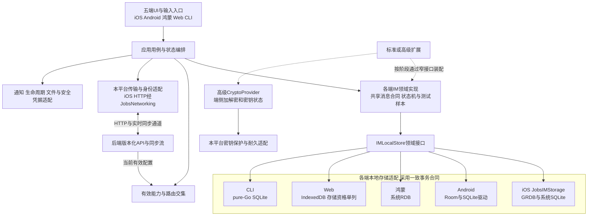
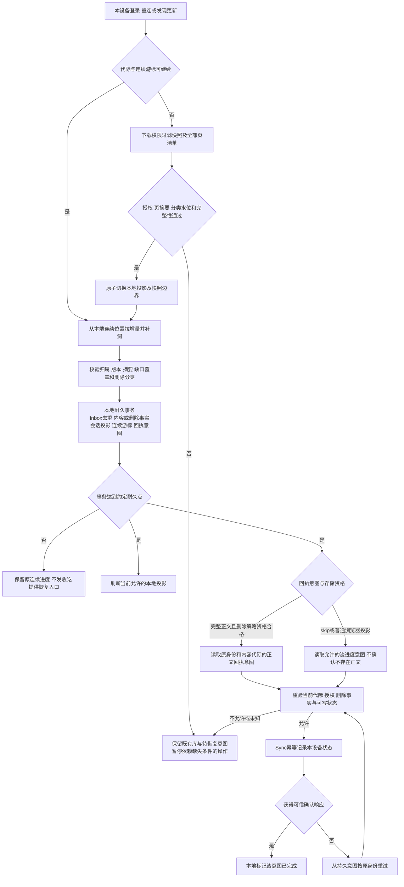

# IM前端架构表

[toc]

---

## 🔥 前言

本文件定义五端的工程、分层、本地数据、同步与构建合同，对应 [产品需求](../IM需求明细表.md/IM需求明细表.md)、[后端架构](../IM后端架构表.md/IM后端架构表.md) 和 [验收台账](../IM功能验收表.md/IM功能验收表.md)。文档基线：**2026年10月9日**。当前仅完成设计和模板只读核对，尚未创建 IM 业务工程、执行依赖安装或构建，不能据此宣称客户端已实现。

| 阅读入口 | 内容 |
| --- | --- |
| [先看通信方式图解](../IM通信方式图解.md/IM通信方式图解.md) | 两大类、附近通信与[高级入口组](#endpoint-group-client) |
| [一、工程与平台边界](#frontend-scope) | 从零新建、五端继承、已选技术基线 |
| [二、分层与模块合同](#frontend-layers) | 领域、存储、传输、UI、能力开关 |
| [三、iOS Swift 工程模板](#ios-template) | JobsByPods、Podfile、DSL 与来源边界 |
| [四、本地数据库方案](#storage-selection) | SQLite、封装职责、WCDB 价值与选型门禁 |
| [五、本地表与字段](#local-schema) | 消息、Outbox、Inbox、连续游标、墓碑、迁移 |
| [六、可靠收发与删除](#durable-sync) | 落盘后收讫、重试、恢复、云删与全局删除 |
| [七、平台与体验](#frontend-experience) | 生命周期、凭据、演示隔离、字体和空态 |
| [八、构建与交付](#frontend-build) | 安装后行为、build 产物、锁定清单、验收 |
| [架构图](#frontend-modules) | [五端存储与分层](#frontend-modules)、[本地事务](#local-sync-transaction-diagram)、[后端多端同步与历史恢复](../IM后端架构表.md/IM后端架构表.md#multidevice-sync-architecture) |

## 一、从零新建与五端工程边界 <a href="#前言" style="font-size:17px; color:green;"><b>🔼</b></a> <a href="#🔚" style="font-size:17px; color:green;"><b>🔽</b></a>

### 1.1、独立新工程与模板承接 <a href="#前言" style="font-size:17px; color:green;"><b>🔼</b></a> <a href="#🔚" style="font-size:17px; color:green;"><b>🔽</b></a>

另起一套 IM 工程，从零设计并实现业务代码；不在既有业务工程上直接修改、改名或覆盖。旧代码仅用于提取有价值的工程经验，例如部署/反部署、自检、日志、挂载与构建交付。阶段 II/III 继承的是本项目已封版的新基线，不是旧业务源码。

iOS 明确使用 <u>[**Swift**](https://www.swift.org/)</u>，以 Jobs 本人的 [Swift 基础工程](../../JobsBaseConfig/JobsBaseConfig@JobsSwiftBaseConfigDemo/README.md) 为工程模板；承接自有通用 Pods、依赖解耦、脚本与 DSL 约定。新 App、标识、业务模块、配置、产物目录与验收记录独立建立；自有通用框架可按需复用并锁定来源版本，不搬入旧业务、Demo 入口、无关跨端引擎或默认账号。模板本身不因本需求自动获得修改授权。

### 1.2、平台路线与确认状态 <a href="#前言" style="font-size:17px; color:green;"><b>🔼</b></a> <a href="#🔚" style="font-size:17px; color:green;"><b>🔽</b></a>

五端共享消息格式、能力 ID、身份/删除合同和一致性测试样本，各平台有自己的实现、工具链与发布包。基础版须完成 CLI、Android、iOS、鸿蒙、Web 的可靠纯文本单聊；CLI/Web 可以先开工，不能因此把移动端移出基础封版。标准增量媒体与群，高级增量私密与聊天体验，见 [阶段目标](../IM需求明细表.md/IM需求明细表.md#phase-goals)。

| 平台 | 工程路线与本地数据 | 当前状态 |
| --- | --- | --- |
| [**iOS**](https://developer.apple.com/ios/) | Swift，沿本人 [**UIKit**](https://developer.apple.com/documentation/uikit) 模板与 JobsByPods；系统 [**SQLite**](https://www.sqlite.org/)＋[**GRDB**](https://github.com/groue/GRDB.swift)＋自有 JobsIMStorage Pod | Codex 已选 iOS 16.0 起；继续本人 UIKit 路线；确切构建版本见第八章，集成尚未验收 |
| [**Android**](https://developer.android.com/) | [**Kotlin**](https://kotlinlang.org/) / [**Jetpack Compose**](https://developer.android.com/compose)；[**Room**](https://developer.android.com/training/data-storage/room)＋AndroidX 内嵌 SQLite | Codex 已选 Android 8.0/API26 起；数据库配置与 ABI 由 Codex 实施验证 |
| [**鸿蒙**](https://developer.huawei.com/consumer/cn/) | [**ArkTS/ArkUI**](https://developer.huawei.com/consumer/cn/doc/harmonyos-guides/arkts-overview) Stage；系统 [**RDB / relationalStore**](https://developer.huawei.com/consumer/cn/doc/doccenter-dev-faq/faqs-local-database-management-68) | Codex 已选 HarmonyOS 5.0/API12 起；原生鸿蒙路线，系统存储并发/持久性待工程实测 |
| [**Web**](https://developer.mozilla.org/zh-CN/docs/Web) | [**TypeScript**](https://www.typescriptlang.org/) / [**React**](https://react.dev/) SPA；原生 [**IndexedDB**](https://www.w3.org/TR/IndexedDB/)＋自有有限适配 | Codex 已选具体浏览器基线；配额/驱逐/隐私模式单列，不套用原生 SQLite 耐久保证 |
| CLI | [**Go**](https://go.dev/)＋[**modernc.org/sqlite**](https://pkg.go.dev/modernc.org/sqlite) | Codex 已选纯 Go 驱动与三桌面平台/双 CPU 架构；复用 IM API，数据库与凭据保护由 Codex 验证 |

工程基线 `IM-baseline-20261009.1` 的框架、最低系统和参数由 Codex 决定并负责验证，不再交给用户补技术判断。各端以相同 IM 合同实现，各自留下构建/耐久/兼容证据；选型存在和组合通过是两种状态。服务端版本由 [后端表](../IM后端架构表.md/IM后端架构表.md#dependency-versions) 管理，客户端具体版本由 [前端锁定清单](#frontend-locks) 管理。

### 1.3、通信模式与端侧责任边界 <a href="#前言" style="font-size:17px; color:green;"><b>🔼</b></a> <a href="#🔚" style="font-size:17px; color:green;"><b>🔽</b></a>

当前五端工程、账号／scope／本地事务、权威进度及删除恢复合同面向中心化主线。一级分类使用中心化／去中心化，详见 [图解](../IM通信方式图解.md/IM通信方式图解.md#im-categories)；可复用 UI、领域及存储接口，但未来去中心化的身份命名空间、信任、消息顺序、收讫和历史恢复按所选网络独立实现，不以替换 BaseURL 冒充兼容。

蓝牙／附近 Wi-Fi 是候选通信通道，平台／设备发现、配对授权、后台、耗电与可靠落盘另行验证。附近收讫和云端接受／同步分别标记；本地消息需稳定 ID 去重，离线权限及恢复对账须明确。不承诺五端等价支持，也不把该候选列入当前基础封版。[附近通信图](../IM通信方式图解.md/IM通信方式图解.md#nearby-chat)

### 1.4、高级中心化多 BaseURL 协调器 <a href="#前言" style="font-size:17px; color:green;"><b>🔼</b></a> <a href="#🔚" style="font-size:17px; color:green;"><b>🔽</b></a>

**`network.endpoint_group_failover` 只在高级版启用**，同一源码按有效配置／可信发行预置能力初始化。首次、重装或缓存配置／清单过期且入口失联时，仅有可信高级发行预置或既有有效高级授权的部署可执行匿名恢复引导；过期地址仅用于取得新签名清单，不据其发送凭据或正文。通过当前服务身份、清单和有效后台能力后恢复正常业务；已知降档配置优先，旧发行预置不能复活高级权限。I／II 不启动扫描、组刷新和冷却定时器，只重连当前固定入口。服务端降档停止新组操作，仍按已有消息／恢复合同对账。[需求合同](../IM需求明细表.md/IM需求明细表.md#advanced-endpoint-group)、[服务端清单](../IM后端架构表.md/IM后端架构表.md#endpoint-group-contract)

预埋组 → 校验可信缓存 → 使用当前入口；失达后逐个验证同组候选，首个合格入口完成协议／认证重连并切换。切换后从合格入口拉新清单，失败不抹掉仍有效旧组；客户端发版带入新的签名整组清单，用同样的版本和部署校验合并。单候选、一轮、冷却及重试上限按后端 1.6 初始数值；候选不可达与业务拒绝分开处理。

本地控制记录与聊天数据分开，按 `environment_id + deployment_id + endpoint_group_id` 隔离：保存 `highest_manifest_version, payload_digest, signed_payload, signature, key_id, expires_at, active_endpoint_id, last_refresh_result`；有效清单和最高版本在同一事务保存，同版异内容拒绝。失败冷却、探测游标和切换代次为受控运行状态，切换代次用于拒绝迟到响应；不把域名当账号或聊天库身份，不在记录中存密码、访问令牌或正文。重装不承诺保留高水位，按可信发行包重建引导。[消息本地表](#local-schema)仍由原作用域和账号隔离。

只有通过 TLS、部署签名挑战和协议核查的准确候选才取得认证材料；跨域重定向不自动转交凭据。HTTP 和实时通道属于同一已验证目标代次；账号／环境切换取消旧探测及刷新。正式 Outbox 保持原发送 namespace／恢复代际／clientMsgId，未知结果先查询或按原 ID 重试，旧连接响应不能改写新连接或其他账号；新恢复代际继续走权威快照及旧凭证失效合同。

五端均做对应适配和证据：原生端核查证书、网络变化与后台约束，CLI 核查构建预置及凭据保护；Web 默认通过已加载页面的同源 BFF 访问 API 与 WebSocket，由 BFF 执行候选验证及上游切换，浏览器不把 Cookie 转交其他域名。页面可匿名参与签名清单核验和展示切换状态，实际上游凭据始终由 BFF 保管；默认不启动携带认证材料的浏览器跨源直连，CORS 不是跨域 Cookie 共用机制，CSP 和 WebSocket Origin 另作校验。BFF 的同源代理能力从基础版存在，只有高级才装配地址组扫描／刷新／冷却，不能借网关越级。浏览器里的前端代码须先能加载，网页原始入口或同源 BFF 本身不可达时，页面内切换不能修复这个入口；网页／BFF 可用性另依部署灾备负责。地址组也不改变附近蓝牙支持或服务端灾备责任。[Web 凭据与来源合同](#web-credential-contract)、[Web CORS 机制](https://developer.mozilla.org/en-US/docs/Web/HTTP/Guides/CORS)

### 1.5、标准搜索范围与端侧私密索引 <a href="#前言" style="font-size:17px; color:green;"><b>🔼</b></a> <a href="#🔚" style="font-size:17px; color:green;"><b>🔽</b></a>

FE-023标准范围分开验收：消息正文中文NFC字面／英文词，联系人昵称／本人备注及获权会话名称的全拼／首字母前缀；不承诺任意正文拼音。名称转换用[后端已选同源字表](../IM后端架构表.md/IM后端架构表.md#standard-module-tables)，固定默认读音，原名称优先并解释多音字可能漏匹配；五端在启用前生成资源版本／摘要、许可和一致性向量。

本地模块按账号／来源隔离可重建 `local_search_documents`：messageId、conversationId、来源代际／内容版本、normalizedBody、状态；`local_name_documents`：对象类型／ID／字段、来源代际／版本、normalizedText、pinyinFull、pinyinInitials、transliterationVersion、状态，字段类型按第五章平台映射。仅索引当前有权内容；私密名称／备注及E2EE正文不向服务器上传原文或索引。各存储按支持能力选择索引／有界查询，不假称所有平台都自带同一种全文插件，结果和权限向量保持一致。

改名／删备注／撤权／global删除或焚毁使本地派生索引失效并继续幂等清理；合法cloud_only仍按原本地保留合同读取唯一副本。搜索补充不延长消息寿命，不从迟到事件或旧备份复活索引。受限数据权利查询／取消另用专门入口和短期证明，不借搜索模块恢复注销中的普通会话。[注销取消合同](../IM后端架构表.md/IM后端架构表.md#account-state-design)

## 二、分层、依赖与能力开关 <a href="#前言" style="font-size:17px; color:green;"><b>🔼</b></a> <a href="#🔚" style="font-size:17px; color:green;"><b>🔽</b></a>

### 2.1、模块责任合同 <a href="#前言" style="font-size:17px; color:green;"><b>🔼</b></a> <a href="#🔚" style="font-size:17px; color:green;"><b>🔽</b></a>

| 模块 | 责任 | 依赖限制 |
| --- | --- | --- |
| 展示/UI | 气泡、会话、输入、导航、空态、字体及辅助功能 | 消费应用状态/用例，不直接写 SQL、签 token 或拼权限 |
| 应用用例/状态 | 发送、同步、账号切换、错误与重试编排 | 依赖领域协议，状态变化可测试；UI 更新在平台 UI 执行域 |
| IM 领域核心 | 消息身份、状态机、顺序、去重、连续进度、删除规则 | 不依赖 UI、具体数据库框架或宿主业务代码 |
| 本地存储适配 | 事务、查询、迁移、Outbox/Inbox、墓碑、缓存隔离 | 对外暴露 IM 行为和领域类型，不泄漏底层 ORM/连接对象 |
| 传输与身份适配 | HTTP/实时通道、鉴权、刷新、版本和错误解析 | iOS HTTP 业务经 JobsNetworking，其他端采用本平台适配；实时通道单独适配，不假设模板 HTTP 封装已实现可靠同步 |
| 能力与路由 | 服务端有效配置、客户端支持、权益与权限交集 | 隐藏入口、路由及发送前检查一致；服务端仍是授权权威 |
| 原生平台适配 | 推送、后台、密钥、文件、网络、通知与辅助能力 | 不将生命周期/厂商限制冒充通用保证 |
| 标准/高级扩展 | 媒体、RTC、机器人入口；加密 Provider、置顶/@/收藏；高级转账与账单独立模块 | 按阶段注册和初始化；核心通过窄接口使用，不反向依赖所有扩展 |

图是五端的共同分层合同，不表示各端共用一个本地库或必须共用同一语言业务二进制；服务端经协议同步权威状态，客户端经各自适配器访问本地库。高级密码内核按已选路线共享Rust实现，私钥不上传后端；扩展虚线表示按阶段启用，未启用不初始化专属引擎。字体/生命周期等平台能力仍分别适配。端侧落盘边界见[本地事务图](#local-sync-transaction-diagram)，设备之间的关系见[多端同步架构](../IM后端架构表.md/IM后端架构表.md#multidevice-sync-architecture)。

### 2.2、配置、生效与历史读取 <a href="#前言" style="font-size:17px; color:green;"><b>🔼</b></a> <a href="#🔚" style="font-size:17px; color:green;"><b>🔽</b></a>

实际能力遵守 [产品交集公式](../IM需求明细表.md/IM需求明细表.md#feature-control)。能力缓存携带环境/作用域、用户、有效版本与失效条件；账号或恢复代际变化后不能沿用旧权限。路由深链、通知入口和直接调用同样重验；缓存只帮助展示，不能向服务器证明授权。

从未启用的扩展不创建专属连接、任务和媒体/加密引擎；已启用后关闭则拒绝新动作，保留必要历史读取、取消、恢复、删除收尾。关闭高级 UI 不等于可以丢弃旧密文 Provider 或删除旧数据。旧端/未知类型提示受限或升级，安全协议不静默降级成明文。限制的是初始化与资源使用，不宣称静态代码天然不占包体或内存。

标准能力被高级继承不等于任何会话都可用。当前 E2EE 会话禁用服务端普通投票与单次／实时位置分享；发送前、深链与机器人入口按会话加密模式复核，服务端须独立拒绝，不能仅隐藏按钮。媒体仅在双方／群成员端侧协议、附件加密和设备信任均满足已交付合同后发送；尚不支持的组合明确显示原因，不自动改用普通会话、把加密内容交给服务端搜索／机器人或降成明文。未来端间投票和位置须先补专门合同与组合验收，见 [E2EE Provider](../IM后端架构表.md/IM后端架构表.md#crypto-providers)；后台开关不能越过这道门禁。

普通会话切到 E2EE 时，前端显示投票／位置正在终止和服务端确认的切换待完成状态，各 owner 排空确认前不能显示已启用。切换前本端合法持有的普通历史保留“普通模式历史”标签与原删除责任；E2EE API 返回的旧投票／位置不可用占位不能由云端明文卡片补齐，新成员不因此获得旧内容。对应[安全模式边界](../IM后端架构表.md/IM后端架构表.md#crypto-feature-boundary)和 AUDC-03。

普通投票卡片只引用 pollId，题目／选项／选票由 interaction owner 维护；源卡片云正文清理、global 或到期后，显示不可继续投票，关闭修改和投票动作。合法本地普通历史可按原范围保留静态内容，不能用缓存重新填云端正文或提交迟到选票。清理交接与恢复门禁见[源引用合同](../IM后端架构表.md/IM后端架构表.md#schedule-favorite-retention)。

### 2.3、高级转账、账单与资金状态 <a href="#前言" style="font-size:17px; color:green;"><b>🔼</b></a> <a href="#🔚" style="font-size:17px; color:green;"><b>🔽</b></a>

对应[产品转账与账单](../IM需求明细表.md/IM需求明细表.md#transfer-billing)、[资金权威模型](../IM后端架构表.md/IM后端架构表.md#money-transfer-billing)和[资金专项验收](../IM功能验收表.md/IM功能验收表.md#money-acceptance-cases)。`finance.transfer` 与 `finance.bill` 仅高级注册；前端隐藏与后端拒绝越级同时生效，有资金写入必须配套账单。关闭新资金业务保留获权用户必要只读账单、旧单查询和受控资金退出，不能丢弃未核实操作。

| 客户端职责 | 必须实施 |
| --- | --- |
| 模块边界 | 使用独立资金领域状态、资金API适配和缓存；消息核心不自行扣款。iOS沿用本人Swift模板和JobsNetworking；五端遵守同一资金合同，CLI以明确确认步骤展示对象、币种、金额及费用，不用普通发消息命令隐式转账 |
| 确认与提交 | 展示权威收款人、总扣款、币种、手续费承担方、实际到账、24小时默认期限及本单取消规则；关键参数改变后作废旧确认。首期同scope同币种、拒本人给本人；可用余额与资金权限由服务端重新验证，客户端校验不作为授权依据 |
| 状态与操作 | 表单未提交／提交待核实／待收款／已到账／拒收退回／过期退回／可选取消退回／退款处理中／已退款分别展示；默认取消开关false，启用也只允许pending操作。收款／拒收／取消按原交易请求，以服务端版本归并，迟到事件不能覆盖新状态；显示剩余时间不由本地计时器执行退账 |
| 未知结果与多端 | 资金操作ID与消息ID分域；明确确认后在线提交，保存最小原ID／参数摘要用于查单。断网、超时、App重启或入口切换时只对账原单，不换ID自动再付款；其他端同时确认也只形成同一结果，状态更新后同步个人账单与余额 |
| 聊天卡片 | 卡片引用transfer_id及权威状态，点击后重新查询资金授权；不是从聊天正文拼接扣款参数。通知／卡片发送失败可补通知，不能再发一笔转账；已读／收讫、删消息／撤回／焚毁不等同资金结算或退款 |
| 账单展示 | 本人列表、筛选、稳定游标分页、明细、原交易／退款关联与按币种汇总；金额使用十进制最小单位字符串／精确类型，不用浮点。预留／释放与实际收入／支出分开统计；缓存显示来源和更新时间，不把旧缓存余额作为可付款证明 |
| 权限与缓存 | 按P、资金账户与财务授权隔离；管理员页面需独立财务权限。普通会话或宿主缓存不能夹带本人全部账单，群成员仅看获权交易信息；退出／撤权清理展示缓存与凭据；未核实操作最小原ID引用先耐久交接到服务端可重建查单索引，或在受保护P中禁止访问地保留，本人重新核验后查原单，不能直接丢弃或重新付款；服务器财务事实继续保留 |
| 演示与异常 | 所有端保留请求API的正常行为，失败时可展示明确标记的独立模拟转账／模拟账单；模拟操作不进入正式资金请求、消息Outbox或真实账本，网络恢复不补发。真实支付未知状态必须保留待核实提示，不被本地模拟成功覆盖；空账单和加载失败提供完整空态／重新加载 |

以上是设计合同，真实资金执行、五端展示、独立权限与灾备对账仍须按FE-089／090、BE-028、T-14及相关ARCH项取得证据。

### 2.4、位置授权、显示与停止共享 <a href="#前言" style="font-size:17px; color:green;"><b>🔼</b></a> <a href="#🔚" style="font-size:17px; color:green;"><b>🔽</b></a>

标准 FE-056／057 的位置分享与 BE-017 的“附近的人”分别实现，后者为独立默认关闭的标准扩展；当前 E2EE 会话拒绝位置分享。领域与权威状态由 [location-service](../IM后端架构表.md/IM后端架构表.md#location-service-contract) 管理，聊天卡片只引用分享 ID，不承担权限或后台定位权威。

| 场景 | 客户端合同 |
| --- | --- |
| 开始单次／实时分享 | 用户先明确选目标会话／受众、范围与期限，再请求系统定位；OS 授权不代替产品内分享同意。实时默认 900 秒，配置 60～86400 秒；确认时显示具体到期时间，服务器返回的受众／版本／expires_at 为权威。单次卡片明确采集时间，不标为持续实时 |
| 状态与刷新 | 区分 prepared／active／paused／stopping／stopped／expired／revoked；最快每 5 秒提交一次新点，点位超过 60 秒须显示“位置已过时”，不能伪造移动或继续标为实时。服务端版本与恢复代际控制迟到更新；prepared 未获接受不得显示已开始 |
| 暂停与恢复 | 断网、后台采集被限制或系统暂不可用时停止新采集／上传，尽力在线提交 paused；受众立即停止实时标记，服务端清 latest；网络失联不能保证通知瞬间送达，受众仍受 60 秒陈旧阈值约束。恢复须重验系统许可、产品受众和未过期期限，沿原分享 ID 对账，不延长原 expires_at；不补传离线轨迹 |
| 停止／撤权／到期 | 本端点击停止、OS 撤权、退出或原期限到达即停止采集与上传，清本地位置缓存；离线保留不含坐标的稳定停止请求，联网后先完成停止／查原状态，不能再上传旧点。stopping 显示“本端已停止，服务器待确认”，不谎报全端清除；stopped／expired／revoked 为终态，不自动恢复共享 |
| 受众与历史 | 每次显示先核验当前受众与权限；成员离群、被撤权后关闭原分享，旧通知／深链不能读坐标。位置快照与实时 latest 按位置 owner 的保留／删除事实处理，已结束、过期或恢复旧备份的 latest 不能复活；源云正文清理终止该分享的新上报，清待上传点并禁止自动恢复，另外已授权的附近发现按独立用途处理；全局删除同步清本地坐标／地图缓存和预览 |
| 附近的人 | 需独立主动开启、独立期限和可随时关闭；期限默认 900 秒、配置 60～86400 秒。该用途的新鲜点仅交 location owner 的授权接口按密文保管／有界查询，向其他用户只展示步长不小于 500 米的粗距离区间，不展示经纬度／cell／精确方向，不从聊天位置自动加入。无当前发现同意不上传发现用点；匿名公开与陌生人可见须另获明确同意 |
| 五端差异 | 原生端遵循前后台定位许可与系统耗电限制；Web 仅在可用安全上下文和明确浏览器授权下采集，页面休眠不承诺持续。CLI 不采集、创建或上报位置，可读获权结构化卡片／粗距离、查询状态并执行获权停止；不伪造点位 |

位置不会因为聊天 UI 隐藏、应用重新前台或账号切换而重新授权；新分享需重新明确确认。T-11、FE-056／057、BE-017 的专项验收须覆盖暂停／停止丢响应、到期、OS 撤权、过时点、越权访问、灾后旧点与无采集终端。

## 三、iOS Swift 模板、Pods 与 DSL <a href="#前言" style="font-size:17px; color:green;"><b>🔼</b></a> <a href="#🔚" style="font-size:17px; color:green;"><b>🔽</b></a>

### 3.1、工程模板与模块组织 <a href="#前言" style="font-size:17px; color:green;"><b>🔼</b></a> <a href="#🔚" style="font-size:17px; color:green;"><b>🔽</b></a>

模板依据为实际 [Podfile](../../JobsBaseConfig/JobsBaseConfig@JobsSwiftBaseConfigDemo/Podfile)、[Podfile.deps](../../JobsBaseConfig/JobsBaseConfig@JobsSwiftBaseConfigDemo/Podfile.deps)、[JobsByPods](../../JobsBaseConfig/JobsBaseConfig@JobsSwiftBaseConfigDemo/JobsByPods) 与 [Swift 工程框架文档](../../JobsBaseConfig/JobsBaseConfig@JobsSwiftBaseConfigDemo/SwiftDoc.md/Swift工程项目框架配置方案@Jobs.md/Swift工程项目框架配置方案@Jobs.md)。这些材料用于提炼新工程合同，不表示当前模板包含新 IM 功能。

主 App 负责品牌、页面与入口；IM 核心、存储、传输和可复用 UI 按责任拆成本地 Pods，避免所有逻辑堆进控制器或聚合 Pod。建议在新工程 `JobsByPods/` 下建立独立 IM 领域、存储和传输模块，名称在实施时锁定；UI 模块依赖核心，核心不依赖 UI。模块粒度按可维护和可验收职责划分，不按每张表/每个按钮建 Pod。

承接 `JobsByUIKit`、`JobsSwiftDSL`、`JobsSwiftBlock`、`JobsSwiftBaseDefines`、`JobsNetworking`、`JobsEmptyAuto` 等所需能力；列清直接依赖、公开入口和自有源码基线。`Core` 只放源码且只有一层，`Resource` 与其平级；按现有 podspec/JobsPodspecKit 风格声明，资源不混入源码 glob，不复制 `Pods/` 生成树为可维护源码。

`Podfile.deps` 逐条声明依赖，只负责清单；`Podfile` 负责 hooks、统一脚本 helper、存在性检查和执行条件。模板当前通过 `post_integrate` 维护同一 `Pods/Pods.xcodeproj` 根组中的 `Podfile` 与 `Podfile.deps` 两个可编辑引用；新工程沿用去重、真实 Ruby 文件类型及根工程完整性原则，重复安装不能重复引用或覆盖 `PBXProject` 根 UUID，引用不能加入 Build Phase。可选报告/展示脚本缺失或失败告警跳过，实际依赖安装或必需工程错误仍作为失败；可选增强跳过会保留相应验收项未通过。模板当前的 SPM 校验可选择跳过、选执行则作为必需步骤，顶部 Ruby 加载也可能阻断；移植时逐项核对，不能把全部旧 hooks 概括成软失败。

### 3.2、UI 与代码块写法 <a href="#前言" style="font-size:17px; color:green;"><b>🔼</b></a> <a href="#🔚" style="font-size:17px; color:green;"><b>🔽</b></a>

UI 沿本人 UIKit 路线：控制器使用既有 Jobs 基类；视图通过同类型 Jobs 工厂创建，配置、事件、装配采用点语法＋链式 DSL；布局使用 [**SnapKit**](https://github.com/SnapKit/SnapKit) 与既有 `byAddTo` 入口。长期 UI 由类型属性/懒加载闭包持有，动态 UI 由强类型集合持有；控制器只编排流程，消息同步、SQL 和重试不塞进按钮 closure。

一条连续配置链只起链一次，每个动作正常提行，DSL 返回当前主对象/Self；查询和明确的终止动作按真实语义处理。Swift 文件使用 Jobs 完整文件头、最小直接 import、一个主要类型一个文件以及可读缩进。`JobsCor` / `JobsFont`、按钮创建/事件和空态复用真实封装，不用看似链式的重复裸赋值替代。

代码块参考当前用户 Xcode `CodeSnippets`，先核对 Jobs 自有 API 真实签名，再复用片段；API 是权威，片段不是。未来改变自有公共 API 时同步相关 README、框架文档、Demo 和片段；当前只定义合同，不修改公共片段或来源工程。

### 3.3、源码与维护边界 <a href="#前言" style="font-size:17px; color:green;"><b>🔼</b></a> <a href="#🔚" style="font-size:17px; color:green;"><b>🔽</b></a>

只维护新 IM 自有源码和已明确接管的自有通用模块。第三方/供应商源码、`Pods/`、`ManualBySwiftPods@Pods/` 及生成代码不因放在工程里就成为自有；保留原作者、许可、来源和升级路径。自有薄适配层可自行实现，不能以“从零”抹掉合法复用组件的来源，也不因发现问题默认修改上游。

## 四、SQLite 与封装选型 <a href="#前言" style="font-size:17px; color:green;"><b>🔼</b></a> <a href="#🔚" style="font-size:17px; color:green;"><b>🔽</b></a>

### 4.1、三层职责与选择状态 <a href="#前言" style="font-size:17px; color:green;"><b>🔼</b></a> <a href="#🔚" style="font-size:17px; color:green;"><b>🔽</b></a>

iOS 本地方案确定为 **系统 SQLite＋GRDB.swift 7.11.1＋自有 JobsIMStorage 本地 Pod**。GRDB 负责成熟的通用访问，自有模块负责 IM 数据合同；不另造 SQL 引擎或通用 ORM，也不把 [**WCDB**](https://github.com/Tencent/wcdb) 作为本期默认。数据库不是后端 [**Redis**](https://redis.io/) 或关系库的端侧替身，客户端不能直连服务器数据表。

| 层级 | 职责 | 本项目工程建议 |
| --- | --- | --- |
| SQLite 引擎 | SQL、索引、锁、文件格式、事务日志及崩溃恢复 | 采用成熟引擎，不在首期另造数据库引擎 |
| 通用访问框架 | 连接管理、参数绑定、并发访问、Swift 映射、通用迁移与观察 | 采用 GRDB 正式版本的 standard 系统 SQLite 路线；不重写所有通用基础能力 |
| IM 领域存储模块 | 消息/事件去重、Outbox、连续游标、墓碑、账号隔离、分页、迁移及收讫合同 | 自主掌握，以 `IMLocalStore` 等领域接口隔离底层；属于前端工程设计，当前尚未实现 |

WCDB 的价值在 SQLite/[**SQLCipher**](https://www.zetetic.net/sqlcipher/) 之上整合对象映射、查询、连接池、加密、全文搜索、迁移、压缩及损坏修复。基础版可能暂时用不到部分能力；额外依赖、包体、工具链和适配成本须实测，不能仅凭品牌称其必需，也不能仅凭 issue 数量断定其不可靠。[WCDB 官方能力](https://github.com/Tencent/wcdb)

选择 GRDB 是因为其 Swift 接口、事务/并发/迁移能力与本人原生工程适配，并可用官方 Git tag 接入现有 Pods 组织；基础阶段无需同时引入 WCDB 的完整封装组合。选型仍须验证真实调用和设备表现，不能仅凭源码公开就宣称没有 Bug。通用迁移能力不自动保证删除事实、待发状态或跨账号安全。[GRDB 官方文档](https://github.com/groue/GRDB.swift/blob/v7.11.1/README.md)

新 IM 的 `Podfile.deps` 逐行声明 `pod 'GRDB.swift', :git => 'https://github.com/groue/GRDB.swift.git', :tag => 'v7.11.1'`，JobsIMStorage 的自有 podspec 声明 `GRDB.swift = 7.11.1`；只有存储实现模块 import GRDB，上层只用 `IMLocalStore`。保留官方 tag 解析出的 commit/摘要及 Podfile.lock，不通过 SPM 再安装第二份。官方提供 Git 接入方案，无需因 trunk 的旧发布而退回 6.x。[官方 CocoaPods 接入](https://github.com/groue/GRDB.swift/blob/v7.11.1/README.md#cocoapods)、[官方 podspec](https://github.com/groue/GRDB.swift/blob/v7.11.1/GRDB.swift.podspec)

默认 `DatabasePool`，单写调度、最多 4 个读连接；`WAL + synchronous=FULL + foreign_keys=ON + busy_timeout=5000ms`，Apple 平台按支持启用 `fullfsync/checkpoint_fullfsync`，记录实际引擎版本与配置。事务中不夹带网络请求。系统 SQLite 随 OS 提供，不能给所有 iOS 设备编造一个统一引擎版本；最低功能合同与实测由 Codex 核对。默认不额外引入 SQLCipher，凭据/秘密不存普通消息表，系统数据保护与高级端侧密钥另行落实。[SQLite 同步选项](https://www.sqlite.org/pragma.html#pragma_synchronous)

### 4.2、耐久、性能与替换门禁 <a href="#前言" style="font-size:17px; color:green;"><b>🔼</b></a> <a href="#🔚" style="font-size:17px; color:green;"><b>🔽</b></a>

实施压测前锁定目标设备、消息规模、分页/补同步负载、错误预算和进程/系统崩溃的耐久要求；比较事务正确性、延迟/主线程阻塞、内存/耗电、WAL 增长、包体、构建与维护成本。框架版本/严重问题须定位实际调用路径并复现核查，不用未复现报告代替测试结论。

消息库保持事务日志和明确的同步持久策略。SQLite WAL 的 `synchronous=NORMAL` 在系统崩溃/断电时可能回滚已提交事务；需要抵抗这些故障的收讫须采用 `FULL` 或经目标平台验证的等效策略，并记录底层文件系统与设备边界。禁止用 journal/synchronous OFF 换取可靠收讫的性能；WCDB `lite mode` 正是这类配置，不能用于此收讫库。[SQLite 持久策略](https://www.sqlite.org/pragma.html#pragma_synchronous)、[WCDB 模式说明](https://github.com/Tencent/wcdb/blob/master/CHANGELOG.md)

数据库线程安全不等于多条 SQL 自动构成业务事务；读写并行不等于多写无限并发。明确单写调度、锁竞争退避、检查点、后台期限、满盘/I/O 错误和取消策略；进程退出前事务未完成则不确认，不以重试时自动删库掩盖失败。[SQLite 线程边界](https://www.sqlite.org/threadsafe.html)、[WAL](https://www.sqlite.org/wal.html)

替换底层仍须数据导出/格式兼容、schema 和加密迁移、回滚方案及同一存储合同测试，不能承诺改一个开关就无损替换。数据库静态加密与高级 E2EE 分开；密钥由平台安全存储管理，不落普通消息表、日志或源码。其他平台适配须证明等效行为，不能直接借用 iOS 结论。

## 五、本地表、字段与迁移合同 <a href="#前言" style="font-size:17px; color:green;"><b>🔼</b></a> <a href="#🔚" style="font-size:17px; color:green;"><b>🔽</b></a>

### 5.1、本地关系模型 <a href="#前言" style="font-size:17px; color:green;"><b>🔼</b></a> <a href="#🔚" style="font-size:17px; color:green;"><b>🔽</b></a>

以下是前端逻辑字段合同，原生 SQLite 落地时补齐可执行 DDL、类型/枚举、空值、外键、索引和 migration checksum；Web 用等效对象库/索引与事务实现，不声称共用 SQL 文件。平台存储私有，不能直接写后端表。[服务端权威模型](../IM后端架构表.md/IM后端架构表.md#data-design)

公共命名空间 `P = environment_id + deployment_id + scope_id + source_context_id + user_id + device_id + store_generation`，绑定服务来源并防止同名租户跨实例串库。`source_context_id` 区分个人客户端与宿主 app/授权上下文；同一 IM 用户通过不同宿主登录不共用未经裁剪的历史、能力缓存或游标，授权代际另随记录校验。每个正式账户/来源上下文独立库/目录或等效可验证隔离；所有查询、缓存、队列与异步任务均携带 P。标识符用精确字符串映射，序号跨语言保持精确，不以浮点近似值比较。平台安全凭据另存，不列入 P 对应普通表。

| 对象 / 阶段 | 主要字段 | 唯一性、索引与事务规则 |
| --- | --- | --- |
| `store_meta` / I | P、schema_version、adapter_version、restore_epoch、security_generation、state、migration_checksum、created_at | 单库归属唯一；首次打开/切换核验来源与代际，不能把服务端恢复 epoch 当本地可任意增改的权限 |
| `conversations` / I | P、conversation_id、type、member_version/epoch、last_message_id、last_sequence_epoch、last_seq、last_read_epoch、last_read_seq、unread_count、updated_at | PK P/conversation；成员与历史状态来自服务端；未读按实际可见连续事件更新，顺序用(epoch,seq)，不以客户端时间排序 |
| `messages` / I | P、message_id、send_namespace_id、client_message_id、conversation_id、sequence_epoch、server_seq、sender_id、sender_kind、type、revision_epoch、content_version、receipt_generation、body、content_digest、state、server_time、delete_scope、expires_at、crypto_protocol/epoch | PK P/message；会话/sequence_epoch/server_seq顺序索引；发送者/namespace/client_message_id幂等；sender kind区分人类与机器人，正文/状态/版本与入站处理同事务，高级私密字段按阶段使用 |
| `inbox_events` / I | P、restore_epoch、stream_id、event_id、stream_seq、coverage_from/to、schema_version、aggregate_id/revision_epoch/version、payload、event_digest、hydration_status、body_digest、state、received_at | UNIQUE P/epoch/stream/event及已知stream_seq；payload为不可变元数据，动态正文存messages；同事件异eventDigest拒绝，对授权skip覆盖耐久应用但不生成正文回执；缺洞未完整应用不推进累计确认 |
| `outbox_messages` / I | P、send_namespace_id、send_restore_epoch、client_message_id、conversation_id、payload、payload_digest、request_version、state、attempt_count、next_retry_at、last_error、server_message_id、created_at | UNIQUE P/namespace/client_message_id；稳定内容摘要，点击发送先提交；未知结果查询原命名空间和 ID，重试不迁移身份；终态保留覆盖幂等/重放窗口，过窗未知暂停对账 |
| `sync_cursors` / I | P、stream_id、contiguous_seq、snapshot_id、snapshot_version、snapshot_coverage、classification_watermark、restore_epoch、updated_at | PK P/stream；只前进到所有必要事件已应用的连续位置，不用最大已见序号替代；快照完整校验/原子切换前不提交边界 |
| `receipt_outbox` / I→II | P、restore_epoch、receipt_id、receipt_type、stream_id、message_id、content_revision_epoch、content_version、receipt_generation、target_manifest_digest、contiguous_seq、object_id、object_revision_epoch、object_version、content_digest、state、attempt_count | PK P/receipt_id；分支键均含恢复/登记存储代际：消息为P/epoch/message/内容代际/版本/generation/manifest/type，累计为P/epoch/stream/连续位置/type，对象再含消息内容代际/版本、receipt generation/manifest及object/对象代际/版本/digest/type；多附件/多流/编辑目标不覆盖。与本地提交同事务，旧代际不能确认新流/新版 |
| `message_tombstones` / I | P、message_id、target_owner、delete_scope、lifecycle_generation、reason、effective_at、source_event_id | UNIQUE P/message/目标范围；记录 cloud_only/global/个人视图的不同事实；重复/旧版本不能放宽已成立范围，屏蔽迟到正文复活 |
| `drafts` / I | P、conversation_id、content、format_version、row_version、updated_at | PK P/conversation；默认本地；跨端草稿启用后按独立版本合同，不自动当成待发消息 |
| `capability_snapshots` / I | P、config_version、supported_features、effective_features、membership_version、permission_generation、valid_until | 只缓存真实下发与客户端交集；来源/代际错误即失效，服务器仍重验每次业务 |
| `media_cache` / II | P、object_id、object_revision_epoch、object_version、message_id、message_revision_epoch、message_version、receipt_generation、target_manifest_digest、content_digest、byte_length、local_path、download_state、received_bytes、permission_generation、expires_at | 元数据按消息/对象版本/确认代际引用隔离，同字节可共用文件；先校验摘要/长度并达到文件/目录耐久点，再事务提交完成元数据与当前目标对象回执意图；rename不冒充断电耐久。编辑仍用同附件时重验当前内容/目标可创建新回执，不强制重下载，也不复用旧回执身份；启动对账孤儿/缺失文件，按有效引用回收 |
| `crypto_metadata` / III | P、conversation_id、protocol_id/version、key_epoch、crypto_context_id、provider_group_id、protocol_epoch、device_trust_generation、key_ref、state | 仅协议/密钥引用；私钥和内容密钥由安全组件管理；旧密文保留所需读取责任，不能切协议后直接丢弃旧 epoch |
| `identity_trust` / III | P、peer_user_id、root_generation、root_public_key、fingerprint、verification_state、device_manifest_digest、checked_at | PK P/peer/root_generation；TOFU首次记录、安全码核验与公钥变化状态独立保存；证书绑定验证失败阻止安全发送，服务端账号登录不代替端侧信任 |
| `crypto_states` / III | P、conversation_id、provider_id、key_epoch、crypto_context_id、provider_group_id、protocol_epoch、state_version、state_format_version、sealed_state、wrapping_key_ref、updated_at | PK P/conversation/provider/context；protocol_epoch用精确uint64表示，不与产品key_epoch混用；仅存受端侧密钥保护的版本化密封状态，普通库无明文私钥/ratchet秘密。发送状态与对应密文Outbox原子提交；接收状态/Inbox/消息/连续游标/ACK意图同事务耐久后确认；FFI只在事务提交成功后安装新内存状态，崩溃/旧备份不能回退写能力 |
| `finance_operation_refs` / III | P、operation_id、transfer_id?、request_hash、state、submitted_at、reconciled_at? | PK P/operation；只保存明确提交的最小核实引用，不是离线付款队列；重启／切换入口查原单，禁止改ID自动扣款 |
| `transfer_cache` / III | P、transfer_id、sender_id、recipient_id、asset_code、amount_minor文本、fee_minor文本、fee_payer、status、row_version、expires_at、cancel_pending_snapshot、updated_at | PK P/transfer；仅缓存获权API响应；精确金额与服务端单调版本，卡片引用与资金状态分离，不据本地写入／时钟结算 |
| `billing_cache` / III | P、financial_account_id、bill_id、transaction_id、original_transaction_id?、direction、amount_minor文本、asset_code、fee_minor文本、type、status、source_version、occurred_at、fetched_at | PK P/account/bill；按本人资金权限、稳定游标分页缓存；分币种汇总、待处理与已记账区分；只读投影不替代账本，登出／撤权清缓存不删除后台财务事实 |

高级体验对象按来源消息及作用域保存引用：个人收藏、个人消息置顶与群级置顶分别建模，不能共用缺所有者的唯一键。收藏默认仅保存消息引用，不另建正文快照；cloud_only 后可读取既有合格本地正文，但源正文不在本端时显示不可恢复提示，不把收藏当作额外云备份。服务端 global/焚毁须清理本地衍生正文、搜索索引、通知预览与应清理的文件，并使引用显示已删除；cloud_only 不强制删掉合格本地正文。媒体授权/保留独立见 [附件合同](../IM后端架构表.md/IM后端架构表.md#receipt-deletion-hooks)。

计划缓存按 P／schedule_id／payload_version／内容持有者保存，不存身份凭据。新写的未发送计划是独立草稿；若从源消息引用创建，保留 source_message_id／来源版本而非静默复制，执行前重验源是否可读，global／焚毁使相关引用计划失效并清载荷，cloud_only 不被解释成“调度器可以从收藏还原正文”。一次任务完成／已确认取消／周期任务终止后，服务端载荷默认 300 秒清理（配置 0～86400 秒）且不晚于其绝对期限，客户端同步终态后执行等效清理；未知执行／排空中不能假称取消成功。独立草稿与周期模板均从创建起最多保留 30 天，周期模板另需用户明确授权和 endAt，保留期间每次执行仍核验权限；即使执行结果未知，到绝对载荷期限也清正文，只保留无正文的原 ID／摘要继续查单，不能无限留正文。清理按 owner／schedule_id／payload_version 关联 `content_cleanup_steps`，失败保留可重试清理记录，不继续展示过期载荷。详见 [计划与内容持有者](../IM后端架构表.md/IM后端架构表.md#control-bridge-bot-tables) 和 T-10／T-20／T-30。

### 5.2、迁移、清理与重建 <a href="#前言" style="font-size:17px; color:green;"><b>🔼</b></a> <a href="#🔚" style="font-size:17px; color:green;"><b>🔽</b></a>

迁移顺序、最低/最高可读 schema 与 checksum 随版本锁定；升级按事务/可恢复步骤执行，失败停止本库写入、同步确认和依赖该库的发送，显示可恢复错误并保留旧库/备份。备份使用数据库认可的一致性机制，不能只复制打开中的主文件忽略 WAL；修复不能保证追回所有正文，也不能丢弃尚未对账的 Outbox。

重建前区分可从云恢复的缓存与已被云删除的本地唯一副本，保护待发、密钥和不可逆事实；不默认自动删库后重新登录。恢复旧本地备份先核对服务器恢复/安全代际、生命周期墓碑与过期事实再开放历史，旧凭据不得复活。长时间离线且无法验证隐私有效性的受限会话按其合同阻止读取，不假称可以远程擦除所有设备。

store_generation 与服务器登记的 deviceId 一一绑定，不是客户端自行改值即可延续资格。消息库被清空/驱逐、重装或恢复旧备份时，停止旧库队列/ACK，退休旧 deviceId 并重新认证登记新实例；安全凭据仍在也不继承旧回执/旧附件授权。完整 schema 迁移保留登记，失败保库并停止同步确认。未完成登记时本地隔离，按 [设备存储实例合同](../IM后端架构表.md/IM后端架构表.md#durable-message-flow) 和 T-54 验证。

增量游标过期时，快照须带来源授权/恢复代际、覆盖范围、边界游标、分类水位和完整页清单。完整覆盖内的历史按权威 `cloud_only/global/个人可见性` 分类对账，不能把缺项直接当作删除，也不能凭本地旧 cloud_only 标记忽略后来的 global。页缺失、过期、版本冲突或分类覆盖不足时保持旧库和可恢复暂存，相关内容暂不可展示，继续补查；全部页面与权限核验完成后才原子切换本地投影/连续边界，再补边界后增量。后台压缩删除事件不免除分类事实，详见 [同步压缩合同](../IM后端架构表.md/IM后端架构表.md#durable-message-flow)。

基础到标准/高级只增量迁移所需模块；关闭扩展不删已有历史/密钥/迁移记录。本地数据库、文件、索引与安全存储分别定义账户退出、切换、撤销及主动清理范围，结果和失败可观察。

## 六、本地可靠收发、收讫与删除 <a href="#前言" style="font-size:17px; color:green;"><b>🔼</b></a> <a href="#🔚" style="font-size:17px; color:green;"><b>🔽</b></a>

### 6.1、发送与未知结果 <a href="#前言" style="font-size:17px; color:green;"><b>🔼</b></a> <a href="#🔚" style="font-size:17px; color:green;"><b>🔽</b></a>

用户发送先生成稳定 clientMsgId，在本地事务提交待发正文/摘要、服务端签发的 send namespace/恢复代际与状态，再调用服务端。接收服务端接受 ACK 后把权威 messageId/序号及结果写回同一发送记录；超时只代表未知，恢复后查询或重试原 namespace/ID。尚未取得发送命名空间时只存本地草稿/待授权状态，不能伪造已提交请求。发送资格每次由后端重验，账号/环境切换后停止旧任务，已经接受的结果仍按所属账户对账。

命名空间退休、幂等窗口结束或服务器恢复代际变化后，旧 Outbox 先查询原结果；无可信结果时显示“历史结果无法确认”并暂停，不能自动换 namespace/ID 补发。用户明确重新发送时创建新的逻辑消息并提示可能重复，不能把查无结果宣传为原消息从未提交。退休只关闭新接受，不妨碍原消息的授权历史读取、收讫或删除。T-51 覆盖幂等事实回收及旧备份恢复后的此边界。

未提交的本地待发可取消；在途/接受未知只能停止重试并核对权威结果，已提交消息走撤回合同。敏感正文不进重试日志。基础仅纯文本；标准附件的上传、绑定、重试与对象收讫按后端媒体合同单独执行。

### 6.2、入站事务与 ACK <a href="#前言" style="font-size:17px; color:green;"><b>🔼</b></a> <a href="#🔚" style="font-size:17px; color:green;"><b>🔽</b></a>

接收完整事件并校验归属/版本/摘要后，在同一本地事务完成 Inbox 去重、正文或删除事实、会话派生状态、连续游标及 receipt_outbox 意图。事务达到已锁定的耐久点后才发送设备收讫。只是收到 socket 帧、画出气泡、发出推送、写入内存或事务失败都不算收讫；缺洞不累计越过，重复相同事件不重复生成用户可见消息。

灾备等待/切换时保留原namespace/clientMsgId及正式Outbox，响应未知不显示成功或换ID自动补发；已获成功的历史可按当前授权查询，未恢复同步副本的新接受继续等待。后端证明无业务回退的受控promotion可保留restore_epoch；PITR或无法证明不回退须新代际并按下述完整快照重基线。只读降级不发送登录/刷新、OTP消费、收讫/已读等写操作，界面说明当前可用行为；服务恢复后按原ID对账，不把演示发送当正式成功。见[灾备合同](../IM后端架构表.md/IM后端架构表.md#dr-runbook)，由T-56～58/ARCH-35验证。

事件、分页/快照、累计游标和消息/对象确认均绑定服务器 restore_epoch 与登记存储实例；新代际先完整快照对账并原子建立新流游标，旧 ACK 拒绝。消息创建顺序/已读比较 `(sequence_epoch,seq)`，内容版本比较 `(revision_epoch,version)`；不把旧序号 100 当作新流已经处理到 100。完整新epoch快照显式权威重基线，普通旧行E0/v18不被本地E0/v20压过；原创建顺序、不可逆事实及本地唯一副本分别保护，普通差异先隔离对账，不自动上传或以此假称零RPO。需要确认旧消息时，先取得新代际权威目标/版本并核验完整本地内容，再创建新回执，不能仅修改旧回执的 epoch。

受权限过滤的流位置由服务端 redacted/skip 覆盖标记明确处理，耐久应用后推进连续游标但不生成正文/对象收讫。不可变 eventDigest 与动态正文 hydration 的 bodyDigest/版本/状态分开；正文已编辑、删除或不可读时按权威状态处理旧事件，不把最新正文按旧版本确认，也不将合法变化误判为事件篡改。T-55 验证缺口与重取。

入库前崩溃没有 ACK；提交后 ACK 前崩溃从 receipt_outbox 重发；后端确认响应丢失仍使用同一回执身份对账。满盘、I/O 错误、迁移失败或未知安全必需格式不推进游标/收讫，明确告警与恢复入口。事件完成可以包含墓碑而非已过期正文，不因此伪造“完整收到了仍有效的正文”。[后端收发事务](../IM后端架构表.md/IM后端架构表.md#durable-message-flow)

编辑后按新内容版本/receipt generation 确认；旧 ACK 不完成新版。设备目标冻结、per_user_any_device/all_target_devices、空目标和新增设备权限遵循 [收讫删除合同](../IM需求明细表.md/IM需求明细表.md#receipt-deletion)，前端不能自行改所需目标或后台 n。正文收讫与完整附件收讫分别记录，不能把收到附件描述算作文件已保存。

附件文件与数据库不能共享一笔事务：文件先达到约定耐久点，再事务记录完成和对象回执意图。下载任务绑定消息/对象版本及授权/生命周期代际，转正前与元数据提交时重验墓碑/代际，按版本隔离路径；失效任务不发布正文/文件并清理残留。文件已保存而元数据未提交时按孤儿对账恢复，不能直接发回执；对象回执首次发送/重试前再次核验文件完整及当前删除/授权代际，缺失/损坏/已失效则暂停并对账，不伪造收到对象。

缩略图、转码、播放清单/分片和缓存预览继承其来源消息引用的访问集合、授权代际及有效截止，不通过猜到衍生 objectId 获取额外权限；原引用 global/到期后，迟到处理或下载结果不能重新发布。共享原对象的其他有效引用单独核验，不把一条消息撤回误作全对象删除。T-52 对照 [媒体表与衍生合同](../IM后端架构表.md/IM后端架构表.md#media-notify-tables) 验收。

### 6.3、云端清理、全局删除与浏览器边界 <a href="#前言" style="font-size:17px; color:green;"><b>🔼</b></a> <a href="#🔚" style="font-size:17px; color:green;"><b>🔽</b></a>

cloud_only 只代表约定云副本清理，合格端本地正文继续按本地保留/隐私策略使用；新设备不因此获得已不存在的云历史。global/撤回/焚毁按范围先更新墓碑和访问状态，再清理相关正文、派生索引/预览和文件，崩溃后持续幂等收尾；迟到推送、事件、快照、旧备份不能恢复已成立的全局删除。不能保证已导出、截屏或长期离线不受控副本被远程抹除。

global 生效时在本地事务中同时阻止对应发送/处理任务继续发布，清除 messages、Inbox 事件载荷以及对应已接受/源消息绑定的 Outbox 正文，保留 ID、摘要、删除代际与最小结果用于幂等对账；终态保留不等于继续保留正文。文件/预览清理另列可恢复收尾任务。重试、恢复和下载完成在提交前重验墓碑/任务代际，不能由旧队列重新插入或发送已删除内容；已进入网络的请求仍由服务端幂等/生命周期规则仲裁，本地取消不能伪称网络动作已撤回。

浏览器持久化可能因配额、驱逐、隐私模式或用户清除而消失。声明并验证存储能力、事务耐久选项及保留限制；不能把普通缓存收讫无条件作为删除云端唯一副本的依据。缺少策略所需的持久保证时，在启用/冻结目标前拒绝该设备用于相应删除资格或要求保留云历史，不能先发合格 ACK 再说明限制；普通传输/展示状态与具备删除资格的收讫分开。不能通过排除一个仍应投递的收件用户来伪造范围完成。[浏览器存储生命周期](https://storage.spec.whatwg.org/)

### 6.4、端侧事务、补洞与收讫架构图 <a href="#前言" style="font-size:17px; color:green;"><b>🔼</b></a> <a href="#🔚" style="font-size:17px; color:green;"><b>🔽</b></a>

本图展开入站同步；发送仍先提交正式Outbox，再按原namespace/clientMsgId与后端对账。每台设备独立处理，不让甲设备的游标替代乙设备；UI可以立即展示已有且当前允许的本地投影，但绘制气泡不是耐久收讫。

图中正文收讫、流进度与用户已读是不同状态；不把skip覆盖、删除墓碑或普通Web展示当完整正文已收到。快照核验失败不提交新边界；暂不能外发回执不回滚此前合法提交的本地事务，保留原意图待对账。附件先完成文件耐久及版本/授权核验，再写对象完成与回执意图，不能由正文收讫代替。只读灾备时暂不外发进度/收讫；代际改变、数据库驱逐或重建时先按登记与快照合同对账，旧意图不能改ID/代际冒充新确认。[入站完整合同](#local-receipt-flow)、[删除与浏览器边界](#client-deletion-policy)、[后端增量/快照时序](../IM后端架构表.md/IM后端架构表.md#multidevice-sync-architecture)

## 七、平台、安全、演示与体验 <a href="#前言" style="font-size:17px; color:green;"><b>🔼</b></a> <a href="#🔚" style="font-size:17px; color:green;"><b>🔽</b></a>

### 7.1、生命周期与凭据保护 <a href="#前言" style="font-size:17px; color:green;"><b>🔼</b></a> <a href="#🔚" style="font-size:17px; color:green;"><b>🔽</b></a>

各端记录前后台、断网、休眠/进程终止、系统更新与通知失达行为；重连从连续进度补同步，不依赖推送必达或后台永久运行。通知只是唤醒/提示，点击须核对当前身份、会话和删除事实；已撤销设备不得靠本地 token 继续拉取受保护数据。

身份访问凭据只在必要运行内存使用，持久刷新凭据和换票 verifier 按下表保存；账号、环境、deployment、scope、source_context 与 device/store_generation 全量绑定，不与普通消息库混存。密码／OTP 不持久保存，MFA、E2EE 与邮件 OTP 的服务端合同不在 UI 层重新发明；端侧加密状态另由 CryptoProvider 密封和事务保护，不把系统安全库当成消息数据库。

#### 7.1.1、五端凭据存放与访问默认值 <a href="#前言" style="font-size:17px; color:green;"><b>🔼</b></a> <a href="#🔚" style="font-size:17px; color:green;"><b>🔽</b></a>

本表是本项目实施决策，官方 API 可用性已核查，实际系统／设备组合仍须取得验证证据；不新增未锁定的第三方凭据包装库。

| 平台 | 已选存放位置 | 访问与不可用行为 |
| --- | --- | --- |
| iOS 16.0＋ | 系统 [**Keychain**](https://developer.apple.com/documentation/security/keychain-services)，刷新凭据／verifier 使用 `kSecAttrAccessibleWhenUnlockedThisDeviceOnly`、`kSecAttrSynchronizable=false` 和本 App 专属访问组 | 只在解锁后读取；锁屏清运行内存中的敏感材料，后台通知只给不含正文／凭据的提示，解锁后再鉴权补同步。写入失败不转存 UserDefaults／SQLite，不宣称后台持续读取；[保护类](https://developer.apple.com/documentation/security/ksecattraccessiblewhenunlockedthisdeviceonly)随设备，不把重装后残留钥匙视为旧设备继续有效 |
| Android API26＋ | 系统 [**Android Keystore**](https://developer.android.com/privacy-and-security/keystore) 创建不可导出 AES-GCM 包装密钥；刷新凭据／verifier 的密文、独立随机 nonce 与认证标签存 App 私有、排除备份的文件，AAD 绑定来源和存储代际 | Keystore 保存密钥，不能直接当字符串保险箱。应用读取前检查设备解锁／当前账户，锁屏清内存并暂停敏感读取；API26／27 不调用 API28 才有的 `setUnlockedDeviceRequired`，API35＋可启用该额外约束，较旧系统按[官方缺陷说明](https://developer.android.com/reference/android/security/keystore/KeyGenParameterSpec.Builder#setUnlockedDeviceRequired(boolean))采用运行期门禁并单列证据。硬件保护能力检测／记录，不假定每台都有 StrongBox；密钥失效／文件损坏须重认证，不生成新密钥强行读取旧 blob |
| 鸿蒙 API12＋ | 系统 [**Asset Store**](https://developer.huawei.com/consumer/cn/doc/harmonyos-references/js-apis-asset) 保管刷新凭据／verifier，`ACCESSIBILITY=DEVICE_UNLOCKED`、`SYNC_TYPE=NEVER`、`IS_PERSISTENT=false`；系统 [**HUKS**](https://github.com/openharmony/docs/blob/master/zh-cn/application-dev/reference/apis-universal-keystore-kit/js-apis-huks.md) 保管 CryptoProvider 的包装密钥和引用 | 使用 API12 可用的 add/query/update/remove 与访问属性；不依赖 API14 的附属信息加密、API18 的加密导入／导出或 API20 的同步查询。无锁屏密码时 DEVICE_UNLOCKED 不能提供密码屏障，须记录条件并在前台采用当前账号再验证；系统服务／钥匙不可用停止持久登录，不降到普通 RDB／preferences |
| Web | 同源 BFF 保管上游访问／刷新凭据与 verifier；浏览器仅存不透明会话 `__Host-jobsim_session` Cookie，`Secure; HttpOnly; SameSite=Lax; Path=/`，不设 Domain | Cookie 不放 localStorage／IndexedDB 或 JS 变量；浏览器 JS 也不拿上游 refresh。Cookie 禁用、BFF 不可达或会话失效时暂停正式联网操作并给重认证入口；仅可按原权限／隐私合同读取合格本地缓存，不模拟登录成功。浏览器不能承诺 OS 级钥匙或可信锁屏通知；敏感页面失焦／隐藏遮蔽，受限场景重验会话。见[同源合同](#web-credential-contract)与[Cookie 属性](https://developer.mozilla.org/en-US/docs/Web/HTTP/Reference/Headers/Set-Cookie) |
| CLI：macOS／Windows／Linux | macOS 系统 Keychain；Windows [**Credential Manager**](https://learn.microsoft.com/en-us/windows/win32/api/wincred/nf-wincred-credwritew)，Generic 条目／`CRED_PERSIST_LOCAL_MACHINE`；Linux [**Secret Service**](https://specifications.freedesktop.org/secret-service/latest/)，当前用户集合与本 App 条目 | 凭据命名含来源上下文，Windows 不跨机器漫游；Linux 服务存在且集合可解锁后才持久保管。无桌面钥匙服务、集合不可访问或系统拒绝时不写明文文件／环境变量／命令行参数；交互式可明确选择本进程内存临时登录，进程结束即丢，下一次需重认证；无人值守任务受控失败，另用获授权机器人任务合同。系统库不是对同 OS 用户的绝对隔离，也不保证终端一直运行或锁屏立即自动锁库 |

秘密不进入资源、源码、build 包清单、剪贴板、历史命令或诊断日志；各平台凭据接口只输出必要错误码和引用。应用账号切换关闭旧连接与异步任务，正式注销／设备撤销后删除对应凭据条目和运行内存，消息缓存／待发／资金核实引用按各自权利合同处理，不用“删 token”冒充聊天正文已删除。安全设施暂不可读时保留受保护待发状态，既不发送无授权请求，也不伪造收讫。

CLI 的 `CGO_ENABLED=0` 约束 Go 主程序；macOS Keychain 接入选本项目自有 Swift 原生助手，随包单独编译、签名并核对摘要，通过有界匿名管道交付到运行内存。不得把凭据放进 `security` 命令参数或临时文件，也不以此打开 Go 的 CGO。助手源码、工具链、安装位置和失败行为纳入 CLI 构建及 SEC-02／AUDC-15 证据；助手缺失或签名不符时停止持久登录，沿上述内存临时登录边界处理。

原生／CLI 退出立即关闭本端会话、清内存和登录凭据；在线先请求撤销原 session／family，结果不明则留不含秘密的待撤销 ID／状态。离线同样本端退出，联网须经本人重新验证后先对账／撤销旧会话，不用已清 token 再开旧连接，也不声称其他设备和服务端已完成撤销。服务器收到撤权后按当前授权阻断，无法联网时只保证本端停用；账号切换保留的旧账号凭据不自动授权当前账号。安全存储写入失败的新登录不报告成功，尽力撤销已签发但未安全交付的会话；E2EE 密钥／正文和未知资金引用依独立恢复合同封存或交接，不随通用 token 清理一并销毁。

#### 7.1.2、Web 同源网关、来源与退出 <a href="#前言" style="font-size:17px; color:green;"><b>🔼</b></a> <a href="#🔚" style="font-size:17px; color:green;"><b>🔽</b></a>

Web 页面／`/api`／实时升级入口在同一 HTTPS Origin，经同源 BFF 转交后端；BFF 使用服务端加密会话记录保管上游凭据，必要会话元数据随部署恢复而核验授权代际。它不会保存或解密 E2EE 聊天私钥。宿主集成默认由宿主的同源 BFF／中间件提供账号绑定，第三方 iframe／跨站 Cookie 组合另作专项，不通过放宽 Cookie 域／SameSite 偷渡默认合同。

密封会话的权威 owner 为 identity-service 的 `auth.bff_sessions`，BFF 通过受限内部 API 使用，刷新存储成功后才能从 updating 恢复 active；未知结果进入 reauth_required。到期、退出、撤权与恢复代际变化拒绝旧 Cookie 并清秘密，Redis／BFF 重启不重新授予权限，见[后端接口与存储合同](../IM后端架构表.md/IM后端架构表.md#api-contracts)。

登录前的 verifier 由同一 owner 的 `auth.bff_exchange_requests` 专属 AEAD 记录保管，期限不超过300秒及原挑战截止；浏览器持独立的 `__Host-jobsim_exchange` 不透明挑战 Cookie，使用 Secure／HttpOnly／SameSite=Lax／Path=/ 且无 Domain。它只授予原挑战查询／交付，不授予聊天；BFF 服务身份、挑战 Cookie、准确 Origin 和原来源上下文都需核验。

上游 refresh 与原正式 Cookie 交付材料同事务密封完成后，BFF才可确认上游换票交付；浏览器仍处于 awaiting_browser_confirmation，未确认时只可查询／确认／取消，聊天、同步、WebSocket和刷新均拒绝。Set-Cookie丢响应或BFF重启，在原300秒窗口内用挑战 Cookie取回同一正式Cookie，窗口不续期、不重建会话。浏览器实际持正式Cookie后，用原确认ID／CSRF／Origin请求确认，取得active结果才显示已登录，并清verifier、临时Cookie密文及挑战Cookie；确认响应丢失用正式Cookie查询原结果。期限／证明／代际失效走撤旧会话再新挑战，已确认登录不因交付窗结束退出。完整状态见[Web Cookie交付](../IM后端架构表.md/IM后端架构表.md#web-cookie-delivery)。

写操作必须使用非 GET 方法、会话绑定 CSRF 值和准确 Origin 白名单；CSRF 值可短期放 JS 内存，经同源请求取得，不能替代会话认证。拒绝缺失或不合规的浏览器 Origin；WebSocket 升级也校验 Origin／当前会话，认证材料不写 URL 查询参数。HttpOnly 和 SameSite 减少材料暴露／跨站携带，不能防止同源恶意脚本发请求，仍由 CSP、内容安全渲染和服务端逐操作授权约束。[WebSocket 来源规则](https://datatracker.ietf.org/doc/html/rfc6455#section-10.2)

浏览器退出先请求撤销 BFF／上游会话，再按相同 Path／host 属性让 Cookie 过期；清本端敏感视图及账号缓存，通知其他标签页当前账号已退出，后端逐请求校验撤权并断开实时连接。断网退出立即阻止本端读取／发起正式操作、清展示并留下不含秘密的待注销标记；联网只允许同源注销／查状态，成功或得到已无效响应后清标记，在此之前不恢复旧 Cookie 会话。不能向用户声称离线已完成服务端撤销；安全设施不可用不能退回 JS 保存 refresh。

#### 7.1.3、并发刷新与换票丢响应恢复 <a href="#前言" style="font-size:17px; color:green;"><b>🔼</b></a> <a href="#🔚" style="font-size:17px; color:green;"><b>🔽</b></a>

同一原生／CLI 会话只允许一个刷新动作，受保护状态先记录原 refresh 请求 ID／凭据代次；Web 由 BFF 按会话串行刷新，标签页不各持 refresh 并竞争旋转。新凭据在安全存储原子替换成功后才释放等待请求／删除旧代次；旧响应按来源／会话代次丢弃。正常刷新只更新 BFF 内部上游凭据，不使浏览器自动退出。当前刷新接口未另设凭据再交付记录，刷新成功但响应丢失时停止使用旧凭据，经本人重新验证撤旧 family 后重认证，不把“旧 token 拒绝”当网络失败无限轮询；下述 300 秒记录仅用于宿主换票，不自动套给刷新。若未来补刷新再交付，须绑定原请求 ID／代次、核验授权并单独验收，不能通过盲目重刷恢复。

业务中间件换票前生成独立随机 verifier，以 [**PKCE S256**](https://datatracker.ietf.org/doc/html/rfc7636#section-4.1) challenge 绑定稳定 requestId、来源上下文、device/store_generation；verifier 放系统安全库，Web 由 BFF 保管，不出现在宿主普通消息或浏览器 URL。成功但响应丢失时以原 requestId／相同参数摘要／verifier 查询 [300 秒加密交付记录](../IM后端架构表.md/IM后端架构表.md#bridge-architecture)，取得同一会话的原交付材料并校验／安全落盘；只得到 session_id 不能宣称已登录。交付过期、原票据到期、撤权或凭据已旋转时不重新创建第二会话，按后端撤销旧交付资格再新挑战；成功、取消或终态到达时清短期 verifier。

离线只保留合格本地消息／待发，不生成刷新成功、设备收讫或资金成功；新凭据尚未耐久时暂停相关联网确认。五端按 FE-007／008／009／071、SEC-02／07 与 T-34 验证锁屏、系统库损坏、并发旋转、响应丢失、来源切换、退出与重装，静态文档核查不等于这些测试已通过。

### 7.2、正式与本地演示隔离 <a href="#前言" style="font-size:17px; color:green;"><b>🔼</b></a> <a href="#🔚" style="font-size:17px; color:green;"><b>🔽</b></a>

进入/刷新/写操作正常尝试 API，失败时按 [产品演示合同](../IM需求明细表.md/IM需求明细表.md#chapter-4) 提供明确标记的本地演示。正式缓存与待发优先保留，演示使用独立身份、存储、队列、能力快照和模拟传输；假消息、模拟收讫/已读/删除不能向真实后端发送或推进真实游标，模拟发送不进入正式 Outbox。

服务恢复后真响应自动恢复正式展示并按真实队列对账，演示编辑不合入真历史；迟到响应按 P 与请求代次丢弃。切到演示视图不取消用户明确提交的正式消息，也不能把其未知提交结果当成本地模拟成功。

### 7.3、字体、主题、空态与资源 <a href="#前言" style="font-size:17px; color:green;"><b>🔼</b></a> <a href="#🔚" style="font-size:17px; color:green;"><b>🔽</b></a>

提供小/标准/大三档字体，持久化偏好，兼容系统辅助字号；布局换行/滚动，不靠缩小正文抵消大字体。支持读屏标签、状态变化、焦点、键盘、足够点击区域及减少动态效果；CLI 尊重终端字号/读屏并提供纯文本与结构化输出。按 [字体需求](../IM需求明细表.md/IM需求明细表.md#font-presets) 验收真实核心操作。

主题采用白天/黑夜/跟随系统，所有既有页面、按钮状态、导航和富文本保持一致。动态列表覆盖加载、空、错误/离线、权限受限与重载，iOS 使用 JobsEmptyAuto 的完整空态入口。图片/图标优先按已确认的素材规则取得并打包，远程加载以本地合法资源兜底；来源、许可和离线演示说明进入 README。

## 八、依赖安装、构建产物与前端交付 <a href="#前言" style="font-size:17px; color:green;"><b>🔼</b></a> <a href="#🔚" style="font-size:17px; color:green;"><b>🔽</b></a>

### 8.1、安装后行为与 build 产物 <a href="#前言" style="font-size:17px; color:green;"><b>🔼</b></a> <a href="#🔚" style="font-size:17px; color:green;"><b>🔽</b></a>

[**CocoaPods**](https://cocoapods.org/) 和 [**Xcode**](https://developer.apple.com/xcode/) 工程行为以模板实际挂载为依据，移植后在新工程分别验收；依赖安装成功、主 target 编译、整个 Scheme 成功、签名/分发和设备运行是不同结果。

| 时机 | 新工程必须承接的行为 | 失败与产物合同 |
| --- | --- | --- |
| 手动安装入口 | 使用配套脚本与 README，按当前用户配置 Xcode Behaviors；不把手动入口默认为每次 Build 都自动安装 | 首次配置/系统权限说明清楚；用户取消不执行实际安装，不能宣称任意机器无需配置 |
| `pod install` hooks | 依赖安装与工程集成；安全维护 Podfile/Podfile.deps 展示、所需报告/挂载；可选动作通过统一 helper 检查和调用 | 更新 lock/workspace 后核验 Pods target、引用、资源与根对象；报告/展示失败告警跳过，不冒充安装或展示验收成功 |
| 安装后唤起 | 若提供打开 workspace/报告等行为，列明触发 hook、配置开关、同步/异步及无图形环境跳过条件 | 不得虚构模板已存在的自动唤起；新行为按实际实现和根 README 对账，打开工程不等于编译通过 |
| 主 App 最后 Build Phase | 参考模板 `Save Build IPA` 及 `ScriptsByDevTools/save_device_ipa_after_build.command/save_device_ipa_after_build.command` | 模板实际输出项目 `build/真机.ipa` 或 `build/模拟器.ipa`；临时打包成功后清空 build 全部内容，含隐藏项、子目录及另一平台包，再写入本次唯一 IPA；不是整个 Scheme 完成回调 |
| 新 IM 产物留存 | 新工程 build 专用于可丢弃构建成品，不存业务数据、人工文件或恢复资料；只对确认归属的目录临时打包、校验后清空并写入本次唯一 IPA；DerivedData 在外 | 失败不得把半成品或旧包标成新成功；记录构建修订、平台/架构、配置、签名状态、摘要与日志位置；成功后可定位产物 |
| 发布/运行 | 真机签名、模拟器可运行包、Archive/分发分别验证 | 模拟器 ipa 是留存打包形式，不能装到真机；真机留存包不自动等于商店分发包；签名资料不进源码/日志 |

模板包含与 IM 无关的示例和本机路径 hooks，需筛选并相对路径适配；不沿用固定用户名、Bundle ID、旧业务 URL 或密钥。只在新工程范围内处理产物，不清理模板 build、其他工程或系统环境。各脚本保留自述、日志、取消和失败说明，根 README 的“项目配置支持”同步记录挂载位置/顺序、输入、产物覆盖规则、依赖与阻断边界。

### 8.2、工具链与依赖锁定清单 <a href="#前言" style="font-size:17px; color:green;"><b>🔼</b></a> <a href="#🔚" style="font-size:17px; color:green;"><b>🔽</b></a>

下表是 Codex 已选的首个实施版本，官方来源复核日为 **2026-10-08**；不是要求用户比较框架的候选表。采用成熟正式版本与稳定窗口，不追随 RC/浮动 latest。实现阶段由 Codex 生成 lock/摘要、解决组合兼容并交付证据，不虚构当前已有新 IM 构建产物。

| 对象 | 已选具体版本 / 支持下限 | 官方依据与实施边界 |
| --- | --- | --- |
| iOS 编译与 SDK | Xcode `26.6`；Swift 编译器 `6.3`，语言模式 `6`；SDK `iOS 26.5`；构建宿主最低 macOS `26.2`，App 最低 iOS `16.0` | [Apple 工具链组合](https://developer.apple.com/xcode/system-requirements/)；iOS16 是产品维护策略，不是 GRDB 硬下限。真机 arm64、模拟器 arm64/x86_64按宿主支持验证，后续发行 SDK 要求升级由 Codex 核查 |
| iOS 存储 | 系统 SQLite＋`GRDB.swift 7.11.1` standard（MIT）＋自有 JobsIMStorage | [正式标签](https://github.com/groue/GRDB.swift/releases/tag/v7.11.1)；Git tag Pod 接入见第四章。启动记录系统实际 SQLite版本/编译选项，禁止重复链接不同引擎；迁移与故障由 Codex 验收 |
| iOS 布局/HTTP | SnapKit `5.7.1`（MIT）；[**Alamofire**](https://github.com/Alamofire/Alamofire) `5.12.2`（MIT），经本人 JobsNetworking/Core＋Async（当前podspec `1.0.1`） | [SnapKit正式Pod版本](https://github.com/SnapKit/SnapKit/releases/tag/5.7.1)、[Alamofire正式版](https://github.com/Alamofire/Alamofire/releases/tag/5.12.2)。SnapKit6.0已[移除官方Pods支持](https://github.com/SnapKit/SnapKit/releases/tag/6.0.0)，首期明确保留5.7.1的成熟Pods集成而非浮动升级；新版整合由Codex维护。只装实际所需subspec，不带Moya/Rx/Promise示例依赖；Socket与消息可靠性仍自有适配 |
| iOS 依赖工具 | [**Ruby**](https://www.ruby-lang.org/) `3.4.11`、[**Bundler**](https://bundler.io/) `4.0.22`、CocoaPods `1.17.0`、[**xcodeproj**](https://github.com/CocoaPods/Xcodeproj) `1.28.0` | [Ruby 发行](https://www.ruby-lang.org/en/downloads/releases/)、[维护状态](https://www.ruby-lang.org/en/downloads/branches/)、[Bundler 正式包](https://rubygems.org/gems/bundler/versions/4.0.22)、[CocoaPods 发行](https://github.com/CocoaPods/CocoaPods/releases/tag/1.17.0)；Gemfile/lock固定实际传递依赖，模板所有旧 Pod 的兼容仍需验证 |
| 自有 iOS 模块 | 模板 JobsByPods 中实际用到的 UIKit/DSL/Networking/字体/空态与脚本，按首次集成源修订固定 | 不编造自有模块新版本。由 Codex 筛选、记录完整源 commit/本地修改摘要、许可证与资源；UI 不直接依赖 GRDB。旧 Demo、Flutter/Unity 等无关依赖不带入 |
| Android 构建 | [**Android Studio**](https://developer.android.com/studio) `Rabbit 1 / 2026.2.1`；AGP `9.4.0`；[**Gradle**](https://gradle.org/) `9.6.0`；[**Eclipse Temurin**](https://adoptium.net/) JDK `17.0.20.1+1`；Kotlin/Compose Compiler `2.4.20`；[**KSP2**](https://github.com/google/ksp) `2.3.12` | [AGP 正式要求](https://developer.android.com/build/releases/agp-9-4-0-release-notes)、[Kotlin 兼容表](https://kotlinlang.org/docs/whatsnew2420.html)、[JDK tag](https://github.com/adoptium/temurin17-binaries/releases/tag/jdk-17.0.20.1%2B1)、[KSP tag](https://github.com/google/ksp/releases/tag/2.3.12)。采用 AGP 内建 Kotlin，按[官方方式](https://developer.android.com/build/releases/agp-9-0-0-release-notes#runtime-dependency-on-kotlin-gradle-plugin)对齐 KGP，不重复旧 Android Kotlin plugin |
| Android UI/系统 | Compose BOM `2026.09.00`；minSdk `26`（Android8.0）、compileSdk/targetSdk `37`、Build Tools `36.0.0` | [Compose BOM](https://developer.android.com/develop/ui/compose/bom)、[API 支持](https://developer.android.com/build/releases/agp-9-4-0-release-notes)。API26是本项目维护下限；不承诺所有旧设备厂商仍有安全更新，正文收发不依赖 GMS |
| Android 数据库 | Room `2.8.5`＋AndroidX `sqlite-bundled 2.7.1`（Apache-2.0，内嵌 SQLite 另列来源）；BundledSQLiteDriver | [Room 版本](https://developer.android.com/jetpack/androidx/releases/room)、[SQLite 适配版本](https://developer.android.com/jetpack/androidx/releases/sqlite)。执行同一耐久事务合同；arm64/模拟器与16KiB页面兼容、实际引擎版本由 Codex 验证 |
| 鸿蒙工具链 | DevEco Studio `26.0.0 Release / 26.0.0.821`；SDK/target/modelVersion `26.0.0`；Hvigor `6.26.4`、ohpm `26.0.0.630`、套件 Node `24.14.1`、Emulator `26.0.0.400` | [华为正式套件映射](https://developer.huawei.com/consumer/en/doc/harmonyos-releases/deveco-studio-new-features-2600)。锁定整套 SDK清单/校验值，不使用 `26.0.0.461` Beta，不猜独立 ArkTS 内部版本；与 Web 的 Node 环境隔离 |
| 鸿蒙 UI/数据库/系统 | ArkTS＋ArkUI Stage；系统 RDB `relationalStore`；compatibleSdkVersion `5.0.0(12)`，最低 HarmonyOS5.0/API12；arm64 真机 | [RDB 文档](https://developer.huawei.com/consumer/cn/doc/doccenter-dev-faq/faqs-local-database-management-68)；数据库随系统提供，实际并发/落盘配置需验证；老 HarmonyOS4 Android 兼容层不算本原生鸿蒙实现 |
| Web 构建 | [**Node.js**](https://nodejs.org/) `24.21.0 LTS`＋随附 npm `11.19.0`；TypeScript `6.0.3`、React/react-dom `19.3.0`、[**Vite**](https://vite.dev/) `8.3.3`；原生 IndexedDB | [Node 发行](https://nodejs.org/en/blog/release/v24.21.0)、[npm 清单](https://github.com/nodejs/node/blob/v24.21.0/deps/npm/package.json)、[TS tag](https://github.com/microsoft/TypeScript/releases/tag/v6.0.3)、[React tag](https://github.com/react/react/releases/tag/v19.3.0)、[Vite tag](https://github.com/vitejs/vite/releases/tag/v8.3.3)。默认 SPA，package-lock 固定后用 npm ci 重建，许可逐包进入 SBOM |
| Web 首验浏览器下限 | Chrome `153`、Edge `153.0.4234.48`、Firefox `155.0.1`、Safari `26.6` | [Chrome 正式版](https://chromereleases.googleblog.com/2026/09/stable-channel-update-for-desktop_0808145027.html)、[Edge 修复基线](https://learn.microsoft.com/en-us/deployedge/microsoft-edge-known-issues)、[Firefox 正式版](https://www.firefox.com/en-US/firefox/155.0.1/releasenotes/)、[Safari 正式版](https://developer.apple.com/documentation/safari-release-notes/safari-26_6-release-notes)。验收保存完整补丁号/OS；生产保持厂商安全维护及及时更新，后续覆盖最新正式及前两代。原生 App 最低 OS 不等于同系统浏览器满足此 Web 下限 |
| CLI 构建/存储 | Go `1.27.1`＋modernc.org/sqlite `v1.60.1`（BSD-3-Clause），内含 SQLite `3.53.4`；基础 CGO 关闭，Linux/macOS/Windows 各 amd64/arm64 | [驱动版本与平台表](https://pkg.go.dev/modernc.org/sqlite@v1.60.1)；严格按 go.mod 对齐 modernc/libc，go.sum固定传递依赖。基础系统首验采用[部署 OS 基线](../IM后端架构表.md/IM后端架构表.md#guided-deployment)，高级 Rust加密桥接单独产出相应平台包，不冒充基础纯 Go构建 |

GRDB 官方 podspec 的 `swift_versions=['6.1']` 与 Swift 编译器最低版本、语言模式是不同维度：新 IM 自有 Podfile 生成配置须明确 GRDB target 的 Swift 6 语言模式 `6.0`，以实际干净安装/构建验证；不直接修改第三方 podspec/源码。[Swift 语言模式](https://github.com/swiftlang/swift/blob/main/CHANGELOG.md#swift-6)

稳定、受支持和可维护优先；开源组件完整源码/传递依赖与构建可追溯。每次选型、升级或底层替换同步更新锁定清单、支持矩阵和相关验收；不使用“最新版”或框架名称代替确切版本，也不把后端锁定表当作前端锁定表。

高级加密使用[统一 MLS/OpenMLS 版本](../IM后端架构表.md/IM后端架构表.md#crypto-providers)，五端只写本平台薄桥接，不各自改写密码协议。iOS 自有加密 Pod 包装 Rust XCFramework，Web 在 Worker 执行 WASM；编译、随机源、秘密保护、状态原子性及互操作由 Codex 验证。数据库访问框架可替换与密码 Provider 可替换是不同合同，不能只替换其中一层就宣称完整迁移成功。

### 8.3、前端交付与验收门禁 <a href="#前言" style="font-size:17px; color:green;"><b>🔼</b></a> <a href="#🔚" style="font-size:17px; color:green;"><b>🔽</b></a>

| 交付 | 必需证据与对应台账 |
| --- | --- |
| 从零工程/本人模板 | 新工程与来源清单、自有模块和第三方边界、无旧业务混入；T-48、ARCH-01/19/34 |
| 本地数据/同步 | DDL/迁移、命名空间、消息/游标事务、Outbox/Inbox、墓碑/文件、持久策略；崩溃/满盘/缺洞/ACK响应丢失、完整快照切换、幂等过窗、恢复代际、设备重建和迁移失败；T-47、T-49～55 与 T-02/04/08/12/13/29/31～33、ARCH-10/31/34 |
| Pods/DSL/脚本 | 依赖图、干净安装、工程引用真实展示、挂载/README、DSL实际调用、所选模块独立编译及 App 构建；T-48、ARCH-01/23/34 |
| 五端体验与安全 | 支持矩阵、字体/读屏/主题、前后台/弱网/通知、能力/路由、账号/环境/演示隔离；ARCH-06/16～18/34 |
| 构建与运行 | 真实包/摘要/来源、系统/设备、配置/签名状态和安装启动互通；模板历史构建不替代 IM 结果；T-48、ARCH-17/23/30/34 |

全部产品状态仍由 [验收表](../IM功能验收表.md/IM功能验收表.md#architecture-checklist) 的逐项证据决定；当前新增合同均未验收。AI 是实现主力，生成、静态审查、模板通过或单端 Demo 启动不能代替当前 IM 的集成/故障/恢复验收。前后端与产品、验收四份文档随同一发布基线维护。

<a id="🔚" href="#前言" style="font-size:17px; color:green; font-weight:bold;">我是有底线的➤点我回到首页</a>
