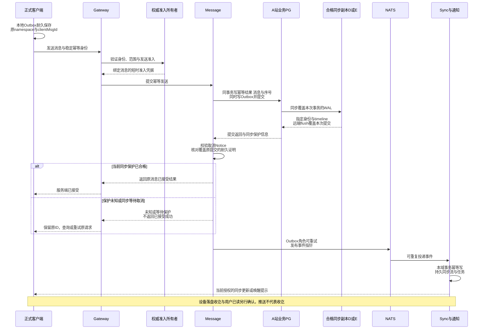
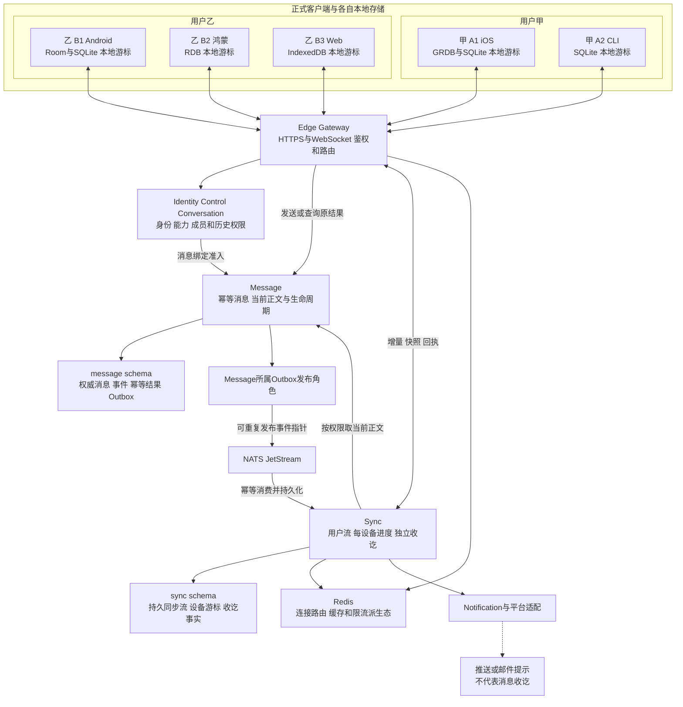
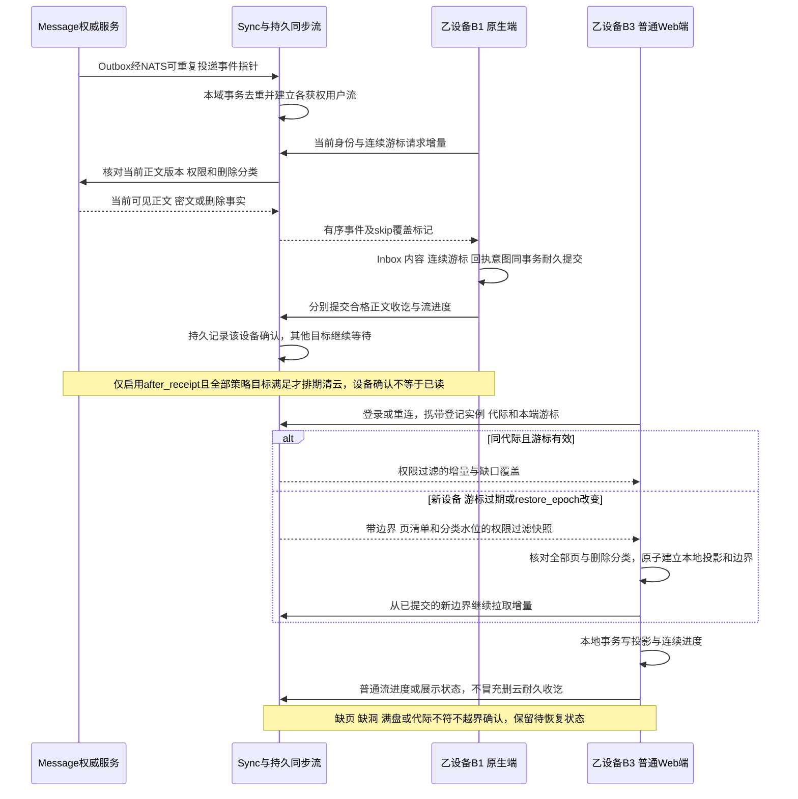
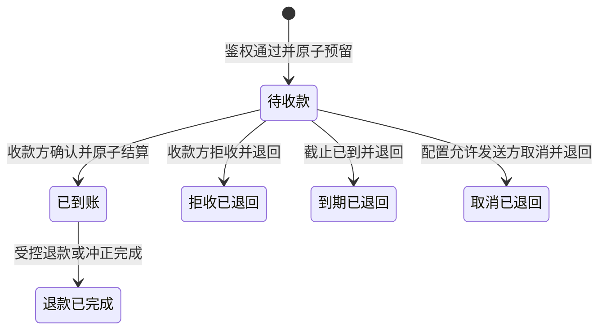
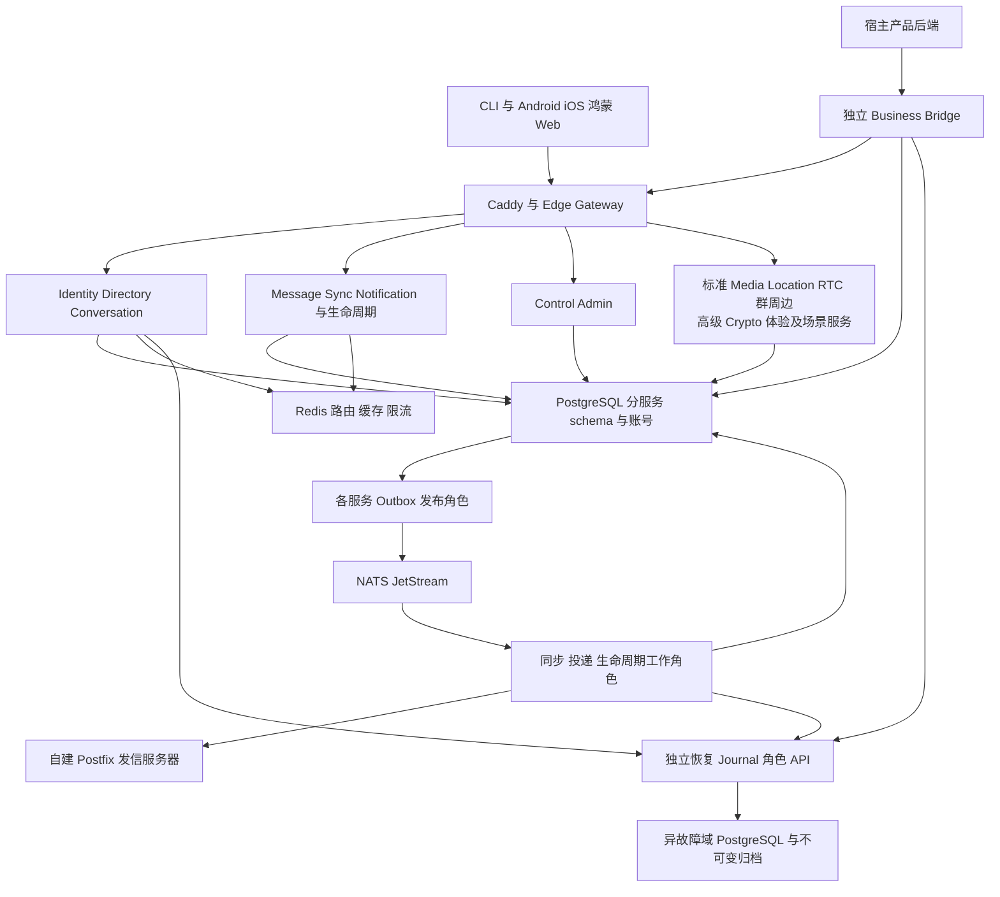
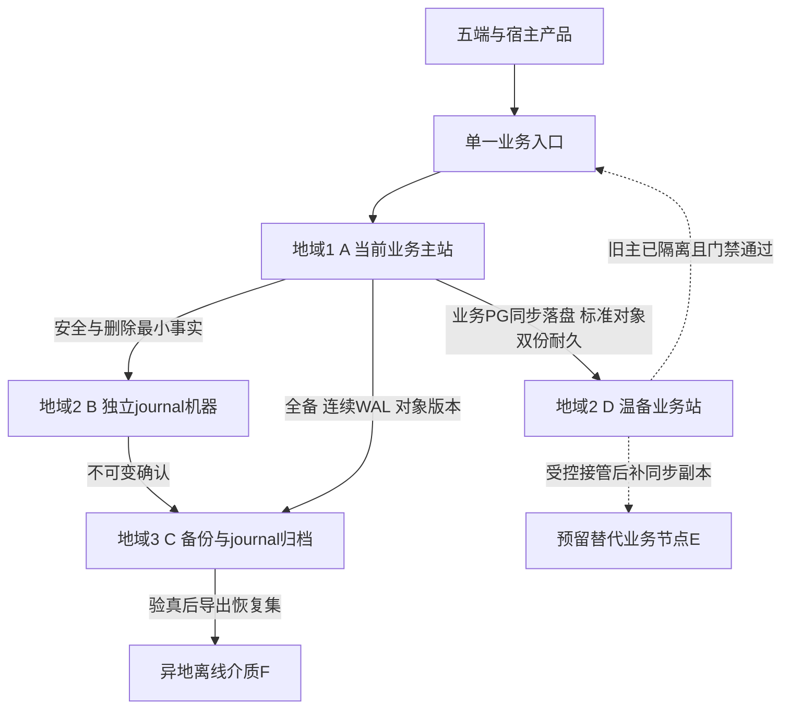
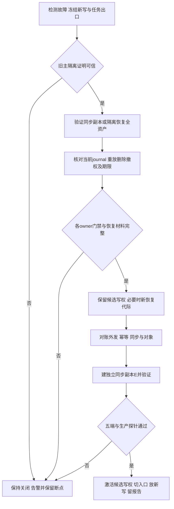

# IM 后端架构表

[toc]

---

| 导航 | 内容 |
| --- | --- |
| [一、架构基线](#architecture-baseline) | 三阶段继承、源码与服务边界 |
| [二、微服务职责](#service-boundaries) | 基础、标准、高级服务和表所有权 |
| [三、协议与可靠消息](#contracts-reliability) | API、授权、Outbox、同步、收讫删除回调、加密协议、机器人和业务桥接 |
| [四、账号与邮件](#identity-security) | 密码、邮件 OTP、封禁与墓碑 |
| [五、Redis](#redis-design) | 缓存、路由、限流和失效策略 |
| [六、数据库与字段](#data-design) | 分服务 schema、具体字段、索引与约束 |
| [七、配置与会员](#configuration-membership) | 能力开关、等级继承、发布回滚 |
| [八、服务器与部署](#hardware-deployment) | 最低/推荐机器、拓扑、容量模型、[一键部署与反部署](#guided-deployment) |
| [九、依赖版本](#dependency-versions) | 经核查版本、源码/许可与锁定合同 |
| [十、运维与封版](#operations-release) | 探针、告警、灾备、迁移与验收 |
| [十一、聊天数据灾备](#disaster-recovery) | 异地同步副本、全资产备份、受控切换与回切、恢复目标及演练 |
| [架构图入口](#architecture-diagram-index) | 服务总览、多端同步、消息时序、灾备和恢复图 |
| [先看通信方式图解](../IM通信方式图解.md/IM通信方式图解.md) | 中心化／去中心化、附近通信、业务责任与高级入口组 |
| [产品需求](../IM需求明细表.md/IM需求明细表.md) | 功能目标与版本边界 |
| [前端架构](../IM前端架构表.md/IM前端架构表.md) | 平台分层、Swift模板、端侧数据/事务与构建 |
| [功能验收](../IM功能验收表.md/IM功能验收表.md) | 每项结果和证据 |

## 🔥 前言

本文是可评审的后端工程设计基线，文档更新日为 **2026-10-09**，依赖复核日为 **2026-10-08**，工程选定基线为 **IM-baseline-20261009.1**。产品行为由 [IM需求明细表](../IM需求明细表.md/IM需求明细表.md) 定义；本文负责服务、协议、数据、部署和依赖，端侧工程与本地表由 [IM前端架构表](../IM前端架构表.md/IM前端架构表.md) 定义，验收结果写入 [IM功能验收表](../IM功能验收表.md/IM功能验收表.md)。当前尚未实现、部署或压测，不把设计值当作已通过的事实。

已确定使用 [**Redis**](https://redis.io/) 辅助后端，采用 [**PostgreSQL**](https://www.postgresql.org/) 保存权威业务事实，[**Go**](https://go.dev/) 实现业务微服务。Redis 的具体许可证按 [依赖清单](#dependency-versions) 纳入交付；不以缓存替代聊天历史、账号权限或资金账本。

## 一、架构基线与三阶段目标 <a href="#前言" style="font-size:17px; color:green;"><b>🔼</b></a> <a href="#🔚" style="font-size:17px; color:green;"><b>🔽</b></a>

### 1.1、继承、封版与一套工程 <a href="#前言" style="font-size:17px; color:green;"><b>🔼</b></a> <a href="#🔚" style="font-size:17px; color:green;"><b>🔽</b></a>

| 阶段 | 工程标段与交付目标 | 进入下一阶段的门槛 |
| --- | --- | --- |
| I 基础版（轻质） | 主营内核只做可靠纯文本单聊，Unicode 表情属于文本；CLI 先贯通最小协议，Android/iOS/鸿蒙/Web 交付同一内核。完成账号/设备同步、通知、字体与无障碍、邮件 OTP、管理员账户状态、手工联系人、能力配置、最小宿主桥接；收讫后可配置删除与生命周期回调从本阶段建立；Bot API 合同先确定 | 本阶段五类客户端与后端的必验项全部通过；图片/附件/群和高阶体验入口及新写接口均关闭；源码/协议/配置/迁移/恢复证据封版，CLI 单独成功不能代表全基础通过 |
| II 标准版 | 继承基础主营内核，增量交付静态/动态图片、音频消息、视频消息、文件与群聊天；标准周边保留音视频通话、搜索、用户确认的通讯录同步、开放机器人/默认机器人/批量计划任务、免费会员等级能力配置 | 基础回归加新增消息类型/群功能通过；媒体消息与实时通话分别验收；旧端兼容、升级迁移、机器人权限和会员继承通过，形成标准封版基线 |
| III 高级版 | 继承标准主营内核，增加私密性（阅后即焚、独立加密模块及协议切换）、体验增强（消息置顶、@群成员、收藏）及中心化多 BaseURL 入口组；按场景启用企业工作区、客服、券积分资金、Web3、AI 等独立微服务；收费订阅/数字购买/广告仍按独立合同预留 | 私密、体验和入口组分别配置、分别验收；入口组不覆盖I／II，去中心化仍按独立可选标段；基础/标准回归不得回退，未实现或未验收模块不能显示已可用 |

三阶段是开发继承，运行时基础/标准/高级是可配置能力预设。封版冻结的是可重建、可恢复的证据基线，不复制三套源码、不另建三套用户/消息数据；下一阶段保留基础能力并执行增量迁移。封版后安全修复形成补丁基线并重验受影响项。[阶段目标](../IM需求明细表.md/IM需求明细表.md#phase-goals)、[版本预设](../IM需求明细表.md/IM需求明细表.md#edition-profiles)

所有周边服务围绕消息主链路装配，故障与资源配额独立，不能因机器人、RTC、商业或 AI 扩展失效阻断本可完成的文本接受和同步。音频/视频**消息**是上传、持久对象和离线投递；实时音视频**通话**是信令与媒体转发，不能相互替代主营消息类型验收。

### 1.2、不变的工程合同 <a href="#前言" style="font-size:17px; color:green;"><b>🔼</b></a> <a href="#🔚" style="font-size:17px; color:green;"><b>🔽</b></a>

- 当前及长期可预见阶段产品免费、源码完整公开；客户端、CLI、后台、业务服务、桥接中间件、协议、构建/部署、迁移和测试均进入交付。必要平台推送/邮件收件服务是外部边界，不能以此隐藏自有核心代码。
- 按关键业务域建立微服务，可在同一台机器分别运行容器；每个服务有独立入口、依赖、数据库账号、迁移、探针和扩容方式。一个按钮不等于一个微服务，业务接口也不等于允许业务代码混入 IM。
- 不信任任何客户端或宿主传入的用户 ID、价格、权限、群成员、等级、时间与状态。鉴权、范围隔离、字段验证、幂等和审计属于全部版本的基座，不能关闭。
- 基础/标准/高级共享身份、会话、消息与权威事件；扩展有自己的 schema。服务只能写自己拥有的表，同机同库也不允许绕过接口跨服务读写私有表。
- 配置只启用已经实现且依赖齐全的能力。停用先禁止新操作、排空任务，已接受的消息、到期删除和结算责任继续完成；高级服务未启用时不启动其容器、连接池、订阅和媒体/模型引擎。

### 1.3、现代稳定与原生端合同 <a href="#前言" style="font-size:17px; color:green;"><b>🔼</b></a> <a href="#🔚" style="font-size:17px; color:green;"><b>🔽</b></a>

服务端采用 [**Go**](https://go.dev/) 并锁定正式受支持版本。iOS 已确认使用 <u>[**Swift**](https://www.swift.org/)</u>，按本人 [**UIKit**](https://developer.apple.com/documentation/uikit) 工程模板、JobsByPods/Podfile 解耦和 DSL 新建业务工程，本地消息引擎为 [**SQLite**](https://www.sqlite.org/)，访问层选定 GRDB.swift 7.11.1＋自有 JobsIMStorage Pod。其他端原生优先的工程路线、兼容范围和工具链由 [前端平台表](../IM前端架构表.md/IM前端架构表.md#frontend-platforms) 与 [前端锁定清单](../IM前端架构表.md/IM前端架构表.md#frontend-locks) 管理，不把后端版本表充当前端选型或实测结果。[目标能力矩阵](../IM需求明细表.md/IM需求明细表.md#client-matrix)

同一源码工程可以有多种平台语言，共享身份/消息协议、能力 ID 与测试样本；原生通知、生命周期、密钥、本地待发、无障碍需分别适配。新技术和 AI 的收益通过构建、资源、故障、兼容和维护结果验证，不以生成成功替代质量证明。

稳定、受支持和可维护优先于版本新旧；每阶段锁定主流正式版本，经兼容与回归验证后升级。另起独立 IM 工程，从零实现业务，不在原业务代码上修改或覆盖；旧实现仅提供值得提取的工程经验，阶段增量继承新 IM 的封版基线。自有通用框架按选定模板及模块复用，权限边界见 [前端源码合同](../IM前端架构表.md/IM前端架构表.md#frontend-ownership)。AI 作为主要实现力量，架构、安全、并发、一致性与恢复执行高级工程标准。部署/反部署承接[平台入口与共享实现](#guided-deployment)模式，在新工程按 IM 合同实现验收。

### 1.4、架构图与阅读顺序 <a href="#前言" style="font-size:17px; color:green;"><b>🔼</b></a> <a href="#🔚" style="font-size:17px; color:green;"><b>🔽</b></a>

架构图使用 [**Mermaid**](https://mermaid.js.org) 可编辑源码，随服务、协议、数据和部署变更同步维护。**当前中心化主线中**，“一个后端”表示同一控制域内统一的 IM 领域模型、授权和协议，不表示只运行一个进程、一台服务器或一个无副本数据库；不把统一授权外推到不同运营者和设备互联网络。逻辑职责、运行容器与物理故障域分别阅读；图中的箭头不授予跨服务直接改表的权限。

| 图 | 阅读目标 | 对应合同 |
| --- | --- | --- |
| [通信方式图解](../IM通信方式图解.md/IM通信方式图解.md) | 先看两大类及消息路径，再看附近通信与业务责任 | [通信控制域](#communication-ownership)、[高级入口组](#endpoint-group-contract) |
| [服务与数据总览](#deployment-topology) | 五端、宿主桥接、核心服务、可选扩展与存储依赖 | 第二章服务所有权、第八章部署 |
| [五端与同账号多设备同步](#multidevice-sync-architecture) | 每台设备独立同步进度，本地库经客户端适配器与服务端对账 | 第三章消息/同步、前端第五/六章 |
| [消息接受与异地耐久时序](#durable-message-flow) | 何时可以显示服务端已接受，总线投递与设备收讫的区别 | 第三章事务、第十一章同步耐久 |
| [断线补洞与新设备恢复时序](#multidevice-sync-architecture) | 增量、完整快照、删除分类和浏览器收讫边界 | T-47、T-50、T-53～55 |
| [灾备拓扑](#dr-topology)与[受控恢复流程](#dr-runbook) | A/D/B/C/E/F 的故障域和切换放行条件 | 第十一章、T-56～58/ARCH-35 |
| [前端分层与平台存储](../IM前端架构表.md/IM前端架构表.md#frontend-modules)、[本地事务图](../IM前端架构表.md/IM前端架构表.md#local-sync-transaction-diagram) | 五端共享合同、采用各自原生适配，落盘与回执有明确边界 | 前端第二/六章、ARCH-34 |

图反映当前设计，不代表服务已部署或验收通过；竞品体验建议经评审纳入行为合同后才更新对应图。封版须核对图、服务入口、表所有权、配置、脚本及真实运行拓扑一致。

### 1.5、中心化主线与去中心化的业务责任 <a href="#前言" style="font-size:17px; color:green;"><b>🔼</b></a> <a href="#🔚" style="font-size:17px; color:green;"><b>🔽</b></a>

一级分类按 **中心化／去中心化** 阅读，消息流向见 [图文说明](../IM通信方式图解.md/IM通信方式图解.md#im-categories)。当前基础、标准、高级继承的主线是中心化内核；后文统一身份、权威表、消息序号、设备进度和灾备合同均限于该部署控制域。服务器集群或多个 BaseURL 不改变运营控制权。

去中心化按高级可选独立标段设计：联邦把身份和事件责任分给不同运营者的服务器，中继由选定网络暂存密文，设备互联把更多身份校验、历史及同步责任放到终端。路线可以组合；后端职责、协议和数据所有权不能只靠更换地址继承。

实际立项须分别明确账号命名空间和信任依据、消息标识／顺序与冲突、离线暂存／新设备历史、终端收讫、删除和管理员权限、端侧密钥以及各运营域恢复责任。自有存储 n 秒清理与回调不保证远端运营者物理擦除；封禁／墓碑不代表全网身份删除；其他节点的副本不自动满足本项目 A/D 耐久或 RPO/RTO。已有中心化会话转换模式须显式授权与迁移，不静默变化。

蓝牙／附近 Wi-Fi 属于候选通信通道，尚未列入当前基础封版或五端支持承诺。附近设备投递不能冒充后台接受，离线设备也不可能实时执行尚未获知的封禁指令；专项身份、期限、收讫和恢复对账合同由 Codex 设计验证。对端始终是待验证输入源，服务器／设备接收方都不能省略校验。[附近通信图](../IM通信方式图解.md/IM通信方式图解.md#nearby-chat)

### 1.6、高级版中心化入口组：发布、轮询与刷新 <a href="#前言" style="font-size:17px; color:green;"><b>🔼</b></a> <a href="#🔚" style="font-size:17px; color:green;"><b>🔽</b></a>

能力码 **`network.endpoint_group_failover`，仅阶段 III**。预埋一组 BaseURL，当前入口连接失败时按顺序尝试同组其他入口，正确连通后切换并拉取新清单；前端发版也可整组更新。I／II 只保留当前配置固定入口的正常重连及现行服务器内部容错，不初始化组轮询或组刷新。[产品合同](../IM需求明细表.md/IM需求明细表.md#advanced-endpoint-group)、[图解](../IM通信方式图解.md/IM通信方式图解.md#advanced-entry-pool)

每组绑定 `environment_id + deployment_id + endpoint_group_id`，组内入口连接同一逻辑 IM 部署和账号域，HTTP API 与实时通道分别有准确地址。入口均须遵守接流配置、单主 fencing、journal、异地同步和恢复代际门禁；读可用和写可用分别呈现。客户端探测只能选择已经放行的入口，不能提升备站为主站，也不能因“连通”降低已接受消息的耐久标准。

配置服务负责目录、签名发布和审计，接入网关负责匿名服务身份／协议探测；清单可在组内合格入口发布独立只读副本。发布签名密钥与网关探测密钥、用户身份／E2EE 密钥分开。清单采用 **Ed25519 签名**；签名覆盖带用途前缀的原始 UTF-8 payload 字节，验签后解析，禁止客户端重新序列化再猜测签名内容。客户端内置本部署可信公钥，轮换由已有根授权或应用发版完成，不从待验证入口取得公钥后自证合法。五端实现使用平台或成熟库，确切版本及测试向量在启用前锁定。[Ed25519 规范与测试向量](https://www.rfc-editor.org/rfc/rfc8032)

| 清单／发布字段 | 合同 |
| --- | --- |
| `schema_version, environment_id, deployment_id, endpoint_group_id, manifest_version` | 格式与部署绑定；版本单调递增，同版不同 payload 拒绝，回滚内容用更高版本发布 |
| `issued_at, expires_at, min_client_version, protocol_versions` | 按可信时间与兼容合同检查；过期清单不能授权新业务连接，时钟异常不跳过校验 |
| `endpoints[]` | 各含 `endpoint_id, api_base_url, realtime_url, priority, probe_public_key`；仅 HTTPS/WSS，准确主机／端口／路径，无 URL 内凭据；不允许任意跨域重定向携带认证材料 |
| `key_id, payload, signature` | `payload` 为可还原的原始签名字节；签名、字段与端点约束全部通过后原子发布。探测随机挑战的签名覆盖本次 nonce、部署／端点身份、协议和读写就绪信息 |
| 发布记录 | 配置服务私有表 `control.endpoint_group_releases`：`id uuid, environment_id text, deployment_id uuid, endpoint_group_id uuid, manifest_version bigint, payload_digest bytea, payload bytea, key_id text, signature bytea, status text, published_at timestamptz, actor_id uuid, reason text`；组＋版本唯一，状态 `draft/active/retired`，普通客户端不能写入 |

正确连通检查 TLS 证书、同一部署的签名挑战、API／客户端兼容及实际实时通道；HTTP 200、TCP 或 ICMP ping 成功均不足。验证前不发送密码、访问／刷新令牌或聊天正文，验证后仍按原鉴权合同登录／重连；签名只证明身份，不保证该入口正在正常提供全部业务。

探测 nonce 由客户端本次随机生成，仅在本候选截止内有效；签名同时绑定 nonce、清单版本、环境／部署／组／端点身份、准确 API／实时地址和读写状态。验证结果不得跨候选或切换代次复用，也不是业务授权。发布高水位、清单摘要、根轮换／撤销最小事实进入现有独立恢复 journal／checkpoint；PITR 恢复先对账，缺材料不发布，重建内容须用高于已发布水位的新版本，不能重新激活已撤销根。

新版有效清单移除／撤销当前入口时停止向其发送新凭据和业务，按新版组受控重连；在途结果保留原 ID 对账，不因回退到旧组重新启用撤销入口。续期即使地址相同也发布新版本。清单到期时暂停该清单授权的新业务、受控关闭其现有业务连接，保留未知结果与本地待发，取得新有效清单后恢复；不靠永久连接绕过期限。降档后的固定入口来自当前可信部署配置，不能把任意旧组地址自动升级为永久固定入口。

初始工程参数：每组最多 **16** 个候选，单候选验证截止 **3 秒**，一轮总预算 **60 秒**，仅一个切换协调器；失败候选冷却 **5 秒**起、指数退避到 **300 秒**，加入 ±20% 抖动。一轮失败保留正式待发并显示离线，整轮重试从 **5 秒**退避到 **60 秒**，网络变化可触发受同一预算限制的新轮次；健康入口正常收发时不逐消息扫组。这些是待实测基线，不是抗干扰成功率承诺。

连接超时、DNS／TLS握手失败或实时通道不可达可触发尝试其他合法候选；证书无效须拒绝该候选。401／403、封禁、权限或业务拒绝不靠换域名绕过，429 遵守限流重试提示。无法判断的发送结果保持未知，用同一部署、原 namespace／恢复代际／clientMsgId 查询或幂等重试，不能制造新消息；恢复代际已改变则执行现有恢复合同。

切换成功后独立刷新清单，验签、防回滚、有效期及兼容检查成功后原子替换。刷新失败保留**仍有效**的旧组和当前合格入口；清单过期停止据其建立新业务连接。发行包及曾验证的缓存地址可作为**匿名取新签名清单的传输候选**，不转交凭据／正文，也不以过期探测密钥授权业务；只有新的有效清单和服务身份通过后才建立业务连接。组内全部失联时靠本机待发、后续网络恢复或前端发版引入新组，不能声称可以凭空拉到新地址。应用发版不能覆盖本地已接受的更高版本；重装／最高版本记录丢失按发行包信任与最新清单重新建立，不假称还能记住原高水位。服务端关闭／高级降档时停止新组轮询和刷新，用仍合格的固定入口收尾及对账；无可用入口则保留正式离线状态。[五端协调器](../IM前端架构表.md/IM前端架构表.md#endpoint-group-client)

## 二、业务微服务、职责与数据所有权 <a href="#前言" style="font-size:17px; color:green;"><b>🔼</b></a> <a href="#🔚" style="font-size:17px; color:green;"><b>🔽</b></a>

### 2.1、基础服务 <a href="#前言" style="font-size:17px; color:green;"><b>🔼</b></a> <a href="#🔚" style="font-size:17px; color:green;"><b>🔽</b></a>

| 服务 | 责任与接口 | 自有 schema / 状态 | 故障边界 |
| --- | --- | --- | --- |
| `edge-gateway` | HTTPS/WebSocket、连接鉴权、连接限额、心跳、请求路由；Web含同源BFF角色，协议不含宿主业务实现 | 无业务私表写权；BFF通过identity内部API访问auth.bff_sessions；Redis仅短时路由 | 重连从同步补洞，Cookie/凭据安全事实不依赖Redis缓存 |
| `identity-service` | 用户/身份、密码/OTP/MFA、设备与会话、权限验证、封禁/墓碑/恢复 | `auth` | 关键鉴权不可用时拒绝新受保护操作，不信任缓存授权 |
| `directory-service` | 公开资料、手工联系人、拉黑与隐私；标准阶段增加明确同意的通讯录发现 | `directory` | 资料缓存失效可回源；拉黑等权限规则用当前权威判定 |
| `conversation-service` | 私聊唯一性、成员、发送准入、角色、历史可见范围；标准阶段承载群/频道权限 | `conversation` | 无法确认发言权限时不接受新消息；授权与权限撤销有明确先后边界 |
| `message-service` | 消息幂等、会话内序号、耐久提交、ACK、编辑/撤回/过期事件；持久保留策略、收讫删除任务与版本化删除回调 | `message` | 数据库未提交不返回已接受；提交后投递故障由 Outbox 重放；生命周期回调故障不阻断消息删除 |
| `sync-service` | 用户增量流、设备游标、收讫/已读、快照与补洞；冻结投递目标与持久收讫事实，发出范围完成事件 | `sync` | 断线不丢事实；Redis 在线路由失效可由持久游标恢复；通知到达不等于本地持久化收讫 |
| `notification-service` | 推送适配器、免打扰、推送尝试；邮件任务投递与反馈 | `notify` | 推送/SMTP 受理不等于用户已收到；不影响已经接受的聊天事实 |
| `control-service` | 能力定义、配置发布、部署应用/作用域、审计、阶段基线；标准阶段增加会员配置 | `control` | 期望配置与有效配置分离；非法配置不发布 |
| `admin-service` | 管理后台 API、管理员操作编排、审计查询；请求转交数据所有者 | `admin` 仅管理操作编排与审计副本 | 无权直接改其他 schema；管理员身份仍由 identity 权威验证 |
| `business-bridge` | 宿主身份映射、业务资源/事件绑定、Webhook，独立中间件 | `bridge` | 宿主失败不污染 IM 核心；可随独立 IM 实例一并交付 |
| `governance-service` | 基础举报/管理员处置、本人数据导出/注销与清理编排；独立恢复日志角色接收各域最小删除/安全变更 journal；高级阶段扩展企业审核工作流 | `governance`；恢复 journal 另用独立存储与恢复周期 | 状态转换与物理清理分别执行；服务停用不能遗失已经成立的清理任务；普通业务库的 PITR 不能同时回退恢复 journal |

后台发信组件连接自建 SMTP 服务，基础阶段不需要给终端用户建设邮箱收件箱。Outbox 发布器、投递工作进程、生命周期清理器属于对应服务的独立运行角色，可同镜像不同启动命令，迁移与表所有权不变。

基础预设不启动媒体、群扩展、消息收藏和加密服务，不初始化其 schema/连接池/后台任务；资料头像先采用客户端随包资源和服务端头像标识，不借头像打开用户图片上传入口。conversation-service 的私聊成员校验仍运行，群类型准入与群管理接口在标准阶段启用。已经升档再降档的实例保留必要历史读取与收尾角色，按 [升级降档保护](#tier-data) 执行。

### 2.2、标准与高级扩展服务 <a href="#前言" style="font-size:17px; color:green;"><b>🔼</b></a> <a href="#🔚" style="font-size:17px; color:green;"><b>🔽</b></a>

| 阶段 | 独立服务 | 责任 / schema |
| --- | --- | --- |
| II | `media-service` | 静态/动态图片、音频/视频消息、文件的上传、授权下载、完整性校验、处理与独立保留 / `media`；基础预设不启动 |
| II→III | `interaction-service` | II 的反应、投票、结构化卡片；III 增量消息置顶与收藏 / `interaction`；消息正文仍归 message，@成员由 message/conversation 校验与 sync/notify 分发 |
| II | `location-service` | 单次位置、限时实时位置与独立授权的附近发现 / `location`；位置受众/来源、截止、点位清理和候选查询由本服务负责；基础不初始化，E2EE 当前拒绝云位置能力，见[位置合同](#location-service-contract) |
| II | `search-service` | 被授权的云会话搜索索引、个人查询 / `search`；权限在返回结果时重验 |
| II | `rtc-service` | 通话状态、首个接听获胜、房间授权 / `rtc`；媒体转发部署为独立 RTC 服务 |
| II | `bot-service` | Bot API、机器人凭据/权限、Webhook/轮询、默认机器人、执行审计 / `bot` |
| II | `scheduler-service` | 定时/周期/批量任务、运行租约、幂等执行、暂停取消 / `schedule` |
| III | `workspace-service` | 企业组织、成员/访客、工作区授权 / `workspace` |
| III | `support-service` | 客服队列、坐席、会话分配、工单关联 / `support` |
| III | `crypto-service` 与端侧 `CryptoProvider` | 独立加密模块；服务端注册协议/版本、协商安全模式、设备公钥/预密钥与备份元数据 / `keyring`；端侧完成 E2EE 内容加解密，不接收端侧私钥 |
| III | `benefit-service` | 券库存、领取/核销、积分账本和兑换 / `benefit` |
| III | `ledger-service` | 用户转账、待收款确认/拒收/到期退回、本人收支账单、资金复式账本、红包、支付状态、对账退款 / `ledger`；转账依赖账单与资金授权，聊天服务只引用交易 ID，不开放任意改余额接口 |
| III | `web3-service` | 钱包签名验证、链适配、交易回执和确认数 / `web3` |
| III | `ai-service` | 用户授权的摘要/翻译/助手、提供商适配、配额 / `ai` |
| III 增量 | `governance-service` | 在基础举报/数据权利服务上增加企业审核、复杂工单与保留策略 / `governance` |

基础数据权利、消息保留/收讫删除和账号注销清理在阶段 I 就具备；附件过期从阶段 II 继承同一生命周期合同；阶段 III 的治理服务增加复杂工作流，不允许借“高级模块未启用”停止基础删除责任。阅后即焚的执行仍由 message/media 的耐久生命周期角色负责，不新增一个只负责按钮的微服务。

### 2.3、微服务模块启停与按需资源 <a href="#前言" style="font-size:17px; color:green;"><b>🔼</b></a> <a href="#🔚" style="font-size:17px; color:green;"><b>🔽</b></a>

服务模块状态为 `registered/disabled/initializing/ready/draining/stopped/failed`。声明 moduleId、版本、依赖、接口/事件、数据所有权、配置、初始化/停止合同、探针及资源预算；只有 ready 接受新工作。初始化幂等且有超时，失败释放已获取资源；停用停止新准入、排空或持久交接在途任务，再停止容器和专属连接/队列/定时器。必要收尾角色继续完成既定责任，后台显示实际状态。

采用源码中明确的服务/模块注册与独立部署，不通过下载用户二进制或 Go 动态 plugin 执行未经信任代码。前端高阶页面与媒体引擎同样按需创建。未启用的源码不等于全部常驻内存；配置预设的资源收益通过同硬件/同数据/同负载的启动、常驻内存、CPU、连接、任务和首次访问延迟对照测量。

## 三、协议、可靠消息与开放集成 <a href="#前言" style="font-size:17px; color:green;"><b>🔼</b></a> <a href="#🔚" style="font-size:17px; color:green;"><b>🔽</b></a>

### 3.1、同步 API 与事件合同 <a href="#前言" style="font-size:17px; color:green;"><b>🔼</b></a> <a href="#🔚" style="font-size:17px; color:green;"><b>🔽</b></a>

外部与阶段 I 内部接口统一为 HTTPS + JSON，实时通知使用 WebSocket；以 [**OpenAPI**](https://www.openapis.org/) 保存版本化可生成的合同。CLI 与原生客户端使用同一身份和消息 API，不拥有后门接口。内部服务采用双向 TLS/服务身份，网络白名单不能代替服务鉴权。当前不为基础版强制增加另一套 RPC 框架。

| 合同 | 字段 / 规则 |
| --- | --- |
| 请求上下文 | `requestId`、`traceId`、认证会话、服务端解析的`scopeId/sourceContextId`；幂等写入增加`idempotencyKey`，普通可变对象并发更新同时提交`expectedRevisionEpoch/expectedVersion`，不能只传裸版本 |
| 同步结果 | 业务对象、权威`revisionEpoch/version`、来源键与服务端时间；快照/增量/分页沿用同类型比较；错误统一`code/message/retryable/requestId`，明确`UNAUTHORIZED/FORBIDDEN/FEATURE_DISABLED/VERSION_CONFLICT/RATE_LIMITED` |
| 消息发送 | `sendNamespaceId/restoreEpoch/clientMsgId/conversationId/type/schemaVersion/payload/attachmentIds`；I 仅 text/空附件，II 按已启用消息类型校验，III E2EE 增加 `protocolId/protocolVersion/keyEpoch/cryptoContextId/providerGroupId/protocolEpoch`；身份、发送时间、成员、权限、序号、成功状态由服务端决定 |
| WebSocket 通知 | 通知类型、对象 ID、权威版本、增量游标；有界载荷，收到通知后按权限拉取，不把通知当作唯一历史 |
| 事件信封 | `eventId/scopeId/restoreEpoch/eventType/schemaVersion/aggregateId/aggregateVersion/revisionEpoch/occurredAt/causationId/traceId/payload`；订阅方按事件 ID 幂等，版本比较包含代际 |
| 对外 Webhook | 事件 ID、时间戳、签名、重试号；密钥轮换、重放时间窗、幂等与停用；未知字段兼容，未知事件不崩溃 |

接口路径分 `/v1/auth`、`/v1/conversations`、`/v1/messages`、`/v1/sync`、`/v1/media`、`/v1/locations`、`/v1/capabilities`、`/v1/bots`、`/v1/bridge` 和管理员路径。认证来自令牌与服务身份，不来自路径中的用户 ID。分页用稳定游标，所有批量请求限制条数、字节、执行时间和并发。

Web 默认由同源网关的 BFF 角色保管上游访问/刷新凭据，浏览器只持 `__Host-jobsim_session` 的随机不透明会话 Cookie：`Secure; HttpOnly; Path=/; SameSite=Lax`，不设置 Domain。BFF 会话绑定部署/scope/用户/设备/来源和刷新 family；自身到期不得晚于上游会话。浏览器写接口检查 Origin 和绑定会话的 CSRF token，GET 不产生业务写入；WebSocket 仅同源、校验 Origin 和会话/来源授权。跨域候选由 BFF 在可信入口验证后调用，不向其他域名共享浏览器 Cookie，也不把 refresh 回传 JavaScript。正常刷新通过BFF单协调器原子更新上游凭据，保持仍有效的浏览器会话；重用检测、撤权/退出和恢复代际改变则结束对应BFF会话。刷新成功响应丢失不套用宿主换票的300秒记录，未交付刷新专用恢复合同前停止使用旧refresh并重新验证身份、受控撤销旧family，不能靠sessionId续登或盲目重刷。此网关内部角色无需新增业务微服务，服务端仍重验上游权限；I/II不因此启用III多入口组功能，具体各端保护见[前端凭据合同](../IM前端架构表.md/IM前端架构表.md#platform-lifecycle)。

BFF耐久秘密的owner选定为identity-service的`auth.bff_sessions`，网关仅通过受限内部Web会话API读取/更新，不直接读写auth私表。Cookie常态只存高熵摘要；上游refresh以AEAD密文存该专用表，视BFF为受限Web客户端凭据持有者，不改变`auth.sessions`仅存摘要的规则。密钥由独立秘密配置引用，AAD绑定BFF记录/scope/user/device/source/restoreEpoch/family/refresh_generation；只有指定BFF服务身份、该Cookie/来源和当前会话检查通过才可取内部交付，不开放浏览器获取refresh的接口。TTL取当前上游闲置/绝对期限中的较早者，不得由Cookie续期扩大；退出/撤权失效立即拒读并耐久清理密文，BFF/Redis重启不能让旧Cookie恢复权限。刷新先将本记录标updating，BFF只在新凭据和匹配generation密封存储成功后恢复active；响应/保存未知时转reauth_required并终止旧资格，不把旧密文当可用refresh。PITR恢复按当前安全journal使旧代际BFF记录失效/清密文，再重新登录；备份旧秘密字节沿保留窗处理，journal不含Cookie/refresh。详见[身份表](#identity-tables)。

Web登录前verifier由同一owner的专用短期`auth.bff_exchange_requests`密封保存，最长300秒，不依赖BFF进程内存。浏览器只持`__Host-jobsim_exchange`随机不透明挑战Cookie（Secure/HttpOnly/SameSite=Lax/Path=/、无Domain，Max-Age不超原期限）；它**仅原挑战查询/交付，不能访问聊天或作为完成登录Cookie**。记录存摘要并绑定准确Origin、requestId/challenge/来源/设备/恢复代际，只有指定BFF内部API凭该Cookie及原上下文可取verifier。普通`auth.exchange_challenges`仍只存S256 challenge，原生/CLI的verifier不上传秘密保管表。BFF重启可续原请求；Web须先耐久密封上游refresh及原正式Cookie交付材料，再按下述**浏览器确认**合同清秘密/过期挑战Cookie，不能因BFF已拿到refresh就提前清证明。恢复旧epoch或证明材料不可取得，按[replacement合同](#exchange-credential-delivery)以新宿主证明撤原资格和会话再新挑战；不从备份恢复有效verifier。

#### 3.1.1、Web登录Cookie最后一跳的耐久再交付与确认 <a href="#前言" style="font-size:17px; color:green;"><b>🔼</b></a> <a href="#🔚" style="font-size:17px; color:green;"><b>🔽</b></a>

上游换票凭据交付与浏览器`Set-Cookie`交付是两个完成点，成功取得refresh不代表浏览器已登录。identity在本域同事务把上游refresh密封进`auth.bff_sessions`、把随机原正式Cookie及确认上下文以独立nonce/AAD密封进`auth.bff_exchange_requests.browser_cookie_ciphertext`，绑定原挑战/request/来源/设备/恢复代际、result_bff_session_id、family和refresh_generation；正式Cookie常态仍仅在bff_sessions存摘要。此事务完成后，BFF才可确认上游交付；Web记录保持`awaiting_browser_confirmation`，原300秒窗口/更早原截止**不重新起算**。

| 阶段 | 行为与竞态边界 |
| --- | --- |
| pending | 初始仅原挑战查询/交付。没有已密封refresh和Cookie材料时不发正式Cookie、不确认上游；崩溃/保存未知沿同requestId查原本域结果，不重新换票 |
| awaiting_browser_confirmation | BFF用原挑战Cookie＋准确Origin/CSRF＋当前上下文，受限读取原密封Cookie并重发**同一个**`__Host-jobsim_session`；不创建第二上游/BFF会话，不生成另一个Cookie，不把材料交JavaScript。此状态的正式Cookie也只能查询/确认/取消交付，聊天、同步、WebSocket和刷新准入均关闭 |
| 浏览器确认 | 浏览器实际收到正式Cookie后，使用它调用`/v1/auth/web-session/confirm`，携原绑定requestId/稳定confirmationOperationId及CSRF证明；受限`/v1/auth/web-session/status`可在响应正文丢失时取回原确认ID/CSRF挑战和阶段，不返回任何令牌/Cookie材料。identity核对准确Origin、Cookie摘要对应的同BFF会话、family/refresh/来源/安全/恢复代际和原截止，在相同BFF/交换行锁下转active/confirmed。只在**浏览器证明已持正式Cookie**后清verifier/Cookie交付密文并过期挑战Cookie，随后开放获权聊天；错误Cookie/他人会话/错上下文拒绝 |
| 响应丢失/重启 | Set-Cookie响应丢失时，浏览器仍用原挑战Cookie在原窗取同材料，BFF重启不丢密封记录。confirm响应丢失时，浏览器已持正式Cookie，用原确认ID查已active结果；重复/并发确认只一次转态，不反复换票/刷新。confirm和撤权/到期按同本域锁排序，失效先成立则确认拒绝 |
| 失效与超期 | 首次刷新旋转、会话撤销/退出、授权/恢复代际变化、原挑战到期使**仍待交付/确认**资格invalidated/expired并清秘密，未确认的BFF/上游会话按原安全撤销合同终止，不能后续凭旧Cookie激活。需要继续登录先完成replacement再新挑战；已确认active会话遵守正常会话截止，不因300秒交付窗自然结束被注销，但不能再交付旧Cookie |

该临时Cookie密文是auth专属秘密，与verifier分别使用唯一nonce和明确AAD用途，禁止进日志/事件/journal或普通缓存。恢复旧记录拒绝交付并清秘密，不从旧备份恢复Cookie可用性。T-34及对应整改子场景验证Set-Cookie丢失、确认丢失、BFF重启、并发确认、错误Cookie、首次刷新与撤权/恢复；这是设计合同，尚未实际运行。

### 3.2、消息接受、投递与事务 Outbox <a href="#前言" style="font-size:17px; color:green;"><b>🔼</b></a> <a href="#🔚" style="font-size:17px; color:green;"><b>🔽</b></a>

发送先由身份/会话所有者确认当前账号、会话、拉黑、成员和能力。identity-service 从权威数据库校验 `security_version/state`，control-service 判定当前有效会员/能力策略，conversation-service 在本服务事务中按当前成员版本记录发送准入。准入凭据绑定作用域、发送者、会话、`clientMsgId`、内容摘要、账号 generation、会员/config 版本、成员版本及过期时间，签名限定 message-service 使用，初始有效期不超过 5 秒，不能跨消息复用。任何必要权威服务不可用都不发新准入，Redis 旧值不能放行。

账号、会员和群权限由不同服务拥有，不宣称跨域撤权与消息提交是全球瞬时原子事务。每个权威服务在本域事务中排序授权决定与撤权，短时凭据的有效期取所有权威验证时限中的最早值，不能从最后一步开始重新计算 5 秒。撤权后该权威服务不再签发有效授权，撤权前已签发的凭据只能在这个有界窗口内进入提交，超时须重新验证。事务设置受请求截止约束的超时，已经提交/结果暂时未知的操作按数据库最终事实核对；5 秒是准入有效期，不能仅按计时器认定所有事务排空。后台显示“新授权已禁用/正在排空/完成”，不能在排空期间宣传所有在途操作已取消。消息收到并不自动赋予撤权后阅读历史的权限，拉取/下载仍校验当前权限。客户端时间、缓存版本不能改变先后。

message-service 在同一数据库事务内完成幂等键检查、准入凭据验证、会话序号递增、消息/事件插入和 `outbox` 插入。使用耐久提交，只有事务成功才返回“服务端已接受”；相同 `clientMsgId` 重试返回原结果，内容摘要不同则冲突。会话头行锁将会话内写入排序，热点会话以分片/配额优化，不能用客户端时间排序。

幂等身份完整定义为 `(scope,sender principal,send_namespace_id,clientMsgId)`。send namespace 由 message-service 在鉴权后签发，绑定独立 `restore_epoch`、发送者、代际与接受截止，原 Outbox 不可搬到新 namespace。退休与消息提交使用同一 namespace 行锁/CAS：先关闭新接受并核对在途提交终态，再允许按锁定窗口回收结果别名；退休证明/最低可接受代际仍保留并进入恢复 journal，旧准入不能越过本域退休栅栏。窗口结束后的查无结果返回 `HISTORICAL_RESULT_UNAVAILABLE`，不等于从未提交；不自动换 ID 重发。退休不影响原消息的授权历史、收讫或删除，正文清理也不等于删除拒重放事实。窗口与 GC 条件在阶段 I 实现前锁定，T-51 验证。

有附件时，先登记持久 `send_attempts`，再向 media-service 取得绑定该发送尝试的临时保留凭据；上传对象已完成大小/类型/摘要验证，但尚未成为永久消息引用。message 的提交事务锁定发送尝试行、确认状态仍可提交并写消息/附件引用事件；Outbox 异步完成媒体绑定确认。两服务不使用跨表强事务，确认失败进入持久重试，已提交消息不会因通知延迟直接删除对象。

孤儿清理器仅在保留到期后向 message 请求“确认已提交或原子取消未提交尝试”。message 使用与提交相同的尝试行锁：已提交返回消息引用，未提交转为不可再提交的 aborted；状态未知/超时则继续保留并报警。media 只有收到明确 aborted 或无需保留的权威结果才回收对象，不能只凭 TTL 或一次“暂未查询到消息”删除附件。重试/清理竞争、服务宕机和延迟确认列入标准媒体验收，基础文本链路不启动附件流程。

可靠异步传递使用 [**NATS JetStream**](https://docs.nats.io/concepts/jetstream)，启用文件存储、耐久消费者、显式 ACK、失败重投及死信处理。发布器仅在收到消息总线确认后标记 Outbox 已发布；崩溃会重复发布，消费者以 `(consumer,eventId)` 去重，完成自己的数据库事务后才 ACK。JetStream 发布 ACK 与副本数不直接等于关联掉电时立即 fsync 的保证；保留可重放的 PostgreSQL Outbox/业务事件，并记录消费者覆盖游标及重放窗口，不能发出总线 ACK 后立即删除唯一补发事实。业务服务仍以 PostgreSQL 为事实来源，不宣称端到端“绝不会重复”。[JetStream 官方合同](https://docs.nats.io/concepts/jetstream)

在线/离线/多设备都读取持久同步流；每设备游标独立。客户端只有在完整消息与连续同步进度写入本地持久事务成功后才 ACK 收讫；TCP/WebSocket 接收、推送到达、仅内存解码不构成收讫。重复 ACK 幂等，存在缺洞时不能累计确认越过缺口；附件元数据与完整附件对象的确认分开。用户已读游标单调前进，最大值不能越过其可见范围；编辑、撤回、删除和入退群有版本化事件。游标保留期过后进入权限过滤的快照重建，不能直接跳到最新位置而丢失删除事实。推送是提醒；“服务器接受、设备收讫、用户已读”是三个不同状态。本地消息/Inbox/连续游标/回执意图的同事务耐久、失败恢复与演示隔离见 [前端同步合同](../IM前端架构表.md/IM前端架构表.md#durable-sync)；存储能力不足的端不能作为删云唯一副本的合格收讫依据，策略/目标在启用前核验，不伪造目标完成。

个人隐藏/删除、仅删除云正文与全局撤回/焚毁分别持久记录：个人动作只过滤本人的视图；`cloud_only` 保留已收讫本地副本并明确历史不可再下载；`global` 发出本地清理指令，保留不含正文的消息墓碑与删除序号。游标过期使用带边界游标的完整快照，再补边界后的增量；快照中明确区分“云内容已清理但本地可保留”和“已撤回/过期不得保留”，不能把旧本地内容上传复活，也不能仅因云正文不存在就误删合格本地副本。离线终端未连接期间不能保证远程擦除已下载内容。[收讫删除与回调合同](#receipt-deletion-hooks)

删除事件和短期墓碑压缩前，必须把 cloud_only/global 与个人可见性所需最小分类交给权威分类索引或经验证无损的覆盖段；不能只凭 retain_until 到期把最后一份分类丢掉。分类保留/压缩覆盖所有仍支持的离线重建与可恢复备份，旧窗口失效有明确重建合同。快照绑定来源授权、恢复代际、覆盖范围/分类水位、边界及完整页清单；缺项只有在明确覆盖和分类证明下才有含义，无法判断时返回 unknown 并受限补查，不令客户端误删唯一副本或保留已 global 正文。跨域构建记录各 owner 版本/水位；期间版本不匹配就重取或使快照失效，不把各次实时拉取混称同一时点。客户端完整核验、原子切换后再确认边界；缺页/过期不能推进。T-50 验证压缩与完整快照。

恢复后的排序和同步使用新 `restore_epoch`，不是仅换登录令牌。同步流身份为 `(scope,source context,principal,restore_epoch,streamId)`，事件/分页/快照、累计游标和消息/对象回执都绑定该代际，旧代际 ACK 拒绝且不能计入新投递目标。消息创建顺序及阅读/可见性边界比较 `(sequence_epoch,seq)`，恢复前记录保留原顺序，新写在新 epoch 排序；聚合版本比较 `(revision_epoch,version)`，不因裸序号/版本复用跳过新事实。新 epoch 从权限过滤的完整快照建立新连续游标，原库唯一副本、未知待发和不可逆事实先核对，不把旧 cursor=100 自动套到恢复后的新流。T-53 验证 PITR、序号复用和旧 ACK。

历史 origin event 保留原身份/版本用于去重，恢复后重放须向所有者核对当前事实并封装到新代际同步流；不能把旧事件的裸序号解释为新流位置。尚待确认的旧消息由权威服务在新恢复代际重新发布原目标清单/内容版本，客户端核对本地完整内容后生成新代际确认；旧 receipt_outbox 不可直接改 epoch 发送。已经完成的删除不重新开放正文，原先合格的存储副本不因恢复自动获得更广权限。

新恢复代际的完整快照是权威重基线，覆盖内普通可变对象显式签发当前 revision_epoch/恢复基线版本，不能让未再写的旧行仍以 E0/v18 被本地 E0/v20 拒绝。各 owner 在恢复门禁内建立该基线投影并记录覆盖水位；本地原子安装 E1 基线后再接新事件。原创建 sequence_epoch 保持不变，已成立的删除/撤权及隐私截止不能重基线回退；云已删的本地唯一正文按分类保留，未对账普通差异可隔离留存，不自动上传或静默丢弃。恢复点/普通业务损失及差异如实记录，不能用重基线冒充零 RPO。

deviceId 表示某来源上下文的一次消息存储实例，不是可跨重装复用的硬件号码；登记时绑定不可原地替换的 store_generation 和已验证持久能力。删库、浏览器驱逐/清空、重装或恢复旧消息库后，必须先退休旧 deviceId/会话/推送资格，重新认证并登记新 deviceId；保留 cookie/Keychain 凭据不能让空库继承旧收讫、冻结目标或旧附件授权。正常保持数据完整的 schema 迁移可保留原登记，异常时停止 ACK 而不是覆盖 generation。离线时先本地隔离，未完成服务器登记不得向真后端确认。旧目标按权威撤销与未达规则处理，新实例不加入旧冻结目标；已合法清理的正文不能由重新登记复活。T-54 验证空库、旧 ACK 迟到与重新下载边界。

当前权限过滤不能在用户流中静默跳号。服务端返回绑定流/epoch、授权版本与明确 `[from_cursor,to_cursor]` 的 redacted/skip 覆盖标记，不泄露被裁剪对象或正文；客户端耐久应用覆盖标记后可以推进连续游标，但不能为该消息生成正文/对象收讫。普通事件的 eventDigest 只覆盖不可变信封/元数据，正文 hydration 响应另带 bodyDigest、内容 revision/version 和 available/edited/deleted/forbidden 等状态。重取时正文变化不冒充不可变事件篡改，真正相同事件异摘要仍拒绝；取不到旧版本时按权威状态完成该流位置，新版走自己的事件或快照，不能把最新正文按旧版本确认。T-55 覆盖撤权缺口与动态取正文。

### 3.3、机器人接口、默认能力与计划任务 <a href="#前言" style="font-size:17px; color:green;"><b>🔼</b></a> <a href="#🔚" style="font-size:17px; color:green;"><b>🔽</b></a>

机器人采用 [**Telegram Bot API**](https://core.telegram.org/bots/api) 的开放接入思路，接口与实现自行设计，不承诺兼容其完整协议。高级用户注册机器人后，在自己的进程/服务器编写代码，通过 Bot API、Webhook 或长轮询处理事件；IM 服务不在用户聊天进程中直接执行任意上传脚本。[产品范围](../IM需求明细表.md/IM需求明细表.md#bot-platform)

| 合同 | 具体设计 |
| --- | --- |
| 身份和令牌 | 专用 `botId`、owner、可撤销随机令牌；数据库仅存令牌摘要；人类用户、机器人与服务账号身份分开 |
| 权限 | 创建者授予能力，加入会话仍按群/用户授权；默认只见直接发送给机器人、命令和被明确授权的事件；不默认读取全部私聊/历史 |
| 默认机器人 | 帮助/命令发现、个人提醒、经授权的群欢迎与群规则、定时公告、本人或管理范围内的批量通知；全部可关闭，不默认开启外部 AI 或商业发送 |
| 计划任务 | 一次定时/周期规则、时区、首次/结束时间、漏执行策略、最大次数、受众快照或执行时解析、暂停/取消；执行前重验账号/会话/机器人权限 |
| 批量任务 | 幂等批次 ID、逐收件人结果、总量与速率上限、重试/部分成功；限制到授权且同意的受众，不能自动给所有注册账号群发 |
| 调度可靠性 | PostgreSQL 持久计划/运行记录，工作者按租约领取；Redis 可作短时互斥辅助，数据库唯一执行键与状态是最终保证 |
| Webhook | 固定 HTTPS 目标、原始 body 签名/时间戳/事件 ID 与重放保护；公网用户目标防 SSRF/DNS 重绑定，拒绝内网/元数据地址；受控私有宿主可由运维明确 allowlist 与隔离出口开放必要内网；失败退避、停用、可查询待投递事件 |

默认机器人也通过同一接口和权限运行，不拥有跳过鉴权的系统后门。WebHook 返回成功仅代表事件已接收，不代表计划任务或消息发送已经成功；执行结果独立查询与回报。周期任务的本地时区/夏令时、服务停机后补跑/跳过、修改任务版本后的去重规则纳入标准版验收。

身份统一为有类型的 principal：human 沿用 userId，bot 沿用 botId，service 仅供明确交付的模块合同；不能把 bot 的 owner_user_id 当发言者。人类会话成员与 bot 成员分别建表，Bot API 由 bot-service 校验机器人状态/令牌/grant 和所有者当前状态，再取得绑定 bot principal 的同一消息准入；角色/额度按授予范围取交集，所有者管理员权限不自动授给机器人。机器人发言和审计保留 sender kind，客户端明确标识。

收讫清单分别记录 required_users 与 required_bots。机器人的事件入队、Webhook 2xx 或轮询游标只表示传递进度；只有已注册且通过耐久合同的消费端点完整保存相应正文/对象后，显式确认版本/代际/摘要，才可计入 after_receipt。每个 required bot 必须有合格端点确认；端点空集不完成，不能默默排除 bot 假称范围齐全。不具备此能力时拒绝该组合或按明示未达期限结束，普通机器人仍可在 cloud_history 工作。E2EE bot 须作为可见且明确授权的可信端点支持所选 Provider，否则不能参与，服务端不代解密。T-49 验证人类、机器人与宿主权限边界。

调度计划固定 `plan_version/cancel_generation`，运行和每个批次动作绑定其版本、租约 fencing token 与稳定 `clientMsgId`。取消事务停止新动作准入，计划进入 `stopping/draining`，未取得有效动作准入的 run/item 转 cancelled；已取得准入的动作只能在原短时截止内向业务所有者交接，已提交动作如实报告，不能由“取消成功”伪称撤回消息。scheduler 对动作准入、取消排序并耐久记录交接，message 校验绑定动作的准入/截止及幂等 ID；提交结果未知须查询，租约过期不能换新 ID 重发。只有全部已发执行资格/未知提交达到终态才显示 cancelled：已提交如实列结果，未提交须由下游原子 abort 或经其确认的到期/fence 阻止未来提交；下游未知保持 draining，不以租约时间过去认定完结。修改计划产生新版本并取消旧版本尚未准入动作，已经交接的旧动作仍按原合同收尾，不同时执行两个版本。默认 DST 规则为不存在的本地时刻跳过、重复时刻只取首次；停机漏执行默认跳过，可显式选择有界补跑，规则和时区版本均进入封版合同。

回调接收方应验证签名并先持久入队/去重再返回 2xx；失败进入退避、死信与受控回放。公网与私有桥接采用不同受控出口策略，不能以开放任意 URL 换取方便，也不能一律拒绝合法私有部署。[OWASP Webhook 安全](https://cheatsheetseries.owasp.org/cheatsheets/Webhook_Security_Cheat_Sheet.html)

#### 3.3.1、计划正文、周期模板和收藏引用的保留/清理 <a href="#前言" style="font-size:17px; color:green;"><b>🔼</b></a> <a href="#🔚" style="font-size:17px; color:green;"><b>🔽</b></a>

明确区分三种计划内容：`source_ref`只引用已有获权消息ID/代际/版本，`independent_draft`为本人尚未发送的一次内容，`independent_template`为本人明确授权独立存储的周期内容。scheduler唯一拥有`schedule.plan_payloads`，`plans`只保存active_payload_id和计划控制字段，原`plans.action_payload_ciphertext`不在新设计重复保存正文；修改创建新payload_version，旧run固定旧版本，并按原交接/排空合同收尾。Outbox/运行结果/批次结果只存ID/摘要/状态，不复制正文。

| 对象 | 保留与清理合同 |
| --- | --- |
| 源引用计划 | `source_ref`的ciphertext必须NULL，每次执行向message取当前获权原版本。源global/焚毁、来源撤权或历史失权立即禁止新动作并取消未准入run，不从缓存/旧备份复活。cloud_only后服务端无正文则报告`SOURCE_CONTENT_UNAVAILABLE`并暂停/终止该版本；合法本地源副本不构成scheduler取回正文的授权 |
| 一次未发送正文 | 仅本人明确创建的独立draft，不因收藏/转发已有消息自动变独立副本。创建时冻结绝对payload_expires_at，首期创建起最长30天，schedule执行必须更早；到期停新准入，未知交接沿原ID对账，不凭计时宣称未发。已下游接受的消息使用自己的生命周期，不由计划清理撤回 |
| 周期独立模板 | 须显式用途/受众/内容独立存储授权及endAt，首期`endAt<=createdAt+30天`；无期限计划/模板拒绝。取消/结束/授权失效停止新执行；模板是明确独立内容，不属于某次已发消息的副本，某次消息cloud_only不自动取消整个计划，也不得把已有焚毁/global消息偷偷复制成模板。若来源本就受禁止复制/焚毁规则约束，拒绝独立模板创建 |
| 终态清理 | 全部动作已完成/取消且无未知交接的payload，默认终态后300秒清理，可配置0～86400秒，`cleanup_due_at=min(terminal_at+delay, payload_expires_at)`；编辑退休的旧payload同样排清理。不把stopping/draining假称终态。即使执行仍未知，到绝对payload期限也停止所有新正文交付并清正文，继续保留原幂等ID/摘要/已交接资格等元数据核对与排空；不能借未知结果无限保留正文或重新发消息 |
| 已发送正文 | 每条已提交消息由message/media独立承担冻结策略/收讫/焚毁；计划结束不清历史消息，消息删除也不改已提交的计划执行事实。关联只保稳定result_message_id，不复制已发正文作执行报告 |
| 收藏与置顶 | 收藏默认仅`source_message_id/source_revision_epoch/source_version/source_context_id`引用，`snapshot_ciphertext`保留兼容字段时以数据库CHECK强制NULL；不在服务端建独立收藏正文。置顶同样纯引用。查询重验源权限/版本/来源，cloud_only标云源不可取，端侧原合法副本按原规则显示；global/焚毁撤销引用和清端缓存。E2EE收藏保端侧引用并用原Provider解密源，不上传明文/另建服务端副本 |

计划自己的终态/期限清理由`schedule.payload_cleanup_jobs`持久领取，准确键为`(scope,planId,payloadId,payloadVersion,cleanupGeneration)`，使用租约/fencing与journal期限/intent/result门禁；只清本域正文、对应缓存/在线副本，保留必要无正文执行事实。涉及源消息派生引用或受约束副本时，message的`content_cleanup_steps`记录`owner_service=scheduler-service, representation=schedule_source_ref, holder_id=planId, object_type=plan_payload, object_id=payloadId, payload_version=原版本, source_context_id=原来源`；interaction用`representation=favorite_ref/pin_ref, holder_id=收藏/置顶ID, object_type=favorite/pin, object_id=同ID`。纯引用清理不是云正文副本删除，global必须传播引用失效；cloud_only标不可取但不虚称删除合法端侧源。

普通投票卡片仅保存pollId引用，interaction的prepared投票绑定已提交source_message_id及源版本/保留合同才开放；源cloud_only/global/到期时停止投票/修改、失效准入generation，`content_cleanup_steps`准确登记`owner_service=interaction-service, representation=poll_question_options/poll_votes, holder_id=pollId, object_type=poll, object_id=pollId, payload_version=源绑定版本`。interaction清题目/选项和该poll的votes明细后只保留无正文不可用状态，迟到准入不得再次填充，不能只清message正文遗留投票副本。未绑定的创建尝试沿原请求核对/abort，状态未知不对外公开。

任何以后批准的正文副本须另登记持有者/用途/原源ID/版本、绝对期限和准确object键，未纳入manifest不得报告源正文全清理；scheduler不能跨schema清message或interaction表。global/撤权访问立即禁用，物理清理待journal确认，延迟和未知独立报警。独立模板的备份字节按既有窗口保留，恢复对账当前绝对期限/撤权并清理，不自动复活任务。T-10/T-20/T-30验证副本/引用、300秒终态、30天绝对边界、取消未知、已发消息独立保留和旧备份。

### 3.4、嵌入别的产品与独立中间件 <a href="#前言" style="font-size:17px; color:green;"><b>🔼</b></a> <a href="#🔚" style="font-size:17px; color:green;"><b>🔽</b></a>

宿主通过原生 SDK/界面组件/CLI/HTTP 接入，可以为某个产品独立部署完整 IM 实例或服务器。桥接中间件持有宿主连接配置，将经宿主服务端签发、经验证的身份映射到 IM 用户；不能由前端提交 `externalUserId` 即获取他人会话。宿主凭据与 IM 用户会话分离，短时换票绑定 app、audience、nonce 和过期时间。[产品合同](../IM需求明细表.md/IM需求明细表.md#external-integration)

| 绑定对象 | 中间件持久数据 | 核心边界 |
| --- | --- | --- |
| 外部身份 | `appId + issuer + externalSubject → imUserId` | 相同文本 ID 在不同 app 不能互认；宿主管理员不是 IM 全局管理员 |
| 业务资源 | `appId + resourceType + resourceId → conversationId` | 资源所有权由宿主权威接口确认；IM 不查询宿主订单/财务表 |
| 业务事件 | 外部事件 ID、类型、映射版本、处理状态 | 基础仅做绑定和获授权的纯文本业务通知，标准起可生成结构化业务卡片；不能把宿主字段伪装成text绕过阶段限制；事件幂等、可重放，不在 IM 内实现订单业务 |
| IM 事件 | 消息/成员/状态事件的获授权裁剪与外发记录 | 默认不外发聊天正文、联系人、E2EE 私钥；业务需要的字段另行授权 |

中间件可以替换而不修改消息核心。Webhook/事件暂时失败进入持久重试和待处理状态，宿主与 IM 不共用数据库事务，也不承诺用分布式回调自动实现跨系统原子提交。基础版完成一个最小身份换票与业务资源绑定演示，随后每种宿主连接器单独验收。

身份换票由 identity-service 在本域事务中原子消费 `(scope,app,issuer,nonce)` 并创建绑定来源的会话，唯一键防并发兑换；nonce 到期、已消费或宿主映射 generation 不符均拒绝**新兑换**。同请求摘要的响应丢失通过[短期交付记录](#exchange-credential-delivery)取回原会话的同一份凭据，不重新消费 nonce 或创建第二会话；异摘要重放拒绝。会话保存 `source_app_id/source_mapping_id/source_mapping_generation`；签发、刷新和受保护请求同时验证个人账号与当前 app/映射权威状态，bridge 不可用或来源撤权尚未核实则拒绝该来源授权。停用 app、解绑外部身份先在 bridge 本域耐久递增撤权 generation 并禁止新换票，经事件/API 让 identity 撤销对应来源会话；撤权期间不得信任旧缓存。个人登录和其他 app 会话不因此被连坐，除非另有明确账号处罚。

来源 app 有效不等于取得该用户全部 IM 权限。来源会话绑定不可扩大的 grant（允许的 app/resource/conversation/operation、grant 版本和期限），实际授权再与本人当前成员/可见性取交集；个人空间和其他 app 会话默认不授予。列表/搜索/同步流/快照/推送、下载和直接猜 ID 请求都按来源裁剪，准入凭据绑定 source/grant；客户端不可通过省略来源字段转为个人身份。授权变更使旧 grant 失效并通知来源流，本地 SDK 按来源上下文隔离缓存/游标。跨产品共享会话须另有明确共享授权，T-49 检验同 scope/同用户的宿主 A/B 隔离。

grant、来源会话与消息准入固定签发时的 app_authorization_generation；每次签发/刷新/请求与当前 app 权威代际比较，不能只检查 active。app 停用在本域递增代际并拒绝旧 grant，重新启用保留新代际，须重新授予/登录；身份撤会话事件尚未处理也不能使旧权限复活。mapping/grant自身撤销同样比较其代际。

身份兑换先取得 IM 当前交换挑战/上下文，宿主签名票据绑定其 restore_epoch、app 授权代际、mapping/grant及 nonce/用途/受众。identity 只接受独立 registry 当前恢复代际并在 nonce 事务中核验；PITR 前的票据即使未过期、消费记录被回退，也只能拒绝并重新签发，不能重复建立新会话。T-33/34覆盖已消费票据的恢复重放。

Bot/bridge 的持久投递队列默认只存事件 ID、版本、摘要和授权对象指针，发送/重试时按当前授权与生命周期取正文；global、到期或撤权后不能把积压旧载荷再次外发。确有声明的正文复制用途时登记持有者、用途、保留期限与清理责任，未发送副本进入 content_cleanup_steps；外部已经交付的独立副本按告知边界处理，不虚称可远程擦除。云正文清理完成必须覆盖所有约定在线队列副本，不能因加密存储就排除。

#### 3.4.1、宿主换票的原申请方证明与短期凭据再交付 <a href="#前言" style="font-size:17px; color:green;"><b>🔼</b></a> <a href="#🔚" style="font-size:17px; color:green;"><b>🔽</b></a>

选择 **PKCE S256 申请方绑定＋auth 专属 AEAD 短期交付记录**。常态`auth.sessions`仍只存随机刷新摘要，不把sessionId当登录完成。挑战前原生/CLI生成32字节随机verifier，Web由同源BFF生成并放专用300秒密封保管表；普通挑战/宿主签发方只接收SHA-256后的base64url challenge。verifier不进入日志/事件/bridge或常态会话，原生/CLI交付前安全保存；BFF短时秘密按[Web保护合同](#api-contracts)受限保管，丢失且无法安全取原记录即走replacement。[PKCE S256格式](https://www.rfc-editor.org/rfc/rfc7636)

规范请求摘要覆盖challengeId/requestId、S256 challenge、app/mapping/grant/source、device/storeGeneration、恢复/授权代际和用途等固定交换上下文，不把尚未签发的票据签名或verifier放入摘要，避免票据自签摘要的循环。再交付同时核对原票据签名摘要与该原上下文，不能只核对可自报的requestId。

| 步骤 | 本域处理与失败合同 |
| --- | --- |
| 申请 | `/v1/auth/exchange/challenges` 以稳定requestId绑定app、来源映射/grant、设备/storeGeneration、当前restoreEpoch和S256 challenge；最长300秒。宿主签发的票据签名**同时覆盖challengeId、S256 challenge、device/storeGeneration、sourceContextId、requestId/规范请求摘要**以及nonce、用途/受众/期限/安全代际，identity逐字段核验；未绑定的旧票据不能用攻击者自己的verifier兑换。挑战API不接受客户端自报userId，身份由已验宿主证明与当前映射权威决定 |
| 首次兑换 | `/v1/auth/exchange` 校验同挑战/票据、verifier和请求摘要。identity同事务消费原nonce、创建**一**个来源会话、写固定refresh_generation及加密交付材料、完成幂等结果；并发只返回这一结果。访问/刷新令牌先随机生成，再以Go标准AES-256-GCM、唯一随机nonce及外置key_ref加密，AAD绑定scope/app/requestId/challenge/device/storeGeneration/session/family/refresh_generation/restoreEpoch及摘要 |
| 响应丢失 | `/v1/auth/exchange/delivery` 要求原requestId、**同请求摘要和verifier证明**；只查既有交付记录，不执行兑换、不再次消费nonce。校验原票据/challenge尚未到期、会话未撤销、刷新generation未旋转、账号/app/映射/grant和恢复代际仍有效后，解密并交付原字节；缺记录、secret或任何校验不明均拒绝，sessionId本身不构成证明。Web交付只到BFF，再设同源Cookie |
| 期限与消费 | `expires_at=min(created_at+300秒, 原票据/挑战/来源grant截止, 会话截止)`；同请求原材料可在此范围重复取回，不能每次读取续期。成功拿到凭据后可用本会话确认交付；确认、首次刷新旋转、撤销/退出或代际变化原子使交付资格consumed/invalidated并清密文，不再返还旧refresh。刷新和再交付用相同会话/交付行锁排序，避免旋转后迟到取旧凭据 |
| 超期/原材料丢失 | 返回 `EXCHANGE_DELIVERY_EXPIRED/PROOF_UNAVAILABLE` 与受限状态，不自动创建第二会话。原申请方以新有效宿主身份证明请求replacement：先在identity事务中撤销旧交付资格及**该旧会话**（客户端明确提示旧会话已失效），完成安全journal撤销门禁后才发新挑战/新requestId并重新换票；撤销未知保持pending，不能无限要求重试已无材料的旧请求。无当前证明无法补交，走正常本人重新验证 |
| 恢复与清理 | 交付密文是短时秘密，过期即关闭读取，auth耐久清理角色移除密文/nonce/key_ref后保留最小幂等状态。物理备份可能保留旧密文字节，恢复门禁核验当前期限/代际并清理，绝不重新交付；恢复journal只记撤销/generation等最小事实，禁止放Token、verifier或交付密文。旧nonce/请求不能因PITR被复活 |

T-34验证“真实获得可使用的原会话凭据”、响应丢失/并发、verifier伪造、票据到期、刷新竞态、撤权/恢复和超期重申请；T-33验证新挑战不能绕过原安全代际。记录字段见[身份表](#identity-tables)。

### 3.5、收讫后可配置删除与生命周期回调 <a href="#前言" style="font-size:17px; color:green;"><b>🔼</b></a> <a href="#🔚" style="font-size:17px; color:green;"><b>🔽</b></a>

这是从基础版继承的消息内核，不等同于高级版阅后即焚。后台按部署作用域/会话策略选择 `cloud_history`（按云历史保留期限清理）或 `after_receipt`（符合指定收讫范围后删除云内容）；待投递记录的释放与云正文保留分别设置，收到 ACK 不直接删除唯一消息事实。启用 `after_receipt` 时必须明确填写非负整数 `delay_seconds=n`、范围、未达最大保留期与附件规则；不在源码硬编码某个秒数。`n=0` 表示满足条件后即可安排删除，依然必须先完成耐久状态转换，不能跳过回调事件或删除事实。

承诺不可延长的生命周期截止在**建立并报告生效时**就写独立恢复 journal，不能等实际删除才留记录。包含稳定 triggerId/操作ID、目标/范围、generation、绝对 due_at 与原因；收讫排期保留首次 receipt_complete_at+n，焚毁保存原始起点/截止，硬保留期及其缩短同样受保护。确认前显示 protection_pending，不宣称受保护期限已建立；本域已知访问硬期限仍按时限制。恢复按原绝对截止补跑，不重新起算。它是提前保存最小期限事实，不等于立即删除，也不替代执行时的 intent/result 门禁；普通消息接受/普通 ACK 无须因此都改成跨域事务。需要此保证的会话/策略须完成期限保护门禁才报告可用。

| 合同 | 权威处理与边界 |
| --- | --- |
| 收讫范围 | 发送时冻结有权接收的用户/设备目标集和成员版本；`all_target_devices` 要求全部目标设备确认，`per_user_any_device` 要求每个目标用户至少一台合格设备确认。没有合格设备/全部设备撤销的目标用户仍是未达，不能以空集满足而立即删除。范围明确包含哪些发件人关联设备；群聊不能用一名成员收到代替全群收到。被撤销设备仅凭权威撤销事件移出目标并记录原因，不由客户端自行忽略 |
| 本地持久确认 | 消息完整写入本地后发送应用 ACK，sync 校验身份、目标、消息版本和该设备已发范围；服务端无法验证真实客户端是否落盘，端侧验收必须用崩溃/重启证明。重复、丢失 ACK 可重试，不重复计数、不跨缺洞累计确认 |
| 触发与计时 | sync 在持久事务中记录收讫、范围首次满足时间与 Outbox；message 幂等接收后令 `due_at=receipt_complete_at+delay_seconds`，使用服务端时间。ACK/范围完成事件重复不推迟计时；后台显示等待确认、已排期、执行中、云内容已清理或失败状态 |
| 编辑与旧确认 | 已有编辑能力开启时，after_receipt仅message权威状态仍等待确认且尚未排期/取得删除资格可编辑；编辑准入CAS产生新edited_version/收讫generation，沿原manifest建立新版本目标并清空新代际确认。旧版本ACK/迟到范围完成事件不确认新正文，新版本目标再次满足才排期；保留原最长未达/保留截止，编辑不得无限延期。已排期/执行/云已清理拒绝编辑并说明状态；cloud_history沿普通编辑合同 |
| 新旧设备与未达 | 新绑定设备不自动加入旧目标快照；删除后的云正文不能补给新设备或被范围规则排除的离线设备。选择 `per_user_any_device` 必须呈现此影响。未达达到 `undelivered_max_age_seconds` 后按明示策略过期、标记未收讫，并保留最小失败事实，不能伪造“已送达”或无限保存 |
| 消息与附件 | 消息 ACK 仅确认正文/附件描述。II 起对每个附件按完整字节、摘要校验、合格设备持久保存建立独立 `object_received` 收讫及保留策略；`after_object_receipt` 等全部目标对象条件满足后才能释放，`fixed_retention` 按独立期限执行。未下载视频不能因收到文字/链接就被当作附件已收讫；未达上限仍可按告知的期限过期，明确其与“确认后删除”不同 |
| 配置版本与迁移 | 每条消息固定策略版本、n、目标规则和保留边界；默认修改只影响新消息。管理员明确迁移待删消息时，预览新截止、目标和范围，审计并 CAS 更新未执行任务；已取得执行资格/已删除不能撤回，既定焚毁/不可延长期限不被普通配置取消 |
| 删除执行 | PostgreSQL 持久任务按租约领取。事务一按消息状态/策略generation加锁或CAS取得执行资格，写租约/fencing token、稳定before事件及Outbox并提交；先取得[恢复 journal](#recovery-journal)的耐久 intent 确认，未确认保持 pending 并报警。事务二重验执行代际/token/租约，原子移除本服务云正文、写最小墓碑/删除范围、after/Outbox及本域执行结果；journal result 确认后才宣告完整完成。失败回滚正文事务，另耐久记录failure与重试；云清理cloud_only不清本地副本，撤回/焚毁global才传播本地清理事件。重启补跑与重复领取只有一次逻辑结果；本地定时器和Redis TTL不是唯一任务源 |
| 媒体授权续存 | cloud_only 清正文后保留无正文的 message/conversation/target manifest、媒体引用及授权元数据，直至附件责任结束。原合格目标且已收讫正文/附件描述的设备仍须当前账号/成员/可见范围校验，才可刷新短期下载 URL 或按摘要续传；正文清理不能提前删掉 media.access_links 使尚未完成附件策略失效。未收讫正文的设备、新设备及发送时排除的设备不能借快照或 URL 刷新新取旧对象；快照/元数据返回也按这一访问集合裁剪，不泄露引用，per_user_any_device 的未收讫设备影响仍按目标合同明示；global 立即撤销后续授权。已经发出的短期 URL、外部缓存与已下载副本按各自撤销/到期边界告知，不能承诺瞬间远程擦除 |
| 多截止与范围升级 | 收讫+n、未达上限、云历史保留、阅后即焚、撤回/注销及附件独立期限各自有稳定 triggerId、generation、deadline/reason/deleteScope；下一执行截止取尚未履行触发的最早值，不能因较晚收讫+n延长既定焚毁。只在**已经到期或明确立即生效**的触发集合中取强范围，global 优先于 cloud_only且已生效范围不能降级，不把未来global提前执行。例收讫30秒cloud_only、焚毁1小时：30秒仅云删，1小时另升global代际传播。已清云正文后仍保留后续global触发任务，新任务使用更高删除代际/稳定trigger键，新增墓碑/事件、撤销媒体与同步本地清理，不能因正文为空跳过全局传播；同消息并发触发按消息行锁/CAS仲裁，旧cloud_only token不能覆写新global。副本清理/必要保留例外分别记录，不覆盖原删除事实 |
| 完成范围 | 正文、附件、搜索索引、缓存/CDN 与备份分别记录清理责任/时间窗；数据库正文完成不谎称附件与旧备份已同步擦除。内部事件、Outbox、JetStream、消费 Inbox/死信、同步流/快照/推送任务仅存最小元数据、摘要和授权对象指针，不持久复制任何聊天正文（含 E2EE 密文）。Bot/bridge 队列按[外发合同](#bridge-architecture)执行。旧版本正文副本逐持有者纳入清理清单，broker 副本需定位清除或等待明确的整段到期并核验完成水位，不能因消费已 ACK 当作已擦除；全部规定的在线副本完成后才宣告在线云正文清理完成，旧备份另计。墓碑压缩先保证权威分类与拒重放覆盖，不能清掉最后删除事实 |

删除触发点预埋版本化 `DeleteLifecycleHook v1`，内建接口与业务桥接使用相同事件信封。事件为 `message.delete.before`（已取得资格、将执行）、`message.delete.after`（本服务目标清理完成）、`message.delete.failure`（某次执行失败）；附件使用对应 `media.delete.*`。载荷限于 `eventId/jobId/scopeId/objectId/deletionGeneration/policyVersion/reason/deleteScope/dueAt/occurredAt/attempt/errorCode` 等获授权元数据，禁止默认附带正文、附件内容、解密密钥或用户密码。

`before` 是**非阻断通知合同**：先提交其耐久事件，再执行本服务删除，不等待远端业务处理成功；接收方可能在删除完成后才收到 before，因此不能把它当作备份正文或批准删除的接口。取得资格事务提交前崩溃重新领取；提交后、正文删除前崩溃恢复同一任务，复用稳定before事件ID；正文事务提交后崩溃由完成状态返回原结果，复用稳定after事件ID，不能重新触发逻辑删除。租约被新工作者领取后，旧token不能再提交。未配置回调时正常删除；注册的适配器有独立工作进程、可配置超时/并发/重试次数与退避，超限进入死信、报警和受控回放，回调超时/崩溃不能无限拖住删除。删除本身失败保留任务重试并发failure，每次失败以执行attempt区分；回调失败另记投递错误，不伪称消息删除失败。相同eventId可重复投递，接收方必须幂等；各事件携带generation/phase，重放或乱序不改变删除事实。[独立中间件](#bridge-architecture)、[生命周期字段](#conversation-message-tables)

### 3.6、独立加密模块与可切换协议 Provider <a href="#前言" style="font-size:17px; color:green;"><b>🔼</b></a> <a href="#🔚" style="font-size:17px; color:green;"><b>🔽</b></a>

高级版用独立 `crypto-service` 与各端 `CryptoProvider` 隔离加密协议；基础 TLS、密码哈希和服务端存储保护始终运行，不因高级模块关闭而取消。Provider 合同包含 `providerId/protocolId/protocolVersion/capabilities/keyFormatVersion`、注册/初始化/协商/轮换/撤销/加解密/销毁及兼容性自检；协议算法与库必须经安全审查、互操作验证与版本锁定，不允许后台上传任意脚本或自创算法。

高级主路线由 Codex 确定为 **MLS 1.0 / RFC 9420＋OpenMLS**，私聊是两个用户的设备组成的 MLS 组，群聊采用同一实现；每个获权设备为独立 leaf。库版本、网络协议版本和自有 Provider ABI 分开，首个 `provider_id=mls10-openmls`、`protocol_id=mls`、`protocol_version=1.0`、ABI/keyFormatVersion 为自有 `v1`。基础/标准可以先交付，不等待高级密码模块实现。[MLS 标准](https://www.rfc-editor.org/rfc/rfc9420.html)

现有 `key_epoch` 明确定义为本产品的 `crypto_generation`：会话内单调的密钥/安全上下文激活代际；数据库仅存规范字段key_epoch，不另存可能分叉的同义计数器。它不是 MLS 内部epoch。另记录 `crypto_context_id`（自有上下文ID）、`provider_group_id`（真实MLS GroupId）与 `protocol_epoch`（该组内部uint64 epoch）。每次激活新的协议epoch或上下文都建立更高的产品generation映射；切协议或同Provider重建组后，新组可以从协议规定的epoch重新开始，不能强行改MLS内部计数。消息信封/AAD、准入、组Commit顺序、当前映射、设备能力与本地密封状态同时绑定上述字段，旧上下文epoch=1不能被新上下文epoch=1复用；wire将协议epoch编码为精确十进制字符串，数据库用受uint64范围约束的numeric(20,0)，Web不经浮点中转。

| 项目 | 已选版本 / 机制 | 官方依据与交付责任 |
| --- | --- | --- |
| 密码内核 | `openmls=0.9.0`；`openmls_traits/openmls_rust_crypto/openmls_basic_credential=0.6.0`，主体 MIT | [官方正式发行](https://github.com/openmls/openmls/releases/tag/openmls-v0.9.0)；使用同一 RustCrypto provider，不让用户比较多套库，所有传递依赖进 Cargo.lock/SBOM |
| 工具链 | [**Rust**](https://www.rust-lang.org/) 正式发行 `1.98.1`，Cargo 使用其随附组件 | [官方补丁发行](https://blog.rust-lang.org/2026/09/03/Rust-1.98.1/)；满足 OpenMLS MSRV1.91并留有稳定窗口，实际 Cargo版本/target/摘要随构建记录，不用 stable 浮动安装 |
| Cipher suite | `0x0001 / MLS_128_DHKEMX25519_AES128GCM_SHA256_Ed25519` | [正式支持](https://docs.rs/openmls/0.9.0/openmls/)；关闭草案/PQ/virtual-clients/targeted-messages，以及 content-debug/crypto-debug，不将实验特性纳入默认安全承诺 |
| 端侧附件 | `aes-gcm=0.10.3`（MIT OR Apache-2.0）；每对象随机独立 256-bit 密钥、AES-256-GCM 分块认证加密 | [正式密码库](https://docs.rs/aes-gcm/0.10.3/aes_gcm/)；密钥/摘要/格式只入 MLS 密文，nonce不重复，AAD绑定对象版本/分块序号/总量；衍生图单独加密，服务端不做 E2EE 明文转码 |
| 五端桥接 | 同一 Rust 内核；iOS XCFramework/C ABI＋Swift Pod，Android JNI，鸿蒙 C ABI/N-API，Web WASM Worker，CLI C ABI平台包 | [上游平台边界](https://github.com/openmls/openmls#supported-platforms)、[Rust 鸿蒙 target](https://doc.rust-lang.org/rustc/platform-support/openharmony.html)；上游部分移动/WASM只构建未测试，鸿蒙未在其测试矩阵，Codex逐端移植并验收，不把target存在写成兼容通过 |
| 身份信任 | 端侧账号根签名公钥＋设备证书，可信旧端授权新设备；首次联系 TOFU记录并提供安全码核对 | 自有身份绑定把 deployment/scope/user/device/generation 与公钥签在证书内。BasicCredential标签不是身份认证；根公钥变化必须提示，未经人工核对的首次联系不承诺抵抗恶意目录替换。邮箱找回不能自行恢复 E2EE旧密钥 |
| 状态持久化 | 有版本自描述状态＋本地密钥封装；ratchet状态与消息 Inbox/Outbox/游标/ACK意图遵守同一事务合同 | 不用上游内存 provider 作生产；适配器加入端侧原子提交，不把上游各自SQLite提交称为原子。旧加密备份只读恢复历史；恢复写能力需登记新设备并建立当前 epoch，不能回退 ratchet/nonce。0.9.0状态格式变化见[发行说明](https://github.com/openmls/openmls/releases/tag/openmls-v0.9.0) |

选择 OpenMLS 是统一私聊/群聊、开源许可和多端共同内核的工程取舍；不选 [**libsignal**](https://github.com/signalapp/libsignal) 作为主线，其 [AGPLv3许可与外部使用边界](https://github.com/signalapp/libsignal/blob/main/README.md) 增加本产品未来自有商业选择和维护整合约束，不代表 Signal 协议不成熟。当前仅选定路线，没有完成密码实现或安全审计。

Codex 的高级交付门禁包括标准向量、另一个独立 MLS 实现互操作、五端互发、成员/设备加入移除、epoch竞争/缺失Commit、离线撤销、ratchet与待发原子性、旧备份、密钥变化、附件截断/换序、协议切换/旧密文/退役及敏感日志检查。完成威胁模型与独立安全复核后才可生产启用。首期只开放这一个已实现且通过的 Provider；第二协议经相同门禁后注册，不在后台展示虚假的可切换选项。RTC媒体E2EE另行实现，不由MLS消息协议覆盖。

高级以子能力增量交付：一个合格MLS Provider可以使E2EE子能力通过，`crypto.protocol_switch`须具有两个真实且通过的源/目标协议才可通过并启用；只换MLS套件或实现不算跨协议切换。第二协议的选型/实现责任继续归Codex，按第三阶段实施时的成熟性重新核查，用户无需决定密码机制；它未完成时不宣称高级全量封版。

`device_manifest_digest` 表示有类型的参与端清单，包含 human device 与明确获权 bot endpoint 的 ID/代际、公钥指纹和 Provider 能力。机器人端点不支持目标协议时不能激活切换或降级明文；端点撤销/能力变更使旧协商失效并按既定 epoch 边界处理。所选 Provider 需要预密钥时，其合同同时覆盖对应机器人端点的领取/单次使用，不用人类设备凭据代替。

| 能力 | 合同 |
| --- | --- |
| 协议注册 | 服务端白名单登记可用协议/版本、Provider 源码与依赖版本、状态、可读/可写范围；各端报告构建支持，由协商选共同安全集合，不信任客户端自行声称的高权限或未允许算法 |
| 会话切换 | 管理员/获授权会话参与方可发起切换请求；完成成员/设备能力验证、必要用户确认、密钥协商及 epoch 激活后，新发送使用目标协议。准入凭据绑定协议/epoch与协商版本，激活切换须排空旧准入或明示旧epoch有界截止，不用客户端声明替代权限边界。协商未完成维持原安全会话或明确暂停新发送；离线不兼容设备按合同等待升级/授权移除，不能静默降为明文 |
| 消息信封 | 每条密文固定 `protocol_id/protocol_version/key_epoch/crypto_context_id/provider_group_id/protocol_epoch` 与设备目标信息；接收端据此选择原 Provider。缓存、重试和服务端路由不得把旧密文按新的默认协议解释；未知/禁用协议或验证失败显示受控错误，不尝试不安全的自动回退 |
| 历史兼容 | 切换只改变切换边界后的新消息；旧协议以 read-only 方式保留到历史迁移/保留期完成。历史重加密由获授权端侧执行、验证完整性并发布新版本，服务端不持私钥代做；Provider 退役前核对旧密文、离线设备、备份、恢复与密钥销毁，无法读取的历史明确告知 |
| 密钥与隐私 | E2EE 的内容加解密和私钥在端侧；服务器仅持设备公钥/预密钥、协商结果、密文与必要元数据。密钥 epoch 更新与成员加入/退出/设备撤销形成版本化边界，管理员切换协议不获取聊天明文或私钥 |
| 与体验组合 | E2EE 搜索在端侧完成，收藏默认只持源引用且按[计划/收藏清理合同](#schedule-favorite-retention)处理；置顶/@仅按获授权元数据处理。阅后即焚的起算/对象/传播范围独立于收讫删云策略，启用收藏/转发/备份前校验冲突，不能借体验增强绕开既定焚毁责任。普通投票/云位置不能被高级继承自动打开，遵守以下组合禁用合同 |

协议切换是可随时**发起**的受控操作，不承诺所有设备瞬间热切完成。停用/降档仍保留旧密文所需的最小只读 Provider 和到期清理角色，直到迁移/退役合同完成。[加密模块字段](#advanced-module-tables)、[能力配置](#core-capability-assembly)

#### 3.6.1、E2EE与普通投票、云位置及源消息引用的组合边界 <a href="#前言" style="font-size:17px; color:green;"><b>🔼</b></a> <a href="#🔚" style="font-size:17px; color:green;"><b>🔽</b></a>

`interaction.polls`属于标准阶段，**仅非E2EE普通会话**可用；当前没有端间加密投票实现。interaction创建/投票/改选/修改/重新开放API均通过conversation权威安全模式和有限准入校验，E2EE返回`FEATURE_INCOMPATIBLE_SECURITY_MODE`，关闭UI不是唯一保护。既有普通投票不能以“存储加密”更名为E2EE投票；未来若交付`interaction.polls.e2ee`，需独立内容加密、状态汇总、成员/设备权限、匿名与删除合同，当前能力注册为不可启用。

切换E2EE前取得conversation安全模式栅栏，停止签发旧普通投票/位置准入，排空已准入动作；必须关闭进行中的普通投票、暂停/结束实时共享及普通位置发布并取得各owner确认后才能激活。只查询一次状态不构成跨服务原子性；未确认保持切换待完成，迟到旧动作由绑定`command_seq/security_mode_generation`的截止/栅栏拒绝。旧投票题目/选项、历史坐标仍按原安全模式与保留责任清理，不重新上传、不改写为“已经加密”。E2EE API不从旧普通投票/云坐标表填充明文卡片，返回原类型/原安全模式的不可用占位；原先合法保有的端侧普通历史明确标“普通模式历史”，新成员/来源不因此获得旧明文，具体历史仍服从源权限。

`location.share`的单次位置和实时位置当前禁止在E2EE会话创建卡片或把坐标交服务端；附近发现是独立账户授权场景，不属于E2EE聊天内容，不能借`location.nearby`绕回会话上传。未来端间位置共享单独实施和验收，禁止降为普通卡片。消息置顶/收藏始终重验当前源消息、来源grant、历史范围和生命周期；只能返回获权源的元数据/端侧解密结果，不能借pin/favorite取源已清理正文或跨来源授权。global/焚毁撤销引用并传播端侧清理，cloud_only保留合法端侧源副本但不给服务器凭空重建正文的权限。FE-039/056/057、SEC-08与T-10/20覆盖这些组合。

### 3.7、权威时间、偏差门禁与清理时效 <a href="#前言" style="font-size:17px; color:green;"><b>🔼</b></a> <a href="#🔚" style="font-size:17px; color:green;"><b>🔽</b></a>

各域持久截止、收讫完成时间与租约由该域 PostgreSQL UTC 时间计算和比较，事务领取任务使用当前数据库时间，不能使用长期事务开始时间拖长租约；进程超时/耗时使用单调钟。跨域签名凭据保存各权威检查时间与绝对截止，验证方执行 `clockSkewGate`：记录服务/数据库时钟偏差、校时健康和配置的最大容许偏差；偏差门槛及安全裕量须小于最短授权有效期并在发布前锁定，验证时保守扣除裕量，不通过则停止敏感新准入/协议激活以及取得新不可逆删除资格/提交而告警，不信任客户端时间修正。到期访问采用保守拒绝，不让时钟异常延长授权；已经完成删除不逆转。时钟回拨/前跳后不重算已冻结 n 或延长删除边界，校时健康后按原截止补跑，同时重验任务状态/fencing；token 不替代时间可信门禁，恢复先对账已有截止。

时间统一不能消除队列和存储的执行滞后；`due_at` 与实际清理完成分别记录，其允许滞后按[压测前 SLO 基线](#slo-baseline)验收。设备时钟异常、多机偏差、数据库切换/重启、到期任务和租约前后跳分别进入 T-42/43；n 仍是后台参数，不能因改校时配置取消已成立删除责任。

### 3.8、五端、同账号多设备与历史恢复架构图 <a href="#前言" style="font-size:17px; color:green;"><b>🔼</b></a> <a href="#🔚" style="font-size:17px; color:green;"><b>🔽</b></a>

五类前端使用同一版本化服务端合同，各设备有自己的本地库、存储实例和连续游标；普通云同步不要求另一台手机持续在线。下图以甲、乙两个用户的五台设备示意，平台可任意组合；箭头连接客户端同步适配器，不是服务端直接访问端侧数据库，也不是客户端之间复制数据库文件。全部路径仍绑定环境、scope、来源授权、用户/设备和恢复代际，宿主 A 的身份不能读取宿主 B 或个人空间数据。

message/sync schema 可位于同一业务 PG 集群，但数据库账号和写权限按 owner 隔离，所有业务事实仍由 [A/D同步耐久](#dr-durability) 保护。Redis/NATS不是历史真源；总线传事件指针，读取正文重验当前版本、可见性和到期状态。通知只是加快发现更新，各端恢复连接后仍按自身进度补同步。

原生新设备也执行快照/增量分支，达到已验证存储耐久与目标资格后按R路径提交独立正文收讫；W只是普通Web资格限制示例，不把所有新设备降为展示端。仅启用`after_receipt`时，全部已冻结策略目标满足才按后台n排期清云；默认不启用收讫删除。

历史恢复只包含当前获权且仍可取得的内容：[默认保留期限](#operational-defaults) 内的云历史可拉取，`cloud_only`清理后不能给新设备凭空重建已清云正文；`global`/撤回/焚毁同步最小删除事实，不能被旧快照或备份复活。高级E2EE同步的是密文，私钥及解密在端侧；账号登录、新MLS组加入和后端灾备都不自动赋予旧密文解密能力，历史恢复仍须履行 [端侧信任与备份合同](#crypto-providers)。正文与完整附件收讫分别确认。

上述图是现有同步合同的视图；快照缺页/失效及恢复代际重基线、浏览器存储资格的完整判据见 [前端可靠同步](../IM前端架构表.md/IM前端架构表.md#durable-sync)，测试见T-47、T-50、T-53～55。服务端只读灾备期间不接受进度/收讫/已读等写操作，客户端保留本地意图，恢复可写并核对代际后再对账。

### 3.9、标准位置分享、附近发现与生命周期 <a href="#前言" style="font-size:17px; color:green;"><b>🔼</b></a> <a href="#🔚" style="font-size:17px; color:green;"><b>🔽</b></a>

位置属于标准扩展，`location-service`唯一拥有`location` schema；基础不迁移/初始化其数据、采集或查询能力。`location.share`分`location.share.single`（一次位置卡片）和`location.share.live`（限时共享最新点），`location.nearby`为独立默认关闭的发现能力。CLI不采集定位，仍可在获权时查询结构化卡片/最新点；不能用假数据上传替代真实授权。单次卡片和实时共享当前仅普通会话支持，[E2EE组合](#crypto-feature-boundary)明确拒绝，不引入第三方地图库或后台秘密采集。

| 路径/责任 | 权威规则 |
| --- | --- |
| `/v1/locations/shares` | 稳定requestId/idempotencyKey创建prepared分享；绑定本人/设备/storeGeneration、服务端派生来源键、会话/成员版本/安全模式及冻结受众。单次点和live首先验证用户明确同意、字段/期限；准备态不对受众公开。message按原发送尝试提交卡片，Outbox交给location绑定messageId后转active；确认未知不重复发卡、不自行清仍可能已提交引用 |
| `/v1/locations/shares/{id}/points` | 仅原获权采集设备可上报；序号/操作ID及摘要去重，校验当前state/权限/来源/原deadline/速率。只持最新点，不存轨迹；服务端received_at决定新鲜度，client observed_at只作诊断，不能未来时间伪造fresh。坐标/精度范围双验证，坐标不是身份、实际人在场或可信真实定位证明 |
| `/pause`、`/resume`、`/stop` | 分享行锁/CAS和当前(revisionEpoch,rowVersion)排序上报/暂停/停止/到期。pause立刻停止授权读取最新点并清点；resume必须同一来源获权本人和新明确授权，保持原截止；stop不可逆关闭当前分享，恢复需要创建新分享ID。关闭模块/成员失权/账号墓碑/来源解绑使当前分享revoked，不自动随解封复活 |
| `/v1/locations/shares/{id}` | 按冻结受众与当前用户/会话历史/grant取交集；受众清单绑定各recipient自己的来源授权上下文，不能要求发送者/接收者的mapping字符串相同。直接猜ID、宿主A/B、改userId或新成员不继承旧受众；同app跨mapping会话须确实已有resource授权。卡片只返引用/模式/状态/截止，坐标临时获权读，sync/事件/推送不存坐标；暂停/过旧/到期不标实时 |
| `/v1/locations/nearby/consent`与`/nearby` | 分享与附近可见**两份**独立授权。服务端派生发现域`discovery_domain_id=personal`或`app:<appUUID>`，只在同scope/同发现域筛选；查询者和候选各自核验自己的source_context_id/mapping/grant及新鲜点、隐私/拉黑/处罚。同app不同合法mapping可互相发现，跨app/个人域拒绝；不能要求完整来源键相等，也不能用发现域代替本人权限。只返粗距离区间，不返精确坐标/cell。关闭两种用途分别生效 |

实时/附近期限默认**900秒**，可配置**60～86400秒**，创建时冻结deadline且不可因重试/恢复延期；每设备/用途**5秒最多上报一次**，过载限流。服务器收到点后**60秒**仍无新点则不可标实时、附近不再返回该候选；OS后台限制/省电/定位撤权时端侧立即停采集并提交暂停/停止。端离线只能先在本机停止，服务器尚未确认时明确pending，不能承诺所有其他端瞬间停止；对端最多按原新鲜度与原绝对截止失效，网络恢复再沿原操作ID确认。

附近显示距离区间步长不小于**500米**，不展示精确方向/轨迹；默认搜索半径5000米（可调500～10000）、每页20人/最多50人，每次查询最多500个候选行和128个粗cell，超界返回明确缩小范围/分页提示，不做无界全库扫描。这些是**已选首期有界查询参数**，尚未验证容量，也不承诺全球空间检索能力。PG按(scope,discoveryDomain,state,coarseCell,expiresAt)受限索引筛候选，Go在有界集合解密并计算球面距离，逐候选重验自己的来源权限，处理跨日期线/高纬边界；粗cell算法/version进入协议锁定与样本，精确点密文独立保存，索引cell属于敏感派生数据。半径和重复查询按本人/设备/scope限流，不把粗化当作绝对无法推断位置的隐私保证。扩大区域/容量须另做空间查询实现与测量，不加未经选型的地图库。

状态为`prepared/active/paused/stopping/stopped/expired/revoked`；prepared到期未绑定时先核对message尝试，未知保持待确认且不公开坐标。单次坐标随对应源卡片的云保留责任清理；live只保最新点，暂停清点，停止/撤权/到期立即拒读，原截止的访问限制不等待journal或worker。服务器时间/5秒准入栅栏与mode切换共同拒绝迟到上报，终态不再resume，必要清理角色继续运行。

位置坐标与粗索引是云内容：location自有耐久任务完成点/候选/缓存清理，回报准确holder/对象版本；global消息撤回/焚毁清卡片引用及合法端缓存，cloud_only清服务器点/索引但保留原已获权端侧静态副本。实时UI无新鲜点也必须撤“实时”标记，不能用缓存重新发布。冻结截止、stop/revoke最小事实与当前授权generation按既有独立journal门禁保护，不把坐标/cell/轨迹放journal、Outbox、搜索、日志或告警标签。location备份沿业务PG/WAL并记资产清单；恢复先对账当前期限/撤权/墓碑，清过期点与旧索引，原live/nearby保持paused且需新授权/新点，deadline仍取原值，已终止分享不复活。历史备份中的坐标密文字节按现有备份保护窗告知，不声称逻辑删点即全域擦除。位置全文/名称搜索只索引卡片类型和有权名称，不索引坐标。

源卡片cloud_only/global/到期先将该分享stopping/expired并递增sharing_generation，停止新上报与读取，迟到旧准入不能再次填坐标；当前分享不可resume，只留内容不可用状态。附近数据来自独立purpose授权，不是分享副本，按自身授权/截止清理，不因清一个卡片误删另一用途。源清理清单准确键为`owner_service=location-service, representation=location_share_point, holder_id=shareId, object_type=location_share, object_id=shareId, payload_version=原sharing_generation`；owner清该代际及其全部待清点/缓存，不能以清理时generation已递增而漏掉旧点。

FE-056/057和BE-017分别验证分享/发现，覆盖双授权、越权受众/来源、旧点、后台暂停、断网停止未知、迟到上报、到期/恢复和E2EE拒绝；字段见[位置表](#location-tables)，已选参数见[默认表](#operational-defaults)。

## 四、账号安全、邮件 OTP 与管理员状态控制 <a href="#前言" style="font-size:17px; color:green;"><b>🔼</b></a> <a href="#🔚" style="font-size:17px; color:green;"><b>🔽</b></a>

### 4.1、密码的不可逆哈希 <a href="#前言" style="font-size:17px; color:green;"><b>🔼</b></a> <a href="#🔚" style="font-size:17px; color:green;"><b>🔽</b></a>

用户表保存 `password_hash`，使用 **Argon2id + 每个密码独立随机盐**，保存带算法/参数/盐的 PHC 编码；不保存明文，也不使用可解密的密码密文。已选初始参数 `m=64 MiB、t=3、p=1、salt=16 bytes、hash=32 bytes`，上线前按真实机器测耗时和认证并发，以有界工作池避免内存耗尽；不能为更快而降到不满足安全基线。参数升级在成功验证后重新哈希，重置密码同时处理旧会话。[OWASP 密码存储](https://cheatsheetseries.owasp.org/cheatsheets/Password_Storage_Cheat_Sheet.html)

密码可选和 OTP 登录是不同登录方式：无密码账号的字段可为空，但密码接口不得把空值当作有效密码；OTP 验证不自动授予管理员身份。日志、指标和管理员后台不返回密码哈希。短期高熵令牌可以存摘要；低熵验证码不能只存不带密钥的普通哈希。

管理员高风险操作使用一次性 `step-up` 授权，绑定 actor、当前 session、action、target、目标 expectedVersion、security generation、请求摘要及短期到期时间；仅原请求可消费，重试返回已记录结果而不重新执行。账号状态操作的消费与本域 pending 操作记录同事务，跨域管理员操作由对应所有者原子记录执行资格并通过 identity 的绑定操作证明交接，结果未知查询原 operationId，不能用一个 MFA 成功结果授权任意目标。TOTP 校验采用已锁定时间窗，因子每个时间步最多成功消费一次，重放/并发不签发第二份证明；MFA 恢复码一次消费并撤销旧因子/相关证明，恢复因子不改变封禁、墓碑或不可恢复注销状态。

### 4.2、自建发信服务与 OTP <a href="#前言" style="font-size:17px; color:green;"><b>🔼</b></a> <a href="#🔚" style="font-size:17px; color:green;"><b>🔽</b></a>

使用自建 [**Postfix**](https://www.postfix.org/) 发信，独立发信域名与服务账号；用户绑定自己的现有邮箱，基础版无需运营用户邮箱。IM 邮件任务只经受限 SMTP 提交进入发信队列，禁止开放转发；公网 SMTP 端口、固定 IP、反向 DNS、SPF/DKIM/DMARC、TLS 与退信地址在采购前自检。送达率须在真实收件服务测试，发信软件免费不等于服务器和域名没有成本。[Google 发信要求](https://support.google.com/mail/answer/81126?hl=zh-Hans)

notification-service 的发信角色使用 [**go-msgauth**](https://github.com/emersion/go-msgauth) 为最终邮件签 DKIM 后提交 Postfix，验证投递管线不改写已签名头/正文；不为基础版强制增加另一套收件/网页邮箱系统。域名 DNS、签名密钥/轮换与退信处理属于部署合同。

| OTP 合同 | 已选初始默认值 / 权威处理 |
| --- | --- |
| 用途隔离 | `registration/email_binding/login/password_reset/recovery`；验证码绑定挑战 ID、邮箱、用途、申请会话及配置版本 |
| 生成与有效期 | 安全随机 6 位数字，5 分钟；参数受安全下限与速率共同约束；服务端时间为准 |
| 发送控制 | 同邮箱 60 秒冷却、每小时 5 次；IP/设备/作用域追加独立限额，反枚举响应统一；完整IP/设备/参数边界见默认参数表 |
| 校验控制 | 单挑战最多 5 次失败；成功原子消费，过期/已消费拒绝；重发使先前同用途挑战失效，不出现多个并行有效码 |
| 存储 | 验证值存服务端密钥 HMAC；投递所需短期码在受控邮件任务中加密，仅投递者可取，用后或过期清除；不进入日志 |
| 投递与重试 | 任务幂等、可追踪 SMTP 接受/退信/延迟；过期后不继续重发旧码，用户可重新申请 |
| 换绑/恢复 | 当前账号验证、确认新邮箱、通知原邮箱；冲突不自动合并账号；恢复与敏感换绑可要求 MFA |

Redis 用于发送限流和冷却加速；挑战及原子消费写 PostgreSQL。Redis 故障不能跳过限流，邮件请求进入有界数据库限流回退或暂时拒绝；邮件故障返回可重试状态，不虚构“已经送达”。[需求](../IM需求明细表.md/IM需求明细表.md#otp-email)

邮箱验证成功不能自动解封或恢复墓碑。发起密码恢复不锁死账号，也不改密码或撤销会话；只有挑战成功且新密码提交后才执行凭据更新/会话策略并通知原可信通道，随后正常重新登录。系统不允许攻击者通过替他人发恢复邮件来禁用对方账号。

注册、绑定/换绑与改密的最终确认统一由 identity-service 实施：先校验完整请求并在事务外计算需写入的密码哈希，再在同一数据库事务锁定挑战/账号，重验用途、邮箱、账号安全状态和版本，原子消费 OTP、写最终用户/身份/密码及会话策略、记录幂等操作结果和通知 Outbox。失败或崩溃回滚整个事务，不出现“验证码已消费但账户没有创建/密码没改”的半完成；邮箱唯一冲突不合并账号，返回明确冲突并保留未消费挑战至到期。事务成功而响应丢失按请求 ID 和摘要查询原完成结果；不同摘要不能复用操作。跨服务资料初始化/欢迎通知走可重试事件，不能反向撤销已完成身份事务或制造第二账号。

上述整笔回滚针对成功验码后的身份写入失败。错误验证码走独立失败分支：锁定挑战，原子增加 attempt_count/必要锁定状态并提交，随后返回拒绝；不消费成功标记，也不执行身份写入。并发错误请求不能超过上限继续试，数据库失败不能宣称计数已生效，更不能因返回业务错误回滚所有失败计数。T-25/40 同时验证错误计数与成功原子提交。

### 4.3、封禁、墓碑与逆向恢复 <a href="#前言" style="font-size:17px; color:green;"><b>🔼</b></a> <a href="#🔚" style="font-size:17px; color:green;"><b>🔽</b></a>

账号权限状态为 `active / banned / tombstoned`，另有独立 `deletion_state=none/requested/processing/completed`。只有具备明确权限的管理员可封禁、解除封禁、建立墓碑或恢复；用户本人申请注销另走数据权利合同，注销处理中/已完成与不可恢复标记优先于普通状态，完成清理后禁止恢复登录。每次状态变化写入前后状态、管理员 ID、理由、工单/请求 ID、生效时间与可恢复范围；更新 `security_version`，撤销会话/机器人凭据并通知网关，后续授权以权威状态拒绝旧令牌。[需求](../IM需求明细表.md/IM需求明细表.md#account-lifecycle)

安全变更使用[独立恢复 journal](#recovery-journal)的 intent/result 合同；经过授权的撤权请求先在本域记录 pending 并拒绝相应新授权，intent 达到规定耐久点后提交最终变更/撤销，result 未确认时后台仍显示待确认，不把 journaling 故障伪装成已完整生效。密码/邮箱/MFA 等凭证变化的 intent 仅在当前验证通过后建立，未经验证的恢复邮件请求不创建撤权 pending 或冻结他人账号。journal 只保存凭证代际和最小重放参数，不能保存密码哈希、验证码、私钥。

| 操作 | 状态与作用 |
| --- | --- |
| 封禁 / 解封 | `active ↔ banned`；禁止规定的新操作，资料/历史保留按明示策略；解封要求重新登录，旧会话不会自动复活 |
| 墓碑 / 恢复 | `active 或 banned → tombstoned`；保留稳定 userId/占位与审计，记录 `state_before_tombstone`；禁止普通登录/发现/发消息，收尾责任继续执行；`banned → tombstoned → restore` 返回 banned，另行明确解封才可 active；恢复只针对仍保留且允许恢复的身份和权限 |
| 注销 / 物理清理 | 独立的请求、等待/撤销期与各服务清理任务；清理后的原始身份、消息、附件或密钥不承诺可恢复，墓碑状态逆转不能创造已删除数据 |

恢复不能绕过原封禁理由或重新加入所有曾退出的群，也不能把已经到期的阅后即焚消息复活。identity-service 的恢复事务必须检查原处罚、独立注销请求、`deletion_state`、清理完成/不可恢复记录与保留期，不能只把 state 改 active；管理员也不能逆转已完成物理清理。管理员首次创建依靠一次性初始化/受控恢复流程，不交付所有部署共用的默认密码。高风险管理员操作要求再次验证/MFA，禁止给机器人或宿主应用授予该权限。

注销冷静期内，原会话已经失效，用户通过**本人受限数据权利入口**重新验证当前可信凭据，取得仅绑定 scope／user／原 requestId、请求版本、用途与短期截止的查询／取消证明；不能用于聊天、解封、恢复墓碑或刷新旧会话。邮件证明用途为 data_rights，按已有单次挑战／凭据／恢复代际校验；无法证明身份时进入受控人工核验，不给匿名请求取消他人注销的权限。

Governance 在同一请求行按锁／`row_version` CAS 仲裁取消和清理开始：仅 `requested` 且数据库当前时间小于 `cancel_until` 时进入 `cancel_pending`；worker 只能在冷静期届满后由 `requested` 进入 `processing`，任一方先获得资格后另一方不能越过。请求版本作为跨域清理栅栏，不提前执行不可逆清理；`processing/completed` 拒绝取消。取消通过幂等操作和现有 journal intent/result 交接，Identity 仅在原 `deletion_request_id` 匹配且仍为 requested 时清回 `deletion_state=none`，递增安全版本并清除该请求引用；不覆盖 banned／tombstoned、recovery_state、其他撤权或消息删除期限。

Identity 确认、清理资格排空及 journal 结果对账后，Governance 才显示 `cancelled`；失败保持待确认，响应丢失查询原 operationId，不虚报恢复。旧令牌继续无效，正常使用需重新登录且满足其余权限；取消不能复活已清理数据或其他独立删除。字段见[请求表](#advanced-module-tables)，FE-059／SEC-03／T-15覆盖冷静期查询、取消竞争及重放。

## 五、Redis 的用途、键空间与失效行为 <a href="#前言" style="font-size:17px; color:green;"><b>🔼</b></a> <a href="#🔚" style="font-size:17px; color:green;"><b>🔽</b></a>

| 用途 / 键模式 | TTL / 规则 | 故障处理 |
| --- | --- | --- |
| `im:{scope}:route:{user}:{device}` | 网关实例/连接代号，初始 90 秒、心跳刷新；连接代号防旧离线事件删新连接 | 路由可重建，客户端补同步；不丢持久消息 |
| `im:{scope}:presence:{user}` | 在线/输入等短时状态；在线 90 秒、输入 10 秒；返回前应用隐私 | 标记未知/离线，不影响账号权限 |
| `im:{scope}:cache:{source}:{object}:{id}:{revision_epoch}:{version}` | 资料/配置缓存，初始60～300秒、抖动；来源和(epoch,version)齐全，只缓存获权裁剪；内部缓存与用户视图分命名空间 | 有界回源/单飞；恢复旧epoch不能命中新基线，不把缓存当权限 |
| `im:{scope}:rate:{purpose}:{subject}` | 原子计数/令牌桶、服务端 TTL，主体使用带密钥摘要，日志不含邮箱/IP原值 | 安全限流有界数据库回退或拒绝，不默认放行 |
| `im:{scope}:lease:{worker}:{job}` | 辅助租约与唯一持有者，续期/释放需校验 token | 持久任务状态与唯一键保证最终幂等；Redis 锁失效不能造成重复扣款 |
| `im:{scope}:hint:{channel}` | 可丢的刷新/在线通知 | 普通 Pub/Sub 断线可丢通知；可靠消息从持久流恢复 |

Redis 不保存密码明文/邮件验证码明文、E2EE 私钥、唯一投递事实和资金余额。普通 Pub/Sub 的官方语义是至多一次，不能充当唯一聊天可靠队列。[Redis Pub/Sub](https://redis.io/docs/latest/develop/pubsub/)

基础部署 Redis 单实例、启用访问控制/TLS与内网隔离、明确 `maxmemory`，内存不与数据库/媒体无界争抢；持久化开启与否按缓存恢复成本配置，不能作为数据不丢失保证。基础单实例采用 `noeviction` 与有界 TTL/写入额度，避免限流状态被淘汰。推荐将可淘汰资料缓存与不可随意淘汰的限流/租约状态拆为两个实例：缓存实例可按访问频率淘汰，状态实例用 `noeviction`，满额明确失败。Redis 的逻辑库号不作为租户或权限隔离，RDB/AOF 重写及 fork 的写时复制内存单独预留。

多机时先选主从与故障切换部署合同，验证客户端重连、短期重复/丢失与限流安全回退；Redis 不可用时普通聊天允许退化为持久拉取，短时在线提示降级。核心鉴权不会因“缓存模式”而降级为相信前端。

## 六、数据库设计、表字段与约束 <a href="#前言" style="font-size:17px; color:green;"><b>🔼</b></a> <a href="#🔚" style="font-size:17px; color:green;"><b>🔽</b></a>

### 6.1、作用域、共用字段与表所有权 <a href="#前言" style="font-size:17px; color:green;"><b>🔼</b></a> <a href="#🔚" style="font-size:17px; color:green;"><b>🔽</b></a>

一台 PostgreSQL 可承载多个 schema，但每个服务使用仅有本 schema 权限的独立账号，撤销 `public` 默认建表权限，使用显式限定表名/受控 `search_path`。schema 本身不会自动形成安全边界；隔离依赖实际数据库授权。容量增长可迁出独立数据库，接口/事件合同保持一致。[PostgreSQL schema 与权限](https://www.postgresql.org/docs/current/ddl-schemas.html)

下表是可直接细化为迁移 SQL 的字段合同。字段默认 `NOT NULL`；标 `?` 的字段可空。业务表标 **C** 时包含 `scope_id uuid、id uuid、created_at timestamptz、updated_at timestamptz、revision_epoch bigint、row_version bigint DEFAULT 1`，主键 `(scope_id,id)`，约束 `row_version > 0`；无 C 的表已列出主键字段。`scope_id` 是服务端从部署/app授权解析的隔离范围，不能直接采用客户端声称的范围。revision_epoch 来自当前独立恢复代际，普通对象版本用(epoch,version)比较；无 C 的同步/版本表也显式列代际。时间存 UTC，计划任务另存 IANA 时区；内容长度、枚举、金额/次数边界在 API 与数据库双重验证。

`source_context_id`全链路采用**text**，API中的`sourceContextId`为同一个精确字符串：个人上下文为`personal`，宿主为`app:<规范小写appUUID>:mapping:<规范小写mappingUUID>`。identity从已验会话及mapping派生并固定到device/流/缓存/搜索/位置/计划；不得把UUID型来源键当同义列，也不接受空值/省略字段将宿主请求提升为个人权限。grant/授权generation和恢复epoch单独保存、独立校验，不塞入该字符串或只因键相等就授予权限。对象没有自身来源列时，其访问仍按请求当前来源裁剪，禁止跨来源缓存命中。

profiles/contacts、会话个人视图/草稿、成员显示状态、用户级别和可变投影等普通对象均显式记录`revision_epoch`与版本；草稿另用`draft_revision_epoch/draft_version`。恢复owner在门禁内将**可变基线投影**签发为新epoch，普通行、API/CAS、快照、增量与搜索源版本一致；客户端旧epoch/v20不能挡住新epoch/v1的权威基线，源未写也必须纳入覆盖。不可变事件、已发布策略内容、账本分录/入账交易保留原身份/创建epoch并追加新事实，不原地重写账本或“rebase”消除资金、撤权、删除/截止。安全generation与使用过的namespace独立journal对账且不可回退。search索引、RTC参与行等无独立对象版本的附属表使用显式父对象/source版本，不自行发裸版本；派生索引恢复清空重建，不能当真源。

`user_id`、`conversation_id` 等跨服务引用是稳定 ID，通过权威 API 和事件校验，不建立跨服务外键或直接 JOIN 私有表；同服务引用用含 `scope_id` 的复合外键。`jsonb` 仅承载带 schemaVersion 的已验证扩展字段，不能代替成员权限、金额、状态和索引字段。下面每表的唯一键/索引也包含作用域，除特别注明的全局随机凭据查找摘要。可空字段参与业务唯一性时，使用 `NULLS NOT DISTINCT` 或与业务范围一致的部分唯一索引，不能让空值绕过去重；活跃唯一约束明确对应的状态条件。

### 6.2、身份、认证与资料表 <a href="#前言" style="font-size:17px; color:green;"><b>🔼</b></a> <a href="#🔚" style="font-size:17px; color:green;"><b>🔽</b></a>

| 表 / 阶段 | 字段（含类型） | 主键 / 索引 / 关键约束 |
| --- | --- | --- |
| `auth.users` / I | C；`password_hash text?、password_version bigint、credential_generation bigint、security_version bigint、state text、state_before_tombstone text?、ban_until timestamptz?、tombstoned_at timestamptz?、restore_until timestamptz?、deletion_state text、deletion_request_id uuid?、redaction_completed_at timestamptz?、pending_security_operation_id uuid?、recovery_state text` | C 主键；state 三值、deletion_state 四值；recovery_state 为 normal/recovery_required；完成注销不可恢复，墓碑恢复保留原处罚；安全/凭证代际单调；安全变更 pending 即拒绝相应新授权，最新凭证不可重建则拒绝旧密码/旧邮箱自动恢复；password_hash 不回传 |
| `auth.principals` / I→II | `scope_id uuid、id uuid、kind text、authority_service text、registered_at timestamptz` | PK scope/id；kind human/bot/service 不可变，人类id沿用userId、bot id沿用botId；仅登记定位，状态仍向身份或bot权威校验；I只启用human，service无独立模块授权不得通信 |
| `auth.identities` / I | C；`user_id uuid、kind text、provider text、lookup_mac bytea、value_ciphertext bytea、verified_at timestamptz?` | UNIQUE `(scope_id,kind,provider,lookup_mac)`；用户复合 FK；邮箱规范化有版本，不随意合并提供商别名 |
| `auth.devices` / I | C；`user_id uuid、source_context_id text、store_generation uuid、durable_contract_version text、receipt_eligible boolean、platform text、client_version text、name text、last_seen_at timestamptz、revoked_at timestamptz?` | INDEX `(scope_id,user_id,revoked_at)`；人类设备限定；来源/存储generation不可覆盖，丢库或旧备份恢复退休旧id并重新认证登记；合格版本按支持矩阵验收，不因自报能力自动具备删除资格；平台白名单；设备名长度上限 |
| `auth.sessions` / I | C；`user_id uuid、device_id uuid、source_context_id text、refresh_digest bytea、family_id uuid、refresh_generation bigint、security_version bigint、restore_epoch bigint、source_app_id uuid?、source_mapping_id uuid?、source_mapping_generation bigint?、source_app_generation bigint?、source_grant_id uuid?、source_grant_version bigint?、expires_at timestamptz、revoked_at timestamptz?、replaced_by uuid?` | UNIQUE `refresh_digest`；INDEX 用户/设备/来源/过期；来源及grant字段同时空或齐全，app/映射/grant权威验证；仅授予指定资源/操作，不继承个人全部权限；device绑定原存储实例；restore_epoch 对当前恢复代际；轮换/重用检测与refresh_generation递增及旧交付资格失效同事务，旧令牌不可反复刷新 |
| `auth.bff_sessions` / I Web | C；`cookie_digest bytea、user_id uuid、device_id uuid、store_generation uuid、source_context_id text、session_id uuid、family_id uuid、refresh_generation bigint、security_version bigint、restore_epoch bigint、upstream_refresh_ciphertext bytea?、secret_nonce bytea?、secret_key_ref text?、aad_digest bytea、expires_at timestamptz、state text、refresh_operation_id uuid?、browser_confirmation_operation_id uuid?、browser_confirmed_at timestamptz?、revoked_at timestamptz?、cleared_at timestamptz?` | UNIQUE cookie_digest；session FK；awaiting_browser_confirmation/active/updating/reauth_required/revoked/expired/cleared；待确认Cookie仅原交付查询/确认/取消不授聊天/刷新，active需浏览器持Cookie确认且当前family/generation匹配；TTL不超上游，Cookie只摘要/refresh密封，失效清秘密，Redis不作权威 |
| `auth.bff_exchange_requests` / I Web | C；`challenge_cookie_digest bytea、origin text、app_id uuid、request_id uuid、request_digest bytea、challenge_id uuid、source_context_id text、device_id uuid、store_generation uuid、restore_epoch bigint、verifier_ciphertext bytea?、secret_nonce bytea?、secret_key_ref text?、aad_digest bytea、result_bff_session_id uuid?、family_id uuid?、refresh_generation bigint?、browser_cookie_ciphertext bytea?、browser_cookie_nonce bytea?、browser_cookie_key_ref text?、browser_cookie_aad_digest bytea?、confirmation_operation_id uuid?、upstream_delivery_confirmed_at timestamptz?、browser_confirmed_at timestamptz?、expires_at timestamptz、state text、cleared_at timestamptz?` | UNIQUE challenge_cookie_digest；UNIQUE scope/app/request；challenge/result BFF session本域FK；pending/awaiting_browser_confirmation/confirmed/invalidated/expired/cleared，原300秒窗不续期；refresh及Cookie材料同事务耐久后才确认上游，用原挑战取同Cookie不换票；browser持正式Cookie确认后才active/清秘密；并发同锁、旧family/恢复代际/截止拒绝 |
| `auth.exchange_challenges` / I | C；`app_id uuid、mapping_id uuid、source_context_id text、source_grant_id uuid、source_grant_version bigint、device_id uuid、store_generation uuid、request_id uuid、restore_epoch bigint、app_authorization_generation bigint、mapping_generation bigint、pkce_method text、pkce_challenge text、expires_at timestamptz、state text` | UNIQUE scope/app/request；S256固定格式，最长300秒且受原grant/票据更早截止限制；只存challenge不存verifier，来源/设备/恢复绑定不可改；旧挑战不能在新代际使用 |
| `auth.exchange_nonces` / I | C；`app_id uuid、challenge_id uuid、restore_epoch bigint、app_authorization_generation bigint、source_grant_id uuid、source_grant_version bigint、issuer text、nonce_digest bytea、ticket_digest bytea、mapping_id uuid、mapping_generation bigint、request_id uuid、request_digest bytea、expires_at timestamptz、consumed_at timestamptz?、result_session_id uuid?` | UNIQUE scope/app/issuer/nonce_digest；UNIQUE scope/app/request；challenge FK；消费/会话/交付同事务；已验原票据摘要与签名绑定上下文保存，S256/当前代际逐字段检查；响应未知走同请求再交付，不重新消费或接受另一张未绑定票据 |
| `auth.credential_deliveries` / I | C；`app_id uuid、request_id uuid、request_digest bytea、challenge_id uuid、source_context_id text、session_id uuid、family_id uuid、refresh_generation bigint、device_id uuid、store_generation uuid、restore_epoch bigint、security_version bigint、app_authorization_generation bigint、mapping_generation bigint、grant_version bigint、delivery_ciphertext bytea?、delivery_nonce bytea?、key_ref text?、aad_digest bytea、expires_at timestamptz、state text、consumed_at timestamptz?、invalidated_at timestamptz?、cleared_at timestamptz?、replacement_operation_id uuid?` | UNIQUE scope/app/request；本服务session/challenge FK；最长300秒且原截止优先；ready/consumed/invalidated/expired/cleared，ready密文/nonce/key齐全、清理后均NULL；S256同请求取原材料，摘要/当前所有代际与refresh_generation不符拒绝，交付/刷新/确认锁同会话与记录；auth专属秘密保护，禁止日志/journal回显 |
| `auth.completion_operations` / I | C；`request_id uuid、request_digest bytea、challenge_id uuid、purpose text、target_user_id uuid?、state text、result_redacted jsonb、completed_at timestamptz?` | UNIQUE scope/request；OTP 消费/最终身份写入/本操作完成同事务；成功记录结果不含密码、码或令牌；不同摘要拒绝 |
| `auth.otp_challenges` / I | C；`target_user_id uuid?、target_security_version bigint?、restore_epoch bigint、identity_lookup_mac bytea、purpose text、request_session_id uuid?、code_mac bytea、key_version int、expires_at timestamptz、attempt_count int、max_attempts int、consumed_at timestamptz?、superseded_at timestamptz?` | INDEX 目标账号/邮箱MAC/用途/到期；注册前 user 可空，绑定/恢复必须与权威账号/用途/邮箱一致；次数 `0..max_attempts`，错误分支原子提交次数/锁定，成功消费与身份写入同事务；并发原子消费、重发废弃旧码，状态/security_version/restore_epoch 变化须重新检查 |
| `auth.rate_windows` / I | `scope_id uuid、purpose text、subject_mac bytea、window_start timestamptz、count int、expires_at timestamptz` | PK `(scope_id,purpose,subject_mac,window_start)`；count 非负；数据库限流回退原子更新并有并发上限 |
| `auth.mfa_factors` / I 管理员→II 用户 | C；`user_id uuid、factor_type text、public_key bytea?、secret_ciphertext bytea?、last_accepted_step bigint?、verified_at timestamptz?、revoked_at timestamptz?` | INDEX `(scope_id,user_id)`；因子类型决定所需字段；TOTP 时间步成功消费用行锁/CAS防重放；私密因子加密、恢复码仅存摘要 |
| `auth.step_up_authorizations` / I | C；`actor_user_id uuid、session_id uuid、factor_id uuid、action text、target_service text、target_id uuid、expected_target_version bigint、security_version bigint、restore_epoch bigint、operation_id uuid、request_digest bytea、expires_at timestamptz、consumed_at timestamptz?、result_ref text?` | UNIQUE scope/operation；绑定会话/动作/目标/版本；一次原子消费，跨域交接凭据限一个已记录操作；撤销、到期或代际变化拒绝，不是通用管理员通行证 |
| `auth.recovery_codes` / I 管理员→II 用户 | C；`user_id uuid、code_digest bytea、consumed_at timestamptz?` | UNIQUE `(scope_id,code_digest)`；一次性原子消费 |
| `auth.admin_grants` / I | C；`user_id uuid、permission_id text、granted_by uuid、expires_at timestamptz?、revoked_at timestamptz?` | UNIQUE 活跃 `(scope_id,user_id,permission_id)`；普通用户/机器人不能自行授权；初始化受控 |
| `auth.account_actions` / I | C；`user_id uuid、actor_admin_id uuid、action text、from_state text、to_state text、reason text、request_id uuid、recoverable_until timestamptz?、result jsonb` | UNIQUE `(scope_id,request_id)`；INDEX 用户/时间；追加审计，不能覆盖前次理由 |
| `directory.profiles` / I→II | `scope_id uuid、user_id uuid、username text、display_name text、avatar_preset text、avatar_object_id uuid?、bio text、privacy jsonb、font_preset text、revision_epoch bigint、row_version bigint、updated_at timestamptz` | PK `(scope_id,user_id)`；唯一规范化username；普通对象按(epoch,row_version) CAS/快照/事件，恢复签发新基线；字体small/standard/large；I预设且avatar_object_id空，II才允许上传；按当前来源/权限裁剪，私密字段不成为公共搜索 |
| `directory.contacts` / I | `scope_id uuid、owner_user_id uuid、peer_user_id uuid、state text、alias text?、labels jsonb、created_at timestamptz、updated_at timestamptz、revision_epoch bigint、row_version bigint` | PK `(scope_id,owner_user_id,peer_user_id)`；禁止self；state区分申请/好友/拒绝/移除；(epoch,row_version)更新/投影；反向关系同本域事务；个人联系人/备注只在获权来源索引，不因宿主同userId外泄 |
| `directory.blocks` / I | `scope_id uuid、owner_user_id uuid、peer_user_id uuid、created_at timestamptz` | PK 用户对；与管理员封禁分别建模；只本人或明确治理权限可修改 |
| `directory.addressbook_consents` / II | C；`user_id uuid、device_id uuid、policy_version text、granted_at timestamptz、revoked_at timestamptz?、sync_mode text` | INDEX `(scope_id,user_id,device_id)`；OS 联系人授权与 IM 明确同意分别检查 |
| `directory.addressbook_syncs` / II | C；`user_id uuid、device_id uuid、consent_id uuid、requested_count int、matched_count int、status text、expires_at timestamptz、result_ciphertext bytea?` | INDEX 到期/用户；结果短期保存、数量有上限；撤回同意停止增量并删除可清理数据，不自动加好友 |

通讯录上传前说明目的、字段与范围，用户确认后匹配，候选好友再次由用户选择。默认不持久保存第三方联系人姓名和完整原始通讯录；传输/短期匹配采取保密与防枚举措施。普通手机号/邮箱哈希不被视为天然匿名数据。

### 6.3、会话、消息、同步和共同事件表 <a href="#前言" style="font-size:17px; color:green;"><b>🔼</b></a> <a href="#🔚" style="font-size:17px; color:green;"><b>🔽</b></a>

| 表 / 阶段 | 字段（含类型） | 主键 / 索引 / 关键约束 |
| --- | --- | --- |
| `conversation.conversations` / I→II→III | C；`kind text、direct_pair_key bytea?、owner_user_id uuid?、title text?、avatar_object_id uuid?、description text?、security_mode text、security_mode_generation bigint、membership_version bigint、command_seq bigint、state text、policy jsonb` | 私聊对以 `WHERE kind='direct'` 的部分唯一索引约束 `(scope_id,direct_pair_key)`，私聊key不可空，按有类型principal对规范化；I仅私聊/自聊，II群/频道，III E2EE；普通扩展写入必须匹配当前mode_generation/command_seq，切换先排空owner；安全模式不因普通开关降明文 |
| `conversation.members` / I→II | `scope_id uuid、conversation_id uuid、user_id uuid、role text、state text、member_display_name text?、joined_at timestamptz、left_at timestamptz?、history_from_epoch bigint、history_from_seq bigint、revision_epoch bigint、row_version bigint、membership_version bigint` | PK `(scope_id,conversation_id,user_id)`；本schema FK；INDEX用户/状态；普通昵称/视图按(epoch,row_version)，角色/历史授权仍对账当前membership与撤权事实；user_id人类，历史边界(epoch,seq)，重基线不放大权限 |
| `conversation.bot_members` / II | `scope_id uuid、conversation_id uuid、bot_id uuid、role text、state text、history_from_epoch bigint、history_from_seq bigint、revision_epoch bigint、row_version bigint、membership_version bigint、grant_id uuid、grant_version bigint` | PK scope/conversation/bot；会话FK；独立bot成员/授权；普通投影按(epoch,row_version)，grant/安全代际独立不可回退，不把owner当成员 |
| `conversation.admissions` / I→III | C；`conversation_id uuid、sender_id uuid、sender_kind text、send_namespace_id uuid、send_restore_epoch bigint、source_grant_id uuid?、source_grant_version bigint?、source_app_generation bigint?、bot_permission_version bigint?、owner_security_version bigint?、client_msg_id uuid、payload_digest bytea、security_version bigint、config_version bigint、level_generation bigint、membership_version bigint、command_seq bigint、protocol_id text?、protocol_version text?、key_epoch bigint?、crypto_context_id uuid?、provider_group_id bytea?、protocol_epoch numeric(20,0)?、identity_checked_at timestamptz、capability_checked_at timestamptz、expires_at timestamptz、status text` | UNIQUE `(scope_id,sender_id,send_namespace_id,client_msg_id)`；sender为有类型principal；Bot绑定权限/owner状态而不继承管理员；来源grant取资源交集，准入绑定namespace/摘要且限时；撤权与准入按各权威处理顺序判定；III E2EE 绑定允许的协议/产品generation/上下文/真实组与协议epoch，不能穿越切换截止提交旧准入 |
| `conversation.invites` / II | C；`conversation_id uuid、token_digest bytea、created_by uuid、expires_at timestamptz、max_uses int、used_count int、revoked_at timestamptz?、approval_required boolean` | UNIQUE token_digest；次数有界、领取原子；链接不直接授予管理员权限 |
| `message.heads` / I | `scope_id uuid、conversation_id uuid、sequence_epoch bigint、last_event_seq bigint、updated_at timestamptz` | PK `(scope_id,conversation_id,sequence_epoch)`；事件序号在消息事务内行锁递增 |
| `message.send_namespaces` / I | C；`sender_id uuid、sender_kind text、restore_epoch bigint、namespace_generation bigint、accept_until timestamptz、result_retain_until timestamptz、state text、retired_at timestamptz?、retirement_journal_seq bigint?` | UNIQUE scope/sender/restore_epoch/generation；active/retiring/retired；签发由message鉴权，退休与提交共用本域行锁/CAS；退休证明独立journal确认后才GC结果别名，最小拒旧事实不删除，恢复旧epoch不重新接受 |
| `message.send_attempts` / I→II | C；`conversation_id uuid、sender_id uuid、sender_kind text、send_namespace_id uuid、send_restore_epoch bigint、client_msg_id uuid、payload_digest bytea、state text、reservation_ids jsonb、expires_at timestamptz、message_id uuid?、abort_reason text?` | UNIQUE scope/sender/namespace/client_msg_id；pending/preparing/committed/aborted；本服务namespace FK；消息提交同时校验namespace仍可接受；提交与取消共用行锁/状态栅栏，aborted 不可再次提交；I reservation_ids 为空，II 才接媒体保留流程 |
| `message.messages` / I→II→III | C；`conversation_id uuid、sender_id uuid、sender_kind text、send_namespace_id uuid、send_restore_epoch bigint、client_msg_id uuid、admission_id uuid、sequence_epoch bigint、created_seq bigint、type text、schema_version int、payload_ciphertext bytea?、encryption_key_ref text?、content_digest bytea、state text、edited_version bigint、expires_at timestamptz?、protocol_id text?、protocol_version text?、key_epoch bigint?、crypto_context_id uuid?、provider_group_id bytea?、protocol_epoch numeric(20,0)?` | UNIQUE `(scope_id,sender_id,send_namespace_id,client_msg_id)`；UNIQUE 会话/sequence_epoch/created_seq；INDEX 会话/排序代际/序号、到期；I 仅 text，II image/audio/video/file 等已开启类型，III 才允许协商后的 E2EE 信封；sender kind须与principal登记/准入一致；有效消息必须有载荷，云清理后仅保留最小事实；E2EE 的协议/产品generation/上下文/真实组与协议epoch字段齐全，numeric协议epoch在uint64范围且不可由默认配置改写 |
| `message.events` / I | C；`conversation_id uuid、message_id uuid?、sequence_epoch bigint、event_seq bigint、event_type text、actor_id uuid、actor_kind text、object_version bigint、payload jsonb、occurred_at timestamptz` | UNIQUE 会话/sequence_epoch/event_seq；事件追加；全部聊天正文含E2EE密文均不进入事件载荷；不可变事件摘要与动态正文摘要分开；消息变更与 Outbox 同事务 |
| `message.user_message_actions` / I | `scope_id uuid、user_id uuid、conversation_id uuid、message_id uuid、action text、revision_epoch bigint、action_version bigint、acted_at timestamptz` | PK scope/user/message；action 区分 hidden/deleted_for_me，事件仅发本人；查询按本人事实过滤，不修改全局消息状态 |
| `message.user_history_limits` / I | `scope_id uuid、user_id uuid、conversation_id uuid、cleared_through_epoch bigint、cleared_through_seq bigint、revision_epoch bigint、visibility_version bigint、updated_at timestamptz` | PK scope/user/conversation；清空本人历史截断点(epoch,seq)单调，后续新消息仍可见；不能给其他用户清空 |
| `message.tombstones` / I | `scope_id uuid、message_id uuid、conversation_id uuid、created_sequence_epoch bigint、created_seq bigint、deletion_sequence_epoch bigint、deletion_seq bigint、revision_epoch bigint、object_version bigint、reason text、delete_scope text、policy_version bigint、deletion_generation bigint、deleted_at timestamptz、retain_until timestamptz?` | PK scope/message；INDEX 会话/deletion_seq；无正文/密钥；cloud_only 与 global 区分本地保留合同；范围只能升级，global 升级提高 generation/序号并追加事件；删除事实覆盖增量/快照与旧端迁移窗口，内容清理与事实保留分别执行；GC前权威分类/拒重放覆盖确认，不凭retain_until丢弃最后事实 |
| `message.retention_classifications` / I | `scope_id uuid、message_id uuid、conversation_id uuid、created_sequence_epoch bigint、created_seq bigint、delete_scope text、deletion_generation bigint、classification_watermark bigint、updated_at timestamptz` | PK scope/message；INDEX 会话/创建顺序；无正文，cloud_only/global分类范围只升级；可无损压缩但须证明覆盖和例外，墓碑GC前分类交接，同步快照据此判断；个人可见性仍由actions/history_limits过滤 |
| `message.retention_policies` / I | C；`policy_key uuid、conversation_id uuid?、policy_version bigint、mode text、delay_seconds bigint?、receipt_scope text、undelivered_max_age_seconds bigint、history_retention_seconds bigint?、attachment_mode text、state text、published_by uuid、published_at timestamptz` | UNIQUE scope/policy_key/policy_version；发布版本不可变；after_receipt 的 n 必填且 ≥0，期限正数且受部署上限校验；I 不启用附件模式，III 焚毁仍有独立合同 |
| `message.retention_assignments` / I | `scope_id uuid、message_id uuid、policy_id uuid、policy_version bigint、message_revision_epoch bigint、message_version bigint、mode text、delay_seconds bigint?、receipt_scope text、target_manifest jsonb、manifest_digest bytea、membership_version bigint、generation bigint、receipt_complete_at timestamptz?、undelivered_deadline timestamptz、retention_deadline timestamptz?、applicable_deadlines jsonb、effective_delete_scope text、decisive_reason text?、due_at timestamptz?、state text、updated_at timestamptz` | PK scope/message；复合FK `(scope_id,policy_id)` 指向本服务 retention_policies 的不可变发布行 `(scope_id,id)`，policy_version 一致；消息提交同事务冻结策略与经权威校验的发送时清单；message_version绑定edited_version，合法编辑CAS开启新收讫generation而不延长原期限；applicable_deadlines 为triggerId/generation/deadline/reason/scope/fulfilled的版本化摘要，权威触发在lifecycle_triggers；due_at 为未履行最早截止，仅已生效触发决定effective范围；云删后保留后续global任务，已生效global不可降级；普通配置不改旧记录，迁移未执行任务用CAS |
| `message.lifecycle_triggers` / I→III | C；`message_id uuid、source_operation_key text、trigger_generation bigint、reason text、delete_scope text、due_at timestamptz、protection_state text、deadline_journal_operation_id uuid?、deadline_journal_seq bigint?、state text、fulfilled_at timestamptz?、result_deletion_generation bigint?` | UNIQUE scope/message/source_operation/trigger_generation；trigger ID稳定，同服务消息FK；pending/eligible/fulfilled；protection pending/durable，受保护截止建立时journal确认，恢复不重算；未来trigger不参与当前scope仲裁；已生效强范围不可被撤销/普通配置降级；消息行锁/CAS分配删除代际，云删不删除后续global trigger |
| `message.lifecycle_jobs` / I→III | C；`message_id uuid、trigger_id uuid、kind text、policy_version bigint、deletion_generation bigint、delete_scope text、due_at timestamptz、status text、attempt_count int、lease_owner text?、lease_token uuid?、lease_until timestamptz?、journal_operation_id uuid?、journal_intent_seq bigint?、journal_result_seq bigint?、last_error_code text?、completed_at timestamptz?` | UNIQUE 消息/类型/generation；UNIQUE scope/trigger_id；同服务trigger FK，云删与后续global分别分配代际可共存；INDEX `(status,due_at)`；事务校验状态/策略代际并取得执行资格；intent 耐久确认前不移除正文，结果未确认显示 journal_pending；重启补跑、租约过期防旧工作者重复提交，降档仍执行 |
| `message.delete_hook_deliveries` / I | C；`job_id uuid、event_id uuid、phase text、deletion_generation bigint、execution_attempt int、hook_id text、contract_version int、metadata jsonb、status text、delivery_attempt_count int、next_attempt_at timestamptz、last_error_code text?` | UNIQUE event/hook；INDEX status/next_attempt；phase before/after/failure；通知先耐久写入，独立限额/重试/死信；metadata 不含正文或密钥；回调失败不阻断删除 |
| `message.content_cleanup_steps` / I→III | C；`message_id uuid、deletion_generation bigint、owner_service text、representation text、source_context_id text、holder_id uuid、object_type text、object_id uuid、payload_version bigint?、replica_id text?、replica_generation bigint?、pg_system_identifier text?、timeline int?、required_lsn pg_lsn?、confirmed_apply_lsn pg_lsn?、object_version_id text?、replica_content_digest bytea?、delete_scope text、state text、due_at timestamptz、completed_at timestamptz?、attempt_count int、last_error_code text?` | UNIQUE消息/generation/owner/representation/source/holder/object_type/object_id/payload_version/replica_id（NULLS NOT DISTINCT）；准确定位多个计划payload/收藏/位置持有者，不能只靠messageId误清整域；PG副本身份/timeline/apply覆盖，对象匹配版本/摘要；owner仅清自己表并回报，无正文入任务；副本/引用类别和备份时间窗分开，未知不冒充完成 |
| `message.mentions` / III | `scope_id uuid、message_id uuid、conversation_id uuid、mentioned_user_id uuid、mention_kind text、membership_version bigint、created_at timestamptz` | PK scope/message/user；仅允许发送时合格成员及获授权 @全体；不信任文本中伪造 userId；E2EE 仅存用户同意公开的路由元数据，正文标注在端侧加密 |
| `sync.user_heads` / I | `scope_id uuid、user_id uuid、source_context_id text、restore_epoch bigint、stream_id uuid、last_cursor bigint、updated_at timestamptz` | PK 作用域/用户/来源/恢复代际/流；用户增量游标事务内递增 |
| `sync.inbox_events` / I | `scope_id uuid、user_id uuid、source_context_id text、restore_epoch bigint、stream_id uuid、cursor bigint、origin_event_id uuid、conversation_id uuid?、event_type text、object_id uuid?、object_revision_epoch bigint、object_version bigint、payload jsonb、created_at timestamptz` | PK scope/user/source/restore_epoch/stream/cursor；UNIQUE 同流/origin_event_id；payload仅元数据/授权指针，不持久复制聊天正文或密钥；响应正文临时向message按当前权限/生命周期读取，已清理返回明确范围状态；授权过滤返回无敏感redacted/skip覆盖标记，不静默跳号、不算正文收讫；不可变eventDigest与hydration版本/bodyDigest分开；按保留期分区，快照补偿明确 |
| `sync.device_cursors` / I | `scope_id uuid、user_id uuid、device_id uuid、store_generation uuid、source_context_id text、restore_epoch bigint、stream_id uuid、received_cursor bigint、updated_at timestamptz` | PK 用户/设备/来源/恢复代际/流；游标只能单调且不得超过该用户已发范围；旧epoch/退休设备ACK拒绝，丢库不能继承游标 |
| `sync.delivery_manifests` / I→II | `scope_id uuid、message_id uuid、policy_version bigint、message_revision_epoch bigint、message_version bigint、generation bigint、receipt_scope text、restore_epoch bigint、required_users jsonb、required_bots jsonb、manifest_digest bytea、state text、receipt_complete_at timestamptz?、expires_at timestamptz、updated_at timestamptz` | PK scope/message/generation；用户/设备及II机器人端点清单来自冻结准入；空端点未达、Webhook进度不算内容确认，required_users不因设备空集消失；首次满足时间与范围完成Outbox同事务；消息编辑开启新版本代际，旧ACK/事件不能完成新代际；重复ACK不推迟截止 |
| `sync.delivery_targets` / I→II | `scope_id uuid、message_id uuid、generation bigint、target_user_id uuid、target_device_id uuid、store_generation uuid、restore_epoch bigint、manifest_digest bytea、message_revision_epoch bigint、message_version bigint、state text、received_at timestamptz?、revocation_event_id uuid?、expires_at timestamptz、updated_at timestamptz` | PK scope/message/generation/user/device；本服务FK指向delivery_manifests；目标来自已提交消息的冻结清单，不异步读取新成员替换；编辑的新版本必须另确认，旧版本不累计；ACK须当前恢复/存储代际，重建新device不继承原目标；撤销须权威事件，过期不伪造收讫；II 扩展群目标 |
| `sync.bot_delivery_targets` / II | `scope_id uuid、message_id uuid、generation bigint、restore_epoch bigint、bot_id uuid、endpoint_id uuid、endpoint_generation bigint、message_revision_epoch bigint、message_version bigint、manifest_digest bytea、content_digest bytea、state text、received_at timestamptz?、revocation_event_id uuid?` | PK scope/message/generation/bot/endpoint；本服务manifest FK；校验冻结端点与bot权威，显式完整持久确认才计数，普通Webhook/轮询ACK不计；旧代际/撤销拒绝，空端点不完成 |
| `sync.read_cursors` / I | `scope_id uuid、user_id uuid、conversation_id uuid、read_sequence_epoch bigint、read_seq bigint、updated_at timestamptz` | PK 用户/会话；`read_seq >= 0`；服务端校验可见范围，跨设备按(epoch,seq)取单调最大值 |
| `sync.conversation_views` / I→II | `scope_id uuid、source_context_id text、user_id uuid、conversation_id uuid、pinned_rank int?、muted_until timestamptz?、archived boolean、hidden boolean、manual_unread_from_epoch bigint?、manual_unread_from_seq bigint?、draft_ciphertext bytea?、draft_revision_epoch bigint、draft_version bigint、revision_epoch bigint、row_version bigint、updated_at timestamptz` | PK scope/来源/用户/会话；个人状态不改群权限；视图CAS用(epoch,row_version)，草稿单独(draft_epoch,draft_version)，恢复两者重基线且快照/事件同值；pinned_rank仅II会话列表置顶，与III消息置顶不同；来源缓存/草稿不混用，标记未读不退真实已读游标 |
| `sync.snapshots` / I | C；`user_id uuid、source_context_id text、restore_epoch bigint、stream_id uuid、boundary_cursor bigint、schema_version int、coverage jsonb、classification_watermark bigint、page_manifest jsonb、owner_watermarks jsonb、permission_generation bigint、state text、expires_at timestamptz` | INDEX user/到期；按owner版本/水位核对后固定页面及完整清单；不能把跨域混合版本作为完整快照，边界后事件再补同步；权限/版本变化重验或使快照失效；分类覆盖不足明确unknown，客户端原子切换前不ACK边界 |
| `sync.snapshot_pages` / I | `scope_id uuid、snapshot_id uuid、page_no int、payload_ciphertext bytea、next_page_no int?、created_at timestamptz` | PK scope/snapshot/page；同服务 FK；持久页面只含边界/对象ID/版本/元数据及删除范围，不保存正文副本；响应临时取权威可读内容，变更/已清理按版本状态明确返回；旧版本正文副本必须纳入content_cleanup_steps，不因存为密文免除清理 |
| `各服务.outbox` / I | C；`restore_epoch bigint、event_digest bytea、event_type text、aggregate_id uuid、aggregate_version bigint、payload jsonb、status text、available_at timestamptz、published_at timestamptz?、attempt_count int、last_error_code text?` | INDEX 部分 `(available_at) WHERE status='pending'`；事件 ID 固定；仅随本服务业务同事务写入；不存聊天正文含E2EE密文，JetStream/消费Inbox/死信同合同；保留元数据覆盖重放窗口 |
| `各服务.inbox_dedup` / I | `scope_id uuid、consumer_id text、event_id uuid、processed_at timestamptz` | PK `(scope_id,consumer_id,event_id)`；与消费产生的业务修改同事务；保留覆盖重放窗口 |
| `各服务.schema_migrations` / I | `version text、checksum text、applied_at timestamptz、release_id text` | PK version；历史迁移 checksum 不得原地修改；迁移者与运行者权限分开 |
| `各数据所有者.recovery_operations` / I | C；`operation_key text、object_type text、object_id uuid、generation bigint、operation_type text、delete_scope text?、security_generation bigint?、send_alias jsonb?、metadata_digest bytea、state text、journal_intent_seq bigint?、journal_result_seq bigint?、applied_at timestamptz?` | UNIQUE scope/operation_key；pending_intent/intent_durable/local_applied/result_pending/completed；message删除的send_alias含sender/namespace/clientMsgId/摘要/原messageId，退休包含拒旧范围；只存最小事实，不含正文/密钥；本域状态与 Outbox 同事务，journal API 幂等，不建跨服务事务 |

聊天正文主存储和多端同步不依赖 Redis 存活。万人群不能从表结构推导吞吐：会话热点、扇出批次、设备数、每秒消息与出站带宽按 [容量模型](#capacity-model) 逐项测量。

### 6.4、媒体、推送和发信表 <a href="#前言" style="font-size:17px; color:green;"><b>🔼</b></a> <a href="#🔚" style="font-size:17px; color:green;"><b>🔽</b></a>

| 表 / 阶段 | 字段（含类型） | 主键 / 索引 / 关键约束 |
| --- | --- | --- |
| `media.objects` / II | C；`owner_user_id uuid、object_revision_epoch bigint、object_version bigint、storage_key text、content_type text、size_bytes bigint、sha256 bytea、state text、encryption_mode text、expires_at timestamptz?、linked_count int、root_object_id uuid?、parent_object_id uuid?、derivation_profile text?` | UNIQUE storage_key；size 非负且受额度限制；INDEX owner/expiry；对象默认私有，不能以文件名拼接任意路径；静态/动图、音频、视频、文件分别类型验证；衍生根/父映射为本服务FK，不以衍生对象ID授予访问 |
| `media.uploads` / II | C；`object_id uuid、owner_user_id uuid、expected_size bigint、chunk_size int、uploaded_parts jsonb、expires_at timestamptz、state text` | INDEX 过期/owner；完成前验证大小/类型/摘要；临时文件与孤儿对象可回收 |
| `media.access_links` / II | C；`object_id uuid、root_access_link_id uuid?、source_generation bigint、conversation_id uuid、message_id uuid、state text、created_by uuid、target_manifest_digest bytea、authorization_generation bigint、delete_scope text?、retain_until timestamptz` | UNIQUE 对象/消息；cloud_only 保留无正文引用/目标授权至附件责任结束，按权威目标和当前权限刷新 URL/续传；global 撤销且提高 generation，新设备/排除目标不得新取；衍生link继承根引用的ACL/目标/有效截止，下载与发布重验；客户端知道 objectId 不等于可下载 |
| `media.reservations` / II | C；`object_id uuid、send_attempt_id uuid、sender_id uuid、sender_kind text、send_namespace_id uuid、conversation_id uuid、client_msg_id uuid、expires_at timestamptz、state text、confirmed_message_id uuid?、last_checked_at timestamptz?` | UNIQUE object/send_attempt；发送者为获准principal，owner配额不代替sender权限；prepared/confirmed/cancelled/released；到期仅触发权威核对，不直接删除可能已提交消息的对象 |
| `media.object_receipts` / II | `scope_id uuid、object_id uuid、message_id uuid、user_id uuid、device_id uuid、store_generation uuid、restore_epoch bigint、object_revision_epoch bigint、object_version bigint、receipt_generation bigint、target_manifest_digest bytea、content_digest bytea、received_at timestamptz` | PK scope/object/message/user/device/restore_epoch/receipt_generation/object_version；校验当前目标、登记存储代际、对象内容版本与摘要；独立于消息 ACK，旧编辑/目标代际不累计；真实完整本地保存由端侧崩溃验收证明 |
| `media.bot_object_receipts` / II | `scope_id uuid、object_id uuid、message_id uuid、bot_id uuid、endpoint_id uuid、endpoint_generation bigint、restore_epoch bigint、object_revision_epoch bigint、object_version bigint、receipt_generation bigint、target_manifest_digest bytea、content_digest bytea、received_at timestamptz` | PK scope/object/message/bot/endpoint/restore_epoch/receipt_generation/object_version；当前冻结bot端点完整字节耐久后显式确认；旧端点/授权/版本拒绝，不冒用owner设备，Webhook2xx/正文描述不算对象回执 |
| `media.retention_assignments` / II | `scope_id uuid、object_id uuid、message_id uuid、policy_version bigint、mode text、target_manifest_digest bytea、delay_seconds bigint?、received_complete_at timestamptz?、expires_at timestamptz、due_at timestamptz?、generation bigint、state text` | PK scope/object/message；after_object_receipt/fixed_retention 明确区分；manifest包含冻结人类设备及bot端点，按当前对象/目标代际汇总各自显式回执；共享对象核对全部仍有效引用与保留责任，不能删除仍被其他消息需要的字节 |
| `media.lifecycle_triggers` / II | C；`object_id uuid、message_id uuid?、source_operation_key text、trigger_generation bigint、reason text、delete_scope text、due_at timestamptz、protection_state text、deadline_journal_operation_id uuid?、deadline_journal_seq bigint?、state text、fulfilled_at timestamptz?` | UNIQUE scope/object/message/source_operation/generation，NULLS NOT DISTINCT；同服务对象FK；受保护截止建立时journal确认并恢复原due_at；按引用先停止授权，到期字节回收须核对全部有效引用；未到期trigger不能提前升级范围 |
| `media.lifecycle_jobs` / II | C；`object_id uuid、trigger_id uuid、kind text、deletion_generation bigint、due_at timestamptz、status text、attempt_count int、lease_token uuid?、lease_until timestamptz?、journal_operation_id uuid?、journal_intent_seq bigint?、journal_result_seq bigint?、last_error_code text?、completed_at timestamptz?` | UNIQUE object/kind/generation；UNIQUE scope/trigger_id，同服务trigger FK；INDEX status/due_at；对象删除前取得 journal intent 耐久确认，结果待确认不谎称全量完成；对象删除重试幂等，数据库元数据与字节删除分阶段对账，降档仍收尾 |
| `media.delete_hook_deliveries` / II | C；`job_id uuid、event_id uuid、phase text、deletion_generation bigint、execution_attempt int、hook_id text、contract_version int、metadata jsonb、status text、delivery_attempt_count int、next_attempt_at timestamptz、last_error_code text?` | UNIQUE event/hook；与 message 生命周期回调同合同；消息删除成功不冒充附件完成，失败/死信可定位 |
| `media.processing_jobs` / II | C；`object_id uuid、root_access_link_id uuid、source_generation bigint、source_retain_until timestamptz、kind text、profile_version text、state text、attempt_count int、lease_token uuid?、lease_until timestamptz?、output_object_id uuid?` | UNIQUE 根引用/对象/类型/配置版本；输出先私有临时保存，完成事务按根引用行锁/CAS重验generation/权限/截止并登记衍生link；失效不发布、残留可回收；根撤回覆盖衍生/HLS/缩略图，其他有效引用不误删；E2EE密文由获权端处理 |
| `notify.push_endpoints` / I | C；`user_id uuid、device_id uuid、provider text、token_ciphertext bytea、token_digest bytea、state text、last_validated_at timestamptz?` | UNIQUE provider/token_digest；INDEX user/device；撤销设备同时停用关联端点 |
| `notify.delivery_jobs` / I | C；`user_id uuid、device_id uuid?、event_id uuid、channel text、payload_ciphertext bytea、expires_at timestamptz、status text、next_attempt_at timestamptz、attempt_count int、provider_receipt text?` | UNIQUE 事件/设备/渠道；INDEX status/next_attempt；持久任务默认仅聊天元数据/对象指针，不存正文预览；获准预览在发送时临时取当前可读内容，外部推送已发副本不宣称可远程擦除；受理/失败/到期分开 |
| `notify.email_jobs` / I | C；`challenge_id uuid?、recipient_ciphertext bytea、template_id text、template_version text、payload_ciphertext bytea、expires_at timestamptz、status text、next_attempt_at timestamptz、attempt_count int、smtp_message_id text?、last_error_code text?` | UNIQUE 非空 challenge_id/template；INDEX status/next_attempt；短期验证码载荷投递后/到期清理 |
| `notify.email_feedback` / I | C；`email_job_id uuid、feedback_type text、received_at timestamptz、provider_code text、detail_redacted jsonb` | INDEX job/时间；退信/延迟与提交成功独立；不把原始含验证码邮件写入审计 |

标准版可由 media-service 的私有本地对象目录提供图片、音视频消息和文件存取，原子写入与对象元数据回收对账；基础预设不启动 media-service，也不提前开放对象上传接口。元数据不能代替实际对象备份。多节点启用共享或开放源码对象存储前必须锁定具体版本、访问授权和恢复合同，不默认共享宿主公开目录。

对象字节/摘要及其内容版本为不可变事实，替换内容生成新对象；普通授权/引用变化不伪装成另一份字节。上传归属 owner_user_id 可用于人类所有者配额，机器人发送/读取仍按自身 principal/grant 校验，不冒用 owner 身份。衍生结果始终先私有存放，根引用撤销与发布通过同一引用行锁/CAS排序；已发布的衍生引用随根同步撤销访问，字节回收仍核对其他有效引用。

### 6.5、能力、会员、业务桥接与机器人表 <a href="#前言" style="font-size:17px; color:green;"><b>🔼</b></a> <a href="#🔚" style="font-size:17px; color:green;"><b>🔽</b></a>

| 表 / 阶段 | 字段（含类型） | 主键 / 索引 / 关键约束 |
| --- | --- | --- |
| `control.scopes` / I | `id uuid、name text、state text、created_at timestamptz、updated_at timestamptz` | PK id；部署/app 隔离范围由管理员配置 |
| `control.features` / I | `feature_id text、module_id text、minimum_profile text、schema_version int、dependencies jsonb、conflicts jsonb、parameter_schema jsonb、apply_mode text、minimum_clients jsonb` | PK feature_id；定义属于源码与锁定合同，后台不能填任意执行代码 |
| `control.config_releases` / I | C；`config_version bigint、profile text、desired jsonb、effective jsonb、state text、effective_at timestamptz?、created_by uuid、reason text、rollback_from uuid?、validation_report jsonb` | UNIQUE scope/config_version；状态 draft/validated/applying/effective/failed/rolled_back；effective 只在必需接流实例已确认版本及健康/合同检查后更新；回滚新建更高版本，不回退撤权/删除事实 |
| `control.module_states` / I | `scope_id uuid、module_id text、instance_id text、release_id uuid、applied_release_id uuid?、applied_config_version bigint?、boot_generation uuid、desired_state text、actual_state text、serving boolean、applied_at timestamptz?、heartbeat_at timestamptz、error_code text?` | PK 作用域/模块/实例；应用确认绑定当前启动代际，旧心跳不能复活已摘流实例；未就绪/版本不符不得接相关新工作或宣告已开放 |
| `control.membership_current` / II | `scope_id uuid、policy_version bigint、activation_version bigint、revision_epoch bigint、row_version bigint、state text、activated_at timestamptz` | PK scope；FK policy；可变指针按(epoch,row_version)更新，activation_version单调且授权事实journal核对；只当前有效版本计算权限，恢复不回退安全代际 |
| `control.membership_policies` / II | `scope_id uuid、policy_version bigint、max_level int、state text、created_by uuid、created_at timestamptz` | PK scope/policy_version；max_level 有管理上限；发布前检查现有分配级别与迁移 |
| `control.membership_levels` / II | `scope_id uuid、policy_version bigint、level int、name text、description text` | PK scope/policy/level；完整 `0..N`，等级递增；不按等级动态建立物理表 |
| `control.level_feature_grants` / II | `scope_id uuid、policy_version bigint、level int、feature_id text、enabled boolean、parameters jsonb` | PK scope/policy/level/feature；复合 FK；继承能力不可取消；参数按能力定义的比较器校验不降级 |
| `control.user_levels` / II | `scope_id uuid、user_id uuid、policy_version bigint、activation_version bigint、level int、assigned_by uuid、assigned_at timestamptz、expires_at timestamptz?、revision_epoch bigint、row_version bigint` | PK scope/activation_version/user；FK level；分配CAS和快照带(epoch,row_version)，仅current同一激活有效；未分配/到期0，恢复对账当前授权而非提高级别，拒绝前端自报 |
| `control.membership_migration_items` / II | `scope_id uuid、target_policy_version bigint、user_id uuid、source_assignment_revision_epoch bigint、source_assignment_version bigint、revision_epoch bigint、row_version bigint、target_level int、target_expires_at timestamptz?、state text、error_code text?` | PK scope/target_policy/user；按完整源assignment(epoch,version)重验目标，目标级别在0..N；本行CAS带(epoch,row_version)，不匹配或未完成不得激活混合策略 |
| `control.quota_buckets` / II | `scope_id uuid、subject_id uuid、feature_id text、window_start timestamptz、window_end timestamptz、limit_value bigint、reserved_value bigint、consumed_value bigint、policy_version bigint、revision_epoch bigint、row_version bigint` | PK scope/subject/feature/window_start；值非负，(epoch,row_version)CAS；reserve本域行锁，恢复须核对已消费/在途事实，不能重基线清空用量赠额度；降低上限不改历史 |
| `control.quota_reservations` / II | C；`subject_id uuid、feature_id text、window_start timestamptz、idempotency_key text、amount bigint、state text、owner_service text、owner_operation_id uuid、policy_version bigint、expires_at timestamptz、consumed_at timestamptz?` | UNIQUE scope/idempotency_key；reserve/consume/release 幂等且与桶同事务；expire 先核对业务是否提交，未确认不释放可能已消费额度 |
| `admin.operation_requests` / I | C；`actor_admin_id uuid、permission_id text、target_service text、target_id uuid、request_id uuid、reason text、state text、result_redacted jsonb` | UNIQUE scope/request_id；管理员操作 API 与数据所有者审计关联 |
| `bridge.apps` / I | C；`name text、issuer text、audience text、verification_config jsonb、credential_ref text、state text、authorization_generation bigint、pending_security_operation_id uuid?` | UNIQUE scope/issuer/audience；密钥只存外部秘密引用，限制换票作用域；停用耐久递增 generation 并拒绝新来源授权 |
| `bridge.identities` / I | C；`app_id uuid、issuer text、external_subject text、im_user_id uuid、state text、mapping_version bigint、authorization_generation bigint、pending_security_operation_id uuid?` | UNIQUE scope/app/issuer/external_subject；解绑递增 generation 并撤来源会话；不可跨 app 自动合并或连坐个人身份 |
| `bridge.resource_bindings` / I | C；`app_id uuid、resource_type text、external_resource_id text、conversation_id uuid、policy_version bigint、state text` | UNIQUE scope/app/type/resourceId；宿主授权成功后绑定；仅绑定不自动授予个人全部会话；不复制完整业务对象表 |
| `bridge.source_grants` / I | C；`app_id uuid、app_authorization_generation bigint、mapping_id uuid、mapping_generation bigint、grant_version bigint、resource_rules jsonb、operation_scopes jsonb、expires_at timestamptz、revoked_at timestamptz?` | UNIQUE scope/app/mapping/grant_version；固定app代际，停用再启用不复活旧grant；规则带schema且有界，个人/其他app默认排除；签发/刷新/读取/同步/写入与本人当前权限取交集，撤销代际单调 |
| `bridge.event_deliveries` / I | C；`app_id uuid、direction text、external_event_id text、event_type text、mapping_version int、source_object_id uuid?、source_revision_epoch bigint?、source_version bigint?、authorization_generation bigint、retention_contract_ref text?、payload_ciphertext bytea、state text、attempt_count int、next_attempt_at timestamptz、last_error_code text?` | UNIQUE scope/app/direction/external_event_id；默认只存指针/元数据，重试按当前授权/生命周期取正文；显式副本合同登记用途/期限与content_cleanup_steps，global/撤权停止未发送正文外发；重放有界，外部已交付副本边界明示 |
| `bot.bots` / II | C；`owner_user_id uuid、principal_id uuid、name text、username text、kind text、state text、description text、privacy_mode text` | UNIQUE scope/username；kind 默认/用户；principal_id=id且向auth登记bot kind；owner人类身份不作为sender，封禁/墓碑停止新准入 |
| `bot.credentials` / II | C；`bot_id uuid、token_digest bytea、permission_version bigint、expires_at timestamptz?、revoked_at timestamptz?` | UNIQUE token_digest；随机高熵令牌仅首次显示；撤销即时影响 API |
| `bot.delivery_endpoints` / II | C；`bot_id uuid、endpoint_generation bigint、capabilities jsonb、durable_contract_version text、receipt_eligible boolean、public_key_metadata jsonb?、state text、revoked_at timestamptz?` | INDEX bot/state；端点/持久合同按实现验收，generation不可复用；完整内容显式回执独立于Webhook2xx；E2EE密钥元数据不含私钥且须支持Provider，不能冒充人类设备 |
| `bot.grants` / II | C；`bot_id uuid、conversation_id uuid?、permission_id text、granted_by uuid、parameters jsonb、revoked_at timestamptz?` | INDEX bot/会话；活跃授权唯一；没有全库历史默认授权 |
| `bot.subscriptions` / II | C；`bot_id uuid、mode text、event_types jsonb、webhook_url text?、signing_secret_ref text?、restore_epoch bigint、last_cursor bigint、state text` | UNIQUE 活跃 bot；轮询/Webhook 消费合同明确；URL 审核与出口隔离 |
| `bot.updates` / II | `scope_id uuid、bot_id uuid、restore_epoch bigint、update_id bigint、origin_event_id uuid、object_id uuid?、object_revision_epoch bigint?、object_version bigint?、authorization_generation bigint、payload jsonb、created_at timestamptz、acknowledged_at timestamptz?、expires_at timestamptz` | PK scope/bot/restore_epoch/update；UNIQUE bot/origin；默认指针/元数据，重试取正文重验当前grant/生命周期；消费进度与完整内容收讫分开；显式正文副本纳入清理清单 |
| `schedule.plans` / II | C；`owner_user_id uuid、bot_id uuid?、source_context_id text、plan_version bigint、active_payload_id uuid、cancel_generation bigint、action_type text、action_schema_version int、timezone text、timezone_rules_version text、schedule_rule text、dst_policy text、next_run_at timestamptz、end_at timestamptz、max_runs int?、missed_run_policy text、state text、terminal_at timestamptz?` | INDEX state/next_run；active_payload_id为本域版本化正文FK，不再重复存action_payload_ciphertext；end_at必填且创建起≤30天；修改新版本/取消旧未准入动作；active/stopping/draining/completed/cancelled/expired/content_unavailable区分，不以未知伪称终态 |
| `schedule.plan_payloads` / II | C；`plan_id uuid、payload_version bigint、content_mode text、source_context_id text、source_message_id uuid?、source_revision_epoch bigint?、source_version bigint?、action_payload_ciphertext bytea?、content_digest bytea、independent_consent_ref uuid?、payload_expires_at timestamptz、terminal_at timestamptz?、cleanup_delay_seconds int、cleanup_due_at timestamptz?、cleanup_generation bigint、state text、cleared_at timestamptz?` | UNIQUE scope/plan/payload_version；本域plan FK；source_ref源字段齐全且ciphertext/独立授权NULL；independent_draft/template须明确授权且源字段NULL，正文清理后ciphertext为空但留摘要/执行关联；期限创建起≤30天，终态delay默认300且0..86400，不可越过绝对截止；新payload不覆盖旧run固定版本 |
| `schedule.payload_cleanup_jobs` / II | C；`plan_id uuid、payload_id uuid、payload_version bigint、cleanup_generation bigint、due_at timestamptz、state text、lease_token uuid?、lease_until timestamptz?、journal_operation_id uuid?、attempt_count int、last_error_code text?、completed_at timestamptz?` | UNIQUE scope/payload/generation；本域plan/payload FK；停止新正文交付后按准确版本清理，intent/result与fencing；到绝对期限清正文但保留未知操作元数据继续核对，清理不撤回已发消息 |
| `schedule.runs` / II | C；`plan_id uuid、plan_version bigint、payload_id uuid、payload_version bigint、cancel_generation bigint、scheduled_at timestamptz、status text、lease_owner text?、lease_token uuid?、lease_until timestamptz?、attempt_count int、result jsonb` | UNIQUE plan/plan_version/scheduled_at；本域payload FK；固定payload/计划版本、租约fencing；取消/正文期限/动作准入按计划行锁排序，result仅无正文状态和ID，失败可重试/终止 |
| `schedule.batch_items` / II | C；`run_id uuid、recipient_user_id uuid、plan_version bigint、cancel_generation bigint、client_msg_id uuid、idempotency_key text、admission_id uuid?、admission_expires_at timestamptz?、handoff_state text、state text、result_object_id uuid?、error_code text?` | UNIQUE run/recipient；UNIQUE scope/idempotency_key；稳定 client_msg_id，未准入取消、已交接有界收尾、未知查询不重发；逐项反馈，不重复可见消息 |

### 6.6、标准聊天扩展表 <a href="#前言" style="font-size:17px; color:green;"><b>🔼</b></a> <a href="#🔚" style="font-size:17px; color:green;"><b>🔽</b></a>

| 表 / 阶段 | 字段（含类型） | 主键 / 索引 / 关键约束 |
| --- | --- | --- |
| `interaction.reactions` / II | `scope_id uuid、message_id uuid、user_id uuid、reaction_key text、created_at timestamptz` | PK scope/message/user/reaction；消息访问/互动权限当前重验 |
| `interaction.pins` / III | C；`source_context_id text、conversation_id uuid、message_id uuid、source_revision_epoch bigint、source_version bigint、pin_scope text、owner_user_id uuid?、pinned_by uuid、expires_at timestamptz?、state text` | personal必有owner/conversation必空；活跃personal部分唯一scope/source/owner/conversation/message；活跃conversation部分唯一scope/conversation/message，source只记操作者来源，不因不同mapping造两个群级事实；读改按各自当前grant/群角色/源历史重验；纯引用，global失效、cloud_only不可取云正文，II不开新写 |
| `interaction.favorites` / III | C；`source_context_id text、user_id uuid、source_message_id uuid、source_revision_epoch bigint、source_version bigint、snapshot_ciphertext bytea?、source_security_mode text、state text` | UNIQUE scope/source/user/源消息；CHECK snapshot_ciphertext IS NULL，默认纯引用；源权限重验，E2EE只端侧解密源，不藏服务端副本；global/焚毁清引用及端缓存、cloud_only不复活云正文；II不开新写 |
| `interaction.polls` / II | C；`source_context_id text、conversation_id uuid、creator_id uuid、source_message_id uuid?、source_revision_epoch bigint?、source_version bigint?、question text?、options jsonb?、multiple boolean、anonymous boolean、security_mode text、security_mode_generation bigint、command_seq bigint、content_retention_generation bigint、content_expires_at timestamptz?、closes_at timestamptz?、state text、cleared_at timestamptz?` | 仅普通会话且CHECK security_mode=cloud；prepared卡片引用确认后active且源字段/题目/选项齐全，未绑定不公开；源cloud_only/global及期限清题目/选项/投票明细，清后题目/选项NULL保最小状态；当前mode/grant准入，E2EE拒绝且切换先关闭/排空；选项ID有界、匿名规则受控 |
| `interaction.votes` / II | `scope_id uuid、poll_id uuid、user_id uuid、option_id text、revision_epoch bigint、row_version bigint、created_at timestamptz、updated_at timestamptz` | PK scope/poll/user/option；本域poll FK；当前会话mode/grant和规则原子校验，E2EE不准新投票/改选；结果随poll源授权和保留，不另供跨来源读取 |
| `interaction.cleanup_jobs` / II→III | C；`target_type text、target_id uuid、source_message_id uuid、cleanup_generation bigint、delete_scope text、due_at timestamptz、state text、lease_token uuid?、lease_until timestamptz?、journal_operation_id uuid?、attempt_count int、completed_at timestamptz?` | UNIQUE scope/type/target/generation；poll清题目/选项/votes，favorite/pin清或失效引用；源card与本域对象准确绑定，intent/result/fencing，事件只元数据，停用仍收尾 |
| `search.documents` / II | `scope_id uuid、message_id uuid、conversation_id uuid、source_revision_epoch bigint、message_version bigint、normalized_body text、body_tsv tsvector、state text、indexed_at timestamptz` | PK scope/message；GIN(body_tsv)及GIN(normalized_body gin_trgm_ops)、INDEX会话；NFC正文与英文simple投影，仅云明文模式；按来源恢复代际／版本拒旧，返回前重验权限和源消息仍存在 |
| `search.name_documents` / II | `scope_id uuid、source_context_id text、audience_user_id uuid、object_type text、object_id uuid、source_field text、source_revision_epoch bigint、source_version bigint、normalized_text text、pinyin_full text、pinyin_initials text、transliteration_version text、state text、indexed_at timestamptz` | PK含scope/来源/受众/对象/字段；INDEX含scope/source/audience/pinyin_full前缀及首字母等价索引；来源为Directory资料／本人备注、Conversation会话名，按源(epoch,version)取新基线；私人备注不成为公共索引，返回前重验当前来源grant |
| `rtc.calls` / II | C；`conversation_id uuid、initiator_user_id uuid、type text、state text、accepted_device_id uuid?、started_at timestamptz?、ended_at timestamptz?、expires_at timestamptz、room_id text?` | INDEX 会话/时间；row_version CAS 首个有效接听获胜，迟到取消/接听不能复活通话 |
| `rtc.participants` / II | `scope_id uuid、call_id uuid、user_id uuid、device_id uuid、state text、joined_at timestamptz?、left_at timestamptz?` | PK scope/call/user/device；同服务 FK；媒体 token 绑定 call/成员/时限/发布订阅权限 |
| `rtc.recordings` / III | C；`call_id uuid、consent_snapshot jsonb、storage_object_id uuid?、state text、started_at timestamptz、ended_at timestamptz?、expires_at timestamptz?` | 不随标准通话自动启用；录制/转写与 E2EE 组合必须有独立授权合同 |

标准版搜索确定采用 PostgreSQL 的 simple 全文索引＋中文NFC字面子串/多词段AND，pg_trgm 为同版内置扩展；具体限额见 [默认参数](#operational-defaults)。中文首版按字面匹配验收，不假称具有语义分词。未来质量目标需要新引擎/分词时由 Codex 提出、锁定与验证，服务接口与权属保持一致。

拼音搜索限定为**本人的联系人昵称／备注和当前有权会话名**，支持无声调全拼与首字母前缀，原名称字面命中优先；不把任意消息正文转为拼音索引，也不承诺语境识别人名／地名。已核查选用 [**go-pinyin**](https://github.com/mozillazg/go-pinyin) `v0.21.0`，使用 Normal／FirstLetter，固定默认读音且不穷举多音组合；Initials声母与FirstLetter首字母区分，错误读音可能漏匹配，结果显示原名称及解释，私人备注可采用用户习惯称呼。[固定版本API](https://pkg.go.dev/github.com/mozillazg/go-pinyin@v0.21.0)

搜索服务只维护可重建投影，通过 owner API／事件取得获权内容，按来源代际／版本更新；改名、删备注、撤权、注销和消息删除使对应投影失效，命中不授予访问权。仅端侧可见的名称／备注及E2EE正文和索引不上传。五端与Go从同一固定tag字表构建带版本／摘要的只读映射及薄转换，保留原MIT和来源，使用相同固定向量；不混用系统转写造成不同拼音结果，不另引全文词库或运行期Go FFI。当前未导出资源或集成，访问框架、性能和五端向量仍须实测。[端侧搜索](../IM前端架构表.md/IM前端架构表.md#local-search-contract)

#### 6.6.1、位置所有者、授权、坐标与清理表 <a href="#前言" style="font-size:17px; color:green;"><b>🔼</b></a> <a href="#🔚" style="font-size:17px; color:green;"><b>🔽</b></a>

| 表 / 阶段 | 字段（含类型） | 主键 / 索引 / 关键约束 |
| --- | --- | --- |
| `location.consents` / II | C；`user_id uuid、device_id uuid、store_generation uuid、source_context_id text、discovery_domain_id text?、purpose text、consent_generation bigint、authorization_generation bigint、policy_version text、granted_at timestamptz、expires_at timestamptz、revoked_at timestamptz?、state text` | 活跃唯一scope/source/user/device/purpose；purpose为share_single/share_live/nearby，发现域仅nearby必填且由服务端派生；OS授权不替代IM同意，两用途不通用，来源/安全代际校验；CLI不签采集授权 |
| `location.shares` / II | C；`owner_user_id uuid、collecting_device_id uuid、store_generation uuid、source_context_id text、consent_id uuid、consent_generation bigint、conversation_id uuid、message_id uuid?、send_namespace_id uuid、client_msg_id uuid、share_mode text、security_mode text、security_mode_generation bigint、command_seq bigint、membership_version bigint、audience_manifest jsonb、audience_digest bytea、sharing_generation bigint、starts_at timestamptz、expires_at timestamptz、state text、stop_operation_id uuid?、deadline_journal_seq bigint?` | UNIQUE scope/owner/namespace/clientMsgId；consent FK，跨域经API验证；prepared绑定成功才active；single/live且security_mode=cloud；live900秒/60..86400，single沿卡片云期限；受众各自来源/grant核验；源清理先失效generation并终止，旧上报不得复活，终态不resume |
| `location.latest_points` / II | `scope_id uuid、share_id uuid、revision_epoch bigint、row_version bigint、point_seq bigint、device_id uuid、consent_generation bigint、sharing_generation bigint、coordinates_ciphertext bytea?、encryption_key_ref text?、point_digest bytea、observed_at timestamptz、received_at timestamptz、fresh_until timestamptz?、expires_at timestamptz、state text` | PK scope/share；本域share FK；只持最新点，live fresh_until=min(received_at+60秒,share截止)，single不冒称实时且沿源云期限；seq/摘要去重/5秒速率，暂停/过旧/终止关闭读取；清理后密文/key_ref为空 |
| `location.nearby_points` / II | C；`discovery_domain_id text、source_context_id text、user_id uuid、device_id uuid、consent_id uuid、consent_generation bigint、coordinates_ciphertext bytea?、encryption_key_ref text?、coarse_cell text?、cell_algorithm_version text、received_at timestamptz、fresh_until timestamptz、expires_at timestamptz、state text` | 活跃唯一scope/domain/source/user/device；INDEX scope/domain/state/coarse_cell/expires；同发现域不同mapping可候选，逐人重验自己的grant并按user去重；精确点不外发，coarse_cell敏感派生；暂停/撤权/60秒旧点不候选，到期清点及cell，来源绝不转换为个人域 |
| `location.operation_results` / II | C；`actor_user_id uuid、source_context_id text、request_id uuid、request_digest bytea、target_type text、target_id uuid、operation text、expected_revision_epoch bigint、expected_version bigint、state text、result_redacted jsonb、completed_at timestamptz?` | UNIQUE scope/source/actor/request；同摘要原操作查询，上报/暂停/停止行锁排序；结果不含坐标/cell，未知不新建第二共享 |
| `location.cleanup_jobs` / II | C；`target_type text、target_id uuid、source_context_id text、cleanup_generation bigint、delete_scope text、due_at timestamptz、state text、lease_token uuid?、lease_until timestamptz?、journal_operation_id uuid?、attempt_count int、last_error_code text?、completed_at timestamptz?` | UNIQUE scope/type/target/generation；只清location自有坐标/粗索引/缓存，源卡片global用content_cleanup_steps准确share/point键交接；原截止与stop/revoke最小事实journal保护，截止访问先拒绝、物理清理intent/result/fencing，备份另计 |

`coordinates_ciphertext`包含经校验的纬度/经度/精度等敏感点字段，由服务端数据保护密钥加密，非E2EE且不能宣传服务端看不见。只在所需有界查询/读取时解密；普通事件、metric、恢复journal不带点/cell。location使用各域共同Outbox/Inbox/审计合同，但不会向message/sync复制坐标正文。[分享与发现完整规则](#location-service-contract)、[恢复资产](#dr-assets)

### 6.7、高级场景扩展表 <a href="#前言" style="font-size:17px; color:green;"><b>🔼</b></a> <a href="#🔚" style="font-size:17px; color:green;"><b>🔽</b></a>

| 表 / 阶段 | 字段（含类型） | 主键 / 索引 / 关键约束 |
| --- | --- | --- |
| `workspace.workspaces` / III | C；`name text、owner_user_id uuid、state text、policy jsonb` | INDEX owner；工作区不是管理员全局 scope 越权入口 |
| `workspace.members` / III | `scope_id uuid、workspace_id uuid、user_id uuid、role text、state text、guest_expires_at timestamptz?、revision_epoch bigint、row_version bigint` | PK scope/workspace/user；普通投影/CAS带(epoch,row_version)，guest到期/撤权按当前安全事实；角色审计，重基线不复活权限 |
| `support.queues` / III | C；`workspace_id uuid、name text、routing_policy jsonb、state text` | workspace_id 为跨服务稳定 ID，由 workspace 权威 API 校验；不建跨 schema FK；队列角色与管理员角色分开 |
| `support.tickets` / III | C；`queue_id uuid、conversation_id uuid、requester_user_id uuid、assignee_user_id uuid?、external_ticket_ref text?、state text、assigned_at timestamptz?、closed_at timestamptz?` | INDEX queue/state；CAS 分配避免两人同时抢单；宿主工单经 bridge 关联 |
| `keyring.providers` / III | C；`provider_id text、protocol_id text、protocol_version text、key_format_version text、source_release text、dependency_lock_ref text、capabilities jsonb、state text、read_enabled boolean、write_enabled boolean` | UNIQUE scope/protocol_id/protocol_version；登记白名单与可读/可写状态；源码注册对应已审查 Provider，不把后台记录当任意动态代码 |
| `keyring.conversation_epochs` / III | `scope_id uuid、conversation_id uuid、key_epoch bigint、crypto_context_id uuid、provider_group_id bytea、protocol_epoch numeric(20,0)、protocol_id text、protocol_version text、membership_version bigint、device_manifest_digest bytea、negotiation_id uuid、state text、activated_at timestamptz?、retire_after timestamptz?` | PK scope/conversation/key_epoch；UNIQUE scope/conversation/context/protocol_epoch；key_epoch为产品crypto_generation单调，protocol_epoch为该真实组内部uint64；manifest含human设备/bot端点代际、指纹与Provider；协商/激活边界不可覆写旧协议；消息写入校验允许的 epoch，旧 Provider 可保持只读 |
| `keyring.protocol_switches` / III | C；`conversation_id uuid、requested_by uuid、from_epoch bigint、from_context_id uuid、target_context_id uuid、target_provider_group_id bytea、target_protocol_epoch numeric(20,0)、target_protocol_id text、target_protocol_version text、target_epoch bigint、membership_version bigint、device_manifest_digest bytea、consent_ref text、state text、deadline_at timestamptz、failure_code text?` | UNIQUE scope/conversation/target_epoch；并发切换 CAS；manifest覆盖所有获权human/bot参与端，未经兼容/授权/密钥协商不得激活；失败不静默明文降级，历史迁移另有证据 |
| `keyring.account_roots` / III | C；`user_id uuid、root_generation bigint、signing_public_key bytea、fingerprint text、authorization_proof jsonb、revoked_at timestamptz?` | UNIQUE scope/user/root_generation；只存公钥/可验证证明，私钥端侧持有；根更换不由邮箱OTP单独授权历史信任，可信设备/安全码变化另合同 |
| `keyring.device_keys` / III | C；`user_id uuid、device_id uuid、store_generation uuid、root_generation bigint、device_certificate bytea、identity_public_key bytea、protocol_id text、protocol_version text、algorithm_version text、fingerprint text、revoked_at timestamptz?` | UNIQUE 用户/设备/协议/有效版本；证书绑定scope/用户/设备/代际/公钥并验证根签名；仅人类设备，不存设备私钥；设备撤销推动密钥状态更新 |
| `keyring.bot_endpoint_keys` / III | C；`bot_id uuid、endpoint_id uuid、endpoint_generation bigint、protocol_id text、protocol_version text、public_key bytea、fingerprint text、revoked_at timestamptz?` | UNIQUE bot/端点代际/协议/有效版本；独立可信参与端，经可见授权/Provider验证，不存私钥或由服务端代理解密 |
| `keyring.key_packages` / III | C；`principal_kind text、endpoint_key_id uuid、endpoint_generation bigint、package_ref bytea、protocol_id text、cipher_suite int、public_package bytea、expires_at timestamptz、claimed_by_operation_id uuid?、claimed_at timestamptz?` | UNIQUE scope/package_ref；MLS KeyPackage仅公钥材料，验证Credential绑定/签名/套件/有效期；设备或bot端点的包按操作原子一次领取，重试返回同一结果，不用共享私钥代替多设备 |
| `keyring.backups` / III | C；`user_id uuid、backup_object_id uuid、format_version int、recovery_public_metadata jsonb、expires_at timestamptz?` | 备份正文端侧加密；服务器没有可自行恢复端侧私钥的明文材料 |
| `benefit.coupon_templates` / III | C；`issuer_id uuid、name text、terms jsonb、stock_total bigint、stock_available bigint、starts_at timestamptz、expires_at timestamptz、state text` | 可用库存 `0..stock_total`；发行/核销主体与规则授权；库存原子扣减 |
| `benefit.coupons` / III | C；`template_id uuid、holder_user_id uuid、claim_key text、state text、claimed_at timestamptz、redeemed_at timestamptz?、redemption_ref text?` | UNIQUE scope/claim_key；INDEX holder/state；状态未核销/核销/过期/作废明确 |
| `benefit.point_accounts` / III | `scope_id uuid、user_id uuid、point_type text、balance bigint、reserved bigint、state text、revision_epoch bigint、row_version bigint、updated_at timestamptz` | PK scope/user/type；余额/预留非负，投影CAS带(epoch,row_version)；与分录/兑换同事务锁余额，恢复重建核对事实，不原地改不可变分录 |
| `benefit.point_entries` / III | C；`user_id uuid、point_type text、delta bigint、balance_after bigint、business_ref text、idempotency_key text、reversal_of uuid?` | UNIQUE 幂等键；对应 point_accounts；分录追加、冲正新分录，不直接改历史；不可兑换货币的积分与资金分账 |
| `benefit.exchanges` / III | C；`user_id uuid、item_ref text、points_cost bigint、quantity int、state text、idempotency_key text、reversal_entry_id uuid?` | UNIQUE 幂等键；成本/数量非负且有上限；失败补偿可追踪，不能先显示到账 |
| `ledger.assets` / III | `scope_id uuid、asset_code text、asset_type text、decimal_scale smallint、maximum_minor numeric(38,0)、state text、created_at timestamptz` | PK scope/asset；精度 `0..18` 且启用后不原地变更，最大值正数；注册资产/渠道与适用性经审核 |
| `ledger.accounts` / III | C；`owner_user_id uuid?、asset_code text、account_type text、state text` | UNIQUE owner/asset/type；同服务 FK assets；类型含用户可用/预留、系统手续费/清算；账户币种不能原地变更，聊天用户不能任意开结算账号 |
| `ledger.account_balances` / III | `scope_id uuid、account_id uuid、asset_code text、balance_minor numeric(38,0)、last_transaction_id uuid、revision_epoch bigint、row_version bigint、updated_at timestamptz` | PK scope/account；同服务FK；可用/预留非负，只在入账事务更新；投影CAS带(epoch,row_version)，恢复先从完整不可变分录和当前资金journal核对再签新基线，不能重基线账本或用Redis当余额事实 |
| `ledger.transactions` / III | C；`business_type text、business_ref text、operation_type text、idempotency_key text、request_digest bytea、state text、external_ref text?、posted_at timestamptz?、reversal_of uuid?、protected_journal_seq bigint?` | UNIQUE scope/operation_type/服务端命名空间幂等键与受约束外部回调号；键绑定原主体/业务/操作，同键异摘要拒绝；已入账交易及原始摘要不可覆写；交易 ID 不因重试/灾备变更 |
| `ledger.entries` / III | `scope_id uuid、transaction_id uuid、line_no int、account_id uuid、asset_code text、amount_minor numeric(38,0)、created_at timestamptz` | PK scope/transaction/line；同服务 FK；每交易每资产金额代数和为 0，入账事务强制校验；整数最小单位，不用浮点金额 |
| `ledger.transfers` / III | C；`sender_user_id uuid、recipient_user_id uuid、conversation_id uuid?、asset_code text、amount_minor numeric(38,0)、fee_minor numeric(38,0)、fee_payer text、sender_debit_minor numeric(38,0)、recipient_credit_minor numeric(38,0)、fee_policy_version bigint、receipt_window_seconds int、sender_cancel_allowed boolean、expires_at timestamptz、state text、idempotency_key text、request_digest bytea、authorization_ref text、reserve_transaction_id uuid、settlement_transaction_id uuid?、release_transaction_id uuid?、refund_transaction_id uuid?、resolved_at timestamptz?` | UNIQUE scope/sender/幂等键；本人不能向自己转账，双方须在同一 scope；同服务 FK 指向账本交易；金额正数/手续费非负、receipt_window_seconds约束60..604800、金额关系与快照校验；INDEX recipient/state/expires；确认/拒收/允许的发送方取消/到期以同一行锁/版本栅栏仲裁，结算与释放互斥 |
| `ledger.billing_records` / III | `scope_id uuid、user_id uuid、record_id uuid、business_type text、business_id uuid、record_stage text、transaction_id uuid?、direction text、asset_code text、amount_minor numeric(38,0)、fee_minor numeric(38,0)、counterparty_user_id uuid?、status text、occurred_at timestamptz、settled_at timestamptz?、source_revision_epoch bigint、source_version bigint、revision_epoch bigint、row_version bigint、reversal_of_record_id uuid?` | PK scope/user/record；UNIQUE scope/user/business_type/business_id/record_stage；稳定stage不以可变status作唯一键；INDEX本人时间/record；投影自身(epoch,row_version)与源(epoch,source_version)分别比较，完整资金事实核对后重建；待收款未结算，transactions/entries权威且不可改，退款关联原记录 |
| `ledger.red_packets` / III | C；`issuer_user_id uuid、conversation_id uuid、asset_code text、total_minor numeric(38,0)、remaining_minor numeric(38,0)、piece_count int、remaining_count int、expires_at timestamptz、state text、funding_transaction_id uuid` | 金额/份数有界；冻结/领取/到期退回通过账本接口；Redis 抢锁不是财务事实 |
| `ledger.red_packet_claims` / III | C；`red_packet_id uuid、claimant_user_id uuid、amount_minor numeric(38,0)、transaction_id uuid、idempotency_key text、claimed_at timestamptz` | UNIQUE 红包/领取者、幂等键；并发不超发；余额与分录同本服务事务 |
| `ledger.reconciliations` / III | C；`channel text、period_start timestamptz、period_end timestamptz、state text、difference_count int、report_object_id uuid?` | 唯一渠道/周期；差异工单、退款与支付回调状态有专项合同 |
| `web3.wallet_bindings` / III | C；`user_id uuid、chain_id text、address text、verification_challenge_id uuid、verified_at timestamptz、revoked_at timestamptz?` | UNIQUE 用户/链/地址；挑战绑定域/nonce/用途/时限，签名不自动授予资金权限 |
| `web3.chain_operations` / III | C；`wallet_binding_id uuid、operation_type text、chain_id text、transaction_hash text?、required_confirmations int、observed_confirmations int、state text、idempotency_key text` | UNIQUE 幂等键；链/交易 hash 受约束；重组、失败、待确认与完成分开 |
| `ai.jobs` / III | C；`requester_user_id uuid、conversation_id uuid?、purpose text、consent_ref uuid、provider_id text、model_version text、input_ref text、state text、result_object_id uuid?、expires_at timestamptz` | 范围/同意/额度验证；E2EE 明文不自动外发，故障不阻断普通聊天 |
| `governance.reports` / I→III | C；`reporter_user_id uuid、target_type text、target_id uuid、reason_code text、evidence_object_id uuid?、state text、reviewer_id uuid?` | INDEX state/时间；基础举报/管理员处置先具备，复杂工作区流程增量扩展 |
| `governance.data_requests` / I→III | C；`user_id uuid、request_type text、state text、requested_at timestamptz、cancel_until timestamptz?、cancel_operation_id uuid?、cancelled_at timestamptz?、processing_started_at timestamptz?、manifest jsonb、completed_at timestamptz?` | 按请求类型校验状态；注销为requested/cancel_pending/cancelled/processing/completed，取消与worker共用row_version栅栏；本人受限认证，只在截止前requested可取消，跨域及journal确认后才显示cancelled；独立于封禁/墓碑，物理清理不可恢复 |
| `governance.cleanup_steps` / I→III | C；`request_id uuid、owner_service text、target_id uuid、action text、due_at timestamptz、state text、attempt_count int、result_redacted jsonb` | UNIQUE request/service/target/action；持久重试、备份保留/删除责任明确 |
| `journal.entries` / I 独立恢复日志存储 | `journal_seq bigint、scope_id uuid、owner_service text、operation_key text、object_type text、object_id uuid?、target_key jsonb、generation bigint、phase text、operation_type text、delete_scope text?、security_generation bigint?、credential_generation bigint?、effective_deadline timestamptz?、replay_parameters jsonb、metadata_digest bytea、occurred_at timestamptz、owner_result text?、previous_digest bytea、entry_digest bytea` | PK journal_seq；UNIQUE scope/owner/operation/phase；target_key/replay_parameters 按版本化类型保存实际复合键、处罚目标状态/ban_until/绑定与凭证代际、发送namespace退休范围及sender/namespace/clientMsgId/摘要/原messageId别名等最小重放值，摘要不能代替数据；phase intent/result，追加不可变且不含正文/秘密；同键异摘要拒绝；独立于普通业务库 PITR/备份生命周期，不建跨库 FK |
| `journal.backup_manifests` / I 独立恢复日志存储 | `backup_id uuid、scope_id uuid、owner_service text、backup_locator text、restore_point text、confirmed_journal_seq bigint、required_journal_through bigint、oldest_required_seq bigint、state text、retained_until timestamptz` | PK backup_id；不可变备份引用/校验记录；全部仍可恢复备份覆盖 journal 起止及确认水位，未过保留窗口不能清日志 |
| `journal.writer_fences` / I 独立恢复日志存储 | `deployment_id uuid、cluster_id text、writer_generation bigint、leader_node_id text、transition_operation_id uuid、pg_system_identifier text、timeline int、protected_lsn pg_lsn、fencing_proof_digest bytea、lease_until timestamptz、state text、activated_journal_seq bigint?` | PK deployment/cluster；generation单调CAS，所有scope/owner绑定本集群许可；B权威分配、C确认后激活，不从旧业务库回退；租约默认30秒/10秒续期，分配/激活及每次续期均须B/C双确认，失效最迟30秒拒新写；物理/网络fencing仍是前置，不用租约单独防双主 |
| `journal.recovery_runs` / I 独立恢复日志存储 | `transition_operation_id uuid、request_digest bytea、deployment_id uuid、cluster_id text、source_node text、target_node text、restore_mode text、writer_generation bigint、restore_epoch_map jsonb、required_journal_seq bigint、owner_gates jsonb、backup_ids jsonb、fencing_proof_digest bytea、replacement_replica_id text?、state text、started_at timestamptz、completed_at timestamptz?、report_ref text?` | PK transition_operation_id；不可变计划摘要绑定源/目标/恢复模式/备份与证据，同ID异摘要拒绝；候选写权仅原计划/owner/E水位CAS激活，计划/恢复/核对/待副本/待验证/激活/失败状态可续跑；证据只有元数据/引用且不含秘密或聊天正文；切换/恢复代际及未决分配追加C，所有owner通过前不激活 |
| `journal.asset_manifests` / I→III 独立恢复日志存储 | `backup_id uuid、asset_id text、owner_service text、phase int、asset_type text、source_revision text、image_digest text?、schema_version text?、config_version bigint?、pg_system_identifier text?、timeline int?、start_lsn pg_lsn?、end_lsn pg_lsn?、content_digest bytea、immutable_locator text、object_version_id text?、key_ref text?、journal_seq bigint、created_at timestamptz、retained_until timestamptz、state text` | PK backup/asset；FK本schema backup_manifests；按类型校验必需字段/完整WAL与版本清单，不可变引用/摘要不替代字节；仅key_ref不存密钥；完整验真前不标可恢复，清单/保留及当前安全覆盖共同门禁 |
| `journal.archive_relocations` / I 独立恢复日志存储 | `recovery_id uuid、asset_id text、source_locator text、source_version_id text、target_locator text、target_version_id text、content_digest bytea、source_proof_digest bytea、retained_until timestamptz、target_confirmed_journal_seq bigint、verified_at timestamptz` | PK recovery/asset；原版本到新版本追加不可变映射，原摘要/确认链与新锁定属性核验并双点确认；locator变更不冒充原versionId，保留原证明；逻辑恢复查询按映射解析，缺源证明/最新覆盖不开放 |
| `journal.restore_epochs` / I 独立恢复日志存储 | `scope_id uuid、restore_epoch bigint、restore_operation_id uuid、required_through bigint、replayed_through bigint、state text、activated_at timestamptz?` | PK scope/restore_epoch；epoch 单调且不可随旧库恢复；重放/owner核对/密钥会话隔离完成前不激活，旧代际会话失效 |

高级表按模块迁移和启用，不因“有字段合同”宣称能力已实现。E2EE 协议/密码库、支付渠道、区块链和 AI 提供商必须完成专项合同与版本锁定后才能上线。会员收费订单、数字购买、广告当前不建空壳交易表；只保留能力 ID/事件接入边界，实际启用时新增受审查的独立 schema 与迁移。

账本入账使用受限服务账号/受控写接口与数据库约束，posted 交易的业务字段及 entries 禁止 UPDATE/DELETE；撤销、退款、更正追加关联原交易的平衡冲正交易，不原地改余额或删除历史。重放同幂等键/相同摘要返回原结果，不同摘要拒绝。余额读取可使用从分录构建的可核对投影，投影可重建，不成为独立随意可写的事实源。

#### 6.7.1、高级转账、账单与资金生命周期合同 <a href="#前言" style="font-size:17px; color:green;"><b>🔼</b></a> <a href="#🔚" style="font-size:17px; color:green;"><b>🔽</b></a>

FE-089/FE-090/BE-028在阶段 III 成套交付：默认路线是**同一资金scope内、同币种的用户余额转账，收款方确认后到账**，不把聊天消息已读当收款确认。实际资产与资金来源由启用的专项合同限定，不新增支付渠道、跨币种兑换或链上到账承诺；链上转账继续由 `web3-service` 的签名/确认数/重组合同独立处理。转账能力码为 `finance.transfer`，账单能力码为 `finance.bill`；转账、红包等资金写能力依赖 `finance.bill`、账本、资金授权和对账就绪，不能仅打开聊天按钮开始扣款。[产品规则](../IM需求明细表.md/IM需求明细表.md#transfer-billing)、[客户端合同](../IM前端架构表.md/IM前端架构表.md#money-client-contract)、[专项验收](../IM功能验收表.md/IM功能验收表.md#money-acceptance-cases)

- **确认与金额**：服务端按当前身份/scope、账户状态、资产、限额和资金验证校验双方，收款人从稳定用户 ID 解析，不能采用客户端昵称确定身份。确认页列出收款人、转账金额、币种、手续费承担方/金额、发送方实际扣款、收款方净到账与收款期限；提交绑定授权引用、请求摘要及配置快照。默认手续费为 `0`、承担方为 `sender`；启用收费后 `sender` 模式扣款=金额+手续费/到账=金额，`recipient` 模式扣款=金额/到账=金额−手续费且净到账必须大于0。金额用已注册精度的整数最小单位，API用十进制字符串传输，禁止浮点、隐式四舍五入、负数或超上限。
- **待收款**：发起时在同一账本数据库事务建立 transfer、不可变预留交易与平衡分录，将发送方可用账户的实际扣款转入其预留账户，更新余额投影并写 Outbox；只有耐久提交后才显示待收款。默认期限 `86400` 秒，允许后台设置60～604800秒（1分钟～7天）的整数值，范围外拒绝发布，发起时保存 `receipt_window_seconds/expires_at`，后续配置不追改在途交易。`transfer.sender_cancel_pending` 默认 `false`；发起时保存 `sender_cancel_allowed`，关闭时已提交待收款不允许发送方单方撤销，未提交表单可取消；开启时仅待收款可由原发送方取消并原路释放，不能撤销已结算款项。
- **结算与退回**：收款方确认须独立资金授权，在数据库权威当前时间严格早于 `expires_at` 时，从预留账户扣除，向收款人可用账户和手续费账户写对应平衡分录；拒收、允许的发送方取消或到期则将全部预留原路释放，未结算不收手续费。确认、拒收、取消、到期共享转账行锁/版本条件；先按固定账户顺序锁余额行，再校验非负余额、状态与期限，原子写分录/状态/投影/Outbox，避免双花、超扣和“既到账又退回”。死锁/序列化失败重试完整事务，并沿用同一业务幂等键。[PostgreSQL 并发事务](https://www.postgresql.org/docs/18/transaction-iso.html)
- **未知结果与重复操作**：发起、确认、拒收、取消、退回和退款各有稳定 operationId/幂等键及不可变请求摘要；重复点击、多端并发、回调重复和网络超时只查询/续跑原操作，同键异参拒绝。提交响应丢失显示“结果待确认”，这是查询结果状态，不能据此把已结算资金改成失败或生成新转账。账本与已登记外部渠道按原交易/回调号对账，未知时暂停相关新资金出口。[幂等请求参考](https://docs.stripe.com/api/idempotent_requests)
- **账单与权限**：`billing_records` 是用户可读的收支视图，`transactions/entries` 是不可变复式账本，两者职责不同。账单覆盖转账、已启用的红包/支付、手续费、退回和退款/冲正，待收款/失败/待确认单列，不计为已结算收支；不可兑换现金的积分单列积分明细。本人查询限定服务端 scope/user；另一方只能看到自己作为当事人的记录，普通聊天管理员不自动获得财务权限。列表支持时间、收支方向、类型、币种、状态筛选，以时间+recordId稳定游标分页；详情关联交易 ID、双方可披露身份、金额/手续费/净额、状态时间线和原交易/退款记录。汇总按同币种已结算事实计算，不跨币种硬加，也不把预留重复记作消费。分页令牌绑定本人/筛选条件/快照水位，不能用篡改 userId 或 conversationId 查别人账单。
- **退款、聊天与生命周期**：结算后更正由有独立财务权限的流程追加平衡退款/冲正交易，默认整笔退款，关联原交易并防重复退款超过可退金额；手续费是否退还按发起时已披露合同处理，余额不足或外部结果未知进入待处理，不强行透支或虚报退款成功。聊天卡片只保存交易引用和可披露摘要，后续状态从账本查询；撤回、删除、收讫清理、阅后即焚及退出群聊都不删除资金事实，不取消未完成结算。审计/保留期限按该资金合同独立管理，不能套用聊天正文保留窗。
- **关闭模块或账号受限**：停用先停止新转账/新红包等资金准入，待收款、到期退回、退款、对账和只读账单职责继续排空或耐久交接，不能关闭账单后留下未结款项。封禁、墓碑、注销先停止普通资金写权并撤旧会话，待收款按资金规则受控退回；本人通过绑定身份/用途/期限的受限验证入口查看自己的只读账单或申请余额退出，受风控/冻结限制的资金走授权财务处置，不借入口恢复聊天/解封或绕过冻结。财务历史保留与本人数据权利分别核对，恢复账号不能抹除原资金处置。
- **灾备门禁**：资金 owner 纳入[全资产备份](#dr-assets)及[恢复流程](#dr-runbook)，入账/幂等/转账/预留余额与完整分录同步保护；跨站切换沿用原交易与操作键，不从旧快照推断“没有付款”。复用[独立 journal](#recovery-journal)，以 `owner_service=ledger` 的版本化资金类型保存 operationId/请求摘要/双方稳定账号/币种精确金额/期限与策略快照/原交易关联、完整平衡分录及外部查询引用，不仅保存摘要；财务读取权限独立，不放聊天正文/备注/凭证。资金执行前 intent 在 B/C 耐久确认，账本提交后的 result 同样双点确认；任一未决只能显示待确认、查询原操作，不自动再扣或生成新 ID。账本和已选渠道专项对账、分录平衡、预留/余额核对、当前完整受保护操作事实与全部未决操作证明完成前，资金写出口保持关闭；journal 结果不能绕过实际账本/渠道证据直接冒充到账。PITR 缺口不能用重新扣款补齐；当前完整分录或受保护事实不足时只报告缺口并阻断。该专项恢复合同、并发与权限测试沿用 FE-089/FE-090/BE-028/T-14/T-58及[资金专项](../IM功能验收表.md/IM功能验收表.md#money-acceptance-cases)验收记录，文档描述不等于资金能力已通过验收。

### 6.8、共享核心与升级降档保护 <a href="#前言" style="font-size:17px; color:green;"><b>🔼</b></a> <a href="#🔚" style="font-size:17px; color:green;"><b>🔽</b></a>

三个阶段共用基础 schema 与稳定 ID，扩展数据按所属服务迁移，无需每次升级重新建立用户/消息表。升档先验证依赖/字段/容量与客户端兼容；降档停止新高级业务，保留只读历史、必要密钥、到期删除、结算/退款和审计。未知高级消息显示受控类型占位并保留获授权原始协议，不能错误转换为普通文本；E2EE 不能静默改明文，已成立的 TTL 不能取消。物理删除前按照数据权利与保留合同执行，不承诺删掉的数据能靠恢复账号找回。

## 七、能力配置、递增会员与发布回滚 <a href="#前言" style="font-size:17px; color:green;"><b>🔼</b></a> <a href="#🔚" style="font-size:17px; color:green;"><b>🔽</b></a>

### 7.1、每等级一张后台表与继承公式 <a href="#前言" style="font-size:17px; color:green;"><b>🔼</b></a> <a href="#🔚" style="font-size:17px; color:green;"><b>🔽</b></a>

管理员定义最高等级 `N`，后台显示 `0..N` 每个等级一张能力配置表。上一等级已拥有的能力在下一等级显示为“继承勾选”，不能取消；本等级可新增能力并调整符合单调规则的限额。数据库使用等级表与等级能力关联表，不动态创建 `VIP1/VIP2/...` 物理表。[产品合同](../IM需求明细表.md/IM需求明细表.md#membership-policy)

`Effective(level k) = 基础公共能力 ∪ Grant(0) ∪ ... ∪ Grant(k)`。能力越级只增不减；配额类参数按该能力定义的比较器校验，例如文件额度/人数上限上升，等待时间下降才代表增强。隐私、安全模式和资金授权不能简单当作“等级越高越强”的数值，仍按用户同意与专项权限校验。等级不能覆盖服务器停用、角色限制或平台不支持。

阶段 II 的会员等级是**免费能力分配机制**，默认公开功能不因未付费被阻挡。管理员可按用户/场景分配级别，后台明确当前无收费；未来收费订阅不自动成为等级来源。减少 N、修改能力或降低用户等级必须预览已有授权与在途任务影响，发布新策略版本后按合同处理，不直接删除旧记录。

等级变更增加 `user_levels.row_version`，签发的能力结果绑定该 generation 与当前策略版本。界面可通过事件/短期缓存刷新，设计刷新上限 60 秒；界面延迟不代表权限延迟，写操作/机器人每次执行/每个受众发送仍由 control-service 权威检查，失联不沿用旧缓存授权。会员降级与已准入操作遵守 [短时并发边界](#durable-message-flow)，普通计划的创建许可不永久授权未来执行。

`membership_current` 是策略唯一有效指针。每次策略发布准备新的 activation_version 和版本化用户分配，会员计算只读取当前指针对应的政策/分配，未分配及 `expires_at <= 数据库当前时间` 均回 0 级，不等待清理任务才失效。减少 N 前给每个受影响用户登记明确目标等级/到期时间，不能笼统删除超界行或静默取 min；迁移未完成保持 pending，旧有效策略继续服务，禁止部分用户用新 policy、部分用户用旧 policy。激活时锁定当前指针，分配写入共用该激活屏障；核对源分配版本/所有迁移项，冲突则重新准备，成功在 control 同一事务切换指针和 Outbox。旧能力凭据有原短时截止，旧 quota reservation 消费/补偿沿原政策和业务提交事实收尾，不因换指针被抹掉。

并发配额使用权威桶与额度预留：reserve 在同一事务锁定桶、检查当前策略/余量、增加 reserved；业务提交后幂等 consume 转为 consumed；明确失败才 release。到期先与业务所有者核对提交状态，已提交必须消费、状态未知继续保留/报警，不能只靠 Redis TTL 自动退回额度。降低等级/配额不抹除已用量，已经准入的预留按截止/收尾合同处理；后台能看到预留、消费、补偿和积压。

### 7.2、配置发布与服务实际状态 <a href="#前言" style="font-size:17px; color:green;"><b>🔼</b></a> <a href="#🔚" style="font-size:17px; color:green;"><b>🔽</b></a>

管理后台按“编辑 → 校验依赖/互斥/继承 → 预览资源/停机/数据影响 → 保存不可变版本 → 排空与重启受影响服务 → 探针/核心链路确认 → 发布 effective 能力 → 各端刷新”的合同执行。单机给出维护窗口，多实例滚动重启，失败回滚到上一可运行版本。安全撤权先阻止新操作，不能等待下一次客户端刷新。

发布器逐实例记录 `applied_release_id/applied_config_version/boot_generation` 的持久确认；必需接流实例全部达到目标版本、探针与契约通过后才原子发布有效指针。允许摘除不合格实例后继续发布，但必须验证剩余容量，不把摘流实例计入就绪；其旧心跳/重启不能自动恢复接流。启动先校验数据库迁移、当前有效 release、恢复代际与依赖，未完成 boot gate 只开放诊断端点。回滚将兼容的上一配置内容建立为**新的更高 config_version**，重新执行应用确认；不回退用户/来源撤权、安全 generation、到期删除、journal 水位或已提交业务事实，无法兼容则保持关闭并前向修复。重启部署程序和配置回滚不能替代撤权操作，客户端旧能力结果不放行服务端新写。

最终可用能力取 `客户端构建支持 ∩ 服务端有效配置 ∩ 会员有效能力 ∩ 用户/会话权限 ∩ 地区/安全约束`；客户端只是显示此结果，服务端每个写操作重验。缺失/过期配置拒绝未经确认的敏感新业务，保留允许的账号恢复、查询待发和数据权利入口。默认“未实现”“未验收”“依赖未就绪”均不是启用状态。

### 7.3、主营内核能力码与服务装配 <a href="#前言" style="font-size:17px; color:green;"><b>🔼</b></a> <a href="#🔚" style="font-size:17px; color:green;"><b>🔽</b></a>

| 稳定能力码 / 起始阶段 | 所需模块与依赖 | 分档及关闭合同 |
| --- | --- | --- |
| `message.text` / I | identity + conversation 私聊 + message + sync | 三档继承；纯文本/Unicode 表情，拒绝伪装图片、附件和高级实体的新写入 |
| `message.retention_policy`、`message.delete_hook` / I | message 生命周期角色 + sync 收讫事实；对外回调可接 business-bridge | 策略与 n 在后台配置，回调可无接收方；消息删除责任不因回调关闭或高级降档中止 |
| `message.image` / II | media + message + sync | 静态图/动图分别验证；I 不启动媒体上传/下载和处理任务 |
| `message.audio`、`message.video`、`message.file` / II | media + message + sync | 音频/视频/文件是持久消息对象；与 `rtc.*` 通话能力分别控制，禁止媒体消息失败时借通话标通过 |
| `conversation.group` / II | conversation 群权限 + message + sync 群目标/扇出 | I 不接受群创建/入群/群发送；不另建一套身份与消息表 |
| `interaction.polls` / II；`interaction.polls.e2ee` / III未来专项 | interaction + conversation安全模式/成员 + message源卡片 | 普通投票仅非E2EE，创建/投票/修改均服务端拒绝不兼容组合；普通模式切E2EE先关闭/排空。e2ee子码当前不可启用，未来另交付内容/状态/匿名/清理，不把存储加密充当E2EE |
| `location.share`（single/live）、`location.nearby` / II | location + identity/directory隐私 + conversation源/受众 + message卡片 | 单次/限时实时子码独立，nearby另授权且默认关闭；I不初始化，E2EE当前禁云卡片/上报，CLI不采集；停止/到期/源清理继续收尾，不同用途不互开 |
| `message.burn` / III | message/media 生命周期 + sync；若与 E2EE 组合需 crypto | 阅后触发与收讫删云独立；用户告知/焚毁范围/最长保留合同确定，停用仍执行既定任务 |
| `conversation.e2ee`、`crypto.protocol_switch` / III | crypto-service + 端侧 CryptoProvider + 当前成员/设备协商 | 只使用已审查锁定的协议；新消息受激活边界约束，旧密文保持原协议与 epoch；停用不暴露私钥/静默降级 |
| `message.pin`、`message.favorite` / III | interaction 高级子模块 + message 权限/删除事件 | II 的 reaction/poll 子模块不提前开放这些接口；置顶与收藏不能绕过源消息权限/焚毁 |
| `message.mention` / III | conversation 成员验证 + message 实体 + sync/notification | III 才开放 @成员/@全体实体与通知规则；普通含“@”的文本在 I/II 不自动升级为成员提醒 |

能力与阶段是源码注册合同；管理员可以在已实现档位内细分开关，会员继承不能越过预设的最低档位。媒体、群、私密、体验和周边分别限制资源；消息接受/幂等/耐久提交等基座不可关闭以换取表面轻量。[三阶段目标](#phase-architecture)、[删除回调](#receipt-deletion-hooks)、[协议 Provider](#crypto-providers)

### 7.4、已选默认参数与安全边界 <a href="#前言" style="font-size:17px; color:green;"><b>🔼</b></a> <a href="#🔚" style="font-size:17px; color:green;"><b>🔽</b></a>

工程基线 `IM-baseline-20261009.1` 由 Codex 选定并负责实现、兼容和测试；Jobs 只需判断产品目标和体验。下表是可直接生成首次安装配置的数值，不是待用户选择的候选。当前未生成配置文件或执行服务测试。单位 `KiB/MiB/GiB` 按二进制，期限按秒，时间保存 UTC。作用域默认为部署 scope；安全规则不能关闭，调整须版本化校验。配额是默认容量目标，不等于每种机器已经支持表内最大值。

| 参数 / 起始阶段 | 已选默认 | 可调边界 / 生效合同 |
| --- | --- | --- |
| 云正文保留 / I | `mode=cloud_history; retention_seconds=2592000`（30 天）；`delete_scope=cloud_only` | 1～3650 天；显式不限期须通过磁盘预算校验并告知费用。新消息固定原期限，已建立不可延长期限不能被默认修改延长；本地合法唯一副本不跟随云期限删除 |
| 收讫删除 / I | 默认不启用；选 `after_receipt` 时预填 `delay_seconds=300; receipt_scope=all_target_devices; undelivered_max_age_seconds=2592000` | n 为整数 0～604800 秒，未达上限 1 小时～365 天；发送时冻结全部获权合格目标设备，包含发件人关联合格设备。30 天绝对上限与收讫+n取已适用最早截止；空目标不算完成，调整仅新消息，旧策略迁移另审计 |
| 已登记设备 / I | 每账号最多 5 台，默认不按失联时长自动撤销 | 1～20 台；降低配额阻止新登记并提示处理现有设备，不静默删除。未合格浏览器不能计作删除资格设备 |
| 消息与分页 / I | 正文 `16384` UTF-8 字节；历史每页 50 条、同步每批最多 200 事件且响应最多 1 MiB | 正文 1～64 KiB；分页 1～100、事件批 1～500，响应字节优先截断并返回连续边界；不能按字符数放过超字节正文 |
| 发送频率 / I | 每用户每秒 5 条，突发桶 10 条；单设备待发队列最多 1000 条 / 16 MiB | 人类/机器人分桶且 scope 总桶有界；队列满明确拒绝新增，不删除未对账待发。批次逐项幂等、不以批量绕限流 |
| 编辑与撤回 / I→II | 基础本人双方撤回窗 120 秒；标准编辑窗 900 秒 | 0～86400 秒；0 关闭对应普通用户新操作，管理员依法获权治理另合同。after_receipt 已排期不可编辑，global 撤回传播清理且期限不可复活 |
| 访问/刷新会话 / I | access 900 秒；刷新闲置 30 天、绝对 90 天，逐次旋转刷新令牌 | access 300～1800 秒、刷新闲置 1～30 天、绝对 1～90 天且绝对不短于闲置；重用撤销家族，账号/来源/恢复代际撤销即时生效，不等 token 自然到期 |
| 宿主换票凭据再交付 / I | PKCE S256＋auth AEAD记录，最长300秒；原requestId/同摘要/原verifier | 期限取原票据/挑战/grant/会话较早者，不续期；首次刷新/确认/撤权清原资格，超期先以新身份证明撤销原交付与会话、journal确认再新挑战；不推广为refresh恢复，不以sessionId登录 |
| 密码成本与工作池 / I | Argon2id `m=65536 KiB,t=3,p=1`，独立盐 16 字节、输出 32 字节；最低主机 2 个哈希工作者、等待队列 16、等待超时 3 秒 | 受限并发，满载拒绝/重试，不无限开 goroutine；推荐机先取 4 工作者并实测。成本只能通过安全基线和容量回归后提高或调整，不交由普通用户任意设置 |
| 邮件 OTP / I | 6 位、有效 300 秒、失败最多 5 次；邮箱重发 60 秒、每小时 5 次；IP 每小时 100 次、设备每小时 20 次 | 6～8 位、120～600 秒、错误上限 1～5 次，重发间隔不低于 60 秒；额外 scope 配额与风控可收紧。同用途重发失效旧码，错误次数与成功消费各自原子提交 |
| 登录/MFA / I 管理员→II 普通用户 | 账号登录桶 5 次/分钟、IP 30 次/分钟；基础管理员强制 TOTP，6 位/30 秒/HMAC-SHA-1、允许相邻 ±1 步；step-up 有效 120 秒；标准普通用户可选同一免费认证器 MFA | 对账号与IP联合限速，不因收到恢复邮件锁死用户；已用时间步永不重复消费。step-up 30～180 秒且绑定请求/目标/版本，一次消费；I普通用户仍完整交付密码／邮件OTP和设备安全，不提前启用普通用户可选MFA。[TOTP 标准](https://www.rfc-editor.org/rfc/rfc6238.html) |
| 封禁/墓碑/注销 / I | 管理员处罚必须明确临时截止或永久；墓碑默认保留可恢复账号关系，不承诺自动恢复；用户注销冷静期 7 天 | 初始向导不给现有账号批量处罚。冷静期可设 0～30 天，注销立即撤销会话/访问，最终清理开始后不可撤销；墓碑与物理清理分开，无理由或无权限不能操作 |
| 网络超时 / I | 图形首屏 API 3 秒后可进入隔离演示；正式消息接受超时 5 秒，未知结果按原 ID 对账；内部调用 2 秒 | 演示超时不是正式发送失败证明；同一总 deadline 传递，各级不累加为无限等待。5 秒准入验证保守扣安全裕量，过期重新取得准入但不换 clientMsgId |
| 长连接 / I | 心跳 30 秒，90 秒失活重连；指数退避 1～30 秒并全抖动 | 15～60 秒心跳，失活不少于 2 个周期；移动后台不承诺常驻。推送只存最小指针，默认不含正文 |
| 时钟 / I | `max_skew_ms=250; safety_margin_ms=500`；敏感新准入最长 5 秒 | 偏差加裕量须小于最短授权期；连续监测服务/数据库时钟，跨域失真拒绝新敏感准入和新删除资格/提交；既有硬期限保守拒绝访问，不能延长保留 |
| 任务与回调 / I | 生命周期角色每 1 秒扫到期任务；租约 30 秒、每 10 秒续租；单域删除工作者 2、单 scope 回调并发 4；回调超时 3 秒 | 所有动作受 fencing；journal 不可达保持 pending，不能绕过。回调全抖动指数退避 1～300 秒，最多 12 次且自首次可投递起 24 小时截止，先达到任一边界进入死信；死信留 7 天元数据、受控重放，正文/秘密不入队 |
| 幂等与同步事实 / I | 普通同步事件保留 30 天；完整快照有效 1800 秒；发送 namespace 自签发起接受新提交90天，到期前24小时为新草稿签发新namespace；旧Outbox留在原namespace。细粒度结果别名从 retired_and_drained 起保留至少90天；墓碑90天后才评估压缩 | 保留窗口仅触发压缩评估：退休 namespace 与拒重放覆盖先耐久建立，未知待发先对账；最小权威分类/退休事实不设一刀切 TTL，全部可恢复备份与离线副本覆盖证明满足后才无损压缩 |
| 联系人与发现 / I→II | 基础手工添加，陌生请求待同意；标准通讯录同步默认关闭，开启先展示用途/字段/范围 | 联系人上传按批最多 500 条；撤回停止后续发现并清理发现副本，不自动撤销已主动建立好友关系 |
| 群 / II | 初始最多 200 成员、20 管理员；新成员历史从加入后开始 | 成员 2～10000、管理员不超过成员；扩大上限须按扇出/回执包络验收，万人群不是默认最低机容量；历史提前开放须显式授权 |
| 图片/动图 / II | 原件最多 20 MiB，最多 4000 万解码像素；动图最多500帧/60秒，单处理任务wall timeout30秒，累计解码像素不超过1亿，处理并发2，工作内存每任务有界256MiB | 大小 1～100 MiB、像素上限不超过 1 亿；压缩炸弹/帧总量必须有界。静态 JPEG/PNG/WebP、动图 GIF 为基本格式，其他格式按端能力拒绝或受控转码 |
| 音频/视频/文件 / II | 音频 20 MiB/10 分钟，视频 200 MiB/10 分钟，文件 100 MiB；基本音频 AAC-LC、视频 MP4/H.264＋AAC | 文件可调 1～512 MiB，时长 1 秒～1 小时；服务端校验类型/字节/时长与处理预算，未知附件不能降为文本。扩容和编解码许可分别验收 |
| 媒体存储与访问 / II | media-service 单写者使用独立本地持久卷/异机备份；对象固定保留 30 天、下载授权 60 秒；上传分片 4 MiB、未完成上传 24 小时清理 | 默认 `fixed_retention` 独立于消息收讫，global 撤回/焚毁更早截止仍优先；派生物继承根对象 ACL/期限。先不增加第三方对象存储；横向扩展由 Codex 增加 S3 适配、锁定具体实现并通过 CAS/恢复测试后发布 |
| 搜索 / II | 明文中文先用 NFC 规范化＋字面子串/多个词段 AND，查询 2～64 字，结果每页 50；英文使用 PostgreSQL `simple` 全文索引 | 中文子串 3 字及以上由同版本内置 `pg_trgm` 加速，2 字走受限授权扫描；SQL 参数化，2 秒超时，返回重验权限。首版不承诺语义/形态分词；E2EE 只在授权端侧检索，不上传明文索引 |
| 默认机器人与计划 / II | 帮助、个人提醒默认可用；群欢迎/规则/公告须管理员授权；外部 AI/批量群发默认关闭。批次最多 100 受众、每 bot 每秒 1 次发送；默认时区 UTC | 时区使用 IANA ID；错过触发默认跳过，显式补跑最多 100 次；DST 缺时刻跳过、重时刻只首次。每用户最多 10 个自建 bot/100 个活跃计划，越界另验资源，不绕过 scope 总限额 |
| 计划正文/模板 / II | 终态清理延迟300秒；创建起正文绝对期限2592000秒（30天），周期endAt必填 | delay为0～86400且不得越绝对期限；stopping/draining不假终态，绝对期限即使未知仍禁正文交付并清正文，保留ID/摘要核对；source_ref不拷正文，独立draft/template须明确授权 |
| 位置/附近发现 / II | live/nearby900秒；每用途/设备5秒最多1次；点旧60秒不实时/不候选；nearby关闭、粗距离≥500米 | 期限60～86400秒，新建冻结；双用途授权，停/撤权/到期不复活，E2EE拒绝云位置；nearby同发现域分别核验来源，查询默认5000米（500～10000）、20人/页最多50、最多500候选/128cell，先有界验证容量 |
| 非付费会员 / II | `max_level=3`，每个新用户为 0 级；所有等级先继承基础已开能力，无收费与购买条件 | N 为 1～100；仅管理员自定义增量勾选/配额，继承项不能取消，降低 N 必须迁移预览；等级不自动触发跨阶段能力或解封 |
| E2EE / III | 默认普通会话不开启；获权双方/群按明确确认启用 `mls10-openmls` Provider | 已启用不静默降级；只用 [已选正式密码套件](#crypto-providers)，设备加入/退出/撤销更新 epoch，未知客户端拒绝新安全会话发送 |
| 阅后即焚 / III | 明确开启后 `burn_delay_seconds=60; start_rule=first_authorized_recipient_read; unread_max_age_seconds=604800; delete_scope=global` | 延迟 5～86400 秒，未读上限 1 小时～30 天；发件人已读不启动，接收方首个获权设备阅读触发全会话范围，发送前明示。起点/绝对截止须 journal 保护，离线不阻止上限过期 |
| 通话 / II | 邀请有效 60 秒；基础单聊/群通话初始房间上限 8 人；录制关闭 | 录制/转写不随普通通话自动开启；先验 LiveKit 独立资源包络，文本服务器不承担媒体转发容量承诺 |
| 本地与体验 / I | 标准字号、跟随系统、锁屏不预览正文；数据库系统保护且 ACK 持久路径严格提交 | 普通本地唯一消息不按云期限自动删；媒体缓存软配额 1 GiB，只驱逐可授权重新取得且非唯一收讫副本。用户注销/global 必须清理，不用缓存优化丢消息 |

资金/券积分、企业保留和地区发行依赖真实币种、渠道、组织与合法用途，不能虚构通用业务输入。它们默认关闭；后续按选中的具体场景由 Codex 完成技术配置与验证，Jobs 提供业务目标。基础安装只需实例/域名/发信域等实际环境信息，不要求操作者理解或填写上述工程数值。[配置发布](#config-rollout)、[主营装配](#core-capability-assembly)

## 八、部署拓扑、硬件最低与推荐支持 <a href="#前言" style="font-size:17px; color:green;"><b>🔼</b></a> <a href="#🔚" style="font-size:17px; color:green;"><b>🔽</b></a>

### 8.1、同机独立容器与多机拓扑 <a href="#前言" style="font-size:17px; color:green;"><b>🔼</b></a> <a href="#🔚" style="font-size:17px; color:green;"><b>🔽</b></a>

基础环境采用 [**Docker Engine**](https://docs.docker.com/engine/) + [**Docker Compose**](https://docs.docker.com/compose/) 管理独立服务，反向代理使用 [**Caddy**](https://caddyserver.com/)。基础只公开 HTTPS/WebSocket，媒体/RTC 端口在标准启用后按需开放；PostgreSQL、Redis、NATS、管理探针与 SMTP 提交口位于内网，管理员入口单独权限和网络策略。数据库、邮件队列、备份和标准媒体对象使用独立卷；容器可重建不等于数据可丢。

上图表示服务依赖，实线是调用或数据依赖，不表示这些节点位于同一物理故障域；各PG箭头仅限本服务所属schema。标准/高级扩展按能力初始化，基础不启动其专属资源。A/D/B/C/E/F的机器、复制与备份关系以[灾备拓扑图](#dr-topology)为准，通知/发信与异步任务不能替代消息同步真源。

一个 `scope` 可以服务一个外部产品；强隔离场景为该产品部署独立 IM 实例/服务器/数据库/密钥，不让多个宿主仅靠前端参数分开。共用部署时做全链路作用域测试、限额和防越权；scope 与宿主 app 的关系由管理员建立。

### 8.2、采购起点与硬件预算 <a href="#前言" style="font-size:17px; color:green;"><b>🔼</b></a> <a href="#🔚" style="font-size:17px; color:green;"><b>🔽</b></a>

下列最低值是**设计支持的启动/低负载验收目标**，尚未实测；推荐值是采购起点，不是任意人数/万人群/视频容量承诺。单机最低不能等同于高可用生产配置。操作系统采用 [**Ubuntu Server**](https://ubuntu.com/server) `26.04.1 LTS`，x86-64 优先完成基线验收，ARM64 需验证全部依赖镜像/构建及性能；确切 OS 镜像与 digest 随版本锁定。

| 场景 / 机器 | 设计最低支持 | 推荐采购起点 | 明确边界 |
| --- | --- | --- | --- |
| I 业务主站 A | 4 vCPU、8 GiB RAM、100 GiB SSD、10 Mbps 公网出站 | 8 vCPU、16 GiB RAM、200 GiB SSD、50 Mbps；独立数据/备份卷 | 核心微服务＋PG/Redis/NATS；本行仅A资源，生产另需D/B/C及E预留。基础有同步耐久/人工灾备，尚无自动HA；不启动媒体/群/RTC/加密扩展 |
| I 恢复 journal 独立节点 B | 2 vCPU、4 GiB RAM、50 GiB SSD，另有异故障域不可变归档存储 | 4 vCPU、8 GiB RAM、100 GiB SSD；按安全变更/删除速率与最长可恢复备份窗口预算日志和归档 | journal 角色 + 独立 PG，与业务库不共享磁盘/整机故障域或 PITR；确认耐久/故障演练后才支持生产门禁，不含自动 HA；不能复用同机另一 schema 冒充保护 |
| I 异机备份/不可变归档 C | 4 vCPU、8 GiB RAM、500 GiB SSD；与业务/journal独立故障域 | 8 vCPU、16 GiB RAM、1 TiB SSD；A/D/B/C/E恢复链路最低100 Mbps，推荐1 Gbps | 自托管 [**SeaweedFS**](https://github.com/seaweedfs/seaweedfs)＋独立PG元数据，归档/不可变确认经故障演练；不能把该容量包含在业务机100 GiB里，C元数据/卷/配置与恢复密钥均有交付责任 |
| I 异地温备 D / 灾后替代 E | 与当前业务A同级：基础4 vCPU、8 GiB、100 GiB SSD；各自独立故障域 | 基础8 vCPU、16 GiB、200 GiB SSD；同步/恢复链路≥100 Mbps，推荐1 Gbps；同步RTT≤100ms作接受SLO试验边界 | D长期运行PG备用并预装同版服务；E同级预留/15分钟可取得经演练，新写恢复必须有合格同步副本。详见[灾备拓扑](#dr-topology)，不得计成A已有容量 |
| I 离线恢复介质 F | 2 TiB、独立地点与管理权限、加密离线保管 | 4 TiB起，随完整恢复集/轮转实际扩容 | 不替代C在线归档；每7天验真导出且至少两份轮转，保留原有效集；密钥恢复材料另存 |
| 自建邮件独立机器 | 1 vCPU、2 GiB RAM、20 GiB SSD、固定公网 IP | 2 vCPU、4 GiB RAM、40 GiB SSD；可控 DNS/PTR、端口和出站信誉 | 域名/服务器有成本；送达率不可由 CPU 保证；不运营用户邮箱 |
| II 标准低负载核心机 | 8 vCPU、16 GiB RAM、200 GiB SSD、50 Mbps | 应用 2 × 4 vCPU/8 GiB；PG 8 vCPU/32 GiB/500 GiB SSD；Redis 2 vCPU/8 GiB；按负载拆分 | 比基础多媒体对象/群/Bot/调度/检索服务；图片/音频/视频/文件消息存储出站与RTC分别预算 |
| II RTC/媒体机器 | 4 vCPU、8 GiB RAM、100 GiB SSD、100 Mbps，仅低负载联调 | 8 vCPU、16 GiB RAM、200 GiB SSD、独立计算型节点；生产优先 10 Gbps 内网，公网按订阅码率采购 | 不保证通话路数；SFU 转发与转码/录制分别测；无需默认 GPU；[LiveKit 部署依据](https://docs.livekit.io/transport/self-hosting/deployment/) |
| II 推荐可靠事件集群 | 单节点 NATS 仅适用于非 HA | 3 节点，每节点 2 vCPU、4 GiB RAM、100 GiB SSD，JetStream 复制因子 3 | 独立故障域；多数派可用与磁盘延迟验收，不能把同机三容器当抗整机故障 |
| II 推荐数据库 HA | 在基础A/D同步耐久之上增加自动接管，节点按标准负载扩容 | 主库＋同步备用各8 vCPU/32 GiB/500 GiB SSD，另配见证/编排及备用资源 | 基础已具人工灾备；自动切换组件/版本、独立故障域、fencing和恢复门禁须锁定并演练，不把主从复制叫作完整HA |
| III 高级模块 | 在已验收标准部署上，启用的扩展服务起点 4 vCPU/8 GiB；涉及账本另配 4 vCPU/16 GiB DB | 私密协议协商/焚毁/置顶/@/收藏与工作区、券积分、资金、链、AI分别隔离/实测；业务数据盘按保留模型采购 | E2EE 内容加解密主要在端侧，服务端测公钥/协商/密文扇出与生命周期；没有“所有高级模块通用最低机”；AI/链节点/录制/GPU 单独预算 |

资源预算给出卷容量阈值、CPU/内存上限、数据库连接池总额与备份空间。基础 A 节点 8 GiB 试算上限：PG 2 GiB、Redis 0.5 GiB、NATS 0.5 GiB、业务进程 2 GiB、OS/观测/余量 3 GiB；实际启动/压力测试不满足就提升最低支持值，不通过压缩安全参数硬塞。Redis `maxmemory` 之外仍有额外进程/持久化内存，必须计入测量。

最低主机初始资源参数：主 PG `max_connections=80/shared_buffers=512MiB/work_mem=4MiB/maintenance_work_mem=64MiB`；消息/同步池各最多8，其余需业务PG的域各最多4，所有业务实例连接总上限64，预留16给管理/迁移/恢复。`fsync/full_page_writes/synchronous_commit` 均开启；增加实例先重算池总额。Redis `maxmemory=256MiB/maxmemory-policy=noeviction`，容器预算至少512MiB；缓存满须回源或拒绝对应操作，安全计数回退以PG权威为准。NATS文件存储初始副本1、5GiB/7天元数据预算，发布失败留PG Outbox，显式ACK、AckWait30秒、最多自动交付10次后登记死信；删除/安全责任不得因死信结束。以上是 Codex 要实施测试的默认值。[PG耐久](https://www.postgresql.org/docs/18/runtime-config-wal.html)、[JetStream](https://docs.nats.io/concepts/jetstream)

### 8.3、容量、网络与存储模型 <a href="#前言" style="font-size:17px; color:green;"><b>🔼</b></a> <a href="#🔚" style="font-size:17px; color:green;"><b>🔽</b></a>

采购前固定试验模型：注册/日活/峰值在线、每用户设备数、峰值消息每秒、群大小/活跃比例、平均正文/附件大小、保留期、收讫范围/n/待删积压与回调重试、重复/离线补同步比例、Bot 批次与通话发布/订阅数。人数不是唯一负载；一万订阅者和一万同时发消息的群分别验收。

| 阶段验收负载草案 | 并发与业务范围 | 用途与边界 |
| --- | --- | --- |
| I 基础 | 100 活跃账号/200 连接、私聊每消息最大10台目标设备（双方各5台）、日新消息50000条、平均正文1 KiB、云历史30天；容量验收另跑10条/秒连续2小时 | 固定设计运行包络与独立压力包络，不计媒体/群；10条/秒不是30天全天流量保证。五端交叉/重连及云历史/n=0/300秒删除分别验收 |
| II 标准 | 1000 连接、100 条消息/秒作为常规试验；静态/动图、音频/视频消息、文件下载与独立附件收讫保留、万人群广播/活跃聊天、Bot 批次、RTC 各建专项负载，不混算 | 验证标准主营增量与单会话热点；记录对象字节/设备数/收讫积压和正文MPS，不以注册人数报容量 |
| III 高级 | 继承基础/标准回归，增加 Provider 协商/切换/旧密文、焚毁任务、置顶/@/收藏热点，再逐启用券核销/红包、工作区/客服和链重组负载 | 主营私密/体验与每种特殊场景独立确定业务额度/硬件，不能由总人数推导全部能力 |

上述数值是工程试验起点，压测后记录支持的容量与余量；扩大目标时同步调整采购，不把草案数值写进产品为既成容量。

| 预算项 | 计算起点 / 实测修正 |
| --- | --- |
| 连接内存 | `峰值连接数 × 每连接实测内存`，加心跳、缓冲、设备路由和重连峰值 |
| 文本出站 | `消息/秒 × 平均接收设备数 × 平均载荷字节 × 8`，另加协议/重试/历史拉取 |
| 历史磁盘 | `消息/秒 × 86400 × 平均持久字节 × 保留天数`，另计索引、WAL、事件/游标、副本和备份 |
| 收讫删除与回调 | 等待确认对象数/年龄、`符合条件的任务/秒 × n` 形成的宽限积压、任务重启补跑、回调失败率/重试窗口与死信；不因n小就忽略最小事实/备份空间 |
| 附件磁盘 | 每日上传总字节 × 保留期 × 副本系数，加衍生图/转码、临时分片和恢复余量 |
| RTC 带宽 | 房间发布流/订阅流码率、TURN 比例、区域、屏幕共享；不能用文本机器配置推导视频容量 |
| 密码验证 | Argon2id 单次 CPU/内存 × 认证并发，受工作池与限流约束，不与消息进程无限争抢 |

业务盘试算按 `50000条/日×30天×20KiB/条≈28.61GiB`，每条20KiB包含全部相关owner数据、索引与正常膨胀，必须由 Codex 用实际schema测量替换。100GiB起点划分为PG40、WAL/应急15、JetStream5、观测/日志10、临时维护10、空闲20GiB；原地双库恢复另用临时卷。若10条/秒全天持续30天，仅按该系数就约494GiB，最低100GiB和推荐200GiB均需扩盘，不能悄悄缩短已承诺历史。70%用量持续15分钟预警，80%持续5分钟严重，90%或剩余不足最近WAL速率2小时用量时受控拒绝新写；不清空WAL/journal/待发事实解压。

备份采用PG自带物理全备每日一次、保留至少8个日备（覆盖当前时刻之前完整7天），连续WAL覆盖最老可恢复全备及之后全部段，初始PITR窗口7天；`archive_timeout=60s`。未压缩16MiB段按低写入每分钟换段试算，7天可达157.5GiB，另有全备/journal/清单，归档预算500GiB起、推荐1TiB；实际压缩和增长由 Codex测量。云历史30天与备份7天是不同窗口，备份过期仍须按journal分类防止复活。不能把pg_dump当PITR链。[PG连续归档](https://www.postgresql.org/docs/18/continuous-archiving.html)

报告同时给 p50/p95/p99、吞吐、错误/重复可见消息、ACK 耐久、队列积压年龄、连接重建、CPU/RAM/IOPS/带宽、成本与测试持续时长。扩容依据实测拐点与安全余量，服务资源不足时有界排队/限流，不把无限缓存当扩容。

### 8.4、压测前锁定的 SLO 与生产准入 <a href="#前言" style="font-size:17px; color:green;"><b>🔼</b></a> <a href="#🔚" style="font-size:17px; color:green;"><b>🔽</b></a>

各阶段交付版本化 SLO 基线，记录硬件/拓扑、作用域、消息类型/目标设备/群扇出、负载包络、配置与 journal 耐久模式、时间源、采样时长/数量、分位阈值、错误预算及负责人。**阈值须在压测开始前锁定**，不能观察结果后调整及格线；未锁定或样本不足为 pending，不开放对应生产承诺。阶段 I 按 100 活跃账号/200 连接/10 条文本每秒包络，阶段 II/III 分别增加其主营类型及扩展专项，不把总体平均掩盖某类消息失败。

| SLO 项 | 测量起止 / 样本边界 | 已选及格条件（尚未实测） |
| --- | --- | --- |
| 服务端接受 | 网关收到完整有效首发→业务事务本地及合格D/E远端flush保护确认并回ACK；重试/幂等另报，A与D/E受控RTT≤100ms、链路≥100Mbps | p95≤200ms、p99≤500ms，有效首发内部失败≤0.1%；timeout计失败/未知，不能因同步等待取消或本地查重跳过远端确认 |
| 同区在线同步 | 权威消息提交 → 合格在线目标端事务完成并向后端ACK；受控RTT≤100ms、下行≥10Mbps | p95≤1秒、p99≤2秒，30秒内失达≤0.1%；离线目标另计。Web普通IDB事务/进度确认同样单列测量，不能据此取得唯一云副本删除资格 |
| 跨区在线同步 | 同一起止，受控RTT≤250ms、下行≥10Mbps、丢包≤0.5% | p95≤2秒、p99≤5秒；不是任意公网延迟承诺 |
| 离线断点/完整快照 | 恢复开始 → 连续游标/完整清单和原子切换完成；每端各30轮、10000事件≤20MiB/10000可见记录≤30MiB | 断点每轮≤120秒且≥95%轮≤60秒；快照每轮≤180秒且≥95%轮≤120秒。小样本逐轮/最大值，不伪造p99；缺洞和可见重复为0 |
| 到期在线云正文清理 | 已适用due_at → 全部规定在线正文持有者完成；媒体/备份单列，global离线端回归另验 | 滞后p95≤5秒、p99≤15秒、单次最大60秒；journal_pending/故障不从统计排除，超限违约/告警，访问硬截止照常限制 |
| journal确认 | 提交保护请求 → B/C两个独立耐久点确认 | p95≤500ms、p99≤2秒；5秒超时保持pending并查询同操作，不能假定未提交 |
| 健康回调 | 耐久事件可投递 → RTT≤100ms且处理≤1秒的接收方持久受理 | p95≤5秒、p99≤30秒；按12次/24小时上限先到者进入持久死信，故障/拒绝如实计失败，不阻断删除 |
| 单业务域灾备 | A或D一个业务域损毁，另一个合格同步副本完整→fencing/journal/替代E及五端验证；按[场景目标](#dr-objectives)计时 | 已确认业务提交RPO=0；有合格当前授权的历史查询目标≤30分钟，恢复受保护新写目标≤2小时，建E及所有门禁计入；基础没有自动HA |
| 双业务域备份恢复 | A/D同时损毁且C业务全备/WAL完整可取→两个业务副本及全部gate恢复 | 普通业务RPO≤5分钟、完整新写RTO≤2小时，按固定包络实测；安全/删除事实另按journal幸存条件RPO=0 |
| 安全/删除事实恢复 | 至少一个已确认独立耐久副本仍可读取，核对最新完整水位 | 已确认事实RPO=0，完整恢复RTO并入2小时；全部故障域同时毁损不在此保证，缺证仍保持关闭 |
| 基础可用性 | 每10秒独立有效文本/鉴权合成探针，5秒内完整成功；30天滚动窗口 | ≥99.5%，计划维护计失败，约216分钟总停机预算；基础无自动HA，不承诺99.99%。封版需30天观测证据，不用2小时负载代替 |

测试由 Codex 设计、执行、留证和整改，基线在第一次运行前固定，Jobs无需选择阈值。容量测试预热15分钟后10条/秒持续2小时、至少72000首发，≥10%同ID重试与≥10%周期重连另报；该试验独立于生产50000条日量预算，试验数据纳入容量。cloud_history与after_receipt的n=0/300分别运行，五类真客户端参与，模拟连接只补规模。稳定性另跑24小时：0.5条/秒＋3次20条/秒各60秒突发，总量≤50000；超包络突发可限流但必须有界、可重试且已接受事实不丢。各类清理样本至少10000任务，媒体/群/RTC在标准阶段另建负载，不能用文本SLO代替。

灾备数据集固定业务PG≤40GiB、所需WAL≤10GiB、journal相关数据≤5GiB；[T-56～58](#dr-delivery-gates)至少覆盖3轮单业务域损毁、关键在线接管与备份恢复各3轮，以及B/C故障、网络分区、同步等待取消、旧主重入与回切。替代E/必要重建节点15分钟可取得、镜像/恢复密钥预置、恢复链路≥100Mbps，计时包含资源取得、fencing、同步副本及全部门禁和五端验证。归档最新成功水位年龄60秒预警、180秒严重，240秒未恢复时拒绝新增会扩大普通RPO损失的业务写入并明确降级；访问查询按权限保留，已经接受的事实继续对账/排空。只有备份链/归档门禁健康才能维持普通RPO目标，不仅设置参数就称已经保证。

`n` 决定收讫后最早取得执行资格的时刻，实际清理完成还受队列、journal、存储和副本责任影响；后台同时显示 due_at、实际完成和滞后，不把“n 秒”宣传为所有副本的绝对擦除时间。有效业务拒绝、安全放行错误、数据丢失和可见重复分开统计；安全放行/已接受事实不可解释为允许的错误预算。容量或最低硬件无法达到已锁 SLO 时提升资源/降低明示负载后重验，不在证据中悄悄更改目标。

### 8.5、主流平台一键部署、运行与反部署工程 <a href="#前言" style="font-size:17px; color:green;"><b>🔼</b></a> <a href="#🔚" style="font-size:17px; color:green;"><b>🔽</b></a>

从基础版交付 Linux/macOS/Windows 薄入口与共享实现，部署 `Deployment` 和反部署 `unDeployment` 成对提供；系统/版本/CPU/运行路线、依赖、资源及实测状态进入版本化支持矩阵。非后端人员可按简短说明完成安装、运行与反部署。参考 [既有部署](../../啄木鸟维修平台/Deployment/README.md) 与 [既有反部署](../../啄木鸟维修平台/unDeployment/README.md)，承接组织与经验，不沿用维修业务数据库、固定项目名、默认凭据或整机清场范围。

本机体验默认低成本路线采用已锁定的 [**Docker Compose**](https://docs.docker.com/compose/) 与独立服务容器；多节点编排按实际规模另行交付，不作为首次体验的必需项。Linux 是生产服务器基线，macOS/Windows 提供本机体验与联调入口。体验仍须鉴权并隔离数据；生产准入要求[正式灾备拓扑](#dr-topology)的同步业务副本、独立恢复 journal、不可变/离线备份、校时与已锁定 SLO，一键安装或单机启动不能绕过门禁。客户端构建、移动平台签名与发布条件单列说明，服务端部署成功不等于五端发布完成。

| 平台 / 首验系统 | 已选免费运行路线 | 工程验证与资源边界 |
| --- | --- | --- |
| Linux生产/体验：Ubuntu Server `26.04.1 LTS`，amd64先验、arm64另验 | Docker Engine `29.8.2`＋Compose `5.6.0`，薄 Shell入口 | 生产采用A/B/C与邮件节点预算；以Docker转发规则及云安全组实测端口隔离，不只看ufw显示 |
| macOS体验/CLI：macOS `26.2`起，arm64/可支持的Intel x86_64 | [**Lima**](https://lima-vm.io/) `2.2.1`，独立Ubuntu26.04.1虚拟机内运行同版Engine/Compose；宿主薄.command入口 | 官方[Lima正式发行](https://github.com/lima-vm/lima/releases/tag/v2.2.1)；Codex生成专属VM配置、固定Ubuntu镜像校验值与Runtime版本。VM默认4vCPU/8GiB/100GiB，宿主建议16GiB以上；不覆盖用户其他VM/daemon |
| Windows体验/CLI：Windows11 `25H2`起，x64先验、arm64另验 | [**WSL2**](https://learn.microsoft.com/en-us/windows/wsl/install) `3.0.1`发行，专属Ubuntu26.04.1发行实例内运行同版Engine/Compose；PowerShell薄入口 | [WSL正式发行](https://github.com/microsoft/WSL/releases/tag/3.0.1)、[Windows版本支持](https://learn.microsoft.com/en-us/windows/release-health/windows11-release-information)；检查虚拟化/必要首次授权或重启。VM同样4vCPU/8GiB/100GiB起，不取消注册用户既有WSL实例 |

上述系统下限是本产品首轮维护/测试策略，不声称是所有工具的理论最低值；桌面虚拟机同机journal只供体验，生产恢复门禁仍需真实异故障域。客户端安装、移动端签名和系统SDK按各平台规则单列。Lima/WSL/Engine为已选公开源码运行路线，宿主操作系统、云机器/磁盘/域名费用与自有免费产品分别列明；所有安装包/镜像锁定与首次/重复安装验证由 Codex 完成。

| 环节 | 工程合同 |
| --- | --- |
| 执行前检查 | 检查系统/CPU支持、依赖健康、磁盘/内存、网络/端口、目标 daemon/cluster与权限；复用健康依赖，不盲装/覆盖共享环境；不足或不支持时给明确处理步骤 |
| 安装与安全初始化 | 锁定源码/镜像并校验，只问必要参数；配置、迁移和初始化幂等，已有账号/密钥/数据不覆盖；管理员受控一次性初始化或首次设置，不使用固定通用密码；秘密不进入普通日志/收据 |
| 安装收据 | 记录 install_id、目标环境/连接、project/namespace、资源ID和创建/复用归属、配置/镜像/迁移版本、摘要及步骤状态；只保存非秘密信息；名称匹配不足以证明归属，收据缺失或不一致拒绝破坏性清理 |
| 就绪、运行与失败 | 迁移、安全配置、applied/恢复代际、核心依赖和业务就绪通过后报告成功；提供状态、启停/重启、脱敏日志与诊断，显示管理端/接入地址；失败给步骤/错误/日志/恢复路径，中断后可重跑 |
| 升级与恢复 | 备份、兼容检查及发布/回滚记录不倒退安全事实；备份带完整性、版本与journal水位，恢复在隔离环境核验后放行；归档可读不代替实际恢复演练 |
| 本实例反部署 | 默认停止新写、处理在途任务并保留数据/恢复材料；运行时选择备份后清理或明确永久删除，预览范围与影响再确认；只清理有归属证明的本实例资源，备份失败不得继续删数据，跨重装保持删除/撤权恢复门禁 |
| 运行环境卸载 | 与应用反部署分开；仅处理安装器记录且确认不再共享使用的环境，核对其他项目/集群/profile；既有共用环境或归属不明不能默认卸载，取消/失败明确保留项；不承诺操作系统恢复到安装前字节状态 |
| 成本与易用性 | 发布前锁定目标机/负载、下载量、常驻资源/费用、步骤/参数/人工介入与耗时目标；记录冷启动、已有环境共存、中断重跑、反部署及非后端操作者结果；未经目标机实跑保持待验 |

首次联网、系统授权/许可、重启、域名/DNS和云网络设置等外部条件由向导明确说明并检查，不宣称任意机器零输入、零费用上线。全部入口保护源码、其他项目和必要恢复记录，默认不清空整个 Docker/Kubernetes 环境。基础以 T-44～46、ARCH-33 验收；后续新增模块同步更新资源收据、脚本、支持矩阵与继承回归。

## 九、外源框架、确切版本与源码交付 <a href="#前言" style="font-size:17px; color:green;"><b>🔼</b></a> <a href="#🔚" style="font-size:17px; color:green;"><b>🔽</b></a>

### 9.1、经核查的后端版本基线 <a href="#前言" style="font-size:17px; color:green;"><b>🔼</b></a> <a href="#🔚" style="font-size:17px; color:green;"><b>🔽</b></a>

下表沿用初次核查并于2026-10-08复核的官方正式版本，作为后续实施的初始锁定基线；不是永远不升级的承诺。构建必须补齐仓库标签/提交、下载校验值、镜像 digest、平台、实际许可证和完整传递依赖，禁止用 `latest` 代替。阶段 II/III 尚未启用的依赖可先确定研究基线，启用前复核支持/漏洞/兼容并重新锁定。

| 组件 / 阶段 | 版本 | 主体许可 | 作用 / 官方版本依据 |
| --- | --- | --- | --- |
| Ubuntu Server / I | `26.04.1 LTS` | 按系统各包分别记录 | 系统基线 / [官方发行公告](https://lists.ubuntu.com/archives/ubuntu-announce/2026-August/000326.html)，[Docker 支持平台](https://docs.docker.com/engine/install/ubuntu/) |
| Go / I | `1.27.1` | BSD-3-Clause | 业务服务与 CLI；HTTP/slog 使用标准库 / [官方下载](https://go.dev/dl/) |
| go-pinyin / II | `v0.21.0` | MIT | 名称全拼／首字母转换，服务端与五端构建字表同源；[正式tag](https://github.com/mozillazg/go-pinyin/releases/tag/v0.21.0)、[许可](https://github.com/mozillazg/go-pinyin/blob/v0.21.0/LICENSE)；只核查版本/API/许可，实际锁、资源摘要及兼容仍待验证 |
| PostgreSQL / I | `18.6` | PostgreSQL License | 权威关系数据库与自带备份工具 / [受支持版本](https://www.postgresql.org/support/versioning/) |
| Redis / I | `8.10.2` | 选择 AGPLv3；另有 RSALv2/SSPLv1 选项 | 缓存、路由、限流 / [官方下载目录](https://download.redis.io/releases/)、[该版本许可](https://github.com/redis/redis/blob/8.10.2/LICENSE.txt) |
| [**pgx**](https://github.com/jackc/pgx) / I | `v5.11.0` | MIT | PostgreSQL 驱动/连接池 / [官方标签](https://github.com/jackc/pgx/releases/tag/v5.11.0) |
| [**go-redis**](https://github.com/redis/go-redis) / I | `v9.23.0` | BSD-2-Clause | Redis 客户端，实验性 auto-pipelining/CSC 默认关闭 / [官方标签](https://github.com/redis/go-redis/releases/tag/v9.23.0) |
| [**golang.org/x/crypto**](https://pkg.go.dev/golang.org/x/crypto) / I | `v0.57.0` | BSD-3-Clause | Argon2id / [官方包与版本](https://pkg.go.dev/golang.org/x/crypto/argon2) |
| [**coder/websocket**](https://github.com/coder/websocket) / I | `v1.8.15` | ISC | 长连接实现 / [官方标签](https://github.com/coder/websocket/releases/tag/v1.8.15) |
| NATS Server / I | `2.15.0` | Apache-2.0 | JetStream 事件传递 / [官方标签](https://github.com/nats-io/nats-server/releases/tag/v2.15.0) |
| [**nats.go**](https://github.com/nats-io/nats.go) / I | `v1.54.0` | Apache-2.0 | 事件客户端 / [官方标签](https://github.com/nats-io/nats.go/releases/tag/v1.54.0) |
| Caddy / I | `2.11.7` | Apache-2.0 | HTTPS/WSS 入口 / [官方标签](https://github.com/caddyserver/caddy/releases/tag/v2.11.7) |
| Docker Engine / I | `29.8.2` | Apache-2.0 | Linux 容器运行 / [官方版本记录](https://docs.docker.com/engine/release-notes/29/#2982) |
| Docker Compose / I | `5.6.0` | Apache-2.0 | 基础同机部署 / [官方标签](https://github.com/docker/compose/releases/tag/v5.6.0) |
| Lima / I macOS入口 | `2.2.1` | Apache-2.0 | 专属Linux体验VM / [官方标签](https://github.com/lima-vm/lima/releases/tag/v2.2.1)；guest OS/运行时仍按本表锁定 |
| WSL / I Windows入口 | `3.0.1` | MIT；系统组件分别记录 | 专属Linux体验发行实例 / [官方标签](https://github.com/microsoft/WSL/releases/tag/3.0.1)，宿主Windows不属于自有源码 |
| [**SeaweedFS**](https://github.com/seaweedfs/seaweedfs) / I 独立归档C | `4.48` | Apache-2.0 | 自托管版本化/Object Lock归档；PG filer＋volume fsync路径独立验耐久 / [官方标签](https://github.com/seaweedfs/seaweedfs/releases/tag/4.48)、[锁定能力](https://github.com/seaweedfs/seaweedfs/wiki/S3-Object-Lock-and-Retention) |
| [**AWS SDK for Go v2**](https://github.com/aws/aws-sdk-go-v2) / I S3归档适配 | core `1.47.1`、service/s3 `1.114.0`、credentials `1.20.6`，smithy-go `1.28.1`随清单 | Apache-2.0 | 仅用S3协议访问自托管C，无AWS付费服务强依赖 / [同次正式发行清单](https://github.com/aws/aws-sdk-go-v2/releases/tag/release-2026-10-02)、[S3 go.mod](https://github.com/aws/aws-sdk-go-v2/blob/release-2026-10-02/service/s3/go.mod)；go.sum补齐传递依赖 |
| Postfix / I | `3.11.7` | EPL-2.0 或 IPL-1.0 | 发信 MTA / [官方公告](https://www.postfix.org/announcements/postfix-3.11.7.html)、[双许可说明](https://www.postfix.org/announcements/postfix-3.3.0.html) |
| go-msgauth / I | `v0.7.0` | MIT | 邮件 DKIM 签名 / [官方标签](https://github.com/emersion/go-msgauth/releases/tag/v0.7.0) |
| [**Prometheus**](https://prometheus.io/) / I | `3.15.0` | Apache-2.0 | 指标、告警规则 / [官方标签](https://github.com/prometheus/prometheus/releases/tag/v3.15.0) |
| [**OpenTelemetry Collector**](https://opentelemetry.io/docs/collector/) / I | `0.162.0` | Apache-2.0 | 遥测汇聚，各启用组件稳定性单独核查 / [官方发行](https://github.com/open-telemetry/opentelemetry-collector-releases/releases/tag/v0.162.0) |
| [**OpenTelemetry Go SDK**](https://github.com/open-telemetry/opentelemetry-go) / I | `1.47.0` | Apache-2.0 | Trace/Metrics；日志先用标准 slog / [官方标签](https://github.com/open-telemetry/opentelemetry-go/releases/tag/v1.47.0) |
| [**LiveKit Server**](https://github.com/livekit/livekit) / II | `1.13.8` | Apache-2.0 | 自托管 SFU，基础 TURN 使用其内置能力 / [官方标签](https://github.com/livekit/livekit/releases/tag/v1.13.8) |
| [**coturn**](https://github.com/coturn/coturn) / II 可选 | `4.18.0` | BSD-3-Clause | 需要独立 TURN 故障域时采用，不强制重复部署 / [源码标签](https://github.com/coturn/coturn/releases/tag/4.18.0) |
| [**FFmpeg**](https://ffmpeg.org/) / II 媒体处理可选 | `9.0.2` | 默认 LGPL-2.1-or-later，构建选项可改变 | 按需转码，不是 SFU 转发的必需依赖 / [官方下载](https://ffmpeg.org/download.html)、[构建许可](https://ffmpeg.org/legal.html) |
| Rust/OpenMLS/aes-gcm / III | Rust发行 `1.98.1`，OpenMLS `0.9.0`、配套crate `0.6.0`，aes-gcm `0.10.3` | 工具链MIT/Apache-2.0；OpenMLS MIT；aes-gcm MIT OR Apache-2.0 | 五端统一密码内核，完整版本/套件/桥接/传递依赖合同见[已选Provider基线](#crypto-providers) |

本期无需 gRPC/Protobuf 强依赖；自建 Bot API `v1` 和调度器随自有源码版本锁定，不搬用 Telegram 的 API 版本号。未列明并核查的新增运行依赖是**启用/封版阻塞项**，不是可以随意装最新版的空白许可。以上 tag/版本已核查，实际全栈兼容与两个 CPU 架构尚未实测。

### 9.2、源码、许可证与构建锁定 <a href="#前言" style="font-size:17px; color:green;"><b>🔼</b></a> <a href="#🔚" style="font-size:17px; color:green;"><b>🔽</b></a>

每次封版交付自有源码、依赖清单/SBOM、第三方许可证/NOTICE、构建锁文件、源码来源与构建步骤；新机器可按公开源与锁定记录重建，不依赖厂商私有 IM/RTC 二进制或隐藏授权服务器。自有新 IM 源码采用 [**Apache License 2.0**](https://www.apache.org/licenses/LICENSE-2.0) 工程发行基线，正式 LICENSE/NOTICE 和贡献权属记录随新源码建立；当前不改 JobsDocs、既有模板或第三方原许可，不把本设计选择称为已经完成实际交付许可审计。

Apache-2.0选型覆盖具有相应权利的自有新业务、客户端/SDK/桥接/薄适配与脚本；已有Jobs通用模块及第三方按原许可与实际权属保留。它允许当前免费公开和未来自有新增部分的商业发行，也允许第三方合规商用/闭源衍生；并不提供商业独占。已经授出的合规许可不能因未来收费收回，外部贡献默认同许可并记录作者/来源/提交权利，未来需要超出授权的改许可时重新核对权属。[许可第2～6节](https://www.apache.org/licenses/LICENSE-2.0)

Redis 8 的 AGPLv3/RSALv2/SSPLv1 可选许可必须按实际采用版本选择并遵守；本基线选择 AGPLv3 的独立 Redis 服务并保留对应源码/声明，未来闭源/托管商业模式需重新核对依赖与贡献权属。仅通过标准协议连接也不能直接断言整个 IM 都必须采用 AGPL；具体修改、融合、分发和网络服务义务按事实核查。将组件打包成二进制或拆成微服务不自动免除许可证义务。[Redis 许可说明](https://redis.io/legal/licenses/)

高级 E2EE 与首版中文搜索路线已经选定；当前归档对象存储、TURN及转码研究基线见本表。支付渠道/链 SDK、AI模型和更大规模编排由 Codex 在实际场景启用前列出版本、许可、配置、硬件和替换路径；不得在缺失此清单时宣称“高级版已封版”。协议可自行实现，但不自创加密算法或把未知依赖称为自有源码。

## 十、探针、运维、灾备与阶段封版 <a href="#前言" style="font-size:17px; color:green;"><b>🔼</b></a> <a href="#🔚" style="font-size:17px; color:green;"><b>🔽</b></a>

### 10.1、健康探针与关键节点 <a href="#前言" style="font-size:17px; color:green;"><b>🔼</b></a> <a href="#🔚" style="font-size:17px; color:green;"><b>🔽</b></a>

每服务提供进程存活 `/livez`、依赖就绪 `/readyz` 与仅内网开放的指标端点。数据库/邮件外部故障不让所有实例反复自杀；readiness 按业务是否可受理区分，恢复有退避、次数上限、熔断和人工入口。正常权限拒绝属于业务结果，不能触发重启。

| 节点 | 指标 / 日志合同 | 初始告警设计，须实测调优 |
| --- | --- | --- |
| 身份/OTP | 验证成功/拒绝/异常、耗时、发送/退信/消费、速率窗口 | 内部错误率 5 分钟超 1%；异常拒绝另做安全分析，不逐次告警 |
| 消息事务 | 持久提交/ACK、幂等命中、冲突、序号分配、耐久错误 | 已接受消息不可查询或重复可见立即高优先级；延迟阈值取压测前锁定的 SLO 基线 |
| Outbox/同步 | 最老待发布年龄、积压、死信、去重、游标补洞 | 待发布超过 60 秒持续 5 分钟预警；恢复通知与失效依赖关联 |
| 恢复 journal | intent/result 确认延迟、未决年龄、确认/归档水位、覆盖备份窗口、恢复重放/epoch 门禁 | 耐久确认不可达、日志缺口/校验失败、未覆盖仍可恢复备份立即告警；未决删除/安全结果保持 pending，不能用重启跳过 |
| 生命周期/回调 | 收讫目标缺口、最老待删年龄、due_at执行滞后、重复领取、cloud_only/global、回调超时/死信 | 已取得执行资格却超清理SLO立即告警；回调故障单独告警/限额，不能拖住消息主链路或无限延长删除 |
| 加密协议 | 协商失败、未知/退役协议、epoch冲突、旧密文可读、拒绝降级 | 未协商协议被接受或E2EE静默明文降级立即高优先级；端侧解密错误仅传非敏感分类 |
| 媒体/RTC | 上传/授权/处理失败、信令状态、建连与丢包/抖动 | 按地区/客户端版本聚合；推送受理与设备收讫分别统计 |
| 账号/配置 | 状态转换、权限撤销、期望/实际版本、模块启停 | 未授权管理员转换、非法配置生效立即告警；失败保留诊断证据 |
| 账本/券积分 | 幂等、核销、分录平衡、外部回调、对账差异 | 不平衡/超发立即阻断并告警，重启不能代替资金核查 |
| 主机/依赖 | CPU/内存、磁盘/WAL、连接池、Redis/NATS、备份年龄 | 磁盘 80% 预警/90% 严重作为起点；备份/复制滞后按恢复目标报警 |

告警包含级别、时间窗、去重键、影响范围、责任角色、恢复通知和运行手册；关联 requestId/traceId/eventId/版本，禁止采集聊天明文、密码、验证码、Token、密钥和完整原始通讯录。关键合成测试使用隔离账号/会话，不给真实用户发送测试消息。

Prometheus 标签仅使用有界的服务/版本/状态/错误分类，不使用 userId/messageId/email 等高基数或敏感值；细粒度定位放入获授权的采样日志/链路。指标保留与压缩预留磁盘余量，基础默认保留 7 天并按实测调整，Prometheus/Collector 单独限制资源。[Prometheus 存储](https://prometheus.io/docs/prometheus/latest/storage/)

### 10.2、备份、恢复与升级降档 <a href="#前言" style="font-size:17px; color:green;"><b>🔼</b></a> <a href="#🔚" style="font-size:17px; color:green;"><b>🔽</b></a>

阶段 I 的生产基线包括[异地同步业务副本与不可变备份](#disaster-recovery)，并具备人工受控灾备切换；单业务故障域损毁的已确认聊天目标RPO=0，A/D同时损毁从C恢复的普通业务目标RPO≤5分钟，完整写恢复目标RTO≤2小时，均须按场景演练。每日物理全备与连续WAL、全资产清单、替代同步副本和隔离恢复门禁共同交付。标准增加附件字节保护，高级增加密文与端侧密钥恢复合同，不能只备PG就声称附件或E2EE可恢复。[PostgreSQL 连续归档](https://www.postgresql.org/docs/18/continuous-archiving.html)

阶段 II 增加经验证的自动HA/多实例接管；基础的同步耐久副本与人工灾备不因此推迟。自动切换仍须独立故障域、防双主、密钥/授权/删除门禁与演练，不能只部署切换组件就宣布可用。恢复先在隔离环境核对消息/权限/过期事实，旧备份不直接开放业务入口。

迁移采用新增兼容字段/表 → 新旧程序兼容 → 回填验证 → 切换 → 后续版本清理的方式。服务分批发布并记录数据库/事件/客户端兼容矩阵；不能随手改历史迁移。基础升标准、标准升高级先迁移对应 schema，随后初始化并通过探针才开放能力；降档保留必要历史/密钥/审计与收尾工作，不删表、不重新搬一套消息库。无法安全回滚的数据变更提供恢复点和前向修复步骤。

### 10.3、独立删除/安全恢复日志与恢复门禁 <a href="#前言" style="font-size:17px; color:green;"><b>🔼</b></a> <a href="#🔚" style="font-size:17px; color:green;"><b>🔽</b></a>

业务库 RPO/PITR 会同时回退墓碑、处罚、会话和凭证版本，因此恢复不能只检查旧库。governance 的恢复 journal 角色接收每个数据所有者版本化 API/Outbox，使用与普通业务库**独立故障域、独立恢复周期**的追加存储；可沿用已锁定 PostgreSQL 与异机不可变归档，不新增隐藏依赖。基础安全／删除类记录只保存对象/复合目标键、删除范围/分类、截止、发送别名及namespace退休范围、已建立受保护trigger/绝对截止、必要处罚/来源绑定状态和安全/凭证 generation 等最小事实，不保存聊天正文、附件字节、密码哈希、验证码、Token 或密钥。普通业务服务无 journal 私表读写权限，通过受鉴权 API 取得写入确认与恢复清单，journal 也不跨服务修改业务表。 阶段III的ledger资金类型另按[资金恢复合同](#money-transfer-billing)纳入独立财务授权与保留范围，保护重建所需的完整最小平衡分录、资产／费用快照、稳定操作ID及结果；由版本化typed payload白名单区分财务事实与普通安全事实，不能按基础安全字段白名单删掉资金恢复材料。资金记录仍禁止聊天正文、支付秘密、Token与密钥，普通聊天／安全恢复角色不获得财务明细读取权限。

| 阶段 | 持久动作与失败处理 |
| --- | --- |
| 本域准备 | 所有者事务写 `recovery_operations`、稳定 operationKey/摘要及 intent Outbox；明确撤权 pending 立即拒绝相应新授权。未验证的账号恢复申请不建立这一撤权。删除到期立即停止读取/下载授权，journal 不可用不能延长访问期限 |
| intent 确认 | journal 按 `(scope,owner,operationKey,intent)` 幂等追加，异摘要拒绝；达到已锁定的异故障域同步耐久/不可变归档确认点后返回 journal_seq 和摘要证明。单独在线业务库提交或消息总线 ACK 不代替这一确认；未确认不执行不可逆清理，保持 pending、重试/告警 |
| 本域执行 | 所有者重验任务/授权版本与 token，在自己的事务或既有媒体字节清理步骤执行变更，写本域结果与 result Outbox；不做跨库事务。删除回调 after 仍只说明其约定本域目标已完成，不冒充所有在线副本/journal/备份完成 |
| 结果确认 | journal 幂等追加 result 并达到同一耐久点；所有者记录 result_seq 后才标完整完成。崩溃/响应丢失通过 operationKey 查询原结果；不能重建新 operationKey 重复执行。未得确认显示 local_applied/result_pending，不能把失败任务列已通过 |
| 未决 intent | journal intent 已耐久、所有者尚未执行/提交结果未知时保持可见未决状态；原库健在则由所有者按锁定状态/稳定ID核对并补 result。恢复旧库时先保守应用相关拒绝访问/撤权或删除约束，再由所有者核对已完成/待重试，不能把“结果查不到”当作取消安全事实；建立期限类型按原绝对due_at应用约束，不因未决或恢复提前焚毁，也不重新起算 |

恢复 journal 属于**必需系统耐久门禁**，与可选业务 `DeleteLifecycleHook` 分开：业务回调超时仍不阻塞删除；journal 耐久点不可达时物理删除待完成，访问硬期限照常生效，积压和清理滞后进入 SLO/告警。其异机资源、写入确认延迟、出口和不可变归档/保留成本纳入采购与压测；未部署并验证独立耐久点不得开放生产删除/安全完成承诺，不能只在同机另建 schema 就称为独立保护。

具体耐久主方案由 Codex 选定为 **B独立PostgreSQL同步落盘＋C自托管SeaweedFS4.48不可变归档**，两点均确认后才返回保护成功；小批合并等待最多50ms，任何等待者必须在本批真正达到耐久点后收到确认。C使用独立PG filer元数据（同版PG18.6、池上限8且fsync/full_page_writes/synchronous_commit开启）、journal路径/collection的volume `fsync=true`，不使用默认异步LevelDB写入冒充断电耐久；归档卷、元数据及私有管理面都在C故障域内。S3请求成功不自动等于完整耐久，Codex须验证S3→filer→volume的配置传递、实际fsync确认、volume数据/索引安全重建及进程/整机故障后按准确版本可读，测试前保持未验收。[SeaweedFS正式变更](https://github.com/seaweedfs/seaweedfs/releases/tag/4.48)

C创建专属版本化桶，journal对象使用COMPLIANCE保留至少90天；运行账号只能追加/读验证，不具有修改锁定配置、缩短保留或绕过保留权，也不能访问filer/volume管理入口、C数据库或底层文件盘；Object Lock不承诺防御C主机root直接改文件。固定operationKey/sequence的object versionId、摘要链与retain_until进入确认材料，按准确版本回读，不把同key新对象/delete marker当旧版本消失。业务备份加密、7天恢复窗口，备份桶默认8天对象保护；多出的保护期及其物理残留向用户明示，不能宣称7天即全域擦除。C若断开或确认未知，原操作保持pending/查询，不跳过安全门禁。[Object Lock语义](https://github.com/seaweedfs/seaweedfs/wiki/S3-Object-Lock-and-Retention)

加密上下文激活、根/设备密钥撤销及减少成员/设备的安全边界也记录最小公共映射和拒用generation到独立journal，不保存私钥；恢复不能重新激活旧上下文或已撤销成员。无法重建最新安全映射时暂停该加密会话新写，由可信端重新协商，不以普通数据库回退代替密钥恢复。

普通会话的踢人/退群、拉黑、历史可见范围缩减、媒体授权撤销及来源grant撤权也由各owner把必要拒绝事实/生效边界纳入journal与checkpoint。恢复点不存在目标消息/账号时，仍建立无正文的分类/拒旧骨架或保持目标关闭，不能以查无行跳过最新global、期限或撤权。缺少完整权限事实时拒绝相关访问。

安全/删除/不可延长期限的已确认事实RPO目标为0，限定至少一个确认耐久副本仍可读取的单故障场景；不是所有节点/管理员凭据同时被毁或攻破后的无条件保证。恢复核对最新完整水位而非旧备份水位。journal热日志至少90天，另每日做无损最小事实checkpoint并归档：当前分类、来源/账号撤权、凭据代际、namespace拒重放覆盖、绝对截止、未决操作与restore_epoch全包含；只在全部仍可恢复备份与活跃责任证明满足后压缩，90天不是安全事实寿命。当前C选择/预算已明确，配置、故障证据与恢复程序由Codex完成，用户无需设计存储协议。

每份可恢复备份记录不可变 backup_locator/校验值、数据库恢复点及 journal 确认水位；journal 保留覆盖**所有仍可恢复备份**和全部之后的最小变更，旧备份生命周期结束前不得清除其所需日志。恢复先隔离网络/旧写入者，从独立 journal 取得当前完整确认水位，验证序列/摘要链和未决 intent，按各数据所有者的恢复 API 重放到该水位并核对截止/墓碑/安全与来源授权；不把“只重放备份产生时的水位”误当最新安全事实。日志缺失、校验失败或某 owner 未确认保持恢复门禁关闭，不开放历史、下载或普通会话。

独立 journal 在PITR或可能业务回退时原子递增 `restore_epoch`，激活新的会话签发/校验命名空间后才开放实例；epoch 来源不能是被回退的业务库，旧恢复代际的令牌、刷新家族、OTP 和 step-up 全部失效。重放凭证代际后，恢复出的旧密码/旧邮箱/MFA 不能被重新签发新令牌掩盖：若无法用未回退的可信材料重建已确认最新凭证/绑定，受影响账号进入 `recovery_required`，拒绝旧密码登录及旧邮箱自动恢复，通过独立可信材料或受控人工核验重置；重置不绕过封禁、墓碑、已注销或来源撤权。只有各 owner 重放/核对完成、恢复代际已激活且 RPO/RTO 实测记录完成，才解除恢复门禁。[恢复字段](#advanced-module-tables)、[账号合同](#account-state-design)

旧恢复代际的宿主兑换票据、发送 namespace、同步流/分页/快照及 ACK 同样失效；各 owner 的普通可变对象权威重基线、原创建顺序和不可逆分类对账见 [恢复同步合同](#durable-message-flow)，不能只更新登录代际就解除客户端恢复门禁。

### 10.4、封版交付清单与验收门禁 <a href="#前言" style="font-size:17px; color:green;"><b>🔼</b></a> <a href="#🔚" style="font-size:17px; color:green;"><b>🔽</b></a>

| 交付物 | 每阶段必须记录 |
| --- | --- |
| 源码基线 | 所有自有工程/服务/中间件与锁定依赖；具体源码版本、可重建说明、完整权利/许可证来源；本文件不自动创建提交或标签 |
| 协议基线 | OpenAPI/WebSocket/Bot/桥接事件、消息 schema、收讫/删除范围、DeleteLifecycleHook版本、III CryptoProvider协议/epoch、错误、权限、幂等、兼容/过期合同和测试样本 |
| 配置基线 | 基础纯文本/标准完整媒体群/高级私密体验预设、能力 ID/依赖/互斥、收讫删除策略/n/目标快照与配置迁移、会员 current/activation 版本及逐用户迁移、逐实例 applied/boot gate、资源/安全/时钟参数、期望/实际状态 |
| 数据基线 | 每服务 schema/字段/索引/约束、迁移 checksum、独立 journal 耐久/备份确认水位/恢复代际、数据回填/恢复/升级降档证据 |
| 运行基线 | 最低机器及独立 journal 实跑、压测前已锁 SLO/推荐容量试验、端口/卷/秘密、健康探针、告警手册、备份恢复/旧凭证拒绝、滚动/维护窗口与新单调版本回滚 |
| 部署交付 | 主流平台配对安装/反安装入口、支持矩阵、安装收据/资源归属、启停/诊断/升级/备份恢复、数据选择与脱敏日志；目标机及非后端人员独立操作证据，旧脚本测试不代替 IM 验收 |
| 前端交付 | [独立前端架构](../IM前端架构表.md/IM前端架构表.md#frontend-gates)、新工程/模板来源、JobsByPods/DSL、各端本地表/迁移/耐久与同步、依赖/工具链锁、脚本/README、构建/签名与设备证据；T-47/48、ARCH-34 与既有五端门禁共同验证 |
| 产品证据 | CLI + Android/iOS/鸿蒙/Web 的阶段范围、逐项测试和异常/跨端/迁移/权限回归；通过/存疑/不通过/未验收/不适用及证据 |

任何基础鉴权、可靠接受/同步、scope 隔离、密码/OTP、管理员权限或恢复合同失败，都不能通过关闭功能或标“不适用”绕过封版。阶段 II 保留 I 的合格能力，阶段 III 保留 I/II；扩展未启用只代表本期范围不包含，不能代表代码通过。需求、前端架构、后端架构、数据库迁移与验收表以同一发布基线对账，AI 生成和 AI 评审均保留可重复证据。

## 十一、聊天数据备灾与灾难恢复架构 <a href="#前言" style="font-size:17px; color:green;"><b>🔼</b></a> <a href="#🔚" style="font-size:17px; color:green;"><b>🔽</b></a>

灾备是基础生产内核的必需能力，标准/高级继承并扩充资产。**RPO**表示允许损失的最新数据范围，**RTO**表示从故障发生或演练注入到约定业务恢复的时间；数据库启动、备份文件存在和灾备验收通过分别记录。单点故障时保护已确认聊天，误删/损坏时保留历史恢复点，整站损毁时提供可执行的异地接管流程。

### 11.1、主站、异地温备与隔离备份 <a href="#前言" style="font-size:17px; color:green;"><b>🔼</b></a> <a href="#🔚" style="font-size:17px; color:green;"><b>🔽</b></a>

Codex选择单主架构：A主站、D异地温备、B独立安全journal、C第三故障域不可变备份。A位于地域1，D/B位于地域2的不同机器/磁盘与管理权限，C位于地域3并分离备份账号和管理凭据；地域应避免同一机房/电力/网络故障同时影响两业务副本。跨地域延迟进入接受SLO，运维按实测网络选址。首期采用受控切换，未引入双活或自动选主组件。

D与A同级采购、预装同版业务镜像/配置，持续运行业务PG备用；应用入口、调度/删除/Outbox/邮件投递工作者默认关闭，不向用户提供未经核验的备用读。E是在灾后补齐同步冗余的预留资源，与接管主站处于独立地域/故障域；最低/推荐与当前业务主站相同，锁定镜像/网络/恢复材料提前准备，容量与配额须经演练证明15分钟内可取得。核心运行至少A/D/B/C四计算节点，另计E预留、离线备份介质F、邮件和标准媒体资源。F最低2TiB、推荐4TiB，实际可用容量须≥4倍最大完整恢复集＋20%余量，覆盖至少3个保留槽位及导出暂存；数据增长或预算不满足时先扩容。

本机体验仍可同机启动各角色以降低上手成本；生产灾备安装配置须核验独立故障域和实际耐久条件。角色同机、同磁盘或全部共用可删除备份的业务凭据不能取得灾备通过状态。

### 11.2、消息接受与同步耐久合同 <a href="#前言" style="font-size:17px; color:green;"><b>🔼</b></a> <a href="#🔚" style="font-size:17px; color:green;"><b>🔽</b></a>

A/D业务PG采用同一18.6镜像digest、CPU架构、扩展和挂载布局的物理流复制，覆盖所有业务schema；扩成多PG集群后每个owner均须独立合格同步副本。默认 `synchronous_standby_names='FIRST 1 (dr_d)'`、`synchronous_commit=on`、`fsync=on`、`full_page_writes=on`，D用受认证的固定replica身份/复制连接；不能用同名任意节点冒充D。同步on等待远端WAL落盘，remote_write不作为掉电耐久依据。[PG同步复制](https://www.postgresql.org/docs/18/warm-standby.html#SYNCHRONOUS-REPLICATION)

默认 `wal_level=replica/max_wal_senders=5/max_replication_slots=3/wal_keep_size=1GiB/max_slot_wal_keep_size=5GiB`，复制专用账号/TLS/内网连接。槽保留预算有上限，失效后由连续归档补齐或重做base backup，不无限堆WAL；物理复制不跨amd64/arm64。替代同步节点E通过完整数据与耐久验证后，才受控更新为 `FIRST 1 (dr_e)`；不清空同步列表获得本机提交成功。[复制参数](https://www.postgresql.org/docs/18/runtime-config-replication.html)

**发送端的接受成功要求：权威消息/幂等结果/Outbox等事务已持久提交，且合格D/E已持久覆盖该提交。** 同步等待超时、取消或主进程退出可能留下已本地提交的事务，仍用原namespace/clientMsgId保持未知并查询。PG取消同步等待可能只发WARNING，不能只凭pgx Commit返回nil或查到本地幂等行就返回成功；须校验同步取消Notice，并取得指定副本身份/system_identifier/timeline及覆盖原提交的flush证明。结果查询可用提交后的本地WAL flush位置作保守上界等待远端覆盖，或使用真实产生WAL的同步确认屏障；只读/空事务不能代替证明。任何证明未知都不得换ID重发。[PG同步取消实现](https://github.com/postgres/postgres/blob/REL_18_STABLE/src/backend/replication/syncrep.c)

同步副本不可用时停止新写准入/新接受成功，不静默改成异步；已进入事务的结果继续对账，客户端保留正式Outbox。接管后的D暂时只有一份业务数据时，已接受历史可以按当前授权查询，运维明确冗余尚未恢复；新的接受成功必须等待E同步保护。安全journal的B/C双确认仍单独履行，业务D不替代C的不可变安全确认。

II附件以稳定对象/版本/摘要保存于A/D独立持久卷：两地完整字节和目录耐久、摘要验证后，业务PG同步提交对象可用状态，才返回上传完成并允许消息引用；复制未完成仅是临时对象。衍生内容采用同一责任或从双份原件重建，未验证不得宣称可用；半份对象/孤儿按持久清单对账，不能只复制URL。附件消耗的双份空间、跨地域带宽、下载路径及灾后E重建时间单列预算，不复用基础文本容量承诺。

D/E纳入正文/对象清理清单；PG远端flush不等于删除已经replay/apply。全部在线逻辑正文清理完成须确认副本应用水位，标准对象须确认两地清理或明确pending；备用入口保持关闭，开放前执行journal门禁。数据库旧页/WAL、对象锁备份的物理残留按各自保留窗记录，不能把逻辑删行称为所有字节立即擦除。灾备只恢复仍有权保留的数据，不取消cloud_only/global、焚毁或不可延期截止。

### 11.3、全资产备份、清单与验真 <a href="#前言" style="font-size:17px; color:green;"><b>🔼</b></a> <a href="#🔚" style="font-size:17px; color:green;"><b>🔽</b></a>

| 资产 / owner / 阶段 | 副本与备份责任 | 恢复与验真边界 |
| --- | --- | --- |
| 所有业务PG / 各服务 / I→III | A→D同步；C每日物理全备＋连续WAL、timeline/manifest，覆盖账号/设备/授权/消息/幂等/回执/任务/配置 | 对应版本/架构恢复，业务owner逐一核验；不能只备message schema |
| Web BFF/换票交付秘密 / Identity / I | auth.bff_sessions/bff_exchange_requests/credential_deliveries及会话/挑战随PG/WAL；密钥独立保护，Cookie摘要与密封refresh/verifier/临时Cookie再交付材料不进安全journal | 恢复核对当前期限/安全/来源/family/refresh/restore代际，清旧秘密并重认证；不能把awaiting_browser_confirmation恢复成active或重发旧Cookie，物理旧密文沿备份保护窗，Redis不作授权 |
| 位置授权/分享/最新点/候选/清理 / Location / II | location全部表/任务随A→D与C PG/WAL；坐标密文/粗cell按敏感内容保护，manifest登记owner、版本与key_ref，期限/stop/revoke最小事实在B/C；单次与live/nearby用途独立 | 对账最新授权/墓碑/期限/源卡片，清过期点/粗索引并重建有界候选；原live/nearby暂停需新授权/点，终态和已清源不复活；journal不含坐标/cell，旧备份字节按保护窗口告知 |
| 计划模板/投票/收藏置顶 / Schedule与Interaction / II→III | 版本化payload、source绑定、run/幂等/清理job及poll内容随PG/WAL；独立模板授权/绝对截止与源清理持有者纳入manifest/journal最小期限事实，收藏不备不存在的snapshot正文 | 恢复按当前授权/源global/cloud_only及原绝对截止清正文/引用；不重启旧未知run、不复活源poll/坐标或模板；已发消息保留由其owner决定，执行元数据核对而非重做 |
| 原件/衍生/头像/用户加密备份对象 / Media / II→III | A/D完整字节；C保存不可变对象版本、摘要、引用与生命周期清单；原件与元数据恢复责任配套 | 上传成功有双份证明；恢复先按权限/期限裁剪，缺失字节不返回可下载；高级密钥仍由端侧持有 |
| 安全/删除journal / Governance / I | B独立PG＋C不可变版本、完整checkpoint和后续链；含未决动作、权限收缩、代际与绝对截止 | 核对当前完整水位，不仅备份时水位；B丢失从C重建同等角色，恢复双点确认后才分配/激活代际 |
| C自身元数据/卷/索引/对象锁配置 / Backup / I | 主路线为版本化对象逻辑导出到F，含完整字节、元数据/锁定属性、原准确版本与manifest；filer PG/配置辅助留存，不以未经协调热拷贝卷作唯一恢复源 | C损毁在新独立归档恢复已验真集合；逻辑导入使用新versionId，按不可变原版本→新版本映射核对摘要/链/保留属性，并取得新的B/C恢复证明，不能伪造原版本/确认 |
| 配置与部署状态 / Control / I | 版本化能力/会员/scope/宿主映射、PG配置、网络/端口/DNS、Compose、证书轮换/安装收据随恢复集 | WAL不包含PG配置文件；依赖真实权限与秘密恢复，不能带入演示或旧地址配置 |
| 服务/备份密钥恢复材料 / Security / I→III | 签名/TLS、OTP HMAC、服务端数据保护与备份解密材料按key_ref/version加密封装；独立故障域/权限保管 | 密钥可取得与解密验真，轮换保留有效备份所需旧钥；不与唯一密文同毁，不在普通manifest/log泄露秘密；用户E2EE私钥不进后端备份 |
| Outbox/Inbox/死信与外发执行 / 各owner / I→III | PG任务/幂等/交接和外部确认随业务备份；journal保存必要受保护副作用最小事实 | Webhook/邮件/推送/Bot及渠道结果先对账，未知暂停，不因恢复换ID重做；账本保护另有专项门禁 |
| 转账/红包/账单/复式账本 / Ledger / III | A→D 同步保护完整转账/预留/分录/余额投影/操作幂等；C备份与WAL覆盖资金 schema；B/C追加独立受保护资金 intent/result，资金保留期限按专项合同独立配置 | 恢复核验原操作 ID/摘要、平衡分录、余额及在途预留、退款、账单投影和渠道结果；当前资金事实/未决操作不完整则保持资金写关闭，不以普通聊天PITR损失窗继续扣款。[专项合同](#money-transfer-billing) |
| 源码/迁移/锁/许可/镜像 / Release / I | 自有Git bundle、依赖来源与SBOM、LICENSE/NOTICE、可执行迁移、镜像离线archive/digest、安装与恢复脚本 | 在无公网仓库条件下重建锁定版本，不依赖公网下载始终可用；材料按发布生成并验真 |
| 告警/审计/运行手册 / Operations / I | 独立告警和脱敏诊断、演练报告随发布留存 | 业务站损毁仍能报警并取得手册，不将聊天明文作为排错资料 |
| Redis/NATS/搜索/CDN派生状态 / 各owner / I→III | Redis缓存/在线态可重建；NATS可靠任务从PG Outbox/持久消费与覆盖位置恢复；索引由授权真源重建 | 恢复时不把旧缓存/总线ACK当授权或唯一事实；旧任务先按当前generation/期限校验，不绕过清理 |

C沿用7天PITR、至少8个日全备、连续WAL和备份桶8天对象保护；同步副本会传播误删和逻辑损坏，不能替代历史备份。F每7天至少生成一次完整、加密并验真的离线恢复集，每集保留15天，至少3个保留槽位并始终保有至少两份已验真不同时间集合，另留导出暂存；首次不足两份时明确保护尚未完成。F存于A/D/B/C之外并与业务管理凭据隔离，新集未验真不覆盖旧有效集。F不是5分钟在线归档，其灾后最多7天的数据缺口须按实际导出水位报告。导出保留原不可变版本/摘要/权限及期限责任，F15天留存加集合内较早7天源备份，物理旧字节残留可达约22天，按manifest最老资产时间明示，不以在线PITR7天称全域擦除；保护期结束按准确归属销毁，journal覆盖所有仍可恢复集合。[PG备份与配置边界](https://www.postgresql.org/docs/18/continuous-archiving.html)

每个恢复集有不可变manifest，字段按资产类型校验；恢复时另外取得journal当前水位。标准对象备份在对应元数据快照及其增量责任结束前保留所需准确版本，缺对象时该集合不标完整，不能把并发写入过程中随意复制目录称为一致性备份。

| 清单域 | 必需字段 |
| --- | --- |
| 集合与资产 | `backupId/assetId/owner/phase/createdAt/retainedUntil` |
| 发布兼容 | `schemaVersion/sourceRevision/imageDigest/configVersion` |
| 数据库与WAL | `PGsystemIdentifier/timeline/startLSN/endLSN/WALsegments` |
| 对象/完整性 | `objectVersionId/contentDigest`及目录完整性摘要；逻辑导入另有原版本→新版本映射 |
| 秘密与安全事实 | `keyRef/journalSeq`，只保存引用，不保存解密密钥；恢复时核对当前journal |

备份实现采用标准认证加密，随机密钥/nonce管理须通过验收；清单可验完整性，密钥另存。`pg_verifybackup`、WAL链/对象摘要检查后仍须在隔离机器实际恢复并做两用户/五端验证；工具校验通过不等于业务可用。缺WAL、签名/摘要错误、解密钥不可取或缺资产时显示明确阻断、保留旧恢复集和报告，不自动接受部分恢复。[PG备份校验](https://www.postgresql.org/docs/18/app-pgverifybackup.html)

### 11.4、按故障场景锁定恢复目标 <a href="#前言" style="font-size:17px; color:green;"><b>🔼</b></a> <a href="#🔚" style="font-size:17px; color:green;"><b>🔽</b></a>

| 场景 | RPO / 数据边界 | RTO / 放行条件（目标，尚未演练） |
| --- | --- | --- |
| A或D一个业务故障域损毁，另一合格副本仍完整 | 发送端已获接受成功的业务提交RPO=0；II包括已获上传完成的对象 | 合格当前授权的历史查询目标≤30分钟；完整新写目标≤2小时，含fencing、journal、E重建及五端验证。需要新恢复代际但不能新登录时历史也保持关闭 |
| A/D同时损毁，C及安全确认副本仍可取 | 普通业务从完整全备/WAL恢复RPO≤5分钟；已确认删除/安全事实按journal幸存副本RPO=0 | 完整新写目标≤2小时，同步重建两个独立业务节点；超出数据/资源包络另实测承诺，不误报消息零损失 |
| D/B所在地域失效，A/C仍健在 | 已确认业务在A；B最小事实从C完整链恢复。暂时缺同步副本和journal写权威 | 新写暂停；补E和B替代角色、双点确认与各gate目标≤2小时，不能把C归档直接当仲裁服务 |
| C卷/元数据损毁，A/D/B仍健在 | 当前业务仍由A/D保护；C恢复集可从F及健康真源重建，旧历史覆盖按实际可取版本报告 | C失效使双确认租约无法续期，最迟30秒关闭生产新写；物理清理/安全完成保持pending。最小保护集≤5GiB恢复目标≤2小时，C完整≤500GiB归档重建目标≤24小时（实测恢复链路≥100Mbps），分别验收；所需旧备份/覆盖未恢复不得伪报完整 |
| 误删、逻辑损坏、勒索或失陷 | 同步副本可能已同样损坏；从事件前可信PITR点恢复，按该点明确数据损失，最新安全约束仍重放 | 可信材料/控制面确认后隔离恢复；验证不足不切入。7天窗口外或所有材料失陷不承诺无条件恢复 |
| 在线节点与C均损毁，仅F可取 | 以最近完整离线恢复集水位为准，正常每7天导出一次；不能声称5分钟或0损失 | 重建资源/密钥/最新安全事实均须核验；若不能取得当前可信安全覆盖，受影响范围不开放，不以F旧journal自动放行 |

基础RTO包络：业务PG≤40GiB、所需WAL≤10GiB、journal≤5GiB，单恢复链路实测≥100Mbps；A/D同时损毁须并行恢复两个业务节点，C总有效出站≥200Mbps且单路≥100Mbps；A/D/B/C正常具备所选资源，E及替代节点15分钟内可开通、镜像/密钥可取得，切换响应/fencing/journal/部署/同步/探针/客户端验证全部计时。标准新增对象先按≤10GiB、恢复链路实测≥1Gbps建立同一2小时试验，其余容量逐档实测；真实数据更大或带宽/预约资源不满足时采购扩容并重验。RTO不从运维开始点击算起，不能排除等待机器或建E时间。

### 11.5、受控切换、回退恢复与回切 <a href="#前言" style="font-size:17px; color:green;"><b>🔼</b></a> <a href="#🔚" style="font-size:17px; color:green;"><b>🔽</b></a>

1、冻结新写准入、旧实例及调度/删除/Outbox/外发出口，记录稳定 `transitionOperationId`。通过独立管理面断电或等效数据库/网络隔离取得fencing证明；只改DNS/VIP、租约或客户端token不能防旧主继续写，证明不足不promote。[PG故障切换](https://www.postgresql.org/docs/18/warm-standby-failover.html)

2、核对D的业务PG身份、timeline、已保护flush及replay边界、完整对象；或在隔离环境从C恢复业务PG/对象/配置/密钥。D先回放完整WAL，不把只接到缓存中的WAL当完整接管。全部数据owner列出可读/写/关闭状态，相关缺口不能被总readyz掩盖。隔离维护角色允许重放所需本地耐久写，但业务入口/任务出口关闭，不产生用户接受成功；维护写明确recovery-mode并审计，仅该隔离角色会话允许synchronous_commit=local，fsync/full_page_writes保持开启；建立E后完整纳入同步保护并恢复生产on模式。生产角色不得借用此例外降级确认。

3、B/C核对当前完整checkpoint/后续链与所有未决代际。B损毁时先从C重建权威角色及完整链，再恢复双点确认；C重建默认从F逻辑导入可取版本或由健康B提供最新完整最小事实，记录原版本/证明到新版本的不可变映射与新B/C确认，不伪造原C versionId；C不自动成为多数派/选主服务。各owner通过恢复API先重放分类、删除、撤权、绝对截止、凭证及加密公共映射；查询无目标行也不能跳过约束。

4、B按稳定操作及不可变计划摘要原子保留更高的候选 `writer_generation`，候选分配/fencing证据经C耐久确认，尚不激活生产写许可；所有owner、E和受控探针通过后再按原计划CAS激活并双确认。`writer_generation`管站点写权，`restore_epoch`管业务回退及客户端安全；两者不能互代。只有同PG身份、已完整保护并回放的业务状态且所有owner证明未回退时，受控promotion可保留restore_epoch/namespace；PITR或无法证明无回退则由B/C保留新restore_epoch，最终激活前保持恢复门禁，按[既有恢复门禁](#recovery-journal)使旧令牌/OTP/准入/同步确认失效。

5、保留原namespace/clientMsgId的获授权只读结果查询，不因新代际把历史结果解释成从未提交；未知继续暂停，禁止自动换ID补发。重建Redis/索引和PG Outbox驱动的NATS任务，核验当前权限/版本/期限；Webhook、邮件、推送、Bot和渠道先按原event/operation/幂等ID查询外部结果，未知不盲目重发。财务扩展先完成独立账本与渠道对账，不能继承普通PITR损失窗后直接扣款。

6、允许的历史查询须经过当前授权/完整journal/硬截止门禁；只读期间不写登录/刷新、OTP消费、设备登记、收讫/已读、任务状态或物理删除。需新restore_epoch但写能力未恢复时，新登录不能完成，不为达到30分钟目标沿用失效令牌；相应查询保持关闭。既定截止继续限制访问，清理pending及滞后如实记录。

7、在独立故障域建立E、同步覆盖当前主站并验真；业务PG同步确认及II对象双份恢复后，用隔离测试账号/受控维护入口验证两用户五端收发/补同步/权限/删除/幂等；B对原计划摘要、候选代际、全部owner/E证明水位CAS激活并取得C确认，激活必要restore_epoch，才切入口并开放新写。D接管后只剩单副本的时间、数据保护缺口及恢复用时进入报告；不能清空同步列表缩短RTO。

8、旧A重新上线保持隔离，校验后用 `pg_rewind` 或完整base backup重建为备用；追平后才按同一流程计划回切。保留 timeline/切换/操作证据，不自动合并两条写分支或复活旧任务。回切须重新fence当前主、分配更高写权代际、保证独立同步副本并重验各gate。[PG回退重建](https://www.postgresql.org/docs/18/app-pgrewind.html)

### 11.6、恢复向导、告警与灾备验收 <a href="#前言" style="font-size:17px; color:green;"><b>🔼</b></a> <a href="#🔚" style="font-size:17px; color:green;"><b>🔽</b></a>

安装器提供“本机体验/生产灾备”拓扑和可执行采购清单；恢复向导分为 `plan/run/verify/resume/drill`，先预览恢复点、资产/校验、最新journal、可能损失、旧站隔离、目标资源与门禁，再执行受控恢复。覆盖/切入生产按既有高风险确认合同进行；重复操作使用同transitionOperationId，失败保留进度、旧材料与脱敏报告，下一步不得靠非后端用户猜SQL或存储协议。反部署默认保留D/B/C/F及备份密钥，不跨节点清场；主动销毁备份是独立授权、按准确归属和保留保护处理，删除容器不等于履行数据删除责任。

每10秒探测同步连接/flush与replay、journal双确认、归档连续覆盖和复制槽；同步资格丢失立即关闭新接受成功并高优先级报警。C连续归档未保护提交范围60秒预警、180秒严重、240秒停止扩大损失窗的新写；按实际未保护提交/无正文心跳衡量，空闲时最后replay时间较老不自动判故障。备份每日校验、离线集每周验真，每月做隔离完整恢复演练，拓扑/依赖/迁移/权限有实质变化后重跑相应灾备项。告警路径和恢复手册不能全部依赖A站。

| 验收对象 | 必需故障与证据 | 阶段 |
| --- | --- | --- |
| T-56 / 同步保护与单故障 | 接受前后断电/整盘毁损、同步COMMIT等待取消、只读幂等命中、D断连、A/D网络分区、旧主重入、E建成前拒新成功；至少3轮单业务域损毁，核验原ID/全部成功提交与实际flush/apply | I；II增对象双份/缺字节/上传中断，III增密文公共映射 |
| T-57 / 全资产备份与损坏 | 缺WAL、损坏备份、C元数据/卷损失、解密材料不可取、误删/勒索隔离恢复；pg_verifybackup＋真实恢复＋对象/清单＋最新删除/权限重放；每类至少1轮，缺证不开放 | I；II/III继承实际资产 |
| T-58 / 整站切换与回切 | A整站、D/B地域丢失、A/D同时丢失、B从C恢复、从离线集受限恢复、切换/回切及外发未知；关键在线接管与备份恢复各至少3轮，记录资源取得/E与全部gate、五端实际RPO/RTO | I；II增加附件/RTC状态，III增加加密与账本专项 |
| ARCH-35 / 灾备工程交付 | 拓扑/采购、资产清单、同步与备份/离线集、字段/运行手册、安装/恢复向导、报警、演练及原始报告；同步更新BE-019/024与ARCH-10/22/33 | 每阶段封版门禁 |

Codex负责实现恢复脚本、真实灾备环境和故障演练并整改；当前这些均为设计基线，全部未验收。产品免费公开与机器/带宽/异地副本费用分别记录，部署向导须展示实际资源需求；不能用同机演示或文档检查替代生产灾备验收。

<a id="🔚" href="#前言" style="font-size:17px; color:green; font-weight:bold;">我是有底线的➤点我回到首页</a>
