# IM通信方式图解 · 中心化与去中心化

[toc]

---

## 🔥 前言

先看图中的消息经过哪里，再看账号、历史和管理权限由谁负责。一级分类采用 **中心化 IM／去中心化 IM**；去中心化下面再介绍不同实现。本文是产品视角的阅读分类，不把整个行业强行划成互斥路线。

文档基线：**2026年10月9日**。现行基础、标准、高级以中心化内核增量交付；去中心化仍属高级可选独立标段。蓝牙／附近 Wi-Fi 是值得评估的候选通信能力，尚未选定实现或列入当前基础封版。图中的竞品机制是公开资料归纳，不代表本产品已经实现或验收。

高级版中心化多 BaseURL 入口组是已明确的功能需求，包含预埋、失达轮询、连通后刷新及前端发版整组更新；目前仅完成设计，尚未实现或验收。

图以本地图片直接展示，同时保留 [**Mermaid**](https://mermaid.js.org) 可编辑源码。箭头表示逻辑通信关系，不表示绕过鉴权、所有设备同时在线或消息已经可靠保存。

| 阅读入口 | 先理解的内容 |
| --- | --- |
| [一、一级分类](#im-categories) | 中心化与去中心化，按控制权理解 |
| [二、中心化与悟空](#centralized-im) | 多台服务器仍可能属于同一个中心 |
| [三、去中心化的不同实现](#decentralized-im) | 不同服务器互通、中继转送、设备互联 |
| [四、附近蓝牙与 Wi-Fi](#nearby-chat) | 没有互联网时的附近聊天，以及离线等待 |
| [五、后端业务架构的差异](#responsibility-boundaries) | 账号、同步、删除、管理与备灾分别由谁负责 |
| [六、我们的产品如何组织](#product-assembly) | 同一个产品，分别实现通信与信任机制 |
| [七、高级多 BaseURL](#advanced-entry-pool) | 同一个中心的多个入口，失达后切换及两种更新途径 |
| [八、名词解释](#plain-glossary) | 用短句理解联邦、节点、中继、P2P 和确认信号 |
| [九、当前适用边界](#design-status) | 已定需求、候选路线与未验收事实 |
| [产品需求](../IM需求明细表.md/IM需求明细表.md#communication-classification) | 阶段与功能范围 |
| [后端责任边界](../IM后端架构表.md/IM后端架构表.md#communication-ownership) | 当前工程基线与未来标段 |

## 一、先看一级分类：中心化与去中心化 <a href="#前言" style="font-size:17px; color:green;"><b>🔼</b></a> <a href="#🔚" style="font-size:17px; color:green;"><b>🔽</b></a>

**中心化：通信体系依赖同一个运营方管理。去中心化：通信控制权分散给不同运营方或用户设备。**分类要看实际部署和会话路径；同一个产品可以支持两类。

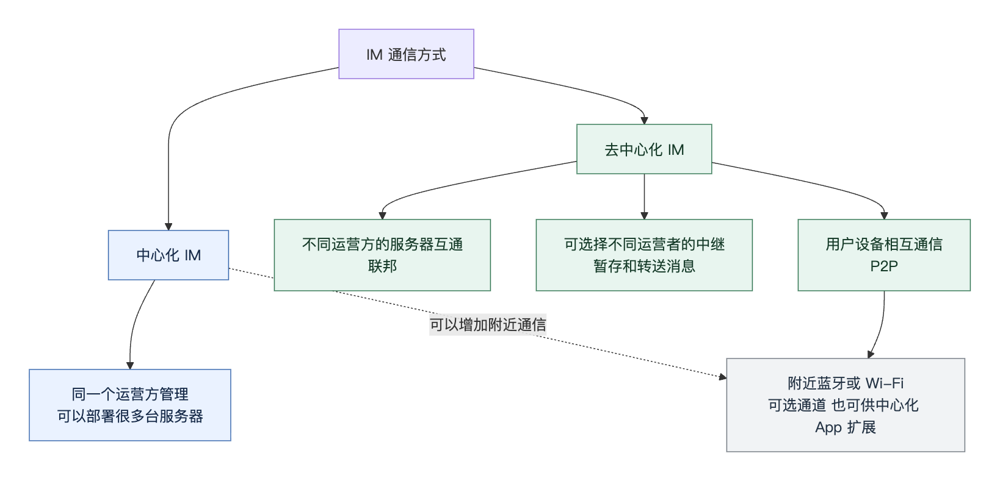

展开架构图可编辑源码

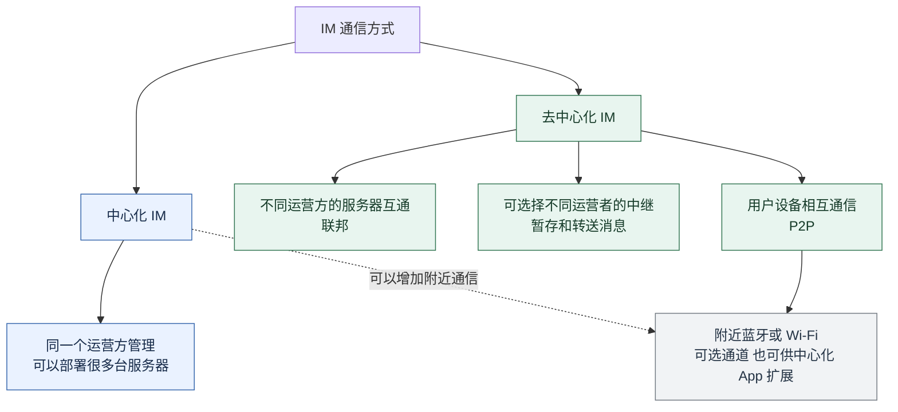

蓝色表示中心化体系，绿色表示去中心化路线，灰色表示两类都能采用的通信通道；蓝牙／Wi-Fi 的使用本身不决定产品归类。

下面三条去中心化路线可以组合，不是必须三选一。“去中心化”也有程度差异：聊天可以分散，附件、通知或账号入口仍可能依赖集中服务。开源、自部署、加密、服务器数量和使用区块链，都不能单独证明通信控制权已经分散。

**服务地址回答“连到哪里”；Wi-Fi／蓝牙回答“用什么连接”；中心化／去中心化回答“谁控制通信”。**客户端配置一个或多个 BaseURL，可以用于故障切换或不同入口；多个地址背后由同一方统一管理，仍属中心化。实际消息连接还可能使用独立实时通道，不必与 HTTP 的 BaseURL 一一对应。

| 看起来相近的场景 | 实际归类 |
| --- | --- |
| 两部手机连同一个 Wi-Fi，消息仍交给统一后台 | 中心化 |
| 两部手机通过蓝牙交换消息，这次收发不经过统一后台 | 设备互联路径；整个产品是否去中心化还要看身份和其他依赖 |
| 两家独立运营的 IM 服务器通过互联网互通 | 联邦式去中心化，不需要蓝牙 |

## 二、中心化 IM：消息交给同一个后台体系 <a href="#前言" style="font-size:17px; color:green;"><b>🔼</b></a> <a href="#🔚" style="font-size:17px; color:green;"><b>🔽</b></a>

甲把消息交给运营方的服务器，服务器保存并投递给乙；乙离线时，服务器按保留规则等待乙重新连接。账号、云历史、多端同步和后台管理有统一的责任方。

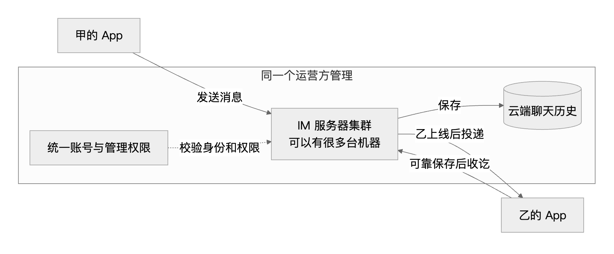

展开架构图可编辑源码

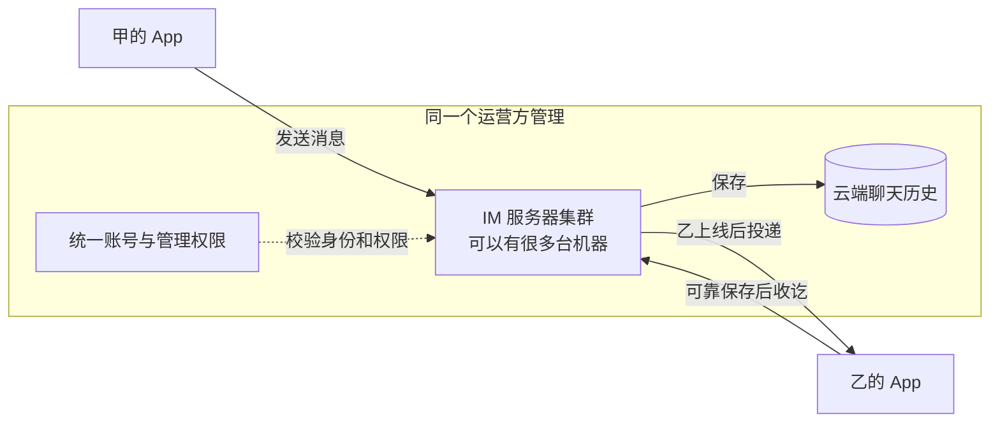

多台服务器、副本和故障接替提升可靠性，但同一个运营方仍控制整个体系。**“服务器分布式”与“通信控制权去中心化”要分开理解。**

### 2.1、悟空放在图中的位置 <a href="#前言" style="font-size:17px; color:green;"><b>🔼</b></a> <a href="#🔚" style="font-size:17px; color:green;"><b>🔽</b></a>

[**WKongAI**](https://github.com/WuKongIM/WKongAI) 是 [**WuKongIM**](https://github.com/WuKongIM/WuKongIM) 的分叉仓库。本次核查固定到代码提交 `00e8787c56f65374513e3ab0ca359c093cff2d54`：客户端向服务器取得路由并建立连接；集群节点采用领导者选举及副本配置。[客户端连接](https://github.com/WuKongIM/WKongAI/blob/00e8787c56f65374513e3ab0ca359c093cff2d54/demo/chatdemo/src/view/Chat.vue#L61-L91)、[领导者选举](https://github.com/WuKongIM/WKongAI/blob/00e8787c56f65374513e3ab0ca359c093cff2d54/pkg/raft/raft/node_become.go#L8-L53)、[副本配置](https://github.com/WuKongIM/WKongAI/blob/00e8787c56f65374513e3ab0ca359c093cff2d54/exampleconfig/cluster1.yaml#L31-L42)

据此，本次归类为 **中心化 IM 下的分布式服务器集群**。它有去掉固定主节点依赖的设计；本次公开源码审阅没有找到足以证明跨独立运营方联邦或终端 P2P 的实现。该判断限于上述仓库和提交，不外推全部版本或商业产品，也不把集群能力称为虚假宣传。

## 三、去中心化 IM：再看消息由谁接力 <a href="#前言" style="font-size:17px; color:green;"><b>🔼</b></a> <a href="#🔚" style="font-size:17px; color:green;"><b>🔽</b></a>

### 3.1、不同运营方的服务器互通：联邦 <a href="#前言" style="font-size:17px; color:green;"><b>🔼</b></a> <a href="#🔚" style="font-size:17px; color:green;"><b>🔽</b></a>

类似不同公司的邮箱互相发信：甲使用 A 的服务器，乙使用 B 的服务器，两家遵守同一通信协议。各自管理自己的用户，不需要把账号全部交给同一家运营方。

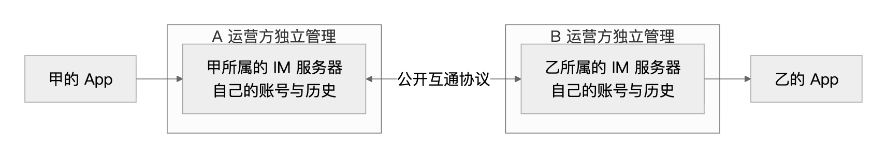

展开架构图可编辑源码

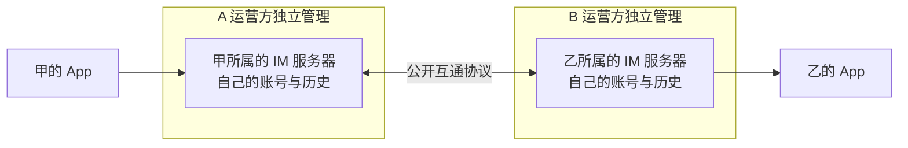

参考 [**Matrix**](https://matrix.org/) 的服务器互通协议：同一房间中的事件在参与服务器之间传递并保存。它仍使用服务器，每个用户仍依赖自己的服务器；分散的是运营和管理权，不表示任意一家的服务器消失后，其用户一定无感继续通信。[Matrix 联邦协议](https://spec.matrix.org/latest/server-server-api/)

### 3.2、中继转送：选择由谁暂存密文 <a href="#前言" style="font-size:17px; color:green;"><b>🔼</b></a> <a href="#🔚" style="font-size:17px; color:green;"><b>🔽</b></a>

甲把加密后的消息交给双方通信关系使用的中继，乙上线后取走。中继负责转送；终端负责解密和自己的聊天记录。不同网络的身份和历史规则不同，不能只凭“用了中继”就认定已经去中心化。

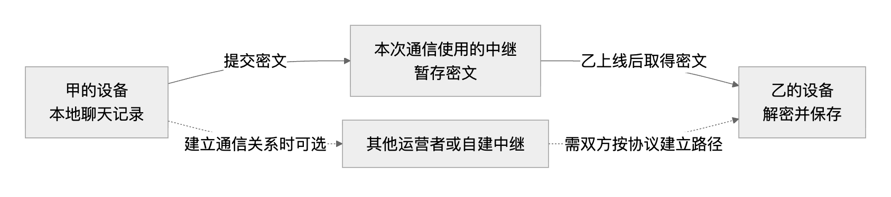

展开架构图可编辑源码

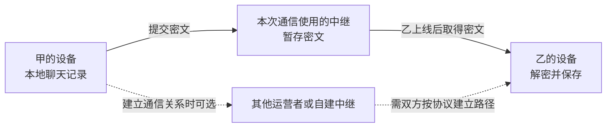

参考 [**SimpleX Chat**](https://simplex.chat/)：没有全局用户标识，使用可选择、自建的消息中继；参考 [**Session**](https://getsession.org/)：私聊密文交给分布式节点网络转送和暂存。这两者的具体身份、路由与暂存协议不同；上图只是共同思路，不是任一产品的完整实现图。[SimpleX 架构](https://simplex.chat/docs/simplex.html)、[Session 网络](https://docs.getsession.org/session-network)

图中的可选中继不表示旧消息可以自动迁移。需要另查附件、手机通知和公开社区的依赖；例如 SimpleX 的 iOS 及时推送目前依赖官方通知服务，Session 的附件、通知和社区也有不同的服务边界。[SimpleX 隐私政策](https://simplex.chat/privacy/)、[Session FAQ](https://getsession.org/faq)

### 3.3、设备互联：终端承担更多责任 <a href="#前言" style="font-size:17px; color:green;"><b>🔼</b></a> <a href="#🔚" style="font-size:17px; color:green;"><b>🔽</b></a>

双方设备建立可信连接并交换消息，账号信任、本地历史和接收确认更多由终端处理。连接路径可能借助网络中继；“设备互联”不等于两台设备之间必须没有任何路由或转发设施。

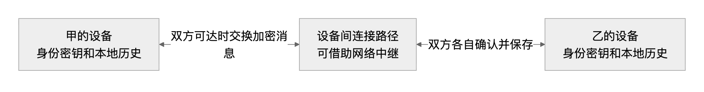

展开架构图可编辑源码

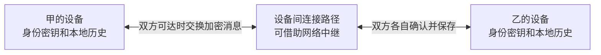

参考 [**Briar**](https://briarproject.org/)：在线时通过 Tor 网络连接设备，互联网中断时可以借助附近蓝牙／Wi-Fi 同步。双方错峰上线时，可以使用 Briar Mailbox 辅助投递。[Briar 工作原理](https://briarproject.org/how-it-works/)

## 四、附近蓝牙／Wi-Fi：没有互联网也能聊天的场景 <a href="#前言" style="font-size:17px; color:green;"><b>🔼</b></a> <a href="#🔚" style="font-size:17px; color:green;"><b>🔽</b></a>

### 4.1、两台设备在附近，建立本地通信路径 <a href="#前言" style="font-size:17px; color:green;"><b>🔼</b></a> <a href="#🔚" style="font-size:17px; color:green;"><b>🔽</b></a>

例如同一场馆、户外活动或互联网中断时，两台设备仍能发现并确认对方，利用蓝牙或可连通的本地 Wi-Fi 路径交换消息。Wi-Fi 接入互联网与本地 Wi-Fi 可通信是两件事；具体连接方式和有效范围需按平台实测。

连上同一个公共 Wi-Fi，不代表两台设备能相互连接：热点可能启用设备隔离，App 仍需支持发现、配对和实际通信。[无线客户端隔离说明](https://documentation.meraki.com/Wireless/Operate_and_Maintain/How_Tos/Firewall_and_Traffic_Shaping/Wireless_Client_Isolation)

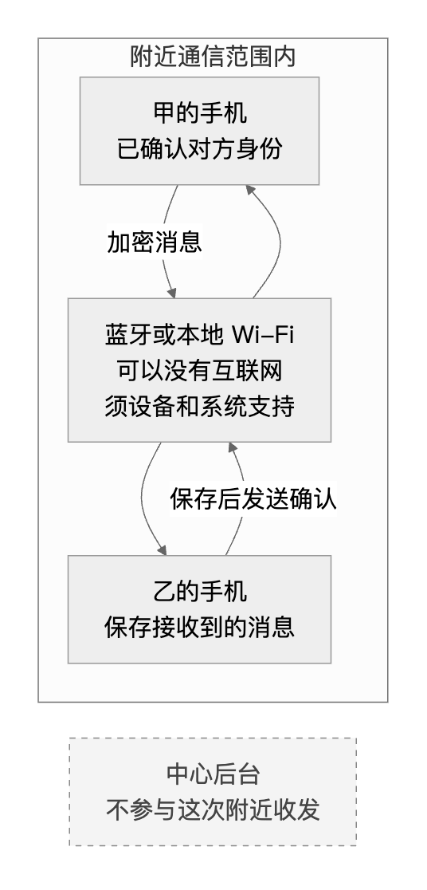

展开架构图可编辑源码

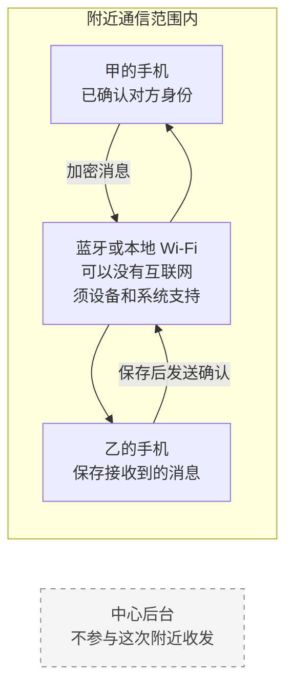

**蓝牙／Wi-Fi 是通信通道，不自动决定整个产品属于哪一类。**一个主要依赖中心后台的 App，也可以额外提供附近通信；这时必须说明哪些聊天行为可离线完成，哪些仍需要后台。

本产品保留该候选场景，具体协议及平台实现由 Codex 设计和验证。能力启用前分别核查设备发现／配对确认、通信加密、权限、后台运行、耗电、距离、断线重连及两端可靠保存。不得先承诺 iOS、Android、鸿蒙、Web、CLI 都有等价支持；也不默认陌生设备能够自动接力转送消息。

### 4.2、对方不在附近或没在线，消息不会凭空送达 <a href="#前言" style="font-size:17px; color:green;"><b>🔼</b></a> <a href="#🔚" style="font-size:17px; color:green;"><b>🔽</b></a>

没有其他通信路径时，消息留在发送设备等待。若已建立可用的中继／离线邮箱路径，可以先暂存密文；这不是终端已经收到消息。

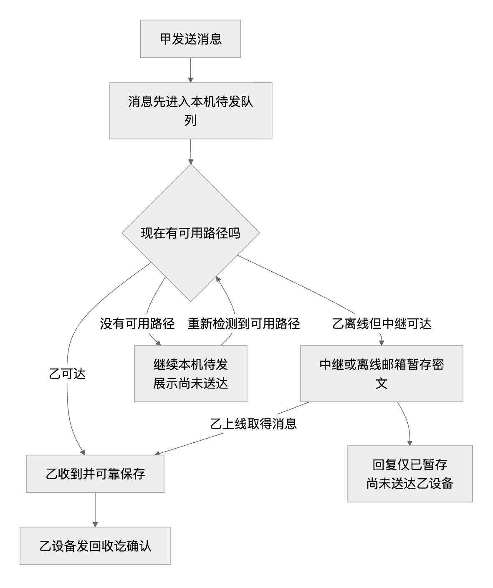

展开架构图可编辑源码

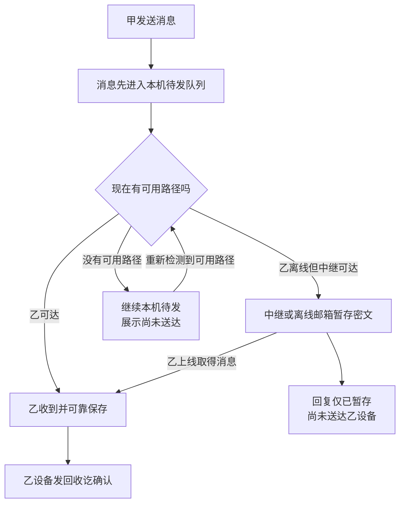

Briar Mailbox 是辅助错峰通信的公开例子，需要额外可达的设备，不表示在所有设备和网络都断开的情况下仍能跨城市送达。[Briar Mailbox 官方说明](https://briarproject.org/how-it-works/)

附近投递与以后上传云端需用同一消息标识去重，并分开显示“对端收讫”和“云端已接受／已同步”。中心后台没有接收或确认的消息，不能冒充现行云历史、异地耐久或后台删除策略已经完成；离线设备也不能声称已实时获知管理员封禁／撤权。安全期限、离线授权与恢复后的对账需在专项合同中落定。

## 五、后端业务架构确实有很大差异 <a href="#前言" style="font-size:17px; color:green;"><b>🔼</b></a> <a href="#🔚" style="font-size:17px; color:green;"><b>🔽</b></a>

**中心化由我们的后台统一承担多项责任；去中心化把这些责任分给不同运营者或终端。**联邦和中继仍有后端，设备互联则把更多责任下沉到终端。

| 事情 | 现行中心化主线 | 去中心化需要另外明确 |
| --- | --- | --- |
| 账号与管理 | 我们管理账号、鉴权、封禁和墓碑 | 各运营方／设备管理什么；无全网管理员时如何拒绝不可信身份 |
| 离线消息 | 我们的服务器按策略保留并补投 | 谁暂存、保留多久；无可用路径时如何等待和显示状态 |
| 多端与历史 | 统一后台协调各设备的进度和可用历史 | 谁授权新设备、提供历史、处理顺序与冲突；未持有的历史不能凭空恢复 |
| 收讫与删除 | 合格终端落盘后确认；我们负责自有存储的 n 秒清理与回调 | 中继收到与终端落盘分开；远端副本的清理只能按其协议及控制权处理 |
| 备灾与恢复 | 自有主／异地副本、独立备份和受控恢复 | 每个运营方的备份、端侧历史及密钥分别保护；别人的副本不自动成为合格灾备 |

现行云历史保留、多端不依赖另一部手机在线、管理员权限和灾备 RPO/RTO，均针对当前中心化控制域。去中心化不能直接继承这些保证。Matrix 的内容删除机制也不能等同于保证所有远端磁盘物理擦除。[Matrix 删除语义](https://spec.matrix.org/latest/client-server-api/#redactions)

正式设计中的“不信任客户端输入”继续成立：服务器要验证来访请求，设备互联时接收设备也要验证对方身份、消息真实性和授权。后台不参与，不代表校验可以省略；责任转移后需定义新的可信依据。

## 六、同一个产品，可以有不同的通信实现 <a href="#前言" style="font-size:17px; color:green;"><b>🔼</b></a> <a href="#🔚" style="font-size:17px; color:green;"><b>🔽</b></a>

工程建议保留一个产品体系，复用适合共享的界面、本地存储接口和消息标识；通信、身份信任、同步及恢复按模式分别实现。共用接口不表示所有模式使用相同账号、数据库表和回执规则。

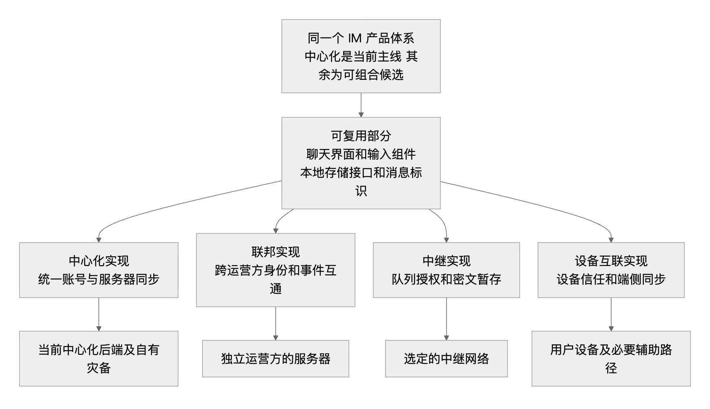

展开架构图可编辑源码

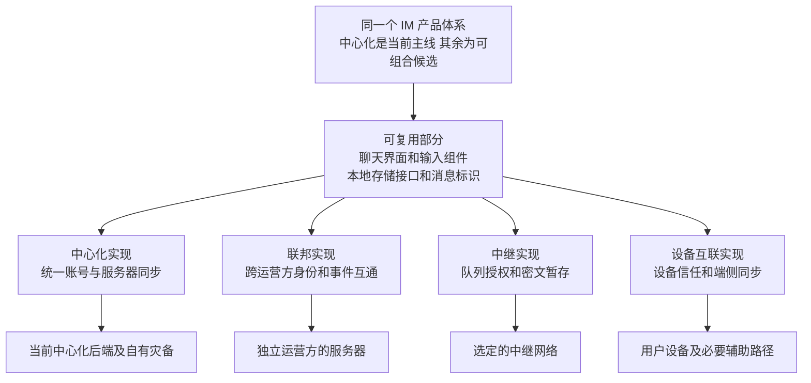

这是一份组织建议和研究图，不是已经选定四套协议或决定同时开发四条路线。现行基础 → 标准 → 高级仍按已确定的中心化内核增量继承；去中心化按高级可选标段另行确定实际网络、协议和支持端。基础／标准／高级表示功能深度，中心化／去中心化表示通信控制方式，不能把“高级”解释为必然去中心化。

新增模式须明确会话所属网络、身份、加密和历史责任；后台勾选不能静默改变已有会话。转换模式要有显式授权及数据迁移方案。附近通信独立定义设备／通道能力，不用更换传输地址冒充账号和同步机制已经兼容。

阶段范围见 [需求表](../IM需求明细表.md/IM需求明细表.md#communication-classification)，服务责任见 [后端架构](../IM后端架构表.md/IM后端架构表.md#communication-ownership)，端侧隔离见 [前端架构](../IM前端架构表.md/IM前端架构表.md#communication-client-boundary)。既有 FE-092／095 与 ARCH-19 承接后续实际立项的协议、平台、来源和证据检查；当前仍未验收，图文检查不代表功能通过。

## 七、高级版多 BaseURL：同一个中心的多个入口 <a href="#前言" style="font-size:17px; color:green;"><b>🔼</b></a> <a href="#🔚" style="font-size:17px; color:green;"><b>🔽</b></a>

**相当于同一座服务大厅有几扇门：一扇门进不去，就试另一扇；后台、账号和聊天记录仍是同一套。**用于连接故障或入口受干扰的容错，不把它称为去中心化。不能仅凭一次连不上就确定故障原因。

客户端预埋一组可信服务地址；当前地址失达后，逐个尝试其他候选，找到真正属于本 IM 且协议可用的地址后切换。切换成功时拉取新版地址清单；下次客户端发版也可以替换整组。**只属于高级版，基础／标准不启用组轮询和组刷新。**

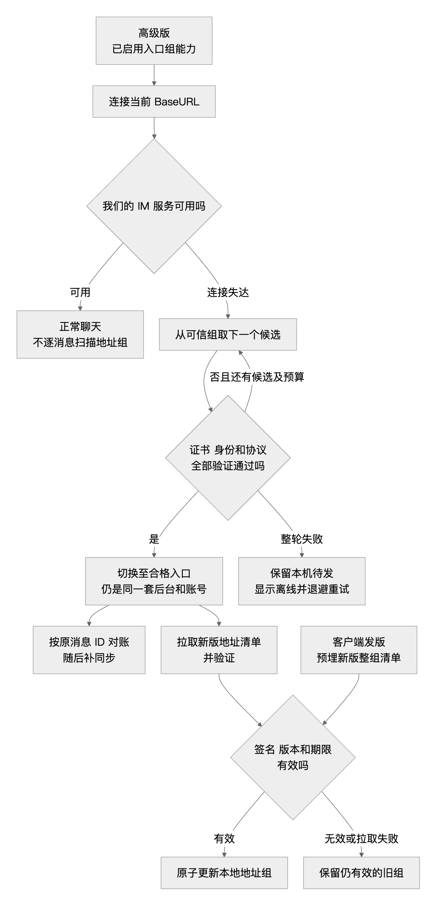

展开架构图可编辑源码

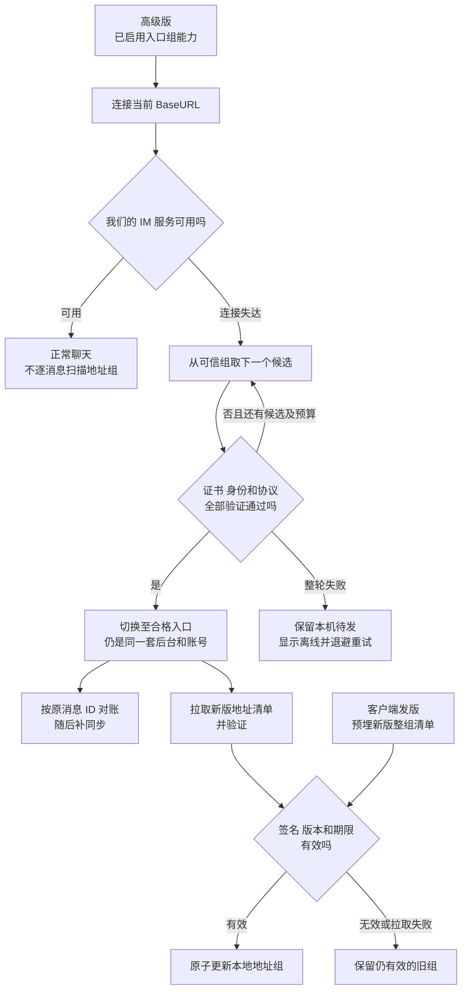

“ping 通”在这里表示 **确实连到了我们认可的 IM 服务**。网址能返回网页，不等于后台身份正确；中间跳转页、错误服务器、证书无效或协议不兼容都不能收到账号密码和令牌。

地址清单需要官方签名，类似盖章的地址簿，防止被替换成别人的服务器；旧版清单不能覆盖已经接受的新版。动态刷新失败不能清空仍有效的旧组，整组失联时也不能凭空得到新地址；保留本机待发，等待网络恢复或前端发版引入新组。Web 页面尚未加载时，页面内部的地址池还没有运行，不能救回网页自身入口。

切换过程中，已经发送但没有拿到确认的消息仍可能成功，必须按原消息标识查询／重试。新入口须满足原有权限、删除和灾备要求；换地址不能绕过封禁，也不能把未准备好的备站直接当主站。服务端已降档时停止新组轮询，保留合法收尾和对账，不假称所有入口都能立即继续聊天。

完整行为见 [高级入口组需求](../IM需求明细表.md/IM需求明细表.md#advanced-endpoint-group)，清单和参数见 [后端合同](../IM后端架构表.md/IM后端架构表.md#endpoint-group-contract)，五端行为见 [前端合同](../IM前端架构表.md/IM前端架构表.md#endpoint-group-client)。

## 八、名词解释：先用一句话理解 <a href="#前言" style="font-size:17px; color:green;"><b>🔼</b></a> <a href="#🔚" style="font-size:17px; color:green;"><b>🔽</b></a>

| 名词 | 通俗解释 | 容易混淆的地方 |
| --- | --- | --- |
| 中心／控制域 | 对这套账号、服务和权限负责的管理范围 | 不等于某一台机器或某一个网址 |
| 分布式／集群 | 多台机器协作工作 | 同一家统一管理时，仍可能是中心化 |
| 节点 | 网络里参与通信的一台服务器或设备 | 节点多，不代表运营者也独立 |
| 联邦 | 不同运营方的服务器按约定互通 | 类似不同邮箱互发邮件；各方仍有自己的后台 |
| P2P／设备互联 | 用户设备建立连接并交换数据 | 可以借助网络中继，不等于绝对无服务器 |
| 中继 | 帮忙转送，有时暂存消息的设施 | 中继收到，不等于对方设备已收到 |
| 离线邮箱／Mailbox | 对方暂时不在线时，替其等待消息的设施 | 需要可达的设施，不会凭空跨越断开的网络 |
| 节点发现／配对 | 找到对方，并确认是否愿意建立联系 | 扫描到设备不代表已获信任或读取权限 |
| Wi-Fi／蓝牙 | 设备之间采用的连接通道 | Wi-Fi 不一定有互联网；两者都不单独决定中心化分类 |
| BaseURL | 客户端 HTTP API 使用的基础服务地址 | 多个地址可通向同一中心；实时消息通道还可有独立地址 |
| 地址组／清单 | 一组允许尝试的服务入口及更新规则 | 必须可信，不能接受任意网络返回的域名 |
| 端到端加密／E2EE | 消息由终端加密，只有获权接收终端能解密 | 加密程度和通信控制权是两个维度 |
| ACK／确认信号 | 某个环节回复“这一环节完成了” | 服务器接受、中继暂存、终端可靠收讫、用户已读必须分开 |
| 收讫 | 合格接收设备已经可靠保存消息 | 附近确认只说明本次对端保存；触发云删还须满足后台目标设备和耐久合同，通知／画气泡不足以证明 |
| 备份与副本 | 副本帮助接替运行，备份帮助恢复历史状态 | 陌生节点恰好有消息，不等于我们的备灾已合格 |

## 九、当前适用边界与验证责任 <a href="#前言" style="font-size:17px; color:green;"><b>🔼</b></a> <a href="#🔚" style="font-size:17px; color:green;"><b>🔽</b></a>

现行中心化三阶段继续保留：基础纯文本和五端可靠收发，标准完整消息与群，高级私密／体验及已选扩展。高级入口组属于已明确需求；去中心化的具体协议、附近通道及平台支持属于待独立方案和验证的候选范围。图解不把二者混同，也不把去中心化强制绑定区块链或钱包。

当前四份主文档与本文分别承担需求、前端、后端、验收及阅读解释，编号与阶段互相映射。**243 项功能和工程验收仍全部未验收。**本次只验证文档、图片、图源码和链接；真实源码、客户端构建、连接故障、签名／权限、多端数据和灾备演练仍由 Codex 实施并留证，用户负责产品目标与体验反馈。

<a id="🔚" href="#前言" style="font-size:17px; color:green; font-weight:bold;">我是有底线的➤点我回到首页</a>
