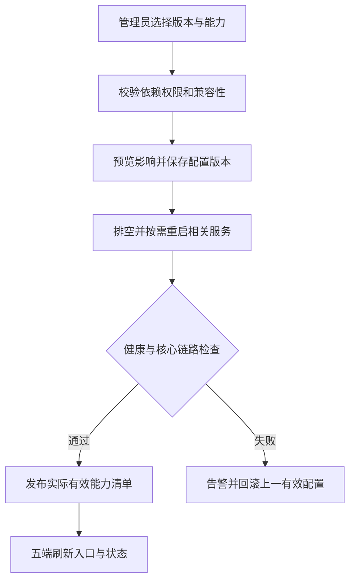
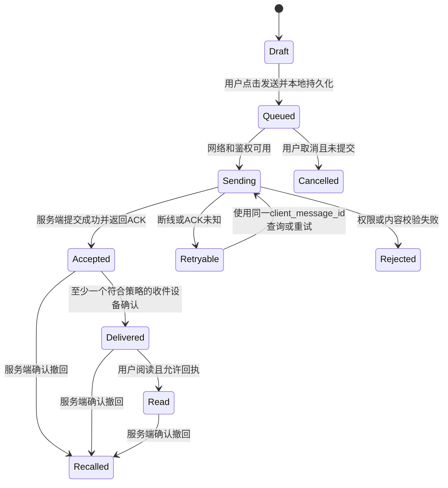

# IM需求明细表

[toc]

---

## 🔥 前言

**产品功能导航｜先看全貌，再点功能**

**基础版 → 标准版 → 高级版，后一版包含前一版；下列列出各版重点与新增能力。** 用户端供聊天使用者操作，管理后台供管理员配置，后台服务负责消息处理与数据保护。当前为产品规划，软件尚未实现或验收；点击功能名称查看本文详情。

- **产品全貌｜一套 IM，多端使用**
  - [中心化聊天主线／去中心化候选](#communication-classification)
  - [手机、网页与命令行](#client-matrix) · [管理后台](#feature-control)
  - [免费使用与完整源码](#source-control) · [嵌入其他产品](#external-integration)

- **基础版（轻质）｜简单、可靠地收发文字**
  - **用户端** · [注册登录、账号恢复与设备管理](#account-login-devices) · [邮箱验证](#otp-email) · [个人资料与手工好友](#profile-contacts) · [隐私、拉黑与举报](#privacy-user-rights) · [纯文本单聊与失败重发](#messages-media) · [会话、草稿与聊天历史](#conversations-search) · [离线与多端同步](#cross-device-sync) · [通知](#platform-experience) · [三档字体与无障碍](#font-presets)
  - **管理后台** · [功能开关与版本预设](#feature-control) · [封禁／解封、账户墓碑／恢复](#account-lifecycle)
  - **后台服务** · [收讫后云端清理与删除回调](#receipt-deletion) · [聊天数据备份与灾后恢复](#disaster-recovery-requirements)
  - **部署管理** · [一键安装／卸载、启动与排障](#guided-installation)

- **标准版（标准）｜补全日常社交聊天**
  - **用户端** · [图片／动图、语音／视频消息与文件](#messages-media) · [群聊、群管理、群公告、频道与话题](#groups-channels) · [语音／视频通话与位置分享](#calls-location) · [确认后同步通讯录](#contact-consent) · [好友／群名片与在线状态](#profile-contacts) · [消息搜索](#conversations-search) · [编辑、回复、反应与转发](#messages-media) · [机器人创建与使用、默认助手](#bot-platform) · [批量、定时与计划任务](#scheduled-tasks)
  - **管理后台** · [机器人授权与停用](#bot-platform) · [任务管理](#scheduled-tasks) · [免费会员等级与能力勾选](#membership-policy)

- **高级版（重度／定制）｜强化私密性、体验与特殊场景**
  - **用户端** · [对话加密与阅后即焚](#privacy-user-rights) · [消息置顶](#messages-media) · [@群成员](#groups-channels) · [消息收藏](#conversations-search) · [独立加密模块与协议切换](#crypto-providers) · [备用服务地址自动切换](#advanced-endpoint-group) · [转账](#transfer-billing) · [个人账单](#transfer-billing)
  - **管理后台** · [资金开关、账单查询与对账](#transfer-billing)
  - **后台服务** · [备用服务地址维护与更新](#advanced-endpoint-group) · [转账处理与账单生成](#transfer-billing)
  - **场景选配** · [企业工作区与复杂社区](#groups-channels) · [客服](#edition-profiles) · [专项会议](#calls-location) · [AI、优惠券／积分、支付红包与钱包](#optional-business)
  - **通信候选** · [去中心化扩展与附近蓝牙／Wi-Fi](#communication-classification)
  - **未来预留，当前不启用** · [收费订阅与数字购买](#optional-business) · [广告](#admin-integration)

高级场景按需选配；去中心化及附近通信仍是候选路线，具体支持端另行确定。所有版本的完整边界见[版本范围](#edition-profiles)，交付顺序见[三阶段目标](#phase-goals)。

打造免费、完整源码公开、可独立部署且可嵌入其他产品的通用 IM。主营业务始终是消息传递：基础版提供可靠纯文本单聊，标准版提供完整消息类型与群聊，高级版增强私密性与聊天体验；三个版本按阶段增量继承，共用同一源码体系，当前中心化主线遵守相同通信合同，跨网络候选另立合同。终端包含 CLI、[**Android**](https://developer.android.com/)、[**iOS**](https://developer.apple.com/ios/)、[**鸿蒙**](https://developer.huawei.com/consumer/cn/) 和 [**Web**](https://developer.mozilla.org/zh-CN/docs/Web)。文档基线：**2026年10月8日**。

本文只定义最终产品行为、阶段边界和验收合同。微服务、服务器、依赖和服务端表字段见 [IM后端架构表](../IM后端架构表.md/IM后端架构表.md)；平台分层、Swift 模板、客户端本地表/同步和构建见 [IM前端架构表](../IM前端架构表.md/IM前端架构表.md)；逐项实测结果见 [IM功能验收表](../IM功能验收表.md/IM功能验收表.md)。当前完成的是文档设计，软件尚未实现，三个阶段尚未验收或封版。

| 阅读入口 | 内容 |
| --- | --- |
| [先看通信方式图解](../IM通信方式图解.md/IM通信方式图解.md) | 中心化／去中心化一级分类、消息流向、附近蓝牙／Wi-Fi 和业务责任 |
| [产品与三阶段](#chapter-1) | 版本继承、阶段目标、工程标段、源码交付 |
| [关键规则](#chapter-2) | 后端开关、账户墓碑、邮件 OTP、通讯录、机器人、业务中间件、会员等级、[一键部署与反部署](#guided-installation) |
| [前端需求](#chapter-3) | FE-001～102，全端可见行为与异常 |
| [状态与权限合同](#chapter-4) | 演示隔离、消息状态、同步、撤权、[收讫删除与回调](#receipt-deletion) |
| [后端能力需求](#chapter-5) | BE-001～036，应提供的服务能力 |
| [安全与平台](#chapter-6) | SEC-01～12及加密、发布边界 |
| [参数与兼容组合](#chapter-7) | 可配置项目、依赖和互斥 |
| [验收场景](#chapter-8) | T-01～58，端到端异常与恢复 |
| [交付与验收](#chapter-9) | 243 项验收台账、前后端独立架构与证据要求 |

## 一、产品定位、继承版本与阶段目标 <a href="#前言" style="font-size:17px; color:green;"><b>🔼</b></a> <a href="#🔚" style="font-size:17px; color:green;"><b>🔽</b></a>

### 1.1、免费公开与完整源码 <a href="#前言" style="font-size:17px; color:green;"><b>🔼</b></a> <a href="#🔚" style="font-size:17px; color:green;"><b>🔽</b></a>

当前及长期可预见阶段，全部版本免费使用、完整源码公开，不以闭源核心、私有构建包或项目方授权服务器作为运行门槛。部署产生的服务器、域名、邮件、平台推送、存储和带宽费用属于运行成本，应在架构与部署说明中列明。

| 交付对象 | 必须交付 |
| --- | --- |
| 产品代码 | CLI、Android、iOS、鸿蒙、Web、管理后台、后端微服务、自建 SDK、机器人平台与业务中间件源码 |
| 协议与数据 | API、事件、能力 ID、消息格式、错误码、状态机、权限合同、数据库字段、迁移与配置样例 |
| 构建与运维 | 精确依赖及许可证、锁定文件、镜像信息、构建/部署脚本、备份恢复、升级回滚、测试用例、告警与排障说明 |
| 依赖边界 | 核心消息/音视频/SDK 能取得源码并可重建；平台服务采用有文档的适配接口；列清自研、开源与外部服务范围 |

采用原创设计与独立实现，可依法使用开放协议和开源组件；不复制竞品私有代码、素材和商标。AI 生成代码仍需检查来源、许可证、正确性和维护质量。操作系统、硬件固件及厂商推送服务的源码不属于自研产品能交付的范围。

未来收费或发布闭源版本由用户另行决定，本期收费、订阅和广告投放均不启用。自有新 IM 源码的工程发行基线选定 [**Apache License 2.0**](https://www.apache.org/licenses/LICENSE-2.0)，适合当前完整开源与未来商业分发；它也允许他人按许可商用，不能收回已授予的许可。第三方组件分别遵守原许可，外部贡献的权属/再许可不能省略；具体交付边界见 [源码许可合同](../IM后端架构表.md/IM后端架构表.md#source-license-contract)。当前选择许可证不代表已经发布产品或完成实际依赖审计。

### 1.2、基础 → 标准 → 高级的继承边界 <a href="#前言" style="font-size:17px; color:green;"><b>🔼</b></a> <a href="#🔚" style="font-size:17px; color:green;"><b>🔽</b></a>

统一称为 **基础版（轻质）→ 标准版（标准）→ 高级版（重度/定制）**。标准版包含基础版，高级版包含标准版；代码增量演进，身份、历史和消息合同保持可兼容。运行时选基础预设可以关闭扩展，但不代表建立另一套产品或另一套用户库。

| 主营内核 | 最早交付阶段 | 稳定子能力 ID |
| --- | --- | --- |
| 纯文本单聊，含 Unicode emoji 字符 | 基础 | `message.text` |
| 静态图/动图、音频消息、视频消息、文件、群聊天 | 标准，继承纯文本 | `message.image`、`message.audio`、`message.video`、`message.file`、`conversation.group` |
| 私密性：阅后即焚、对话 E2EE、独立加密模块与协议切换 | 高级，继承标准消息类型与群聊 | `message.burn`、`conversation.e2ee`、`crypto.protocol_switch` |
| 体验增强：消息置顶、@群成员、消息收藏 | 高级 | `message.pin`、`message.mention`、`message.favorite` |
| 可靠传输、同步、收讫删除策略与删除回调 | 基础交付，后续继承 | `message.retention_policy`、`message.delete_hook` 及基础可靠性合同 |
| 中心化多 BaseURL 预埋、故障轮询、切换后刷新和前端发版整组更新 | 高级；基础／标准不启用入口组 | `network.endpoint_group_failover` |

以上是版本主营边界。基础不发送图片/贴纸/附件或群消息；用户在纯文本中输入 `@昵称` 只是普通字符，不能触发高级提及通知。音频/视频**消息**属于异步存储与投递，音视频**通话**属于独立 RTC 能力。身份、安全、后台、机器人、会员、中间件及商业周边按各自阶段交付，但关闭可选周边后，已交付版本的主营消息仍必须独立可用。

| 版本 | 默认功能边界 | 扩展与关闭规则 |
| --- | --- | --- |
| 基础 | 邮箱注册/绑定与密码、邮件 OTP、账号恢复、设备与会话撤销、资料与手工联系人；一对一纯文本/Unicode emoji、会话/历史、草稿、待发重试、删除/撤回、未读、离线补同步、可配置收讫删除与回调；基础通知、拉黑举报、隐私/数据权利；CLI 与四图形端；后台能力配置、封禁/墓碑及恢复；最小 SDK 与业务中间件 | 不启用图片/贴纸、语音条、音视频消息、文件、群、RTC、机器人执行；不启用 E2EE/焚毁及置顶/@/收藏。安全、可靠性、管理审计与探针完整交付 |
| 标准 | 基础全部，加静态图/动图、语音条及音频、视频消息、文件、群聊天；经确认的通讯录发现/同步、名片、状态；表情包、编辑、回复/线程/反应、转发、搜索、定时消息；群/角色/邀请/公告/话题/频道；单聊与群 RTC、位置分享、历史/备份恢复；开放机器人及默认机器人、批量/定时任务；非付费会员等级与能力表 | 标准群聊不依赖消息置顶、@和收藏；这些高级入口及写 API 关闭。普通聊天无需钱包、区块链、AI 或购买权限；周边可独立关闭 |
| 高级 | 标准全部，加独立加密模块、对话 E2EE及协议切换、阅后即焚，以及消息置顶/@群成员/收藏等体验增强；按场景启用企业工作区、复杂社区、客服、专项会议/录制、AI、优惠券/积分、支付红包/转账/配套账单与资金账务、钱包身份、高级中心化多 BaseURL 入口组、去中心化通信适配（含联邦等候选路线） | 私密性、体验与业务扩展分别勾选；加密协议经协商生效，旧密文仍可按原协议读取。选择高级预设不自动启动全部扩展，也不自动开启收费 |

基础的安全传输、密码保护、权限校验和存储保护始终启用。高级 E2EE 是会话安全模式，与基础加密分开；收讫后清理云端副本也不等于阅后即焚。一个 FE 编号含多种能力时，按稳定子能力和平台验收；例如 FE-026 的文本属于基础、提及属于高级，FE-044 的公告属于标准、置顶和提及属于高级。能力关闭时服务端仍拒绝越级请求，不能只隐藏 UI。

### 1.3、三阶段工作目标与封版门禁 <a href="#前言" style="font-size:17px; color:green;"><b>🔼</b></a> <a href="#🔚" style="font-size:17px; color:green;"><b>🔽</b></a>

| 阶段 | 明确目标 | 本阶段交付与通过条件 |
| --- | --- | --- |
| 第一阶段：基础建设与封版 | 交付五端可靠纯文本单聊，形成可继承的消息内核 | 身份/邮件 OTP、纯文本、五端互通、收讫删除参数/回调、管理生命周期、Redis、独立微服务、最小业务中间件、完整源码/部署/数据迁移及探针；基础范围逐项通过，图片/媒体/群及高级能力越级请求被拒绝后封版 |
| 第二阶段：标准增量与封版 | 在已封版基础上完整支持图片、音视频消息、文件与群聊 | 静态图/动图、音频/视频/文件、群权限与可靠投递；独立 RTC、通讯录同步、机器人/任务及会员等周边按标段交付；置顶/@/收藏及私密扩展未启用，第一阶段回归和新增标准范围通过后封版 |
| 第三阶段：高级定制增量 | 在已封版标准版上强化私密性、聊天体验、中心化连接韧性及已选业务 | 阅后即焚、独立加密模块/协议切换、消息置顶/@/收藏与多 BaseURL 入口组分别验收；入口组不下放基础／标准，特殊业务按定制模块明确范围与安全条件；基础和标准回归仍通过后形成高级发布基线 |

第一阶段可以先以 CLI 打通端到端链路，再接四个图形端；**仅 CLI 通过不能代表完整基础版封版**。Android/iOS/鸿蒙/Web 的目标系统与设备清单在实施计划中锁定，图形界面不要求 CLI 模拟；五端均遵守相同身份、鉴权、消息与同步合同。

封版必须锁定源码修订、协议/消息格式、数据库迁移、依赖、构建/部署材料、配置预设、能力矩阵和验收证据。没有通过证据不能写成“已封版”。封版后的修复形成新补丁基线，不覆盖原记录；标准/高级从上一基线增量演进，迁移、回滚和禁用扩展仍须保护已有消息、密钥和删除事实。具体门禁见 [验收表阶段规则](../IM功能验收表.md/IM功能验收表.md#phase-gates)。

### 1.4、工程标段与交付边界 <a href="#前言" style="font-size:17px; color:green;"><b>🔼</b></a> <a href="#🔚" style="font-size:17px; color:green;"><b>🔽</b></a>

标段按功能域分工，通过协议、事件和可验收结果交接；后端按域使用独立微服务。标段是交付责任单元，可以包含多个相关服务；不把每个按钮拆成独立进程。各域数据私有化、部署拓扑与硬件在 [后端架构](../IM后端架构表.md/IM后端架构表.md#service-boundaries) 中独立定义。

基础版按标段实施、逐项验收，再完成跨标段联调与五端集成验收；标段通过不代替整期封版。可以先用 CLI/Web 验证最小链路，Android/iOS/鸿蒙仍属于基础版交付。各标段交付源码、接口、配置、迁移、用例与排障材料，部署入口从基础建设开始提供。AI 作为主要代码实现力量，通信架构、安全、并发、一致性及恢复按高级工程标准实施，质量以可重复验收证据判定。

另起独立 IM 工程，从零实现业务代码，不在原业务代码上修改、改名或覆盖；旧代码仅提取有价值的工程经验。优先承接主流平台安装/反安装、环境自检、健康检查、日志和数据保留思路，在新工程按 IM 的依赖、权限、数据和作用域重新实现与验收；旧业务实现与历史测试不算本项目完成。标准/高级增量继承本项目封版的新基线。技术选择以稳定、受支持和可维护为先，在此基础上采用主流现代版本。

iOS 明确用 <u>[**Swift**](https://www.swift.org/)</u>，以本人 [Swift 基础工程](../../../JobsBaseConfig/JobsBaseConfig@JobsSwiftBaseConfigDemo/README.md) 为模板，在新工程承接自有 `JobsByPods`、`Podfile + Podfile.deps` 解耦、安装/构建挂载脚本和 `build` 产物约定。UI 使用 Jobs 自有组件、代码块/懒加载闭包和 DSL 点语法＋链式语法；新 IM 业务独立实现，模板与第三方源码不因此默认修改。iOS 本地消息引擎确定为 [**SQLite**](https://www.sqlite.org/)，Codex 已选 GRDB.swift 7.11.1 standard 系统 SQLite 路线及自有 JobsIMStorage 薄封装，各端适配与兼容验证由 Codex 完成。具体模块、本地表、可靠收讫、脚本和版本边界见 [前端架构](../IM前端架构表.md/IM前端架构表.md#ios-template)。

| 标段 | 工作范围 | 依赖与交付物 | 验收重点 |
| --- | --- | --- | --- |
| I-01 身份与安全 | 邮箱/密码/OTP、设备、恢复、管理员封禁/墓碑/恢复 | 邮件域名与通道、身份 API/权限合同、管理界面 | OTP 单次有效、全会话撤销、管理员独占与审计 |
| I-02 消息与同步 | 纯文本单聊、幂等、离线/多端、删除/未读、收讫删除参数与回调 | I-01；消息/事件合同、持久删除任务、回调与恢复用例 | ACK 未知重试、本地入库后收讫、配置延迟/范围、回调隔离、删除不复活 |
| I-03 五端基础 | CLI、Android、iOS、鸿蒙、Web 的基础功能和无障碍；iOS 按本人 Swift 模板新建 | I-01/02；独立前端架构、本地表/迁移、五端能力矩阵、脚本/构建包与 CLI 文档 | 真服务互通、本地事务/收讫、平台差异、字体/恢复、Pods/DSL 与 build 产物 |
| I-04 嵌入与中间件 | 最小 SDK、宿主身份映射、业务资源绑定、回调 | I-01/02；独立中间件源码/API/接入示例 | 租户隔离、绑定幂等、宿主故障不阻塞聊天 |
| I-05 平台与基础封版 | 配置、Redis、主流平台一键部署/反部署、数据迁移、探针/告警/备份 | I-01～04；安装入口、支持矩阵、低技术门槛运维手册、依赖/硬件表、封版清单 | 非后端人员独立部署/运行/排障与反部署、恢复演练、源码可重建、基础全部适用项通过 |
| II-01 标准聊天 | 完整群聊、联系人同步、频道/话题、名片及标准交互 | 基础封版；增量协议与五端页面 | 群权限/历史/收讫范围、搜索与同步；不依赖置顶/@/收藏 |
| II-02 媒体与通话 | 静态图/动图、音频/视频消息、文件；独立单聊/群 RTC | II-01 与媒体服务；格式矩阵和网络预算 | 消息上传/下载/校验、附件独立保留；通话另验取消/接听竞争与弱网 |
| II-03 机器人自动化 | Bot API、命令/事件、默认机器人、批量/定时/计划 | 基础接口合同；外部机器人示例与调度管理 | 授权、幂等、取消/撤权、宕机恢复 |
| II-04 会员能力 | 最大等级 N、每级能力表、继承和配额 | 基础能力目录；配置界面与策略 API | 能力单调增加、继承锁定、变更原子生效 |
| II-05 标准封版 | 标准集成、迁移/停用、全端与基础回归 | II-01～04；标准封版清单 | 新增范围与基础回归全部适用项通过 |
| III-01 特殊隐私 | 独立加密模块、E2EE/协议切换、阅后即焚、加密备份 | 标准封版；Provider 合同、协议与密钥威胁模型 | 协议协商、不降级明文、旧密文可读、设备撤销、到期清理 |
| III-02 聊天体验 | 消息置顶、@群成员/全员、收藏及相关同步 | 标准群/媒体/消息合同；独立子能力 | 权限、提及通知/隐私、收藏副本/引用与删除的一致性 |
| III-03 组织与协作 | 企业/客服/复杂社区、专项会议及定制机器人工作流 | 标准封版；租户/组织与人员授权 | 个人/企业边界、来宾及管理员权限 |
| III-04 营销与财务 | 优惠券/积分；高级资金模块含转账、红包与配套账单 | 标准封版；独立业务服务与账务接口 | 并发、幂等、核销/冲正；转账/收款/退回与个人账单、后台对账一致 |
| III-05 外部协议与通信 | 钱包身份、去中心化通信（含联邦候选路线）及外部桥接分别按立项范围实现 | 标准封版；独立明确网络、协议、版本、身份与支持端，去中心化不以钱包或区块链为前提 | 重放、断网、信任、历史与删除边界；链上重组仅适用链功能；附近通道另行评估 |
| III-06 AI与高级封版 | 可选 AI/定制扩展、专项审计和继承回归 | 已选高级标段；数据授权及发布基线 | 授权外发、成本/隐私、基础/标准回归 |

### 1.5、中心化与去中心化：先看图，再看责任 <a href="#前言" style="font-size:17px; color:green;"><b>🔼</b></a> <a href="#🔚" style="font-size:17px; color:green;"><b>🔽</b></a>

一级分类为 **中心化 IM／去中心化 IM**。中心化由同一个运营方统一管理通信；去中心化再区分不同运营方服务器互通、可选择的中继转送、设备互联等可组合路线。多台服务器和多个 BaseURL 不自动变成去中心化；蓝牙／Wi-Fi 是通信通道，去中心化也可以通过互联网通信。

完整消息流向、悟空归类、公开竞品与附近通信见 [IM通信方式图解](../IM通信方式图解.md/IM通信方式图解.md)。基础／标准／高级表示功能深度，中心化／去中心化表示通信控制方式，两个维度分别记录。现行三阶段以中心化内核为工程交付基线；高级去中心化候选路线按独立标段确定，附近蓝牙／Wi-Fi 尚未列入当前基础封版，也不承诺五端等价支持。

同一个产品可以复用适合共享的客户端能力，后端业务责任和通信实现须分别设计。去中心化不直接继承统一账号、云历史、多端进度、管理员全域封禁、收讫删除或当前灾备保证；会话模式变化需明确授权与迁移，不能由后台开关静默改变身份和历史责任。服务责任见 [后端边界](../IM后端架构表.md/IM后端架构表.md#communication-ownership)，端侧责任见 [前端边界](../IM前端架构表.md/IM前端架构表.md#communication-client-boundary)。

### 1.6、高级版中心化多 BaseURL 与地址组更新 <a href="#前言" style="font-size:17px; color:green;"><b>🔼</b></a> <a href="#🔚" style="font-size:17px; color:green;"><b>🔽</b></a>

**高级版独立能力 `network.endpoint_group_failover`**：在客户端预埋一组同一逻辑 IM 部署的 BaseURL。当前入口连接失达时，按顺序、限定超时和总预算尝试组内其他候选，首个正确连通的入口完成重连后继续聊天。基础／标准不启用组轮询、组刷新或扫描定时器，只保留当前固定入口的普通重连、网络反馈及服务器内部受控容错。多入口仍属中心化，不改变账号和管理权；用途包含入口故障或受干扰时的连接容错，不保证所有网络条件都能连通。[图文流程](../IM通信方式图解.md/IM通信方式图解.md#advanced-entry-pool)

两种更新途径同时提供：**切换至合格入口时拉取新版签名地址清单；客户端发版时预埋新版整组清单。**新清单全部验证通过后原子替换，刷新失败保留仍有效旧组；应用预埋版本不能覆盖更高动态版本。全部入口失达时保留正式待发并提示离线，等待受控重试、网络恢复或客户端发版，不虚构已送达和刷新成功。

“正确连通”须验证合法证书、预置可信根认可的同一环境／部署／组身份、API 与实时协议，以及对应读写就绪状态；HTTP 200、网页跳转或 ping 成功不足。验证前不交出密码、令牌和消息正文，伪清单、回滚清单、错误部署或过期授权拒绝；401／403、封禁、权限拒绝不通过换入口绕过。具体签名字段、密钥轮换、匿名恢复和参数由 [后端合同](../IM后端架构表.md/IM后端架构表.md#endpoint-group-contract) 定义。

切换不创建新账号、聊天库或消息：已发送却未取得确认的请求保留原 namespace／恢复代际／clientMsgId，按原 ID 查询或幂等重试；新入口的灾备放行和历史恢复仍执行原合同。新版清单撤销旧入口时停止向其发新业务，保留原请求结果对账。高级降档停止新组操作，按当前可信固定入口进行必要收尾，无法连接时保持离线队列。五端分别验实际连接、凭据、生命周期和 Web 跨源限制，不能仅用 CLI 或静态 ping 替代。[前端协调器](../IM前端架构表.md/IM前端架构表.md#endpoint-group-client)

该能力主挂 FE-076，发版更新挂 FE-077，后端主挂 BE-024；T-01/36、SEC-12及 ARCH-03/07/08/34/35承接去重、发布与阶段／安全／平台／灾备证据。当前仅需求和设计，全部仍未验收。

## 二、关键产品规则与开放能力 <a href="#前言" style="font-size:17px; color:green;"><b>🔼</b></a> <a href="#🔚" style="font-size:17px; color:green;"><b>🔽</b></a>

### 2.1、后台开关决定能力与前端入口 <a href="#前言" style="font-size:17px; color:green;"><b>🔼</b></a> <a href="#🔚" style="font-size:17px; color:green;"><b>🔽</b></a>

后台提供基础/标准/高级预设、细粒度能力树、参数、依赖、互斥和期望/实际状态。每项说明是否即时生效、需要重连还是需要重启相关服务；保存前预览影响，初始化和核心链路检查通过后发布有效能力清单，失败报警并回滚。

**实际可用能力 = 客户端已支持能力 ∩ 服务端有效配置 ∩ 会员能力策略 ∩ 当前身份/资源权限 ∩ 适用地区与安全规则。** 基础阶段的会员策略为默认开放基线；标准阶段才启用自定义等级。客户端只展示当前交集，不能因服务端勾选而获得尚未交付的代码。服务端验证所有输入与权限，包括备注、昵称、偏好等普通数据。

配置须包含稳定能力 ID、模块/阶段、版本、默认值、类型/范围、依赖/互斥、作用范围、最低客户端版本、变更人与理由、生效方式、失败/回滚记录。用户隐私与授权不能被管理员用业务开关越权替代；关闭功能时拒绝新业务，但保留必要历史阅读、取消、恢复和清理入口。

发布记录每个接流实例实际应用的配置/模块版本，只有确认符合有效版本的实例接收相关新写操作；旧版本或状态未知实例摘流/拒绝，重启后先核验再接流。失败回滚通过新的单调配置版本恢复兼容设置，不能倒退版本号或撤销已经成立的封禁、数据删除、密钥撤销和隐私期限；后台分别显示发布中、生效、失败与补偿进度。

扩展未启用时不启动其服务进程或专属任务；前端不初始化其页面与引擎。已成立的删除、投递、结算等责任由受控收尾组件继续执行。按相同负载测量启动、常驻内存、CPU 和首次使用延迟后判断节省，不能仅凭“未 init”宣称运行效率必然提高。详见 [模块生命周期](../IM后端架构表.md/IM后端架构表.md#module-lifecycle)。

### 2.2、管理员封禁、账户墓碑与恢复 <a href="#前言" style="font-size:17px; color:green;"><b>🔼</b></a> <a href="#🔚" style="font-size:17px; color:green;"><b>🔽</b></a>

| 状态/操作 | 产品行为 | 操作权限与恢复边界 |
| --- | --- | --- |
| 正常 | 按有效配置、关系与角色正常使用 | 普通用户不能改变运营状态 |
| 封禁 | 立即阻止新的登录/通信准入，显示原因、期限及申诉；保留数据按既定策略处理 | 仅具备封禁权限的管理员操作；解封同样鉴权、二次验证和审计，恢复后重新登录 |
| 墓碑 | 保留稳定身份占位与历史引用，隐藏正常资料/发现入口，禁止新通信和身份重新占用 | 仅具备墓碑权限的管理员执行；进入墓碑前预览数据/成员/机器人影响。恢复需明确可恢复范围与期限 |
| 恢复墓碑 | 在数据仍存在且允许恢复时回到有效状态，重新核验身份和会话 | 仅管理员操作；不恢复旧令牌、被删除内容、过期即焚消息或已撤销密钥 |
| 注销/物理删除 | 用户可按数据权利发起；按照确认的处理范围、期限及必要保留执行 | 与管理员墓碑分开。不可恢复的删除不得由“恢复墓碑”按钮反向还原 |

封禁/墓碑必须联动撤销设备会话、实时连接和推送权限，并暂停或取消相关机器人、定时任务与外部授权；各服务按最新账户状态重新鉴权。新准入的阻止与已准入工作的排空分别显示，撤权竞争窗口及完成条件由架构合同限定，不宣称跨微服务全球瞬时原子。恢复墓碑保留原有独立处罚，不自动解封；需要解封时另行执行相应管理员操作。操作记录操作者、理由、目标、前后状态、关联工单、时间和结果。并发请求、服务重启和恢复不允许旧凭证复活；共享 IP 不作为永久封禁所有账户的依据。

管理员高风险操作的再次验证生成一次性动作证明，绑定管理员/会话、动作、目标及其版本、安全代际和有效期；修改处罚对象或重复使用必须拒绝。采用时间型验证码时防止同一步验证码重复成功使用，恢复 MFA 不解除既有处罚。撤权进入待确认状态即阻止新的敏感授权，完成结果与[独立安全日志及恢复门禁](../IM后端架构表.md/IM后端架构表.md#recovery-journal)对账，不能把未完成补偿显示为全部撤销完成。

### 2.3、自建邮件 OTP 与密码保护 <a href="#前言" style="font-size:17px; color:green;"><b>🔼</b></a> <a href="#🔚" style="font-size:17px; color:green;"><b>🔽</b></a>

第一阶段自建用于验证通知的邮件发送服务，用户绑定其已有邮箱，不索取第三方邮箱密码，也不要求为每个用户建设新的邮箱收件系统。邮件一次性验证码（OTP）用于注册、邮箱绑定/换绑、登录验证、恢复及适用的敏感操作再验证；每次挑战绑定租户、账户/目标邮箱、用途、有效期和尝试次数，成功后只能消费一次。重发废弃旧码，发送与验证分别限速；并发验证、退信与延迟投递不得使旧码再次有效。

邮件服务与身份认证分工：邮件负责投递，身份服务负责生成与验证。SMTP 接受不代表用户收到，邮箱验证完成之前不能授予已验证身份。邮箱换绑重新认证并验证新邮箱，通知旧可信渠道；不能删除最后一种有效登录/恢复方式。邮件 OTP 是一种较弱验证手段，不能将单独邮件码宣传为强 MFA；管理员处罚、资金、密钥变更等操作按独立强验证策略执行。登录/恢复回复避免账号枚举，他人发起恢复不能自动锁定受害者账户；OTP 或密码恢复不能解封或恢复墓碑。[账户恢复依据](https://cheatsheetseries.owasp.org/cheatsheets/Forgot_Password_Cheat_Sheet.html)

身份服务在同一数据库事务内完成挑战成功消费和最终注册、绑定、换绑或密码重置；提交前重新校验账户安全版本、目标身份唯一性和当前权限。失败/崩溃不留下“验证码已用但身份动作未完成”的半状态；响应丢失通过固定操作ID查询/幂等重试已提交结果，不新建身份或重复执行重置。外部邮件投递仍通过事务 Outbox，不要求 SMTP 与数据库原子提交。

错误验证码的失败次数/锁定状态须原子提交并经重启保留，不能因返回验证错误回滚计数；成功验码后的身份写入失败才回滚成功消费。并发错误请求受同一挑战上限约束，限次不能只存在于前端或 Redis。

用户密码采用 [**Argon2id**](https://cheatsheetseries.owasp.org/cheatsheets/Password_Storage_Cheat_Sheet.html) **加盐单向哈希**，数据库只保存哈希、算法/参数版本，不保存明文或可逆“加密密码”；客服和管理员不能查看原密码。密码重置生成新凭证并撤销旧会话，成本参数和邮件服务器部署见 [认证及邮件架构](../IM后端架构表.md/IM后端架构表.md#email-delivery)。本项目代码和开源邮件软件可免费自托管，域名、机器、维护与送达成本仍存在。[邮箱验证依据](https://cheatsheetseries.owasp.org/cheatsheets/Email_Validation_and_Verification_Cheat_Sheet.html)

### 2.4、确认后同步通讯录好友 <a href="#前言" style="font-size:17px; color:green;"><b>🔼</b></a> <a href="#🔚" style="font-size:17px; color:green;"><b>🔽</b></a>

通讯录发现/同步在第二阶段交付。先申请系统权限，再由用户在 IM 内确认上传用途、字段、范围和保留期限；预览并选择联系人后才发起匹配。系统曾授予通讯录权限不等于允许永久后台上传。匹配展示结果，用户再确认发送好友申请或按已选择的关系策略处理，不默认把全部匹配对象添加为好友或允许名单。

支持有限联系人授权、增量同步、取消/撤回、删除已上传发现数据、重新授权和同步结果明细；记录同意版本与时间。拒绝通讯录仍可按用户名/二维码手工加好友。通讯录散列也不能当作绝对匿名数据，发现接口须防批量枚举并尊重对方可发现性。CLI 的联系人导入同样先预览、明确确认并可取消，不能利用非图形端绕过授权。

### 2.5、开放机器人与默认功能 <a href="#前言" style="font-size:17px; color:green;"><b>🔼</b></a> <a href="#🔚" style="font-size:17px; color:green;"><b>🔽</b></a>

第一阶段定义机器人身份、命令、事件、授权和回调协议；第二阶段交付完整 Bot API 与默认机器人。借鉴 [**Telegram**](https://core.telegram.org/bots/api) 的开放机器人模式，允许高级用户创建/编辑机器人资料、命令与权限，用自己的程序接收事件并执行允许的 IM 动作。机器人是独立、明确标识的身份，不能伪装用户或管理员。

| 开放能力 | 产品要求 |
| --- | --- |
| 创建与编辑 | 所有者、名称/说明、命令、事件订阅、权限、回调地址、密钥轮换/撤销；公开/私有范围可配 |
| 开发接入 | 公开 API/SDK/事件格式与示例；签名 Webhook 或拉取事件模式；版本、错误码、限额和重试文档 |
| 权限 | 所有者/租户、显式加入的会话、事件和动作 scopes；私聊/群读权限分别授予，默认无权读取全部历史 |
| 外部程序 | 用户程序独立运行，通过开放接口调用；不在 IM 核心服务中直接执行用户提交的脚本。图形工作流或隔离沙箱作为高级扩展另行验收 |
| 撤销与管理 | 用户可停止订阅、移出会话或撤销授权；管理员可停用违规机器人；其待执行任务随权限状态重新判定 |

默认机器人采用以下设计起点，全部源码公开，可禁用和替换；不依赖付费模型才能运作：

| 默认机器人 | 基础功能 | 默认授权范围 |
| --- | --- | --- |
| 帮助机器人 | 命令发现、使用说明、服务状态链接 | 用户主动发给机器人的指令；无私聊历史读取 |
| 个人提醒机器人 | 创建/查看/取消个人提醒、时区和重复规则 | 用户本人提醒和主动选择的消息引用 |
| 计划发送机器人 | 预览并确认定时/批量发送、查看结果、取消未执行任务 | 仅授权目标会话；受用户权限、限速与屏蔽规则约束 |
| 群助手机器人 | 欢迎语、群规则、公告提醒、投票；管理动作默认关闭 | 群管理员显式配置；禁言/移除等动作需单独授予相应权限 |

机器人不等于 AI：规则、消息转发和定时任务可以通过普通代码完成。E2EE 会话不允许机器人默认获得明文或成员密钥；需要可信机器人参与时，应作为明确授权的会话参与者显示并遵守所选协议。机器人拥有者的权限不能超过当前账户、会话角色和部署能力；加密协商清单含全部获权人类设备与bot端点/代际/Provider能力，不兼容时拒绝激活。

机器人使用独立且有类型的身份/会话成员，发言者显示机器人而不是所有者；所有者管理员权限不自动授予机器人。机器人投递与人类设备分开计量，Webhook 2xx/轮询进度不代表完整内容已持久保存；只有经验证的消费端点按当前版本/代际显式确认才可计入收讫删除。端点空集仍为未达，不支持所选加密协议的机器人不能冒充可信 E2EE 参与者。具体表与准入见 [机器人架构](../IM后端架构表.md/IM后端架构表.md#bot-architecture)。

### 2.6、批量、定时与计划任务 <a href="#前言" style="font-size:17px; color:green;"><b>🔼</b></a> <a href="#🔚" style="font-size:17px; color:green;"><b>🔽</b></a>

支持一次性、周期性、批次任务；配置目标、时区、触发时间/规则、开始/结束、执行上限、重试和失败处置。发送前预览收件范围与内容并明确授权，批次记录目标快照，并在实际执行时重新过滤有效授权；不能向未同意的陌生人无限群发。批量联系人管理、消息发送与群操作使用各自权限，不通过机器人绕过拉黑、群限制或封禁。开放接口与通用调度是两项分别交付的能力。[机器人命令与权限参考](https://core.telegram.org/bots/features#commands)

任务可查看、暂停、取消、重新排期和审计；重复投递不得重复执行业务。执行时重新验证账户、机器人、成员、权益、资源和会话安全模式；权限撤销后取消或失败，不继续使用创建时的旧授权。服务宕机、重启、时区/DST 变化、错过时间、部分批次失败须有确定策略；已完成动作不虚称可撤销。E2EE 排期不得由服务端解密修复密文，失效时暂停并请求受权端重新加密。

取消/修改计划递增计划版本与取消代际；逐目标动作须取得当前有效执行资格，稳定幂等键贯穿最终消息ID。取消先停止新资格，已准入动作按有界合同完成或中止，状态区分“停止新执行、正在排空、取消完成”；只有确定不再产生新提交后显示取消完成，已提交消息单独列出，撤回另走消息合同。租约过期的旧工作者不能提交。周期任务保存时区及版本化重复规则；夏令时重叠时刻默认只执行一次、不存在的时刻默认跳过并记结果，后台可选择其他已实现策略，不能因重启/DST补发两次。

### 2.7、嵌入其他产品与独立业务中间件 <a href="#前言" style="font-size:17px; color:green;"><b>🔼</b></a> <a href="#🔚" style="font-size:17px; color:green;"><b>🔽</b></a>

提供可嵌入 SDK、公开 API、事件和示例，使宿主产品把 IM 功能交给本项目承担。可给一个宿主单独部署 IM 微服务/服务器，也可共享集群并严格隔离租户；使用同一公开产品源码与合同。

宿主与 IM **代码、数据库及发布周期分别维护**，通过独立中间件绑定用户、订单/客户/工单等业务资源与会话。中间件只持有必要的身份映射和绑定信息，调用公开接口；不嵌入宿主业务源码，不直写 IM 私有表，也不把业务字段不断塞入消息核心表。基础仅提供身份/单聊绑定与纯文本业务通知；标准起可启用带版本的结构化业务卡片，点击动作仍回到对应业务权威服务验证。中间件、机器人不能绕过版本允许的消息类型。

| 绑定合同 | 必须定义 |
| --- | --- |
| 身份 | 应用/租户/宿主账号到 IM 身份的服务端映射；换票绑定签发方/受众/用途/账号/到期与唯一票号，耐久原子一次消费；并发重放仅有同一结果，响应丢失可查；不信任前端 user_id |
| 资源 | 业务类型/ID与会话的映射、参与者及可见性；创建、更新、解除和删除的幂等规则；跨租户冲突拒绝 |
| 数据进出 | 聊天事件/API按授权推送或查询；范围、字段、留存和用途明确，E2EE不因此变成可读明文 |
| 事件 | 签名、事件ID/版本、超时、重试、去重、失败查询/补偿；回调不阻塞聊天核心事务 |
| 故障隔离 | 宿主/中间件宕机不导致已接受消息丢失；恢复可重放许可事件，不重复建会话或重复执行业务 |
| 生命周期 | 宿主用户注销/解绑、应用/租户停用递增来源授权代际，撤销该来源的 IM 会话、刷新令牌及资源权限；签发/刷新/读写核验来源有效，未知时拒绝；不连坐个人空间/其他应用身份；排空与结果可查，保留数据权利入口 |

第一阶段交付最小身份兑换、单聊绑定及签名事件回调；第二阶段扩展群/机器人等已交付能力；第三阶段按定制业务增加协议适配，保持隔离边界。

宿主凭据仅授予已绑定且明确授权的资源/操作，再与本人当前 IM 权限取交集；同租户/同用户不代表宿主 A 能读取宿主 B 或个人空间。列表、搜索、同步/快照、推送和下载均按来源裁剪，SDK 按来源隔离缓存/游标。机器人与宿主投递队列默认只存指针/元数据，发送/重试重验当前权限及消息生命周期；正文复制须另有用途/期限与清理责任，global/到期/撤权后不继续外发积压正文，外部已交付副本按明示边界处理。

### 2.8、会员最高等级与继承勾选 <a href="#前言" style="font-size:17px; color:green;"><b>🔼</b></a> <a href="#🔚" style="font-size:17px; color:green;"><b>🔽</b></a>

会员等级是后台可配置的能力策略，与基础/标准/高级运行版本分开；当前免费，不由支付自动赋予等级。后台可定义最高等级 **N**、等级名称和分配规则，等级 0 为基础权益；每个等级呈现一张能力配置表。

| 配置规则 | 必须实现 |
| --- | --- |
| 逐级继承 | 第 k 级继承第 k−1 级所有允许能力；继承项自动勾选并标明来源，在高等级不能取消，新增能力可自主勾选 |
| 配额单调 | 存储/文件/人数/频率等同一口径配额不小于低等级；“不限”按最大权限语义处理，不用负数比较误减权限 |
| 能力边界 | 只分配服务端已实现且当前部署/预设允许的能力；账号封禁、对象角色、隐私授权、区域和安全条件继续生效 |
| 变更发布 | 修改低等级后计算继承结果，唯一有效策略指针确定当前政策；用户等级分配版本与策略激活版本分开，先准备并验证新版本全量映射，再原子激活，不能一半服务用旧配额、一半用新配额 |
| 降级与降低 N | 等级到期默认回到等级0；降低N须逐用户确定新等级（不高于新N）并预览/确认，迁移准备失败不激活半成品。既有预留按原版本收尾，新准入用新版本；不为达配额直接删除已有消息/附件 |
| 审计与纠错 | 等级分配、能力与配额变更、继承结果、操作者和回滚记录可查；不允许数据库直改绕过校验 |

“每级一张表”指后台的等级能力配置界面；数据库采用规范化等级/能力关系，字段见 [数据库设计](../IM后端架构表.md/IM后端架构表.md#data-design)。标准版完成这套免费能力策略，高级版增加可分配的定制能力。未来收费订阅、数字购买、广告作为独立接口预留，当前不自动启用。

### 2.9、五端范围、原生优先与字体 <a href="#前言" style="font-size:17px; color:green;"><b>🔼</b></a> <a href="#🔚" style="font-size:17px; color:green;"><b>🔽</b></a>

各端共享协议和验收标准，原生能力单独实现。优先采用当前主流、稳定且可维护的原生路径；实际框架版本在实施时锁定。CLI 基础版以文本/结构化输入输出支持纯文本单聊、历史、同步、身份和管理脚本接入；标准版才支持图片/音视频/文件路径及群控制，不要求显示图形气泡、摄像头预览或移动系统通知。

| 能力族 | Android | iOS | 鸿蒙 | Web | CLI |
| --- | --- | --- | --- | --- | --- |
| 基础身份/联系人/纯文本单聊/历史/同步/收讫删除 | 完整基础 | 完整基础 | 完整基础 | 完整基础 | 完整基础，无图片/文件上传入口 |
| 通知与后台 | 按系统验证 | 按系统验证 | 按系统验证 | 按浏览器验证 | 在线事件/轮询及可选终端提示，不承诺后台常驻 |
| 标准群/媒体/机器人/能力策略 | 原生交互 | 原生交互 | 原生交互 | 浏览器交互 | 数据/控制 API与脚本交互，媒体保存文件 |
| 高级消息置顶/@/收藏 | 按能力交互 | 按能力交互 | 按能力交互 | 按能力交互 | 结构化操作与同步，不要求图形样式 |
| RTC/地图/专门会议 | 按设备验证 | 按设备验证 | 按设备验证 | 按浏览器验证 | 明确不提供图形/音视频采集；已交付控制接口可使用 |
| 私密模式与备份 | 按端安全实现 | 按端安全实现 | 按端安全实现 | 按浏览器边界实现 | 选定 CLI 支持的安全协议才可读写，不转明文兼容 |

平台与最低系统范围必须记录，能力不支持时说明原因；后台勾选不能超越操作系统/浏览器能力。所有端同样保护凭据、本地数据与待发队列，并接受弱网/重启/撤权测试。平台工程与本地数据见 [前端架构](../IM前端架构表.md/IM前端架构表.md#frontend-platforms)，后端版本见 [后端技术基线](../IM后端架构表.md/IM后端架构表.md#quality-native)。

### 2.10、三档字体与无障碍 <a href="#前言" style="font-size:17px; color:green;"><b>🔼</b></a> <a href="#🔚" style="font-size:17px; color:green;"><b>🔽</b></a>

图形端提供 **小字体、标准字体、大字体**，默认标准，不提供任意滑杆；即时生效并持久化。正文、标题、按钮和提示按语义重排，核心内容不能裁剪，不能缩小正文抵消用户的大字体选择。系统更大的辅助字号采用换行、滚动或专门布局，支持读屏、足够点击区域、键盘焦点、减少动态效果和必要的 RTL。

无障碍意味着老人、视力较弱者以及使用读屏/键盘的人仍能完成核心流程。发送、搜索、加好友、入群、接听、恢复账号及管理确认覆盖三档与系统辅助字号。CLI 尊重终端字号和屏幕阅读器，提供纯文本/无色与结构化输出，不依赖仅以颜色表达状态。字体属于用户偏好，会员等级和后台预设不能关闭必要的无障碍能力。

### 2.11、非后端人员的一键部署、运行与反部署 <a href="#前言" style="font-size:17px; color:green;"><b>🔼</b></a> <a href="#🔚" style="font-size:17px; color:green;"><b>🔽</b></a>

基础版必须让没有后端实操经验的人按简短说明，以尽量少的必要输入完成安装、启动、状态查询、日志定位与反部署。部署易用性属于产品能力和封版门禁，后续版本继承；低门槛不削弱身份校验、数据保护、资源隔离及恢复要求。

| 能力 | 必须体现的行为 |
| --- | --- |
| 主流平台入口 | Linux、macOS、Windows 各有入口；自动检查系统/版本/CPU、资源、网络、端口与权限；公开支持矩阵及实测状态，不支持时说明原因和下一步 |
| 最少配置与启动 | 默认低成本路线只询问必要参数；依赖准备、配置与安全初始化、迁移、启动和业务就绪通过后显示管理端/接入地址；重复运行保护已有账号、凭据与数据 |
| 运行与排障 | 提供启停/重启、状态、脱敏日志与诊断；失败显示步骤、原因、日志位置及处理办法，修复后可重跑；不以容器启动代替业务就绪 |
| 反部署与数据选择 | 默认只处理本 IM 实例并保留数据/恢复材料；运行时可选择备份后清理或明确确认永久删除，预览范围；备份失败不得继续删数据，共享运行环境卸载另选并检查其他项目使用情况 |
| 低成本与独立验收 | 列明硬件、常驻资源、运行费用、首次联网/权限/域名等条件；按支持矩阵由非后端人员独立操作，记录步骤/必填项/人工介入/耗时及失败结果，不能只在作者机器上通过 |

承接既有 [部署工程](../../../啄木鸟维修平台/Deployment/README.md) 和 [反部署工程](../../../啄木鸟维修平台/unDeployment/README.md) 的平台分层、自检、日志与数据处理经验。它们是工程参考，尚未移植为 IM 部署实现；业务配置与整机清场范围须重新适配，不能默认连带删除其他项目。安装收据、拓扑与恢复边界见 [部署架构](../IM后端架构表.md/IM后端架构表.md#guided-deployment)，验收对应 T-44～46 与 ARCH-33。

### 2.12、高级版转账与配套账单 <a href="#前言" style="font-size:17px; color:green;"><b>🔼</b></a> <a href="#🔚" style="font-size:17px; color:green;"><b>🔽</b></a>

转账是**高级版明确包含的资金能力**，可在聊天中发起，也可从资金入口操作；基础／标准不启用。**涉及钱的功能必须配套账单**：启用转账、红包、充值、提现、退款或资金手续费时，个人账单和后台对账一并提供。资金模块可独立关闭，聊天仍可使用；免费使用产品与转账金额是两件独立的事。

| 功能 | 产品行为 |
| --- | --- |
| 发起转账 | 选择收款人和金额，确认前展示收款人、币种、总扣款、手续费、实际到账和收款期限；更改关键内容后重新确认。首期为同一资金作用域内、同币种的IM账户余额转账，不自动兑换、不跨租户，也不允许本人给本人转账；余额不足时不能发起 |
| 待收款与收款 | 发起成功先预留金额，显示“待收款”；收款人明确确认后才到账。仅收到／已读聊天消息不代表收款，双方各端同步权威状态；卡片通知失败不重新扣款 |
| 拒收、过期与取消 | 收款人可拒收；待收款默认 **24小时**，后台可调，发起时固定该笔期限。拒收／到期退回预留金额；发送方撤销已提交待收款由独立开关控制，默认关闭，开启后也只能取消仍待收款的订单。收款／拒收／取消／到期竞争只产生一个有效结果；未提交表单可自由取消，已到账不能靠撤回聊天或取消卡片退钱 |
| 手续费与异常 | IM内部转账手续费默认 **0**；如启用费用，确认前明确由谁承担与净到账。断网／超时显示“处理中／待核实”，查询原交易后再显示结果，不把失败提示当作一定未扣款；失败、退回、退款、争议有可查询状态，本阶段默认整笔退款，部分退款另设专项；退款成功须以真实退账为准 |
| 个人账单 | 提供收入／支出／待处理／退回／退款与手续费列表、筛选、分页、明细及按币种收支汇总；可按日期、类型、状态、对方、金额查找。明细包括交易号、类型、方向、金额／币种、手续费、对方、时间、当前状态及关联原交易；预留／释放与已入账分开统计，不能把同一笔钱重复计为收支 |
| 账单权限 | 本人只看自己的账单，交易双方只能看该笔获权信息；群成员、好友及宿主产品不因聊天关系自动获得账单权限。后台查询、导出、对账、差异处理需独立财务权限、脱敏与操作记录，会员等级不能代替资金授权 |
| 聊天与账务分离 | 删除／撤回／焚毁聊天或清理云端副本不删除真实交易与账单，也不自动退款。聊天卡片从交易状态更新，普通文字不能伪装官方转账；账单与资金记录有独立保留规则，后台不能直接修改历史金额，纠错通过受控退款／冲正留下原交易关联 |
| 停用与账户处理 | 关闭资金、降档、封禁／墓碑只限制新交易，不吞掉余额或预留金额；旧单仍可受控查询、到期退回、退款／对账，保留必要本人账单与资金退出途径。风控冻结继续生效，恢复账号不恢复旧支付授权；注销完成前处理余额、预留、争议和未知结果 |

能力依赖为 `finance.transfer` → `finance.bill`；有任何真实资金功能启用时，不能关闭必要账单或账务审计。`transfer.receipt_timeout_seconds` 默认 `86400`，`transfer.sender_cancel_pending` 默认 `false`；期限、取消规则和费用方案随该笔交易固定，后改配置只影响新单。真实资金与本地演示余额／模拟账单完全隔离，断网不自动补发付款；链上转账另按[高级资金边界](#chapter-7)实施，不沿用内部余额的可退回承诺。

本节落实 FE-089／FE-090、BE-028 与 T-14；工程合同见[资金架构](../IM后端架构表.md/IM后端架构表.md#money-transfer-billing)、[前端资金状态](../IM前端架构表.md/IM前端架构表.md#money-client-contract)，逐项检查见[转账与账单验收](../IM功能验收表.md/IM功能验收表.md#money-acceptance-cases)。

## 三、前端全量需求与后端对应 <a href="#前言" style="font-size:17px; color:green;"><b>🔼</b></a> <a href="#🔚" style="font-size:17px; color:green;"><b>🔽</b></a>

### 3.1、账号、登录和设备（FE-001～010） <a href="#前言" style="font-size:17px; color:green;"><b>🔼</b></a> <a href="#🔚" style="font-size:17px; color:green;"><b>🔽</b></a>

| 需求编号 | 功能与前端合同 | 对应后端 | 关键验收 |
| --- | --- | --- | --- |
| FE-001 | 注册、登录、退出、账号存在性处理；手机号含国际代码，邮箱验证；本人修改密码，手机/邮箱绑定、换绑、解绑；错误提示避免批量枚举账号 | BE-001、BE-002 | 换号保持原user_id；新凭证验真、旧可信通道通知，解绑不能移除最后有效登录/恢复途径；注册中断、旧号遗失/回收、绑定冲突均可验证 |
| FE-002 | 基础采用密码/邮件 OTP 登录验证；短信为可替换渠道扩展；验证码倒计时、重发、风险挑战、限流提示 | BE-001、BE-021、BE-035 | 服务端签发与单次验证；客户端绕过、跨用途/邮箱重放、并发与过期均被拒绝，邮件失败不误标验证成功 |
| FE-003 | [**Apple**](https://developer.apple.com/sign-in-with-apple/) 及审核通过的第三方登录；绑定/解绑、授权撤销、重复身份合并提示 | BE-001、BE-002 | 不能按邮箱相同直接合并账号；保留至少一种有效登录途径 |
| FE-004 | 通行密钥、强验证及新设备验证；系统验证失败可使用受控恢复途径 | BE-001、BE-002 | 验证挑战一次性，凭证可删除，跨设备登录语义清楚 |
| FE-005 | 找回密码、恢复码、可信设备恢复、人工申诉入口；凭证变更重新认证，风险冷静期与撤销旧会话 | BE-001、BE-002、BE-021 | 重置后旧会话按策略失效，客服无法查看原密码；新号码持有人不能自动获得旧账号或E2EE历史 |
| FE-006 | 场景所需实名、年龄/企业身份认证；资料脱敏、进度、失败原因、复核 | BE-003、BE-021、BE-030 | 非必需通信功能不强收身份证；验证材料保留期限可查 |
| FE-007 | 本地应用锁、系统生物识别、锁屏预览控制；本地手势为可选弱保护 | BE-002、BE-018 | 锁定态不能从通知/深链进入敏感会话；不上传系统生物模板 |
| FE-008 | 单/多设备策略；设备链接、可信设备确认、扫码登录、历史授权与会话撤销 | BE-002、BE-007、BE-018 | QR 短期且一次性；显示待登录设备并手机确认；撤销后不能继续收发 |
| FE-009 | 设备列表：型号、近似地区、最后活跃、安全事件；新设备提醒、退出指定/全部设备 | BE-002、BE-014 | 不伪造精确地理位置；撤销令牌、连接、推送和密钥权限同步 |
| FE-010 | 登录过期、账号冻结、设备风险、服务维护、Token 刷新与并发请求恢复 | BE-001、BE-002、BE-021、BE-024 | 刷新失败收口为一个登录入口，不重复弹窗，不无限重试 |

### 3.2、资料、好友和消息请求（FE-011～018） <a href="#前言" style="font-size:17px; color:green;"><b>🔼</b></a> <a href="#🔚" style="font-size:17px; color:green;"><b>🔽</b></a>

| 需求编号 | 功能与前端合同 | 对应后端 | 关键验收 |
| --- | --- | --- | --- |
| FE-011 | ID/用户名/昵称、头像、简介；昵称和签名审核；动图/短视频头像为受限扩展 | BE-003、BE-010、BE-021 | 唯一标识与显示名分开；签名长度和计数方式可配置；格式失败有静态兜底 |
| FE-012 | 好友列表、分组/标签、备注、添加来源、删除好友与关系状态 | BE-004 | 删除好友不等于双方删除聊天；两端状态按关系策略一致 |
| FE-013 | ID/用户名/手机号/二维码/群名片搜索与添加申请；搜索隐私设置 | BE-003、BE-004、BE-021 | 关闭手机号搜索后不能被该方式发现；不默认按真实姓名公开搜索 |
| FE-014 | 陌生人消息请求、接受/拒绝/举报、屏蔽附件预加载与危险链接 | BE-004、BE-021 | 未接受请求不能自动来电、读回执或获取在线状态 |
| FE-015 | 系统通讯录权限与 IM 内同步确认；预览并选择联系人，发现匹配结果、确认添加/申请，增量同步、取消与撤回 | BE-003、BE-004 | 不自动上传或添加全部好友/允许名单；撤回停止同步并处理已上传发现数据；拒绝权限仍可手工加好友 |
| FE-016 | 拉黑、解除、允许名单、谁可发消息/来电/加群；可按文本、图片、语音、文件、来电分别设许可；好友与系统封禁分开展示 | BE-003、BE-004、BE-021 | 服务端强制执行，不能只靠前端隐藏按钮；拉黑默认阻断私聊/来电，特殊例外可见且可撤销；群内交互规则明确 |
| FE-017 | 好友/群名片、共同群、资料可见范围；生日等额外资料按需收集 | BE-003、BE-004、BE-011 | 共同群仅展示可见交集；转发名片不授予查看私有资料权限 |
| FE-018 | 在线/最后活跃、正在输入、忙碌/勿扰状态及可见性控制 | BE-003、BE-008 | 状态有有效期；允许关闭；断网与后台不误判为仍持续在线 |

### 3.3、会话与导航（FE-019～025） <a href="#前言" style="font-size:17px; color:green;"><b>🔼</b></a> <a href="#🔚" style="font-size:17px; color:green;"><b>🔽</b></a>

| 需求编号 | 功能与前端合同 | 对应后端 | 关键验收 |
| --- | --- | --- | --- |
| FE-019 | 基础会话列表、最新摘要、未读、时间排序与未知类型占位；高级提及计数 | BE-005、BE-007、BE-008 | 按阶段过滤未启能力；编辑/撤回/删除后摘要正确；隐私模式不泄漏锁屏文字 |
| FE-020 | 会话免打扰、归档、标记未读、隐藏/移除、通知粒度；标准可选个人会话列表排序置顶 | BE-005、BE-008、BE-014 | 会话列表置顶与高级消息置顶是两个能力；标记未读不回滚真实阅读游标或取消已发回执 |
| FE-021 | 基础纯文本草稿/输入恢复、发送键/输入法；标准回复目标与附件队列 | BE-005、BE-006、BE-010 | 基础不显示附件队列；崩溃恢复不把草稿自动发出，跨端冲突有明确策略 |
| FE-022 | 历史分页、定位消息、跳到最新、未读分界与返回原位置 | BE-005、BE-007、BE-020 | 删除/过期目标显示原因，不跳到错误消息；加载不改变阅读位置 |
| FE-023 | 标准全局/会话搜索：消息正文中文NFC字面／英文词；本人联系人昵称／备注及获权会话名称的全拼／首字母前缀；按人/日期/媒体/文件过滤 | BE-020 | 原名优先、多音字误差可解释，不承诺任意正文拼音；服务端和五端采用同源映射，私人备注按受众隔离，E2EE及仅端可见内容只在授权端索引；结果重验权限、删除和来源版本，见[搜索设计](../IM后端架构表.md/IM后端架构表.md#standard-module-tables) |
| FE-024 | 高级：消息收藏、收藏/笔记会话、收藏夹、文件聚合和跨端查看 | BE-005、BE-010、BE-019 | `message.favorite` 在基础/标准关闭；收藏是独立副本或引用需声明，原消息删除后的行为一致；私密会话是否允许另存需明确，不能绕过焚毁策略 |
| FE-025 | 手机单栏、平板/桌面分栏、多窗口、多账号切换、键盘导航 | BE-002、BE-005、BE-007 | 多账号数据库/缓存/通知隔离；切账号不泄漏上一账号内容 |

### 3.4、消息、媒体与一致性（FE-026～040） <a href="#前言" style="font-size:17px; color:green;"><b>🔼</b></a> <a href="#🔚" style="font-size:17px; color:green;"><b>🔽</b></a>

| 需求编号 | 功能与前端合同 | 对应后端 | 关键验收 |
| --- | --- | --- | --- |
| FE-026 | 基础：纯文本/Unicode emoji/文字链接；标准：安全预览/已交付卡片；高级：结构化提及 | BE-006、BE-010、BE-013 | Unicode 组合字符计数清楚，超长分段/拒绝统一；基础链接不生成媒体卡片；基础/标准的 `@昵称` 仅为文字，结构化提及由高级权限校验；富文本不执行脚本 |
| FE-027 | 发送中/已接受/已送达/已读/失败；失败重发、取消队列、离线发送 | BE-006、BE-007 | ACK 丢失后重发同一消息不重复；本地写成功不当作服务端成功 |
| FE-028 | 标准：语音条及音频文件消息，录制、取消、播放、倍速、续播、未听标记；转写为可选 | BE-010、BE-027 | 基础不启用音频 API/UI；录音中断可恢复或明确失败；转写失败不影响原音频；外发转写需知情选择；语音消息不要求先建立通话 |
| FE-029 | 标准：静态图/动图、视频、文件，选取、编辑、压缩、原图选项、缩略图、上传进度、暂停/重试、断点续传、下载保存；视频预览/播放、暂停、拖动与续播进度 | BE-006、BE-010、BE-019 | 基础无任何聊天附件能力；前后端都校验大小/类型，动图跨端按声明格式播放；退出会话/切后台再进入可从合法续点播放，明确进度仅本机或跨端同步；消息信封收讫不等于附件下载完成；过期链接可刷新；元数据去除与原图保留策略清楚 |
| FE-030 | 贴纸、动画、自定义表情包；资源版本、配额、静音、减少动态效果 | BE-010、BE-013 | 动画格式由跨端能力评审决定；不支持时展示可识别静态图，不远程执行代码 |
| FE-031 | 本人视图删除、本地清理、双方撤回；展示云端保留策略与删除状态，区分时间窗/权限与提示 | BE-009、BE-019、BE-020 | 基础即交付[收讫删除](#receipt-deletion)的后台 n 秒配置/回调；云端副本删除不伪装为本地焚毁；离线设备不复活已撤回消息；删除不能保证接收者另存副本消失 |
| FE-032 | 消息编辑、编辑标记、冲突版本、允许时间和类型 | BE-009 | 两端编辑版本收敛，不能越权编辑他人消息；保留策略按会话类型定义 |
| FE-033 | 引用回复、线程/话题、跳转原消息、表情反应与取消 | BE-009、BE-012、BE-013 | 被引用消息删除后只保留允许的残余信息；重复反应请求幂等 |
| FE-034 | 单条/多选转发、合并转发、来源与说明、禁止转发策略 | BE-009、BE-013 | 不把源会话权限带给新收件人；钱款/登录卡片不能当可重复执行消息转发 |
| FE-035 | 高级：消息置顶、多个置顶列表、定位原文、权限与到期 | BE-011、BE-013 | `message.pin` 在基础/标准关闭；个人置顶按用户独立存储/取消且不广播给群，群级按角色管理；两人置顶同一消息不冲突；不与会话列表排序混同；顶层展示策略明确 |
| FE-036 | 本人阅读游标、未读数与对外已读回执分开；多端一致；群回执按用户聚合 | BE-008 | 阅读不倒退；关闭回执仍同步本人未读但不外发已读；群人数按用户而非设备去重，分母和隐私规则明确；大群可关闭逐人回执 |
| FE-037 | 多端增量同步、断线重连、补洞、重复乱序处理、新设备历史与加密状态 | BE-002、BE-007、BE-018、BE-019 | 至少测试重连、撤回后上线、设备时钟错误、旧端升级和游标过期 |
| FE-038 | 定时发送、静默发送、提醒/稍后处理、取消计划与时区；E2EE采用支持该能力的协议/端侧或受控密文调度 | BE-009、BE-014 | 执行时身份/成员/密钥版本有效，否则暂停并请授权设备重加密或明确失败；服务端不得取得正文修复密文；不能把后台未运行误判为计划已发 |
| FE-039 | 投票、活动/事件提醒、任务/待办卡片；选项与变更权限 | BE-013、BE-014 | 一人一票/多选/匿名规则明确；取消活动传播；机器人卡片不能越权写数据 |
| FE-040 | 系统事件：入退群、权限改变、来电未接、公告、服务通知 | BE-011、BE-013、BE-015 | 可信事件由服务端签发，普通用户不能伪造管理消息 |

### 3.5、群、频道和社区（FE-041～048） <a href="#前言" style="font-size:17px; color:green;"><b>🔼</b></a> <a href="#🔚" style="font-size:17px; color:green;"><b>🔽</b></a>

| 需求编号 | 功能与前端合同 | 对应后端 | 关键验收 |
| --- | --- | --- | --- |
| FE-041 | 创建/解散/退出群、群名头像简介、成员上限、群角色与可见规则 | BE-011、BE-024 | 群主/管理员/成员权限明确；万人成员和在线压测分别报告 |
| FE-042 | 邀请、入群申请、链接/二维码、过期撤销、反刷、历史可见起点 | BE-011、BE-021 | 被踢成员旧链接不可绕过封禁；退群后媒体链接失效策略生效 |
| FE-043 | 转让群主、任命管理员、踢人、禁言、全员禁言、慢速模式、权限提示 | BE-011、BE-021、BE-022 | 前后端同权限；失去权限后旧页面操作被拒绝且刷新状态 |
| FE-044 | 标准：群公告、群昵称/成员标签、文件/媒体、搜索；高级：消息置顶、@群成员/全员 | BE-011、BE-013 | 标准群公告不依赖消息置顶或提及；高级结构化提及由服务端验证成员/角色/频率/可见范围，通知按用户去重并遵守隐私；公告修改和到期一致 |
| FE-045 | 群话题/子频道、频道订阅/广播、评论权限、分类与发现 | BE-012、BE-020 | 私有频道不可被非成员搜索内容；订阅不等于双向好友关系 |
| FE-046 | 社区容纳多个群/频道，分层角色、规则入门、审核与内容分区 | BE-011、BE-012、BE-021 | 社区成员与频道权限独立，退出社区撤销相关能力 |
| FE-047 | 大群通知/回执降级、管理员工具、风险提示、屏蔽与举报 | BE-008、BE-012、BE-014、BE-021、BE-024 | 不能给每个成员推送所有输入状态和逐人已读；限流有可理解反馈 |
| FE-048 | 企业工作区、组织目录、游客、单点登录、保留/导出政策提示 | BE-003、BE-011、BE-030 | 企业空间与个人空间数据隔离；管理员能力和会话可见模式事前告知 |

### 3.6、音视频、会议与位置（FE-049～057） <a href="#前言" style="font-size:17px; color:green;"><b>🔼</b></a> <a href="#🔚" style="font-size:17px; color:green;"><b>🔽</b></a>

| 需求编号 | 功能与前端合同 | 对应后端 | 关键验收 |
| --- | --- | --- | --- |
| FE-049 | 单人语音/视频呼叫、取消、拒绝、未接、通话记录、权限引导；隐私通话模式按策略强制中继 | BE-014、BE-015、BE-016 | 呼叫超时和取消可靠传达；失败不产生持续响铃；陌生人来电接听前不交换可暴露对端地址的候选；中继失败不静默改直连 |
| FE-050 | 群语音/视频：邀请、房间、举手、主持人、禁麦、移除、加入权限 | BE-011、BE-015、BE-016 | 上麦人数、观看人数、房间数分别限制；踢出后不能继续订阅媒体 |
| FE-051 | 麦克风/摄像头切换、扬声器/耳机/蓝牙、前后摄像头、弱网降级、视频质量 | BE-016、BE-024 | 自动适配优先；当前免费，部署/能力配置限定预算和质量上限，不能保证网络或设备条件之外的清晰度 |
| FE-052 | 单线忙线、多线等待、保持/恢复、电话打断、系统来电集成与跨设备接听 | BE-002、BE-014、BE-015 | 一台设备接听后其他设备停止响铃；来电 UI 与服务端状态一致 |
| FE-053 | 通话/播放状态恢复、音频焦点、路由中断、网络切换与异常终止 | BE-015、BE-016 | Wi-Fi/蜂窝切换可恢复或明确结束；系统电话后状态不会卡死 |
| FE-054 | 会议排期、屏幕共享、主持人、成员列表、字幕、录制、会议分钟数 | BE-013、BE-015、BE-016、BE-027 | 录制/云转写先提示参与者；用户拒绝权限可继续使用基础通话 |
| FE-055 | 滤镜、背景虚化、变声、噪声抑制与低端机降级 | BE-016 | 过热/低电时可降低效果；变声/滤镜不能作为远程实名认证凭据 |
| FE-056 | 单次位置和限时实时位置分享、地图卡片、停止共享、过期 | BE-017 | 可立即停止，最小精度/时长可配置；关闭权限不继续采集 |
| FE-057 | 附近的人默认关闭，粗粒度距离、可见时长、屏蔽、反跟踪 | BE-017、BE-021 | 500 米仅是产品参数；不暴露精确坐标或原始 IP；关闭后及时移出发现列表 |

### 3.7、隐私、数据、安全和用户权利（FE-058～067） <a href="#前言" style="font-size:17px; color:green;"><b>🔼</b></a> <a href="#🔚" style="font-size:17px; color:green;"><b>🔽</b></a>

| 需求编号 | 功能与前端合同 | 对应后端 | 关键验收 |
| --- | --- | --- | --- |
| FE-058 | 本地/云历史、缓存体积、媒体清理、保留期、备份/恢复、存储不足提示 | BE-010、BE-019、BE-020 | 保留期限由后台按正文/媒体/备份分别配置，当前不按付费套餐区分；文本/媒体/备份保留分开；清缓存不误删待发附件 |
| FE-059 | 账户注销、冷静期受限查询／取消、数据导出/删除请求、处理进度和合法保留说明 | BE-002、BE-019、BE-020、BE-030 | 注销与退出/冻结不同；旧会话失效后通过本人受限认证查询／取消，截止前requested才可取消，与清理开始原子仲裁；取消结果经跨域/journal对账，不能解封或复活旧令牌/已删数据；[注销合同](../IM后端架构表.md/IM后端架构表.md#account-state-design) |
| FE-060 | 基础传输/本地保护；高级独立加密模块与对话协议选择/切换，正文、附件/缩略图、通话、群媒体、屏幕共享、备份逐项声明E2EE范围；设备安全码/身份验证、密钥变化提醒 | BE-018 | 依据[加密协议合同](#crypto-providers)协商新消息协议、保留旧密文读取；未知/不兼容协议明确失败，不静默明文降级；不把 TLS 或媒体逐跳加密叫完整E2EE；录制/字幕改变可见性需知情；各端支持范围明确 |
| FE-061 | 阅后即焚、一次查看媒体、敏感预览遮挡、计时与到期通知 | BE-009、BE-018、BE-019 | 明确计时起点与最大暂存；日志/通知/备份遵守清理；不作绝对防截屏承诺 |
| FE-062 | 应用锁、敏感操作二次验证、密钥恢复码、恢复失败反馈 | BE-001、BE-002、BE-018 | 登录恢复不代表 E2EE 历史恢复；恢复因子遗失的后果提前说明 |
| FE-063 | E2EE 备份选择、端对端设备迁移、可信设备交接与密钥失效 | BE-002、BE-018、BE-019 | 服务端无法明文还原私密备份；撤销设备不等于抹除该设备已经保存的历史 |
| FE-064 | 隐私政策/协议版本、用途授权、撤回、未成年人策略、举报证据选择 | BE-003、BE-019、BE-021、BE-030 | 不用“后台新增隐私策略”代替用户知情；敏感信息最少收集、用途受限 |
| FE-065 | 手机号/真实姓名/头像/在线/已读/来电/群邀请可见与发现控制 | BE-003、BE-004、BE-008 | 可见性和可搜索性分开；原始 IP/风险设备号不展示给他人 |
| FE-066 | 权限中心、最小授权、相册/通讯录有限访问、权限撤回后的降级 | BE-003、BE-004、BE-010、BE-017 | 拒绝通讯录/定位/相册不影响纯文本通信；不重复诱导授权 |
| FE-067 | 拉黑、举报、诈骗警示、证据预览、进度、申诉与安全帮助 | BE-004、BE-021、BE-022 | 选择证据后才上传；不把整个私密会话自动上报；举报限流防恶意滥用 |

### 3.8、iOS、Web、桌面与体验工程（FE-068～077） <a href="#前言" style="font-size:17px; color:green;"><b>🔼</b></a> <a href="#🔚" style="font-size:17px; color:green;"><b>🔽</b></a>

| 需求编号 | 功能与前端合同 | 对应后端 | 关键验收 |
| --- | --- | --- | --- |
| FE-068 | Android/iOS/鸿蒙/Web 的推送与通知适配、锁屏摘要、通知动作、会话分组、角标、免打扰与深链 | BE-008、BE-014 | 按各端实际支持范围验证；推送丢失/重复/延迟不丢消息；以消息同步修正角标；敏感内容默认受保护，详见[五端能力范围](#client-matrix) |
| FE-069 | 相机/麦克风/照片/定位/通讯录权限；相机临时文件，保存相册由用户选择 | BE-010、BE-017 | 取消拍摄不保存；有限相册可继续选取；录音与来电前按场景请求权限 |
| FE-070 | 前台/后台/被系统终止/离线/锁屏/重新安装的生命周期 | BE-002、BE-007、BE-014、BE-015 | 不依赖后台永久长连接；冷启动补同步；用户强退和系统限制下不作即时送达承诺 |
| FE-071 | Web HTTPS、登录保护、跨标签页协调、拖拽/粘贴上传、浏览器通知与缓存 | BE-001、BE-002、BE-007、BE-010、BE-023 | 防脚本注入和跨站请求；Cookie/Token 策略明确；浏览器不支持的能力可识别降级 |
| FE-072 | 本地数据库/索引、事务、分页、迁移、账号隔离、崩溃恢复与低磁盘保护 | BE-007、BE-019、BE-020 | 十万条消息量级滚动/搜索按目标机压测；索引不泄漏私密明文；异常不无限重建 |
| FE-073 | 多语言、时区、深浅/跟随系统主题、小/标准/大三档字体、系统无障碍缩放、读屏、键盘、减少动态效果、RTL | BE-003、BE-005、BE-013 | 应用不提供无限字体滑杆；三档切换实时生效且持久化，正文与控件按语义缩放，长文不截断关键内容；系统更大辅助字号可通过重排/滚动完成核心流程，详见[关键产品规则](#chapter-2)；排序用服务端事件序 |
| FE-074 | 系统分享面板、Share Extension、二维码/链接、受控第三方分享、跨端交接 | BE-002、BE-010、BE-023 | 分享扩展内不能越过账号锁；邀请参数可撤销，不泄漏Token；禁转发策略有边界 |
| FE-075 | API 请求优先、本地演示回退、完整空态/重载、连接状态和数据来源 | BE-006、BE-007、BE-024 | 无服务可演示、恢复后真数据覆盖；演示与真账号数据隔离，详见第四章 |
| FE-076 | 环境配置、固定入口健康／重连、离线反馈；仅高级支持多 BaseURL 预埋组、失达轮询、切换及清单刷新 | BE-024 | I／II 不初始化入口组；III按[高级地址组合同](#advanced-endpoint-group)验同部署身份、签名／防回滚、有界轮询、刷新失败保有效组、未知请求原ID去重与五端连接；Debug 环境切换不进入 Release 用户入口 |
| FE-077 | 版本兼容、最低支持版、非强制/必要强制更新、更新说明、维护状态；高级发版可整组更新预埋服务地址 | BE-024、BE-025 | iOS 进入商店更新；旧版可读取基本状态/帮助；强更不困住资金和数据权利入口；高级新版预埋清单须通过相同部署／签名／版本校验，不覆盖更高动态清单 |

### 3.9、运营、审核、开放集成（FE-078～084） <a href="#前言" style="font-size:17px; color:green;"><b>🔼</b></a> <a href="#🔚" style="font-size:17px; color:green;"><b>🔽</b></a>

| 需求编号 | 功能与前端合同 | 对应后端 | 关键验收 |
| --- | --- | --- | --- |
| FE-078 | 商店发布、登录/UGC/隐私/删除/购买审核、地区开关、审核演示账号 | BE-001、BE-019、BE-021、BE-024、BE-026、BE-030 | 声明 SDK 采集与隐私要求；实际端到端流程和审核资料一致 |
| FE-079 | 后端管理基础/标准/高级预设与细粒度功能开关，能力清单驱动入口；灰度、公告、服务状态与帮助客服 | BE-003、BE-022、BE-024 | 前端按本构建支持能力与后端有效授权的交集展示，不能下发任意执行代码；依赖/互斥/生效方式/重启/回滚可查；修改客户端仍不能绕过服务端校验，详见[关键产品规则](#chapter-2) |
| FE-080 | 邀请码、注册来源/关系来源、二维码和链接归因、活动参数 | BE-004、BE-022、BE-023 | 不自动形成多级资金上下线；过期/欺诈邀请可撤销；不把用户关系公开给邀请人 |
| FE-081 | 嵌入 SDK、宿主身份兑换、独立业务中间件、业务资源绑定与签名事件回调；支持独立 IM 部署 | BE-001、BE-023、BE-032 | 宿主/IM 代码与数据不合并；映射与授权在服务端，租户隔离、绑定幂等，宿主宕机不丢聊天消息 |
| FE-082 | 管理端：举报队列、内容/资料审核、禁言/封禁、申诉、权限审批和审计 | BE-021、BE-022 | 最小权限；处罚说明/期限；禁止无边界私聊监控；敏感操作可追溯 |
| FE-083 | 开放机器人创建/编辑、命令与事件订阅、身份标识、授权审阅、密钥轮换/撤销；默认机器人和外部代码接入 | BE-013、BE-023、BE-031 | 标准阶段可通过公开 API 编程；机器人默认无全历史权限，不执行未受控用户代码；被撤权后任务停止或失败 |
| FE-084 | 开屏资源/品牌信息/广告：本地兜底、远程缓存、频控、跳过、投诉 | BE-010、BE-022 | 首次显示内置资源；仅使用完整有效缓存；通话/发送/支付不能被强制广告打断 |

### 3.10、AI、付费、钱包与跨网络通信（FE-085～095） <a href="#前言" style="font-size:17px; color:green;"><b>🔼</b></a> <a href="#🔚" style="font-size:17px; color:green;"><b>🔽</b></a>

| 需求编号 | 功能与前端合同 | 对应后端 | 关键验收 |
| --- | --- | --- | --- |
| FE-085 | AI 转写/翻译/摘要/搜索/建议回复；逐功能开关、输入选择、模型处理说明 | BE-020、BE-027 | 默认不自动上传全部私聊；生成内容可编辑并标记；无法处理时保留原消息 |
| FE-086 | 端侧 AI、可选云 AI 和企业知识助手；用量、成本、保留、撤回 | BE-018、BE-023、BE-027 | 私密模式优先端侧或用户明确授权选段；提示注入防护；AI 不自行执行支付/封禁 |
| FE-087 | 免费会员等级/能力策略、等级可见信息和额度提示；最高等级 N 与逐级继承后台配置；收费订阅接口独立预留 | BE-026、BE-034 | 会员等级不等于版本预设；能力不能绕过封禁/角色/隐私；当前不以订阅收费授予能力，后端配置和前端实际状态一致 |
| FE-088 | 未来数字贴纸/主题/额外配额购买的预留模块；权益说明、退款/撤销、购买历史 | BE-026 | 当前关闭，不作为三档聊天能力门禁；未来启用按平台/地区购买规则实施，客户端显示成功不直接授予权益 |
| FE-089 | 高级：聊天内／资金入口转账、红包、AA收款／付款请求；确认身份与金额、待收款、收款／拒收／到期退回、可选待收款取消、退款与争议，见[转账规则](#transfer-billing) | BE-028 | 24小时默认期限及费用／取消规则发起时固定；预留与结算／释放原子且幂等，未知结果查原单；重复确认／跨端并发不多扣，消息已读／删除不改变资金事实 |
| FE-090 | 高级：个人账单列表／筛选／分页／明细与按币种收支汇总；配套后台账单查询／导出／对账；钱包、优惠券领取／核销／过期、积分余额／兑换、充值／提现，见[账单规则](#transfer-billing) | BE-020、BE-028、BE-029 | 钱包／不可兑付积分／法币／链上资产分开；精确金额、本人授权、管理员独立财务权限；账单来自账本，预留／释放不重复计收支，退款关联原单；聊天删除／模块停用不丢账 |
| FE-091 | 钱包身份登录/绑定、地址展示/校验、签名确认、身份恢复与解绑 | BE-001、BE-002、BE-029 | 地址不是公开全部关系的许可；签名包含域、链、随机挑战、到期；私钥不上传 |
| FE-092 | 去中心化消息传输、节点发现、密文暂存、离线同步、节点故障与延迟说明 | BE-007、BE-018、BE-023、BE-024，按所选网络取适用项；BE-029 仅钱包/链功能另启时需要 | 按[通信方式图解](../IM通信方式图解.md/IM通信方式图解.md#decentralized-im)说明网络/运营与终端责任，去中心化不强制钱包或区块链；不把消息正文上链；能测连接、离线送达与删除限制；附近通道仍待独立方案及平台验收 |
| FE-093 | 可选链上转账卡片、网络/合约/币种/费用、授权和交易状态 | BE-029 | 广播/待确认/已确认/失败/重组分开；不承诺交易可撤回；公链交易可见性提示 |
| FE-094 | Token-gated 社区、可验证成员资格、链上凭证与可撤销证明 | BE-011、BE-012、BE-018、BE-029 | 检查资格不是读取钱包全部资产；资格失效后撤权；可保留不依赖代币的替代认证 |
| FE-095 | 跨协议/联邦互通、外部桥接身份、会话能力协商与安全提示 | BE-018、BE-023、BE-030 | 身份、权限、加密和删除语义不能完整保持时提示并限制，不静默跨信任边界 |

### 3.11、CLI、开放自动化与阶段管理（FE-096～102） <a href="#前言" style="font-size:17px; color:green;"><b>🔼</b></a> <a href="#🔚" style="font-size:17px; color:green;"><b>🔽</b></a>

| 需求编号 | 功能与前端合同 | 对应后端 | 关键验收 |
| --- | --- | --- | --- |
| FE-096 | CLI 基础无 GUI 注册/登录/邮箱验证、联系人、纯文本单聊、历史/监听/补同步、重试/删除/撤回/未读、退出与凭据撤销；标准增加图片/音视频/文件路径与群控制；高级按能力支持私密与置顶/@/收藏；交互及 JSON/退出码接口 | BE-001、BE-002、BE-004～009、BE-023 | 同一服务和权限合同，终端重启不丢已提交状态；基础拒绝越级消息/附件操作；凭据不放命令参数或日志，脚本超时/重试幂等，隔离本地演示 |
| FE-097 | 开放机器人编辑、管理、授权和默认帮助/提醒/计划发送/群助手；高级用户自编程序调用 | BE-023、BE-031 | 默认功能可关闭/替换；令牌与回调验证、会话范围和撤权有效，不因机器人获得所有聊天数据 |
| FE-098 | 批量/定时/周期计划任务，预览目标、时区、结果、失败、暂停/取消/重排；控制台和 CLI/API 操作 | BE-009、BE-031 | 宕机恢复、错过触发/部分失败策略确定；重复事件不重复执行，执行时重新鉴权 |
| FE-099 | 宿主接入管理、身份/资源绑定、解除、数据出入范围和失败重放；独立中间件示例 | BE-023、BE-032 | 宿主 ID 不自证权限，跨租户绑定拒绝，解绑和删号可追踪；IM 与宿主可分别升级 |
| FE-100 | 管理员封禁/解封、墓碑/恢复、原因/期限、申诉和审计；预览可恢复范围 | BE-002、BE-021、BE-022、BE-033 | 普通用户/普通运营无权处罚或恢复；旧令牌/连接/任务被撤销，恢复不还原已物理删除数据 |
| FE-101 | 阶段范围、冻结基线与验收证据管理；标准继承基础、高级继承标准 | BE-024、BE-025 | 基础未通过不能封版；新增功能与历史/协议/迁移兼容，继承回归失效须重新验收 |
| FE-102 | 最大会员等级 N、每级能力勾选表、自动继承与配额、用户分配、变更预览/回滚 | BE-022、BE-034 | 高等级不能取消低等级能力或减少同口径配额；降低 N 显示迁移影响，实际权限仍经服务端校验 |

逐项合同按 [阶段边界](#edition-profiles) 分解适用子能力；默认未开启的扩展仍保留完整需求，不等于已实现。管理端只向受权管理员展示管理能力。

## 四、跨端数据合同与关键状态机 <a href="#前言" style="font-size:17px; color:green;"><b>🔼</b></a> <a href="#🔚" style="font-size:17px; color:green;"><b>🔽</b></a>

### 4.1、服务端优先与本地演示回退 <a href="#前言" style="font-size:17px; color:green;"><b>🔼</b></a> <a href="#🔚" style="font-size:17px; color:green;"><b>🔽</b></a>

所有进入/刷新页面、列表加载与用户写操作都正常请求 API。首屏可以先显示打包的本地演示数据，成功后用服务端响应替换；失败、短超时或解析失败时继续可操作的本地演示。**演示模式必须可识别并使用隔离的演示账号、数据库和命名空间**，不能把模拟消息伪装为已经送达真实收件人。

已登录正式账号优先展示该账号上次已验证的本地缓存和待发队列；接口不可用时，可自动进入明确标记且隔离的演示视图，不能用假历史、余额或未读数覆盖正式账号数据库。切换账号/环境/会话后，旧请求、上传和订阅结果按归属与请求代次丢弃；服务恢复后重新对账，不丢正式 Outbox、真实分页位置或尚未确认的操作，也不把演示编辑合并进真历史。

- 建议交互 API 超时起点为 3～5 秒并可配置；媒体上传与 RTC 分别定义超时，不能共用短超时。
- 正式账号的断网待发消息进入独立 Outbox。网络恢复后只重试这些用户明确提交的消息，并按幂等 ID 对账；演示账号操作不自动回放成真实消息。演示消息、模拟收讫/已读绝不向真实后端发回执或推进真实游标，存储/队列见 [前端隔离合同](../IM前端架构表.md/IM前端架构表.md#frontend-demo)。
- 真请求成功后自动切回服务端状态；删除/撤回、支付、会员、设备撤销等敏感结果须经服务端确认，演示仅显示模拟结果。
- 对所有动态列表提供加载中、有数据、空数据、失败/离线、权限受限和重载状态。iOS 优先复用项目已有 `JobsEmptyAuto` 等完整空态控件。
- 附件/头像等先展示已打包的本地品牌资源或合法的既有资源；远程失败保留兜底。产品素材优先来源为 [**iconfont**](https://www.iconfont.cn/)，无合适素材时使用可追溯官方/开放许可来源，下载到项目资源目录并记出处。
- 部署说明须包含 API 回退、空态、图片兜底、离线预览、演示隔离与服务恢复方法。

### 4.2、消息状态机 <a href="#前言" style="font-size:17px; color:green;"><b>🔼</b></a> <a href="#🔚" style="font-size:17px; color:green;"><b>🔽</b></a>

服务端接受代表已达到合同约定的持久提交点，不代表对方已经收到。发送超时代表结果未知，必须查询/幂等重试，不能直接生成一条新消息。撤回受时间窗和权限约束；“用户视图删除”与该状态机中的“撤回”是不同事件。媒体先上传或采用明确的附件待就绪状态，不能展示永远无法下载的成功消息。

待发记录绑定服务端签发的 send namespace/恢复代际与 clientMsgId；同一逻辑消息重试保持完整身份。命名空间退休、幂等窗口结束或服务器恢复后先查询旧结果，无法确认时暂停并明示，不能自动改身份补发。用户明确重新发送创建新逻辑消息并提示可能重复；旧消息历史、收讫和删除仍按原授权处理。拒旧栅栏与结果回收规则见 [可靠消息架构](../IM后端架构表.md/IM后端架构表.md#durable-message-flow)，基础阶段实现前锁定。

上图的送达表示单聊中收件用户至少一台合格设备收讫。收件端必须将完整消息及同步进度可靠写入本地存储、提交事务后才确认；仅网络收到、解析或显示成功不能作为删除依据。累计游标确认不能越过未持久化的缺口，重复确认幂等。群聊按用户去重展示送达/阅读人数，不能将一个成员收到说成全群收到；分母采用发送时有权收取的成员集或明示规则。展示“已送达”的条件与[云端删除所需收讫范围](#receipt-deletion)分别定义。本人内部阅读游标始终用于未读同步，对外已读事件只在允许时发布。

仅尚未提交的本地队列可以立即取消。发送中或 ACK 未知时，“停止重试”不保证消息没有提交；必须查询权威结果，已接受消息改走撤回流程。服务端取消能力若存在，应定义取消与提交的竞争结果，前端不能先宣称取消成功。

### 4.3、同步、数据对象和冲突规则 <a href="#前言" style="font-size:17px; color:green;"><b>🔼</b></a> <a href="#🔚" style="font-size:17px; color:green;"><b>🔽</b></a>

| 对象/字段 | 必须定义的合同 |
| --- | --- |
| 账号/设备/会话 | 人类 user 与 bot principal 分开；device/session/conversation各有ID，外部映射/授权按应用和资源隔离。deviceId绑定某来源存储实例，丢库/驱逐/重装或旧库恢复须退休旧登记并重新认证，不继承旧收讫资格 |
| 消息 | sender principal/kind、发送namespace/恢复代际、客户端幂等ID、服务端ID、创建顺序(epoch,seq)、内容版本(revision_epoch,version)、类型/协议、时间、附件引用与加密模式 |
| 事件流 | 消息/编辑/撤回/删除/已读/成员角色进入可同步事件；游标/分页/快照/ACK绑定流与恢复代际；过滤位置返回无敏感skip覆盖，不静默制造缺洞；事件摘要与动态正文摘要分开 |
| 顺序 | 会话顺序比较(epoch,seq)，不依赖手机时钟；恢复后不能让旧游标/ACK确认复用序号的新事件，新流先完整快照对账；不要求全系统全局唯一严格顺序 |
| 阅读 | (read_epoch,last_read_seq)单调推进；标记未读仅提醒；历史起点与清空范围同样含排序代际，新成员/不可见事件/过期消息不产生幽灵未读 |
| 草稿/偏好 | 本地专属还是跨端同步逐字段声明；多端修改按版本/字段合并，不能一律依赖客户端时间覆盖 |
| 删除/撤回 | 范围/执行人/版本/截止与墓碑保留；墓碑GC先保证权威分类覆盖。快照缺项不自动等于global或cloud_only，未知受限补查；同步、搜索、缓存/CDN/备份与离线设备一致 |
| 恢复/迁移 | 新设备历史、密钥授权、备份遗失、撤销/重装分别定义；快照有覆盖/分类水位/完整页清单与owner版本，完整核验后原子切换，不用半份快照推进边界 |
| 协议演进 | 未知字段可忽略，未知类型可展示占位并升级提示；安全必需版本不可静默降级；服务端可撤销最低版本 |

普通消息采用 **至少一次传输 + 服务端/客户端幂等处理** 达到用户可见不重复。不能把 WebSocket 或队列本身写成“恰好一次业务提交”的保证。[**WebSocket RFC 6455**](https://www.rfc-editor.org/info/rfc6455/) 定义双向传输，不替应用实现离线历史、业务确认和去重；这些属于本需求合同。本地字段、命名空间与可恢复事务见 [前端数据模型](../IM前端架构表.md/IM前端架构表.md#local-schema)，提交后 ACK、满盘/迁移失败和云删边界见 [端侧同步合同](../IM前端架构表.md/IM前端架构表.md#durable-sync)。

### 4.4、权限模型与失效策略 <a href="#前言" style="font-size:17px; color:green;"><b>🔼</b></a> <a href="#🔚" style="font-size:17px; color:green;"><b>🔽</b></a>

账号有效、设备有效、会话成员、角色权限、关系/屏蔽、功能权益、区域限制与风控状态应分别计算。所有写操作在服务器重新鉴权；实时通道和媒体下载也要鉴权，不能只保护 HTTP 页面入口。

退出群、禁言、设备撤销、账户冻结、会员到期和 Token 刷新失败，必须明确前端当前页面/待发队列/通话/附件下载的即时行为。预签名下载链接采用短期有效与合理撤销策略，不能承诺已下载数据远程抹除。

撤权、封禁、墓碑和会员配置变更必须具有服务端生效点。调用使用最新可接受的权限版本；缓存无法确认时不放行新的敏感操作。旧页面、令牌、机器人和延迟任务不能沿用已撤销权限。消息已被权威提交时如实返回结果，后续处理走撤回/取消或既定收尾，不伪称从未发生。实现方式见 [账户与权限架构](../IM后端架构表.md/IM后端架构表.md#data-design)。

### 4.5、收讫后可配置删除与生命周期回调 <a href="#前言" style="font-size:17px; color:green;"><b>🔼</b></a> <a href="#🔚" style="font-size:17px; color:green;"><b>🔽</b></a>

三档继承同一消息生命周期内核。后台配置 `message.retention_policy`，支持云历史保留 `cloud_history` 和收讫后删除云端副本 `after_receipt`；后者将 **n 秒**保存为 `delay_seconds`，由管理员配置，不在代码中写死。它以设备可靠收讫为计时起点；高级阅后即焚以已声明的阅读/打开等条件计时，不能互相代替。

| 合同 | 必须实现 |
| --- | --- |
| 参数与发布 | n 为非负整数、单位秒；`0` 表示进入立即可执行队列而非无限保留。默认 `cloud_history`；发布 `after_receipt` 必须明确填写 n，后台展示校验上限、作用范围、影响及策略版本，不编造固定行业秒数 |
| 策略快照 | 每条消息记录生效的模式、n、目标范围和策略版本；修改默认只影响新消息。迁移待删旧消息须预览、确认和审计，不能悄悄缩短旧消息保留期 |
| 谁确认才开始计时 | `all_target_devices` 要求发送时冻结的目标设备均确认；`per_user_any_device` 要求每位目标用户至少一个授权设备确认，必须说明其他离线设备可能无法再取回。群聊不能因一人收到而删除其他成员待收内容 |
| 时间与离线 | 可靠记录 `receipt_complete_at`，收讫截止为 `receipt_complete_at+n`；每个触发各带原因/截止/删除范围，最早截止决定下一次执行时间。只有已到期或已明确生效触发参与范围仲裁，不能用未来焚毁范围提前删本地；未达到期不伪称收讫。不可延长的截止在建立并报告生效前写独立journal，未确认显示保护待完成，恢复不重算起点/截止；n是最早执行资格延迟，实际清理/重试滞后单列SLO；硬期限到时停止相应云对象访问，物理清理失败如实告警/补跑 |
| 编辑与旧确认 | 标准起，`after_receipt` 消息仅在尚未排期/取得删除资格时可编辑。编辑产生新内容/收讫代际，旧版本 ACK 不确认新版，按既定目标重新收讫后计算新版截止；保留原最长未达/保留边界，不能靠编辑无限延期。已排期、执行或云已删时拒绝编辑并说明；云历史模式按普通编辑合同 |
| 删除范围 | 云正文 `cloud_only` 不命令客户端删除已下载历史；随后合法撤回/焚毁仍能升级为 `global`，即便正文为空也递增墓碑版本、发本地清理事件；乱序/重复任务不能把global降回cloud_only。新设备仅取得按保留与授权合同仍可用的历史 |
| 附件 | 收到地址/缩略图不等于原件保存；完整下载回执独立配置。cloud_only后仅原合格目标/存储实例且已收正文描述者可在当前权限/期限内刷新URL；新设备/空库不继承资格。缩略图/转码/HLS/预览继承来源引用ACL、目标与截止，迟到任务重验代际，global撤引用和衍生访问；共享其他有效引用不误删 |
| 清理完成度 | 正文/索引/缓存/媒体/备份各自记录，保留最小去重/分类事实；独立日志耐久确认后清理并对账才宣告完成。内部事件、Outbox、JetStream、消费Inbox/死信不复制任何聊天正文含E2EE密文；机器人/宿主显式副本纳入清理责任，积压不延长外发权限。恢复先对账最新安全/删除水位，不完整保持隔离 |
| 删除触发回调 | `message.delete_hook` 从基础交付；先提交执行资格/租约、删除意图与 `before` 事件，取得独立日志耐久确认后，以本域另一事务提交正文移除/墓碑/`after`及任务结果；日志结果确认后再宣告对应范围完成。失败发 `failure`，崩溃按稳定事件ID/代际/租约栅栏恢复。中间件订阅是非阻断扩展，不替代系统删除日志 |
| 回调语义 | `before` 是触发通知，不是远端审批或任意否决；满足系统日志/执行资格门禁后即可删除，不等待业务接入方完成。需要先保存业务状态时在生命周期前段完成，不能靠可选业务回调无限阻断到期清理；系统耐久日志失败则明确等待/告警，不假称删除完成 |
| 可靠性与探针 | 删除与回调均可重复传递但业务幂等；任务有事务边界、并发仲裁、重试、失败状态与恢复入口。回调有超时/退避/死信/重放，宕机隔离；事件只含授权的消息ID、范围、原因、策略/事件版本与结果，不带正文或私钥；触发/删除/回调延迟和失败有探针告警 |

具体服务、字段和回调结构见 [架构删除合同](../IM后端架构表.md/IM后端架构表.md#receipt-deletion-hooks)；验收覆盖 T-29、T-30 和 ARCH-31。云副本删除是运营保留策略，不能据此宣称端到端加密或保证接收者无法另存。

灾备恢复必须先重放独立日志中晚于备份点的删除、撤权和凭证变更，并核对完整水位；日志不完整时保持受影响范围隔离。恢复代际由未回退的独立来源递增，旧令牌、旧 OTP 与动作证明失效；无法重建最新凭证/邮箱绑定的受影响账号进入 `recovery_required`，不得用已更换的旧密码/旧邮箱直接登录或自动恢复，改走可信材料/人工核验。备份密钥和该日志分别保护，不保存明文密码或端侧私钥。[恢复架构](../IM后端架构表.md/IM后端架构表.md#recovery-journal)

## 五、后端全量能力需求 <a href="#前言" style="font-size:17px; color:green;"><b>🔼</b></a> <a href="#🔚" style="font-size:17px; color:green;"><b>🔽</b></a>

后端按功能域使用独立微服务、版本化协议与事件，隔离数据和故障；同一源码体系支撑全部版本预设。基础服务始终运行，扩展服务按能力启用并独立启动/排空/重启，关键节点具备探针和告警。[**Redis**](https://redis.io/) 明确列为后端依赖，用于适合的缓存/在线态/限速与协调；可靠历史、授权和任务事实必须有持久权威来源。具体职责、框架版本、硬件及表字段全部在 [架构表](../IM后端架构表.md/IM后端架构表.md) 定义。

### 5.1、后端基础能力目录 <a href="#前言" style="font-size:17px; color:green;"><b>🔼</b></a> <a href="#🔚" style="font-size:17px; color:green;"><b>🔽</b></a>

“核心”指建设 IM 时必须理清并有明确责任人的领域；频道、附近的人等产品功能可以关闭，但其权限、隐私和资源限制在启用前必须补齐。

| 后端 ID | 前端对应域 | 后端职责 | 边界与验收要求 |
| --- | --- | --- | --- |
| BE-001 身份与认证 | FE-001～010 账号身份 | 内部不可变 userId；账号、手机、邮箱、第三方身份绑定；注册、登录、OTP、Passkey、MFA；号码与邮箱变更；反枚举、限速、验证码服务端签发校验；第三方凭证服务端验真 | OTP 限次、限时、单次使用并绑定用途；客户端不能自证验证码正确。账号绑定冲突不可自动合并。密码明确采用独立盐和有版本成本参数的 Argon2id 单向哈希；本地 [**Face ID**](https://developer.apple.com/documentation/localauthentication) / [**Touch ID**](https://developer.apple.com/documentation/localauthentication) 不等同于把人脸数据上传服务器。第三方登录采用适用的 OAuth / [**OIDC**](https://openid.net/developers/how-connect-works/) 验证流程。 |
| BE-002 设备会话与账号恢复 | FE-001～010、058～067 | 每设备会话、令牌刷新与撤销；设备上线/下线；单端/多端策略；二维码登录挑战、已登录设备确认；恢复码、恢复凭据、人工申诉工单 | 扫码挑战短时、一次性，并绑定浏览器/设备会话；扫码不直接代表授权。移除设备同时撤销后续令牌和推送关联；已下载数据无法远程保证抹除。恢复成功触发风险通知和会话处置；客服发一次性重置链接，禁止配置人人可知的初始密码。 |
| BE-003 资料与隐私配置 | FE-011～018、058～067 | 昵称、唯一用户名、头像衍生图、个性签名、资料版本；可发现性、在线态/已读可见性、通讯录匹配同意；隐私策略版本与用户选择 | 修改资料有鉴权和版本冲突处理。真实姓名、号码、邮箱、IP、实名材料不是公开资料；按可见性返回裁剪字段。隐私设置默认值、变化生效范围和撤回同意流程可测试；后台新增配置项不能自动视为用户同意。 |
| BE-004 联系人与发现 | FE-011～018 | 好友申请/接受/拒绝/撤回、单向或双向关系、备注、标签、删除、拉黑；用户名搜索、二维码、共同群；受控通讯录发现 | 拉黑、好友、系统封禁分别建模；群内看到被拉黑者消息的策略另行定义。通讯录匹配不自动加好友、不自动放进白名单；防批量枚举，联系人哈希也不能视为天然匿名。共同群只返回双方有权见到的群。 |
| BE-005 会话状态 | FE-019～025 | 私聊/群聊/频道/自聊会话；会话成员、置顶、静音、归档、草稿同步、隐藏/清空、最后消息、分页与同步版本 | 会话唯一性和并发创建幂等；用户个人置顶/静音与群级操作隔离；草稿跨端按明示规则处理冲突。隐藏会话、清空本地、删除云记录是不同动作；最后一条消息被撤回后预览正确。 |
| BE-006 消息接入与幂等 | FE-026～040 | 发送权限和群成员状态校验；clientMsgId 去重；serverMsgId；会话内服务端序号；持久化、ACK；发送状态查询；过载和消息配额 | ACK “已接受”只能在满足既定耐久策略后返回，不能代表对方已收到。发送超时可用 clientMsgId 查结果，重试不生成重复可见消息；相同幂等键与不同内容发生冲突时明确拒绝。客户端时间不可决定权威顺序。 |
| BE-007 消息分发与多端同步 | FE-019～040、068～077 | 长连接鉴权、心跳、路由；在线分发与离线队列；会话流/用户同步流、断点游标、补洞、快照；其他设备同步；为收讫删除保留目标与进度事实 | 基础只处理纯文本单聊，标准扩展媒体/群；网络允许重复、延迟、乱序，去重和补偿达成一致。每设备游标独立，累计确认不越过缺口；云副本删除不误发端侧焚毁，撤回/全局删除事件补同步。游标过期可恢复快照；权限失效历史范围明确。 |
| BE-008 已读未读与在线态 | FE-019～025、026～040、058～067 | 本地持久化后的设备收讫回执、用户已读游标、未读数；高级提及未读；最后在线、正在输入、通话占用、隐私过滤 | 服务端接受、设备可靠保存、用户已读分开；可靠记录[删除范围收讫](#receipt-deletion)，重复 ACK 不重置起点、不重复计数；用户已读单调。群回执按用户聚合；高级未启用时不生成结构化提及/提及通知。 |
| BE-009 消息变更与生命周期 | FE-026～040、058～067 | 基础删除/撤回、收讫后 n 秒删除策略与持久任务、删除 before/after/failure 回调；标准编辑/定时/引用/转发；高级阅后即焚；版本与审计 | 按[生命周期合同](#receipt-deletion)执行策略快照、范围齐备、后台 n、定时重启恢复、竞态/幂等和非阻断回调；区分个人视图、云副本、全局撤回与焚毁。阅后即焚独立定义阅读起点、最长待投递期限、多端/备份，不保证无法截图或另存。 |
| BE-010 媒体附件处理 | FE-026～040、068～077 | 分片与断点续传、上传授权、配额、校验、缩略图/转码、CDN、对象生命周期、下载权限、媒体任务队列 | 文件后缀、MIME 和实际内容联合校验；原文件名不可用作可执行路径。下载时校验授权，分享凭据限时；对象存储默认私有。非 E2EE 内容可做查毒/内容检查；E2EE 附件由端侧加密、处理缩略图和必要扫描，服务器不能声称扫描了不可解密正文。孤儿文件可回收。 |
| BE-011 群成员与权限 | FE-041～048 | 群创建、入群/审批/邀请、退出/移除、群主转让、管理员、禁言、公告、群名片、成员分页；权限和成员版本 | 每次写操作按当前角色校验，不能仅在按钮上限制；邀请链接可限次、到期、撤销。新人历史、退群历史、被踢历史分别定义。群主异常离线/注销后的继承策略明确；万人群不返回完整成员和在线名单，必须分页并限制查询速率。 |
| BE-012 频道话题社区 | FE-041～048、078～084 | 广播频道、公告频道、帖子/话题/线程、订阅、公开/私密目录、举报、检索；按消息类型区分写入和分发策略 | 频道浏览和发言权限分开；私密频道内容与成员不能出现在公开搜索。广播万人订阅、万人同时发言与普通群是不同容量合同；跨频道搜索先校验授权。可通过功能开关关闭，不必让初版普通群同时实现社区系统。 |
| BE-013 互动与结构化消息 | FE-026～048、078～084 | 标准回复/引用、反应、投票、活动、联系人/群名片及富卡片；高级消息置顶/结构化@/收藏；可扩展消息 schema与未知类型兜底 | 混合领域按子能力分档，高级未启用时拒绝置顶/@/收藏写 API。重复互动幂等；卡片 action 二次鉴权，URL 不代表可信；提及成员范围、通知与收藏引用/副本安全独立校验；未知类型有占位且不崩溃。 |
| BE-014 推送通知 | FE-068～077、049～057 | [**APNs**](https://developer.apple.com/documentation/usernotifications) / Android 厂商通道 / Web Push；设备 token 生命周期；静音、提及、免打扰、badge；推送去重、失效 token 清理 | 推送作为提醒和触发同步的通道，消息以服务器同步流为准。APNs 接受请求不代表设备已收到；用户禁止通知后正常登录仍能补齐消息。锁屏预览遵循隐私设置；E2EE 不在载荷放明文正文。通话推送专用于真实来电，并带短有效期和 callId。 |
| BE-015 RTC 信令与通话状态 | FE-049～057 | 呼叫、响铃、接受、拒绝、取消、忙线、超时、挂断；通话 token；多设备抢答；房间成员、通话记录、来电权限 | 用 callId 和版本化状态机处理双方同时呼叫、取消晚于接听、多个设备接听、重复挂断；首个有效接听获胜，其余设备停止响铃。候接/保持需要系统端能力和产品明确支持；客户端断开不直接等同永久挂断。过期来电不得复活。 |
| BE-016 RTC 媒体与会议 | FE-049～057 | STUN / TURN 或同等穿透服务；媒体转发/混流；音频、视频、屏幕共享、主讲人、举手、字幕、录制；带宽自适应与入会配额 | 1 对 1、多人互动会议与大规模观看分开测试。配置上行发布数、每端订阅数、分辨率、帧率、码率、TURN 比例和区域。录制、转写、AI 参会需明示并取得适用同意；采用媒体 E2EE 时服务器录制/转写需另作可见授权设计。不能从万人群推导出万人互动视频。 |
| BE-017 位置共享与附近的人 | FE-049～057、058～067 | 静态位置、限时实时共享、附近的人；空间查询、同意、到期清理、会话受众、反跟踪与反刷接口 | 定位由系统权限和用户授权控制；IP 是网络层信息，读取 IP 不需定位权限，且不能视为精确经纬度。附近的人双向自愿、可立即关闭，默认返回粗粒度距离而非精确坐标；不承诺 GPS 一定准确。位置 TTL、精度和查询限速单独配置。 |
| BE-018 加密密钥与 E2EE | FE-058～067、026～040、049～057 | 基础 TLS/存储保护；高级独立 crypto 模块与端侧 CryptoProvider，协议注册/协商/切换、设备公钥与预密钥、密文投递、群密钥轮换、安全码及加密备份 | 依[协议合同](#crypto-providers)按消息记录协议 ID/版本/密钥世代；新消息切换，旧密文用原 Provider 读取，退役前完成必要迁移。私钥不上传，后台只选已交付且审核的协议，不能上传任意算法驱动旧端；不静默降级明文；E2EE 无任意服务端内容读取。 |
| BE-019 数据保留删除与备份 | FE-058～067 | 数据分类、保留期限、删除队列、账号注销、对象与索引清理、缓存/CDN 失效、备份生命周期、恢复后的删除重放 | 私人本地删除、个人云副本删除、双方撤回、自动过期、注销分别有状态机。允许用户发起适用范围的数据删除，不能一律“云端只能增量”。存在合法保留项时显示范围、依据与期限；备份删除时限和业务删除时限分别说明，恢复不得把已删除内容再次公开；灾备按[全资产与删除重放合同](../IM后端架构表.md/IM后端架构表.md#dr-assets)保护正文/对象和不可逆事实，复制与历史备份分别验收 |
| BE-020 搜索导出与迁移 | FE-019～040、058～067 | 云会话全文/类型/时间检索、索引同步、媒体定位；导出任务、账户数据副本、跨端迁移、导入去重 | 搜索返回前按当前成员身份、删除状态和可见范围过滤；撤回/删除同步清理索引。E2EE 正文搜索以本地索引为主，服务器只查获授权的元数据；加密导出由用户控制解密凭据。大文件导出异步、限流、可取消，链接到期且归属明确。 |
| BE-021 举报风控治理 | FE-058～067、078～084 | 用户举报、证据上传、工单、分级处置、反垃圾/反诈骗、限速、申诉、处罚到期；实名验证按业务与市场需要启用 | IP/设备异常是风险信号，不能因共享 IP 自动永久封禁所有人。禁言、用户拉黑、系统限制、账户冻结分别建模；处罚原因、期限和申诉可查询。E2EE 举报由举报者主动提交选定证据，不能后台批量解密；实名材料最小收集、隔离授权并有删除周期。 |
| BE-022 运营管理与审计 | FE-078～084、058～067 | 管理员角色、最小权限、运营配置、公告/广告、活动、客服工单、配置发布、操作审计、紧急操作与审批 | 普通运营无权导出聊天或实名材料；敏感访问需明确授权、理由、审计及适用告知。不能把“超管可监控任何私聊”作为默认。审计记录包含操作者、时间、对象、前后状态和结果，查询需授权；权限变更与大规模删号可回溯，禁止只做数据库直改。 |
| BE-023 开放平台 SDK 与集成 | FE-078～084、068～077 | API / SDK、机器人、Webhook、应用身份、租户隔离、授权 scopes、回调签名与重试；深链与邀请链接；嵌入业务系统身份映射 | 用户 ID 不是访问凭据；每次读取/动作都校验参与者/租户/作用域。机器人显式加入且权限可撤销；Webhook 带事件 ID、时间和验签，重复事件幂等、失败可重放。应用回调 URL 校验、防 SSRF；跨 App 跳转只传短时授权码或必要标识，不能把长期 token 放进链接。 |
| BE-024 部署配置容量与灾备 | FE-全部核心域 | 环境隔离、域名与连接策略、服务发现、限流、资源配额、容量规划、多故障域、备份恢复、证书轮换、版本兼容、灰度回滚 | 固定入口重连属于全部版本；多 BaseURL 预埋组、轮询及刷新仅高级启用，按[高级入口组合同](#advanced-endpoint-group)验证，不能称为去中心化或 VPN。鉴权策略、密码哈希参数、消息期限等配置版本化并可回滚。故障演练覆盖区域/节点/数据库/队列/对象存储/第三方服务；清楚记录 SLO、RPO、RTO 和预算。[一键部署与反部署](#guided-installation)按 T-44～46、ARCH-33 验证低门槛操作、资源归属与数据恢复；基础生产具备[正式聊天灾备](#disaster-recovery-requirements)，A/D同步耐久、B/C安全日志、隔离备份/离线恢复集与受控切换/回切，按T-56～58/ARCH-35逐阶段验收 |
| BE-025 可观测性质量与交付 | FE-全部核心域 | traceId、结构化日志、消息生命周期指标、重连/积压/推送/RTC 指标、成本指标；联调环境、接口契约、兼容测试、压测与故障注入、发布门禁、值班手册 | 日志对正文、号码、token、位置、实名信息脱敏。可定位“客户端已发、服务端未接受、未投递、未拉取、无法解密”等阶段。发布验证不只测接口 200；须覆盖重复、乱序、断网、进程崩溃、权限变化、过期和历史版本。告警阈值与处理责任明确。 |

密码哈希、安全问题、找回流程、上传校验分别依据 [OWASP Password Storage](https://cheatsheetseries.owasp.org/cheatsheets/Password_Storage_Cheat_Sheet.html)、[OWASP Authentication](https://cheatsheetseries.owasp.org/cheatsheets/Authentication_Cheat_Sheet.html)、[OWASP Forgot Password](https://cheatsheetseries.owasp.org/cheatsheets/Forgot_Password_Cheat_Sheet.html)、[OWASP File Upload](https://cheatsheetseries.owasp.org/cheatsheets/File_Upload_Cheat_Sheet.html)。OAuth 的 PKCE、刷新令牌重放防护参见 [RFC 9700](https://www.rfc-editor.org/rfc/rfc9700.html)，Passkey 服务端挑战和校验参见 [WebAuthn](https://www.w3.org/TR/webauthn-3/)。本表不把可配置参数当作不用设计和测试的万能开关。

### 5.2、后端扩展能力目录 <a href="#前言" style="font-size:17px; color:green;"><b>🔼</b></a> <a href="#🔚" style="font-size:17px; color:green;"><b>🔽</b></a>

这些功能属于全量能力边界，启用顺序取决于产品定位和预算。钱包、链上资产和企业合规不应成为基础 IM 是否完整的判定条件。

| 后端 ID | 前端对应域 | 后端职责 | 边界与验收要求 |
| --- | --- | --- | --- |
| BE-026 | FE-087～088、102 | 非付费等级策略与未来商业购买接口分离；会员能力由 BE-034 管理；订阅/订单/购买凭证/退款等独立预留 | 当前收费关闭。启用未来购买需独立范围、许可和验收；平台购买核验不由客户端成功页替代，会员等级不等于收费套餐。 |
| BE-027 AI、语音识别、翻译与助手 | FE-028、054、085～086 | ASR / TTS、翻译、摘要、智能搜索、助手、机器人；模型路由、任务队列、取消、配额、成本、输出审核与工具授权 | 用户/会话选择启用，明确第三方数据流、留存和训练用途。E2EE 优先端侧计算；云处理仅上传用户明确选定内容，不能默默获得整段会话密钥。模型输出标识可能错误；会话内容是数据，不能自动转成工具命令；发消息、付款、加群等动作须有独立授权及审计。 |
| BE-028 优惠券积分与资金账务 | FE-089～090 | 独立营销／账务模块：券与积分；高级转账、余额预留／收款／拒收／退回、红包、充值／提现／退款；个人账单、后台账单与对账 | 券／积分／真实资金分账；资金业务强依赖账单，独立复式账本、受控资金权限与精确金额；幂等及并发不超扣，未知结果查原单，账务成立后更新卡片；关停、删除与恢复遵守[转账及账单合同](#transfer-billing)，不抹账、不重复付款 |
| BE-029 Web3 身份与链上交易 | FE-091、093、094；FE-092仅另启钱包／链身份时 | 钱包地址签名登录/绑定、链和 token 元数据、交易意图、广播、确认、重组/失败、费用、合约交互、社区持仓凭证；托管模式下还需托管与提现风控 | 钱包私钥/助记词不进 IM 聊天或日志。签名绑定域名、nonce、到期和用途；资产权限按有效持仓重新校验。“内部账本记 USDT”与“链上 USDT 转账”区分，链/token/精度/确认数明确；广播成功不是到账，重组可回退待确认。若无需资产，去中心化消息也可独立实现，不强制发币。 |
| BE-030 企业合规与联邦互通 | FE-048、059、064、095 | 组织/租户、SSO、组织成员同步、来宾、DLP、留存与法律保留、企业审计、数据驻留；可选联邦身份、跨服务器路由与治理 | 企业归档访问范围、个人空间边界、管理员可见性要明示；E2EE 与可解密归档分别设计并标注模式。联邦只对接有互通协议的服务，不承诺任意微信/WhatsApp/Telegram 账号天然互聊；处理远端不可达、跨域身份、垃圾消息、能力不匹配与撤回无法控制远端副本。 |

### 5.3、新增平台与管理能力（BE-031～036） <a href="#前言" style="font-size:17px; color:green;"><b>🔼</b></a> <a href="#🔚" style="font-size:17px; color:green;"><b>🔽</b></a>

| 后端 ID | 前端对应域 | 必须提供的能力 | 验收边界 |
| --- | --- | --- | --- |
| BE-031 机器人与调度 | FE-038、039、083、097～098 | 机器人身份/所有权、令牌/scopes、公开命令与事件、Webhook/拉取、默认机器人；批次/定时/周期、暂停/取消、重试与结果 | 默认无全历史权限；用户程序独立运行；执行时重验授权，宕机/重投不重复业务；E2EE 不由服务端取得明文 |
| BE-032 独立业务中间件 | FE-081、099 | 宿主凭据兑换、应用/租户用户映射、业务资源会话绑定、签名事件、查询与重放、解除映射 | 不融合宿主代码、不直写 IM 表；租户/会话双重授权，绑定与回调幂等；宿主故障不阻塞可靠收发 |
| BE-033 账户生命周期 | FE-010、059、082、100 | 管理员封禁/解封、墓碑/恢复；状态、期限、申诉、审计、会话/连接/授权与任务撤销；独立处理账号注销 | 仅获权管理员执行，恢复不复活旧会话或已删除数据，状态并发与恢复可测试 |
| BE-034 递增会员能力 | FE-087、102 | 最大 N、等级名称、每级能力/配额、继承计算、用户分配、预览/发布/回滚、配置版本 | 能力集合与配额单调，继承项高等级锁定；降低 N 有明确用户迁移，安全/资源权限不被会员绕过 |
| BE-035 自建邮件投递 | FE-001、002、005 | 注册/绑定/恢复邮件、模板、独立发送队列、签名/退信、速率与通道健康；身份服务掌握 OTP 判定 | 单码单用途/邮箱、限时限次；投递失败可重试但不误授予身份；不保存用户外部邮箱密码，OTP 和内容不进入普通日志 |
| BE-036 Redis 缓存与协调 | FE-018、027、036、079及平台 | 缓存、短期在线态、限速、路由与受控协调；命名空间、TTL、失效/重建、故障策略 | 不将 Redis 临时数据当作唯一消息/任务/权限事实；缓存或协调失效不导致安全放行、历史丢失或重复账务 |

## 六、安全、平台与发布合同 <a href="#前言" style="font-size:17px; color:green;"><b>🔼</b></a> <a href="#🔚" style="font-size:17px; color:green;"><b>🔽</b></a>

### 6.1、官方平台规则与适用边界 <a href="#前言" style="font-size:17px; color:green;"><b>🔼</b></a> <a href="#🔚" style="font-size:17px; color:green;"><b>🔽</b></a>

Apple 登录、UGC、账户删除、数字权益计费和更新需按实际发行方案核验。4.8 针对第三方/社交主账号登录及列明例外，不能推导为所有应用必须 Apple ID。创建账户的应用需允许应用内发起删除；账号删除不自动取消商店订阅。数字权益在常规 App Store 路径依购买规则处理，地区例外另行核查。[登录规则](https://developer.apple.com/app-store/review/guidelines/#login-services)、[账户删除](https://developer.apple.com/help/app-review/guideline-reference/5-1-1-account-deletion)、[购买规则](https://developer.apple.com/app-store/review/guidelines/#payments)

普通消息使用 APNs；后台更新推送可能节流且不保证送达。真实来电按最低 OS/发行地区选用 CallKit 或 [**LiveCommunicationKit**](https://developer.apple.com/documentation/livecommunicationkit)，经典 PushKit 回调按官方要求上报来电，不能用于普通聊天保活。[后台推送](https://developer.apple.com/documentation/usernotifications/pushing-background-updates-to-your-app)、[PushKit](https://developer.apple.com/documentation/pushkit/responding-to-voip-notifications-from-pushkit)、[LiveCommunicationKit](https://developer.apple.com/documentation/livecommunicationkit)

iOS 系统选图与整库读取权限分开；有限相册/通讯录授权、拒绝和后续撤销都需支持。截屏通知发生在截图之后，录屏/镜像状态可用于降低暴露，不能作为绝对防留存能力。[照片选择](https://developer.apple.com/documentation/photokit/selecting-photos-and-videos-in-ios)、[联系人访问](https://developer.apple.com/documentation/contacts/accessing-the-contact-store)、[截图通知](https://developer.apple.com/documentation/uikit/uiapplication/userdidtakescreenshotnotification)

### 6.2、安全模式与恢复边界 <a href="#前言" style="font-size:17px; color:green;"><b>🔼</b></a> <a href="#🔚" style="font-size:17px; color:green;"><b>🔽</b></a>

会话安全模式必须明确，按实际选定模式制定“搜索、AI、举报、备份、归档”实现，不把互相冲突的保证拼在一起。

| 模式 | 服务端可见范围 | 前端体验 | 后端依赖与边界 |
| --- | --- | --- | --- |
| 云端可读受管会话 | 服务端可解密内容，可按约定进行全文检索/审核/归档 | 清楚说明处理方、使用目的、存储周期；敏感权限最小化 | TLS、存储加密、KMS、资源授权、明文访问审计与审批；不能标注“服务端不可读” |
| 端到端加密私聊/群聊 | 正常转发节点不取得消息明文；仍可能看到必要路由元数据 | 设备认证、密钥变化提示、可信设备添加/撤销、端侧搜索；用户主动选取举报证据 | 异步密钥分发、设备身份、会话/群成员变更、密钥更新、密文离线队列；AI 服务若收取所选明文需单独明确同意 |
| 用户控制的加密备份 | 备份服务存密文，恢复权限由单独恢复凭证决定 | 告知恢复码/密码遗失后无法恢复的情形；加入新设备不是自动取得所有旧记录 | 备份密钥与登录密码/会话密钥分离；恢复、版本、撤销、迁移及保留期独立验收 |

高级 E2EE 主路线选定 [**MLS 1.0（RFC 9420）**](https://www.rfc-editor.org/rfc/rfc9420.html) 与 [**OpenMLS**](https://github.com/openmls/openmls)，私聊与群聊使用同一设备成员模型，具体版本、套件和五端适配见 [加密 Provider 基线](../IM后端架构表.md/IM后端架构表.md#crypto-providers)。前向保密与泄露后恢复依赖实际更新和密钥删除流程；采用标准不自动解决账号身份、历史备份、多设备、推送、内容治理或法律合规。客户端、备份和成员设备本身被攻破时也不能保证消息保密。此为已选工程路线，移植、互操作与安全验证由 Codex 执行后才能进入高级可用清单。

### 6.3、平台安全共同验收 <a href="#前言" style="font-size:17px; color:green;"><b>🔼</b></a> <a href="#🔚" style="font-size:17px; color:green;"><b>🔽</b></a>

| 编号 | 前端必须交付 | 后端/平台必须对应 | 关键验收场景 |
| --- | --- | --- | --- |
| SEC-01 | 注册/登录/绑定/恢复错误说明、频率限制提示、Passkey/恢复入口 | 挑战签发与验证、凭证生命周期、滥用限速、登录风控 | 修改客户端参数不能绕过验证；旧码、跨用途码和重复使用码拒绝 |
| SEC-02 | 扫码显示被授权设备信息并由已登录端主动确认 | 一次性二维码、到期、挑战与设备绑定、服务端会话撤销 | 扫码不立刻授权；截图重放失败；撤销后新请求无权访问 |
| SEC-03 | 应用内账号删除、二次确认、导出/删除进度、订阅管理链接 | 全部设备撤销、第三方 token 撤销、分存储删除作业、失败重试、保留例外 | 注销完成可验证；不得只停用账号；删除账号不虚称自动取消 Apple 订阅。[账户删除指引](https://developer.apple.com/help/app-review/guideline-reference/5-1-1-account-deletion) |
| SEC-04 | 权限有限/拒绝/撤销/设置返回后的空态与回退 | 媒体上传、联系人发现与定位接口能在缺权限时正常降级 | 拒绝相册仍能用系统选择器；拒绝通讯录仍能通过用户名添加好友 |
| SEC-05 | 通知预览隐私、会话静音、角标、推送点击目标验证 | 设备 token 更新/失效清理、合并策略、增量同步、内容最小化 | 乱序、重复、静默通知未送达后恢复正确；点击旧通知不泄露已撤权内容 |
| SEC-06 | 通话权限、系统中断、忙线、等待、耳机路由、后台恢复 | 信令幂等、呼叫有效期、取消竞争、多设备接听仲裁、TURN/SFU | 对方挂断先于推送到达；重复 push；锁屏/后台/系统来电竞争 |
| SEC-07 | Web 富文本/文件预览/外链严格处理，重新登录与多标签同步 | HTML 清洗/CSP、Cookie/CSRF、防越权、上传隔离与安全下载 | 恶意文本不可执行脚本；已登录用户不能猜 ID 下载别人的文件 |
| SEC-08 | E2EE 安全状态、密钥变化/新设备提示、端侧搜索与备份管理 | 协议实现、密钥分发版本、成员退出/撤销后的轮换 | 被撤销设备不能解密后续消息；新增成员历史权限符合声明 |
| SEC-09 | 拉黑、举报消息/用户/群/广告、申诉、可达客服入口 | 举报工单、证据最小化、角色审批、处置通知与审计 | E2EE 举报只提交用户所选证据；拉黑后各消息/通话路径一致。Apple UGC 要求含过滤、举报、屏蔽和公开联系方式。[Apple 1.2](https://developer.apple.com/app-store/review/guidelines/#user-generated-content) |
| SEC-10 | 合法隐私文案、SDK 和权限用途说明、发行地区差异提示 | 数据字典、第三方处理清单、保留周期和配置变更记录 | App Privacy 与实际行为一致；所用 required reason APIs/适用第三方 SDK 正确声明。[Privacy manifest](https://developer.apple.com/documentation/bundleresources/privacy-manifest-files)、[Required reason API](https://developer.apple.com/documentation/bundleresources/describing-use-of-required-reason-api) |
| SEC-11 | [**StoreKit**](https://developer.apple.com/documentation/storekit) 购买/恢复/退款状态及跨端权益刷新 | 服务端核验交易、处理订阅生命周期及重复通知、权益幂等 | 支付完成前不发真实权益；退款/到期后权益一致；删除账号能提示续订关系 |
| SEC-12 | IPv6/弱网/断网/系统版本兼容；安全失败可解释 | 网络路径兼容、服务发现、证书轮换、版本协商 | IPv6-only、DNS 失败、证书过期不关闭证书验证；重连不重发重复业务。iOS 的 IPv6-only 支持属于 [Apple 2.5.5](https://developer.apple.com/app-store/review/guidelines/#software-requirements) 平台要求 |

地区通话说明：官方当前框架文档已同时涵盖 CallKit 与 LiveCommunicationKit；经典 PushKit 回调仍保留严格上报通话要求。中国大陆商店等地区的具体可用接口/审核条件需在选定最低 OS 和发行地区后向官方最新文档/审核渠道复核。发行前按目标地区、最低系统版本和发行渠道核验可用框架与审核要求，不采用修改地区信息规避审核的方案。

### 6.4、安全实施基线 <a href="#前言" style="font-size:17px; color:green;"><b>🔼</b></a> <a href="#🔚" style="font-size:17px; color:green;"><b>🔽</b></a>

密码使用成熟慢散列实现（明确采用 Argon2id），随机独立盐和经负载验证的成本参数；访问凭证、刷新会话与恢复凭证分开。HTTPS/WSS 使用现代 TLS，正常校验证书和域名；优先 TLS 1.3，按实际兼容需求支持 TLS 1.2，禁用旧 SSL/TLS 版本。端侧密钥使用安全存储；服务端可读数据采用受控密钥托管和轮换，密钥不进入普通业务库、日志或分析系统。[OWASP 密码存储](https://cheatsheetseries.owasp.org/cheatsheets/Password_Storage_Cheat_Sheet.html)、[OWASP TLS](https://cheatsheetseries.owasp.org/cheatsheets/Transport_Layer_Security_Cheat_Sheet.html)、[Apple Keychain](https://developer.apple.com/documentation/security/storing-keys-in-the-keychain)

通行密钥已形成可采用的标准体系；[**WebAuthn Level 3**](https://www.w3.org/TR/webauthn-3/) 于 2026年8月25日发布为 W3C Recommendation，但仍须按目标浏览器、系统和凭证恢复路径逐端验证支持。登录通行密钥和聊天备份密钥保护是不同需求。Web侧还须实现安全渲染、CSP、CSRF/会话保护、上传隔离和对象级鉴权；协议实现与客户端本地存储接受独立安全评审。

### 6.5、媒体加密与通话网络隐私 <a href="#前言" style="font-size:17px; color:green;"><b>🔼</b></a> <a href="#🔚" style="font-size:17px; color:green;"><b>🔽</b></a>

聊天正文、附件/缩略图、单人通话、群会议、屏幕共享和备份分别列安全范围，不把同一“加密”标识覆盖全部数据路径。若承诺媒体转发节点无法读内容，需独立媒体E2EE与成员密钥管理；录制/字幕采用端侧或明确授权的受信参与端，改变信任模式时向全体参与者说明。[**SFrame RFC 9605**](https://www.rfc-editor.org/rfc/rfc9605.html) 可供选型，它区分媒体逐跳保护与端间保护，不能据此认定某SDK已具备实现。

### 6.6、独立加密模块与可切换协议 <a href="#前言" style="font-size:17px; color:green;"><b>🔼</b></a> <a href="#🔚" style="font-size:17px; color:green;"><b>🔽</b></a>

高级版将对话加密单列为独立模块：端侧 `CryptoProvider` 负责真正的 E2EE 加解密，后端独立服务负责协议目录、协商、设备公钥/预密钥和密文路由。核心消息不硬编码某个协议；基础 TLS/存储保护不随高级开关关闭。接口、数据字段及服务边界见 [架构加密模块](../IM后端架构表.md/IM后端架构表.md#crypto-providers)。

| 合同 | 产品与验收要求 |
| --- | --- |
| Provider 接口 | 能力查询、身份/会话建立、消息/附件加解密、密钥轮换、设备撤销、迁移与错误；模块有明确接口版本和支持端清单，可独立替换、验证 |
| 协议选择 | 后台随时可发起已交付协议的选择/切换；会话及参与设备协商实际生效协议，不支持时暂停/提示升级，不能偷偷换成明文。管理员配置不替代用户的会话安全授权 |
| 切换边界 | 新消息在已确认的切换边界使用新协议；每条密文带 `protocol_id`、`protocol_version`、产品 `key_epoch/crypto_generation`、`crypto_context_id/provider_group_id/protocol_epoch`；产品激活代际不混同新组从头起算的MLS内部epoch。不同协议的密钥/会话状态隔离，不能把旧密文直接交给新解密器 |
| 历史与退役 | 旧消息继续由原 Provider 解密；旧协议默认停止新加密但保留必要读取。历史迁移只能由有权端解密/重加密，旧 Provider 退役有历史可恢复校验；安全紧急禁用时明确受影响记录与恢复路径 |
| 隐私与兼容 | 后端可登记公钥和必要元数据，不能持有端侧私钥或取得 E2EE 内容密钥明文。未知协议/版本、密钥不匹配、成员变化和离线设备给出可恢复失败，搜索/收藏/机器人遵守会话模式 |
| 验证与发布 | 采用经评审的成熟协议及密码库，不自创密码算法；协议测试向量、兼容/迁移、撤销/轮换与降级防护分别验收。已选 MLS 协议的选择不等于已经实现或审计通过 |

阅后即焚、E2EE、消息置顶、@和收藏各自独立勾选。焚毁计时与云端收讫删除共用生命周期执行器，但保留各自原因、起点、范围和优先关系；置顶/收藏不能未经声明延长私密消息寿命。

“不在UI显示IP”与“通话对端在网络层无法获取连接地址”不同。直接P2P协商可能向对端暴露地址；提供强制中继隐私模式，陌生人按策略默认使用，接听前不交换可暴露地址的候选。中继不可用时提示失败，不静默转直连；检验真实网络路径并计入TURN费用。[WebRTC 安全架构 RFC 8827 §6.4](https://www.rfc-editor.org/rfc/rfc8827.html#section-6.4)

## 七、配置参数与特殊场景组合 <a href="#前言" style="font-size:17px; color:green;"><b>🔼</b></a> <a href="#🔚" style="font-size:17px; color:green;"><b>🔽</b></a>

### 7.1、参数定义与默认值 <a href="#前言" style="font-size:17px; color:green;"><b>🔼</b></a> <a href="#🔚" style="font-size:17px; color:green;"><b>🔽</b></a>

后台可配置业务选择，但每个参数都须声明类型、范围、默认值、单位、作用范围、版本与生效方式；不采用无边界的任意输入。工程默认基线为 `IM-baseline-20261008.2`，技术选型、参数和验证方案由 Codex 给出并维护，用户无需补后端知识或逐项选择框架。下面是首次安装的明确默认行为；详细数值、校验边界和生效范围见 [默认参数表](../IM后端架构表.md/IM后端架构表.md#operational-defaults)，上线前由 Codex 在目标机器验证，不能把默认值称为行业标准或实测结论。

| 首次安装 / 新消息的默认行为 | 管理员可配置与用户提示 |
| --- | --- |
| 普通云历史保留 30 天，云到期仅清理云内容；已合法落盘的本地消息不因此自动焚毁 | 发送前呈现保留策略，历史页面提示云恢复范围；调整只默认影响新消息。长期保存可配置并重新核算存储成本 |
| 收讫删除默认关闭；启用后的推荐预设为完整目标设备收讫后 300 秒云清理，最长未达仍为发送后 30 天 | n 可设为 0～604800 秒；发送时冻结目标，包含发件人关联合格设备；离线目标到上限是过期未达。n 不等于全部副本实际擦除耗时 |
| 最多 5 台已登记设备，正文最大 16 KiB UTF-8；基础只有纯文本 | 超限返回明确状态；旧设备撤销需确认，不能为满足新配额静默删库或冒充收讫 |
| 邮件验证码 6 位、5 分钟有效、最多 5 次错误；同邮箱重发间隔 60 秒，每小时 5 次 | 由服务端安全规则约束，统一防枚举；过期或重发后的旧码不能继续使用 |
| 标准版初始群上限 200 人；图片/动图 20 MiB、音频 20 MiB、视频 200 MiB、普通文件 100 MiB | 管理员可调，较大群/附件须增加资源并实测；文件/媒体类型与完整字节收讫独立验证 |
| 通讯录同步、外部 AI、机器人群发和付费能力默认关闭；标准非付费等级最大 N=3，默认各级仅继承已开放的基础能力 | 用户主动同意通讯录；机器人只能处理获权受众。管理员可增加等级能力，高等级不能弱于低等级 |
| 高级 E2EE/焚毁按会话明确启用；焚毁预设为首名获权接收方已读后 60 秒全局清理，未读上限 7 天 | 发送前告知全局范围，发件人已读不触发；不能偷偷降为明文。收藏/备份/转发与焚毁冲突按规则拒绝 |
| 默认标准字体、跟随系统主题、锁屏仅提示有新消息；反部署默认保留数据 | 用户可选择小/标准/大字号及通知预览；永久删除仍需显示范围并确认 |

| 参数域 | 必须配置并说明 |
| --- | --- |
| 身份与账户 | 会话期限、设备数、OTP有效期/尝试/重发/限速、恢复冷静期、封禁期限、墓碑可恢复范围与保留期限 |
| 消息与媒体 | 字符/字节限制、类型/大小、图像像素/视频时长、编辑/撤回窗、发送速率、陌生请求与已读策略 |
| 群与频道 | 成员/管理员数、历史起点、邀请/全员提及、慢速模式、逐人或聚合回执 |
| 存储与删除 | `cloud_history/after_receipt`、n秒 `delay_seconds`、目标收讫规则/离线期限、策略版本/迁移、正文/媒体/备份分别保留、本地缓存、云副本/全局删除范围、墓碑与账号清理 |
| 删除回调 | before/after/failure订阅、接口/事件版本、授权字段、签名、超时/重试/死信/重放、探针；缺省无订阅正常删除，回调不能无限阻断 |
| 高级私密与体验 | Provider/协议支持列表、协商/切换/退役规则；阅后即焚起点/期限/范围；消息置顶/@/收藏开关、角色/配额及隐私冲突 |
| RTC | 上麦/观看/房间数、质量/带宽、超时、强制中继、录制提示/保留与媒体E2EE能力 |
| 机器人与任务 | 机器人/订阅数、收件范围、批次量/速率、时区、错过触发策略、重试/截止时间、并发/配额 |
| 业务中间件 | 租户/应用、身份兑换期限、业务类型/绑定规则、字段与事件范围、回调重试/保留 |
| 会员 | 最大等级N、每级能力/配额、继承口径、分配/到期规则、降低N的迁移处理 |
| 高级业务 | AI授权／配额／保留；券／积分规则；资金精度／限额／渠道／费用／账单保留和导出权限；转账收款期限默认86400秒、发送方待收款取消开关默认false，均发起时固定；钱包／协议／区域条件 |
| 时间与SLO | 持久截止/租约的权威UTC时间、跨节点允许偏差/异常门禁、各阶段测量起止/负载/阈值/错误预算/样本时长与锁定版本；n和物理清理完成滞后分开 |

参数变更不允许静默取消隐私授权、到期删除或已成立的业务责任。硬件、容量、SLO、版本与数据类型见 [架构表](../IM后端架构表.md/IM后端架构表.md#hardware-baseline)，实现后用实测结果校正。

### 7.2、安全模式与功能互斥 <a href="#前言" style="font-size:17px; color:green;"><b>🔼</b></a> <a href="#🔚" style="font-size:17px; color:green;"><b>🔽</b></a>

| 选择 | 可兼容能力 | 必须拒绝或说明的组合 |
| --- | --- | --- |
| E2EE 会话 | 服务端转发密文、端侧搜索、用户控制的备份、选择性举报 | 服务端任意明文搜索/私聊监控/自动云AI；未授权机器人读历史 |
| 阅后即焚 | 临时密文、到期清理、明确起点与离线期限 | 永久不存储与无限离线送达同时承诺；绝对禁止对方留存 |
| 长期云历史 | 可恢复游标、分层保留、删除事件与快照 | 保证永不删除且同时支持所有不可恢复数据删除；无限容量且无运行成本 |
| 收讫后删除云副本 | 后台n秒、冻结目标/策略、持久回调、端侧既有历史 | 一设备收到就宣称所有设备可恢复；只删正文行却保留同步正文；无端侧授权便删本地历史；将收讫等同已读 |
| 大群 | 受控发言、扇出与回执聚合、治理 | 万人成员等同万人双向高清通话或逐条全员回执零成本 |
| 外部网络/联邦 | 明确协议/节点/身份、能力协商与可迁移历史 | 任意竞品账户天然互聊、远端副本立即物理删除、绝对无元数据 |

### 7.3、高级 Web3 与资金边界 <a href="#前言" style="font-size:17px; color:green;"><b>🔼</b></a> <a href="#🔚" style="font-size:17px; color:green;"><b>🔽</b></a>

去中心化传输、E2EE、钱包身份、链上交易是独立能力，不把聊天正文、通讯录或证件写入公共链；不以钱包功能为基础/标准版上线前提。资产卡片只表达经权威来源核验的事实，不能通过点击聊天卡片暗中触发签名、扣款或无限授权。

| ID | 前端需求 | 后端 / 协议需求 | 验收与边界 |
|---|---|---|---|
| WEB3-01 | 可选钱包连接 / 登录；显示域名、地址、链、目的与有效期，支持拒绝 | 如采用 Ethereum 身份，按 SIWE 校验签名、域名 / URI、链、一次性 nonce 与时效；支持所选钱包类型，不收集私钥。[SIWE 标准](https://eips.ethereum.org/EIPS/eip-4361) | 重放 / 错域签名被拒绝；登录签名不伪装成交易、授权或资产转移 |
| WEB3-02 | 钱包与 IM 账号的绑定、解绑、换绑、撤销设备；说明恢复边界 | 强验证钱包占有权与现有账号，防抢绑；登录、消息、钱包和备份密钥分域 | 改 IM 密码不等于恢复钱包 / 历史消息密钥；丢失某一身份时不自动接管其他身份 |
| WEB3-03 | 持有凭证的群 / 频道入口；可显示待核验、无资格、已过期、资格恢复 | 配置支持链和资产；按确定区块核验；处理转移、撤销、节点故障与链重组；资格撤销后轮换后续消息密钥 | 旧成员已看到的历史无法“撤回记忆”；不得只凭前端余额解锁，链查询失败不能误授予权限 |
| WEB3-04 | 转账 / 收款请求卡片先展示收款地址、链、资产、金额、手续费；用户明确确认 | 订单与链交易分离；校验链、资产合约与精度；广播、确认数、失败 / 替换 / 重组状态跟踪；重复回调幂等 | 点击聊天卡片不直接扣款；避免浮点金额；已发起 / 已上链 / 最终确认分开显示，链上退款不是自动回滚 |
| WEB3-05 | 钱包连接会话列表与撤销；dApp 请求展示对象、方法、范围、资产风险 | 接入 [**WalletConnect**](https://walletconnect.com/) 等经选型的协议；允许链 / 方法约束、会话有效期、审计与风险策略 | 钱包连接不等于无限授权；高风险签名不被“消息确认”按钮暗中触发；不把旧内置浏览器作为必做功能 |
| WEB3-06 | 外部协议联系人 / 会话标识、消息请求、已授权应用 / 设备可见 | 评估 [**XMTP**](https://xmtp.org/) / [**Waku**](https://waku.org/) / [**Session**](https://getsession.org/) 的 SDK 成熟度、身份映射、推送、附件、TTL、离线同步、节点成本和停服迁移 | 明确支持的协议与版本；不同协议不承诺天然互通；外部网络故障不伪装已送达 |
| WEB3-07 | 默认不公开钱包与 IM 关系；连接链服务前披露必要的数据流 | 最小化地址、IP、社交图谱和 RPC 查询关联；聊天正文、通讯录、证件和敏感资料不上公共链 | 不承诺绝对匿名；区块链公开可追踪，不把永久公开账本当可删聊天数据库 |
| WEB3-08 | 自托管钱包安全备份、恢复与丢失提示；高风险操作二次确认 | 自托管 / 托管 / 外部钱包三种路线明确取一或分产品；自托管私钥默认只在端侧，由专项安全设计管理 | 普通客服不能重置自托管私钥；不把助记词上传到 IM、日志、分析、剪贴板或 AI 上下文 |
| WEB3-09 | 不支持地区 / 渠道 / 功能有清楚的关闭态与替代入口 | 支付与数字资产能力独立开关，按实际上线市场、商店规则、许可、风控与资金责任专项评审 | 项目不因加入钱包就默认发行币、交易所、理财或跨境结算；普通 IM 可独立上线 |

上表是 FE-091～095、BE-029～030 与 T-17 的高级专项子场景，验收证据链接到这些主编号，不能因主编号通过就省略已启用子场景。托管/自托管/外部钱包、法币/非兑付积分/链上资产分开定义；使用哪些渠道、协议和市场在该模块立项时确定，按实际发行地区核验适用要求。

### 7.4、权威时间与预先锁定的验收标准 <a href="#前言" style="font-size:17px; color:green;"><b>🔼</b></a> <a href="#🔚" style="font-size:17px; color:green;"><b>🔽</b></a>

各域的到期、收讫计时和租约由明确的数据库UTC时间源决定，跨服务凭据按校时健康与允许偏差验证；运行耗时使用单调钟。时钟回拨、前跳或超允许偏差时，停止受影响的新敏感准入和不可逆删除资格/提交并告警，不能用客户端时间纠正权威顺序。恢复后按耐久任务补跑，过期工作者仍受租约代际栅栏约束。

每阶段在压测前锁定 SLO 基线：消息耐久接受、在线同步、离线补同步、删除排期到执行、本域清理及全部规定在线副本完成各自定义测量起止、阈值、p95/p99/错误预算、负载包络、样本时长、硬件和版本。n秒与实际清理完成不是同一指标；仅报告平均耗时、低负载Demo或测试后改及格线不能通过。基础数值和测试窗口已经由 Codex 选定，见 [SLO 与测试方案](../IM后端架构表.md/IM后端架构表.md#slo-baseline)；实际执行与整改也由 Codex 负责。缺实现或无足够证据时仍为未验收，不能将技术任务转交给用户作选择。

### 7.5、重要聊天数据的备灾与恢复 <a href="#前言" style="font-size:17px; color:green;"><b>🔼</b></a> <a href="#🔚" style="font-size:17px; color:green;"><b>🔽</b></a>

聊天数据保护从基础生产版开始交付，标准/高级继承；消息成功必须具有异地耐久依据。采用[正式灾备架构](../IM后端架构表.md/IM后端架构表.md#disaster-recovery)：单一业务主站A、异地同步温备D、独立安全journal B、第三故障域不可变备份C，另有替代同步节点E预留及离线恢复集F。主/备两地落盘后才返回接受成功；备站失联不静默降级为本机成功，发送端保留原ID待发/未知结果并对账。复制用于节点/整站故障接管，历史备份用于误删或逻辑损坏恢复，两者共同交付。

单业务故障域损毁的已确认业务目标RPO=0；A/D同时损毁从C恢复的普通业务目标RPO≤5分钟，新写恢复目标RTO≤2小时，包含旧主隔离、journal核对、替代副本、各owner门禁与五端验证。仅在当前授权/恢复代际路径可用时，历史查询目标≤30分钟；备份、离线集合和更大数据规模按[场景及包络](../IM后端架构表.md/IM后端架构表.md#dr-objectives)说明边界并实测，不宣传任何灾难都零丢失。

标准阶段增加附件原件/衍生/头像的双份耐久与版本化备份，高级阶段增加密文、公共密钥安全映射和端侧恢复合同。恢复不复活已撤回、焚毁、注销、撤权或已到硬期限的数据；后端无法找回已清云且设备也丢失的唯一正文，E2EE私钥由可信端/用户加密备份保护，不由服务器补造。业务删除、WAL/不可变备份/离线介质的物理残留窗分别说明。

本机体验可一键同机启动；生产安装与恢复向导负责核验故障域、同步/备份/密钥及完整性，失败给出断点与报告。基础先支持受控灾备，标准再增加经验证的自动HA；T-56～58、ARCH-35为各阶段必需门禁，Codex负责脚本、真实演练和整改。

## 八、关键端到端验收场景 <a href="#前言" style="font-size:17px; color:green;"><b>🔼</b></a> <a href="#🔚" style="font-size:17px; color:green;"><b>🔽</b></a>

| 编号 | 场景 | 可验收结果 |
| --- | --- | --- |
| T-01 | 发送后服务器提交成功但 ACK 丢失，重试；高级入口组切换后同请求跨入口对账 | 收件端只出现一次；发送端恢复同一消息状态；仅高级附加跨入口场景保持同部署和原 namespace／恢复代际／clientMsgId，代际变化走恢复合同 |
| T-02 | 接收乱序/重复事件、离线后跨天上线 | 补齐可见事件且不重复；游标和会话摘要正确 |
| T-03 | 同账号两设备同时编辑、撤回、阅读，关闭公开已读；E2EE排期后变更成员/密钥/设备 | 版本收敛；本人未读仍同步但不外发已读；不会复活撤回消息；无效计划暂停/失败，不由服务端解密修复 |
| T-04 | 设备离线超过删除墓碑保留期后再上线 | 强制按权威快照/可见历史重建，旧本地消息不回灌 |
| T-05 | 上传中断、对象已上传但消息未提交、链接到期 | 可恢复或取消；孤立对象到期回收；下载链接可刷新 |
| T-06 | 群内撤权/踢出后继续调用旧接口/订阅/下载 | 拒绝越权并及时关闭相应能力；客户端解释状态 |
| T-07 | APNs 未送达、重复推送、通知点入、冷启动 | 通过同步拿到正确历史；不重复插入；角标最终正确 |
| T-08 | App 进入后台、系统终止、强退、重装 | 不承诺永久后台在线；重启恢复已提交状态，密钥/备份行为符合告知 |
| T-09 | E2EE 新设备、密钥改变、遗失恢复码、后台查询 | 安全提示出现；未授权设备不能解密；服务端不能任意读私密正文 |
| T-10 | 阅后即焚在离线设备、备份、通知和日志中的副本 | 到期处理符合声明；不泄漏预览；说明不可控制的外部副本 |
| T-11 | 权限拒绝、有限相册/通讯录、后续撤回授权 | 基础聊天可用，相关功能降级并能重新尝试 |
| T-12 | 低磁盘/大历史/弱网/旧机/大字体/读屏/RTL | 不丢未确认消息，不崩溃；核心收发/搜索/恢复可完成 |
| T-13 | 无后端演示、正式账号已有历史时刷新失败、A→B→演示切换后旧响应晚到、网络恢复、模拟支付、真账号 Outbox | 演示不误发真人、不记真实账、不覆盖真缓存；旧异步结果不跨账号/环境写入；真账号重试只处理明确提交的消息 |
| T-14 | 转账确认／收款／拒收／到期与可选取消竞争，余额不足／并发／未知结果；账单筛选及越权，红包最后一份抢领、支付重复回调与退款超时 | 单笔预留／结算／释放唯一，精确同币种不多付；本人账单与后台账本可核对，待处理不重复计收支；删除聊天／封禁／停用／备灾不丢账或重付；详见[资金专项验收](../IM功能验收表.md/IM功能验收表.md#money-acceptance-cases) |
| T-15 | 注销后受限查询／取消、截止与清理开始竞争、响应丢失；搜索残留、媒体CDN、备份到期和合法保留 | 仅本人且截止前requested可取消；processing/completed拒绝，跨域及journal确认后才显示成功；不恢复旧令牌/处罚/独立删除，重新登录；各存储按合同处理，保留例外有记录 |
| T-16 | 通话跨设备同时接听、忙线、电话打断、弱网切换 | 只有一个有效接听结果；其余端停铃；资源及时释放 |
| T-17 | 链上广播失败/重组、签名重放、节点故障、桥接降级 | 展示真实状态，不重复发资产；不能重放签名；安全模式不静默降低 |
| T-18 | 机器人/AI/管理员伪造权限、恶意链接和举报滥用 | 强制鉴权、限流与审计；无授权不能读取数据或执行资金/处罚动作 |

| 编号 | 场景 | 可验收结果 |
| --- | --- | --- |
| T-19 | CLI与Android/iOS/鸿蒙/Web互发基础纯文本，终端无GUI登录/邮箱验证/历史补同步/重启 | 同一身份与权限合同、消息只出现一次、历史/未读收敛；基础无图片/附件入口；脚本状态和退出码明确，无凭据泄漏 |
| T-20 | 机器人定时/周期/批量任务执行中宕机、重复事件、权限撤销、部分失败、取消与DST变化 | 按已定义规则恢复/跳过/补执行；不重复已成功动作，失权任务不执行，结果可查 |
| T-21 | 宿主/中间件停机、身份伪造、跨租户资源绑定、重复回调与解除绑定 | IM不丢已接受消息，拒绝越权；绑定/回调幂等，业务恢复可追踪重放；无直写IM库 |
| T-22 | 普通用户/管理员并发封禁或墓碑、设备离线、任务在途、恢复后使用旧token | 仅获权管理员能操作；连接与授权撤销、处罚审计完整；恢复后新登录，已物理删除历史不复活 |
| T-23 | 配置N级会员，取消继承项、降低配额、修改低等级、降低N并有高等级用户 | 拒绝不单调组合，继承项锁定；发布版本一致，降低N有预览/迁移，历史和安全规则保留 |
| T-24 | Redis失效、重启、过期/淘汰、主从切换、缓存陈旧与协调重复 | 消息/授权/任务权威事实可恢复；无法确认权限时不放行敏感操作；不丢历史或重复账务 |
| T-25 | 自建邮件OTP重发/乱序/重放/过期/并发验码、换绑、退信与投递延迟 | 一次性/用途/邮箱校验与限次有效，未验证不赋权；旧验证码规则一致，不泄露密码或OTP |
| T-26 | 基础封版后标准增量，再升级高级、关闭扩展、旧端重连、数据库迁移/回滚 | 前阶段基线与证据保留，继承回归通过；历史/删除/密钥不损坏；未通过范围不宣称封版 |
| T-27 | 基础纯文本单聊与Unicode emoji五端互通，伪造图片/附件/群或高级请求，关闭周边与重启 | 主营文本独立可用，越级请求被服务端拒绝；媒体/群/E2EE/体验扩展不初始化；标准与高级继承相同文本可靠性 |
| T-28 | 标准静态图/动图、音频/视频消息、文件与群，离线/弱网/成员变更；高级能力未启用 | 各端声明格式与完整媒体可用、群权限/收讫范围正确，消息不依赖RTC；置顶/结构化@/收藏及私密扩展关闭；高级开启体验能力后验证权限/同步与删除冲突 |
| T-29 | 发布收讫删除n秒、目标规则/本地持久化后ACK、重复/旧版本ACK、内容编辑、附件、改配置、宕机恢复与并发撤回 | 明确n，当前代际范围齐才固定截止；未排期编辑使旧确认失效且不延最长边界，排期/执行/已删拒绝编辑；旧策略不被默认改写；任务幂等恢复、媒体不误删；云删不焚毁本地，全部规定在线副本完成后才声明清理，备份恢复不复活正文 |
| T-30 | 删除before/after/failure回调，无订阅、宕机/超时、重投/死信、日志门禁与本域事务崩溃、部分完成 | before/意图先提交，独立日志确认后正文/墓碑/after与本域结果提交，日志结果确认后才宣告范围完成；崩溃/fencing有效；可选业务回调不阻断，系统日志失败如实待处理，事件无正文/密钥 |
| T-31 | 独立加密Provider协商/协议切换、离线旧端/未知版本、旧密文读取、密钥撤销及旧协议退役 | 新消息使用已协商协议与世代，旧密文走原Provider；不支持时失败而非明文降级；有权端迁移可恢复，端侧私钥/内容密钥明文不进服务器，关闭模块不损坏既有历史 |
| T-32 | cloud_only正文已删、原目标设备已收讫正文但尚未完整下载附件，URL到期/续传；新设备或目标外请求 | 保留的引用/摘要/授权不含正文；原获准且当前权限有效设备可在附件期限内刷新/续传，新设备/未收讫正文的目标无新授权；global撤引用，共用对象不误删；快照同样裁剪 |
| T-33 | 恢复点早于删除/封禁/改密/邮箱换绑，近期WAL缺失、journal水位缺失或凭证不可重建 | 独立耐久日志完整重放后才开放受影响范围；日志缺失保持隔离，restore_epoch独立递增，旧令牌/OTP/动作证明无效；已更换的旧密码/邮箱不签新凭据，必要账号recovery_required并走可信恢复 |
| T-34 | 同宿主票据并发/重放、换票成功响应丢失，应用停用/用户解绑后旧IM令牌刷新及资源访问 | 票据原子一次消费且结果幂等可查；票据绑定当前restore_epoch/app/grant，已消费旧票即使PITR回退nonce记录仍拒绝；来源app/映射代际决定会话/资源权限，撤销可恢复对账，不连坐个人空间或其他应用；未达完成条件不假称撤完 |
| T-35 | 修改会员策略、等级到期、降低N，准备迁移失败和旧额度预留 | 唯一有效策略与用户分配一致；准备完整后原子激活，等级到期回0、降低N逐人明确落点；新准入用新策略，既有预留按原合同收尾 |
| T-36 | 多实例配置部分应用失败、控制服务/实例重启、旧实例回归、回滚 | 接流实例须确认当前有效配置；旧/未知版本摘流，回滚使用新单调发布版本，不回退撤权/删除/安全期限；后台实际状态可查 |
| T-37 | 两名用户分别个人置顶同一消息、群管理员群置顶，个人取消/并发操作 | personal/conversation作用域和唯一键正确，个人操作互不影响且不向群广播，群级角色验证；删除/焚毁合同一致 |
| T-38 | 计划取消/修改或DST变化时旧工作者已领取、下游响应未知、重复执行/重启 | 计划/取消代际及lease fencing有效，逐动作稳定clientMsgId；取消拒绝新资格，全部已发资格/提交终态才完成，未知保持排空；已提交如实列出，DST按所选规则不重复执行 |
| T-39 | 管理员MFA同码/动作证明重放、换处罚对象/会话/安全版本、恢复MFA | 动作证明绑定actor/session/action/target/version/security generation且一次消费，TOTP已用时间步拒绝；失败不执行高危动作，恢复不解封/恢复墓碑 |
| T-40 | OTP成功消费后崩溃、身份唯一性并发冲突、邮箱换绑/改密提交响应丢失 | 消费与最终身份写入同事务，失败无半完成状态；固定操作ID可查询已提交结果，不重复建身份/重置；邮件异步与认证分开 |
| T-41 | n晚于硬期限，30秒cloud_only与1小时焚毁并存，先云删后合法撤回/焚毁，任务乱序/并发 | 最早触发决定唤醒，范围只合并已到期/已生效触发；30秒仅云删不提前1小时global，后续global即使正文已空仍升级事实/通知，不降级；云对象到期失效与本地保留分清，物理滞后按SLO告警 |
| T-42 | 主机时钟回拨/前跳、多节点偏差、租约到期旧工作者继续执行 | 数据库UTC/跨域偏差门禁/单调耗时合同有效；不可信时暂停受影响敏感准入和新不可逆提交，恢复按耐久事实补跑；fencing拒绝旧工作者 |
| T-43 | 测试前SLO锁定、在线/离线与清理多阶段计时，负载不足或测试后改阈值 | 测量起止、阈值、包络/样本/版本预先固定；分别报告p95/p99/错误预算、排期滞后及范围完成窗口；缺锁定/证据不得通过，不以n秒冒充实际擦除时间 |
| T-44 | 非后端人员在支持矩阵内的干净目标机、已有其他容器项目的机器上首次部署与启动 | 步骤/参数/介入/费用按发布前锁定标准记录；自检、配置、安全初始化、迁移和就绪完成，真实两用户文本互通；失败定位清楚，其他项目不受改写；不等于五端全部验收 |
| T-45 | 重复安装、停启/主机重启、升级，以及断网、坏包、满盘或中途失败后重跑 | 安装收据与锁定版本可追溯；账号/凭据/历史不被重新初始化，迁移幂等；失败不报成功，提供诊断和恢复路径，回滚继续遵守安全事实与配置代际合同 |
| T-46 | 本IM反部署保留/备份后清理/永久删除，备份失败、恢复重装及共享环境卸载 | 运行时说明并确认范围与数据策略；只清理有归属证明的目标，其他项目不连带清理；备份失败拒绝删数据，实际恢复核对journal/撤权/删除门禁；共享运行时归属不明或仍被使用时拒绝默认卸载 |
| T-47 | 本地消息事务、连续游标与ACK前后崩溃、满盘/I/O或迁移失败；账号/演示切换、cloud_only与global、旧备份恢复 | 对照[前端存储/同步](../IM前端架构表.md/IM前端架构表.md#durable-sync)，消息/版本/去重/连续游标及回执意图同事务耐久提交后才收讫；缺洞/写入失败不提前ACK，提交后回执可幂等重发，旧代际不确认新版；多流/多附件回执不覆盖，标准附件验证文件耐久先于完成元数据/对象回执，失效下载及缺失文件不假确认；正式/演示不串库不发假回执，迁移失败保数据，global清Inbox/Outbox正文且旧任务不重发，已删事实不复活；浏览器能力不足不冒充删除资格 |
| T-48 | 从零新建Swift IM，干净依赖安装、重复hooks、JobsByPods/DSL、主App构建、build留存、签名与运行 | 对照[模板合同](../IM前端架构表.md/IM前端架构表.md#ios-template)和[构建合同](../IM前端架构表.md/IM前端架构表.md#frontend-build)，新工程不改原业务，依赖逐条可读且展示唯一，hooks实际/README一致，可选失败告警而必需失败不伪称成功；DSL/资源/直接依赖与独立模块及主App构建通过，产物可追溯；安装/编译/Scheme/签名/分发分别记录，不默认带入无关示例或修改第三方 |
| T-49 | 宿主A/B映射同scope/同用户、个人空间与机器人发言；owner有管理员权限、bot端点2xx后未落盘、撤权后积压重投 | 来源grant/固定app代际与本人权限取交集，停用再启用不复活旧grant，列表/搜索/流/下载不跨应用；bot为独立principal/成员，owner不代言或外溢管理权；合格端点完整正文持久确认才计消息收讫；视频描述/2xx不释放对象，完整字节显式对象ACK才完成；空集/旧端点或内容代际不完成；global/撤权后不外发积压正文 |
| T-50 | 游标/墓碑过期与分类压缩；cloud_only后global；缺页/过期快照、跨域构建中途变更 | 权威分类/覆盖仍可判定，不误删本地唯一副本、不留已global内容；unknown受限补查；完整页/owner版本/授权/分类水位核验后原子切换边界，半份快照不能累计确认 |
| T-51 | 幂等结果GC与旧准入并发、过窗未知待发、恢复点早于消息创建/删除后旧ID重试 | namespace退休与提交按本域锁/CAS排序，独立拒旧证明保留；旧namespace不新建第二条消息，历史结果缺失如实暂停；旧Outbox不迁新namespace/ID自动补发，明确重新发送另建逻辑消息并提示可能重复 |
| T-52 | 缩略图/转码/HLS生成与原引用global/到期并发，迟到任务发布、猜衍生ID、共享对象仍有其他引用 | 衍生映射/ACL/目标/有效截止继承，发布和下载重验根generation；失效不发布且残留可回收，清理覆盖衍生链；其他有效引用可用，E2EE不被服务端假转码 |
| T-53 | 服务器PITR到较旧序号，旧端cursor100、新流复用96～100、旧ACK/事件迟到；备份后已建立焚毁/收讫截止但尚未到期 | 流/序号/版本及确认绑定独立restore_epoch；旧ACK拒绝，顺序/阅读/历史边界按epoch与seq；新流完整快照原子权威重基线，旧行E0/v18不被本地E0/v20跳过，不跳过新事件或让旧确认计入新目标，原唯一副本及不可逆事实先对账；恢复点早于焚毁/收讫排期建立时仍重放原绝对截止，不重新起算 |
| T-54 | 浏览器数据库驱逐而cookie仍在、原生删库/重装或旧备份恢复且安全凭据保留、旧ACK迟到 | 旧device/存储实例退休并重新认证登记新device；空库不继承旧回执、游标/目标或旧附件授权，离线先隔离；原目标按撤销/未达规则，已删云正文不复活；完整迁移与丢库分别处理 |
| T-55 | cursor101因撤权不可见、102正常；同事件重取正文已编辑/删除/裁剪，或真正不可变摘要冲突 | 授权skip/redacted覆盖可耐久推进但不生成正文收讫；eventDigest与动态bodyDigest/版本/状态分开，合法正文变化不误判篡改，旧事件不确认最新正文，真正同事件异摘要仍拒绝 |
| T-56 | 接受前后A/D单域毁损、D失联/网络分区、同步提交等待取消、幂等命中、旧主重入和E重建 | 已确认成功的提交有合格远端flush证明且幸存；未知保留原ID/查询，不因本地行存在伪报接受；旧主fence，E未建成不静默降低同步标准；II上传对象完成也有两地完整字节证明 |
| T-57 | 缺WAL、损坏备份、C元数据/卷丢失、误删/勒索、密钥不可取与离线集不完整 | 全资产manifest、准确对象版本/摘要与解密验真；隔离恢复重放当前删除/权限/期限，目标缺行也保留拒旧约束；缺证保持关闭，工具校验不代替真实恢复 |
| T-58 | A整站、D/B地域丢失、A/D同时损毁、B/C重建、离线恢复、回切及外发结果未知 | 旧主隔离、当前journal/owner门禁、写权及必要恢复代际、E同步与五端验证后受控切入口；Webhook/邮件/Bot/渠道按原ID对账、不盲目重放；逐场景报告实际RPO/RTO，计入资源取得与完整恢复路径 |

每项按阶段、子能力、平台、系统/设备、构建和配置版本执行。扩展未在某阶段纳入时可以说明阶段不适用，但不能据此将该扩展写成已验收；基础安全与核心收发不能用关闭开关规避失败。

## 九、源码交付、验收证据与持续完善 <a href="#前言" style="font-size:17px; color:green;"><b>🔼</b></a> <a href="#🔚" style="font-size:17px; color:green;"><b>🔽</b></a>

### 9.1、全量验收台账 <a href="#前言" style="font-size:17px; color:green;"><b>🔼</b></a> <a href="#🔚" style="font-size:17px; color:green;"><b>🔽</b></a>

[IM功能验收表](../IM功能验收表.md/IM功能验收表.md) 包含 **102 FE + 36 BE + 12 SEC + 58 T + 35 ARCH = 243 项**，当前全部“未验收”。状态为“通过 / 存疑 / 不通过 / 未验收 / 不适用”；以明确的当前阶段范围为准，部分子能力或平台通过不能将整项标成通过。例如 FE-026 的纯文本在基础验收、结构化提及在高级验收；FE-028/029 媒体在标准首次验收，基础阶段应验证未启用/越级拒绝，不记成媒体通过。ARCH-31 覆盖收讫删除与回调，ARCH-32 覆盖独立加密模块与协议切换；T-32～43补齐权限、事务、恢复和时效的异常链路，T-44～46 与 ARCH-33 覆盖低技术门槛部署及反部署；T-47/48、ARCH-34 覆盖本地可靠存储、全新 Swift 工程、模板/DSL 和构建交付；T-49～55 覆盖来源/机器人身份、分类快照、拒旧幂等、媒体衍生、恢复同步代际、设备存储重建与权限过滤事件；T-56～58/ARCH-35覆盖同步副本、全资产备份、整站切换/回切和外发对账。

证据记录源码修订/构建、依赖、协议/迁移与配置版本、平台/系统/设备、环境、用例、预期与实际结果、日志/录屏/报告、日期和执行人。AI 可以执行和整理验收，但不能仅凭代码生成、文档补齐或 Demo 运行声称通过。影响行为的变更后重新评估相关证据，失效项回到未验收。

阶段封版要求本阶段全部适用项通过、存疑/不通过有处理结果、必要跨端/安全/故障恢复测试通过，继承阶段回归保持通过。实际承诺的容量、延迟、可用性和恢复时间须有压测及演练结果。

### 9.2、实现前锁定与独立文档职责 <a href="#前言" style="font-size:17px; color:green;"><b>🔼</b></a> <a href="#🔚" style="font-size:17px; color:green;"><b>🔽</b></a>

| 文档 | 唯一职责 | 实施前补充并锁定 |
| --- | --- | --- |
| 本需求表 | 功能边界、用户/管理员行为、阶段与可验收结果 | 按已选默认基线实现；未来定制按真实业务目标增加范围 |
| [后端架构表](../IM后端架构表.md/IM后端架构表.md) | 服务/接口/数据归属、数据库字段、依赖及版本、硬件/部署/观测/升级 | 构建依赖锁定与镜像digest、目标负载、实测容量/成本、安全审计与可恢复迁移 |
| [前端架构表](../IM前端架构表.md/IM前端架构表.md) | 五端分层、Swift本人模板、Pods/DSL、本地表与事务、同步/删除、生命周期、构建与签名 | 按已选工具链/最低系统/数据库访问层完成依赖解析、可执行迁移、hooks/README、目标设备与故障证据；iOS 为系统 SQLite＋GRDB＋自有 IM 存储模块 |
| [功能验收表](../IM功能验收表.md/IM功能验收表.md) | 每项状态、阶段适用、证据和封版门禁 | 测试构建、配置、环境、用例与真实结果 |

前、后端架构必须交付可编辑的 [**Mermaid**](https://mermaid.js.org) 架构图，至少覆盖服务/数据依赖、五端本地存储与分层、同账号多设备和不同用户同步、消息接受/设备收讫、增量补洞/完整快照、灾备及受控恢复。图中明确阶段可选模块、数据所有权、同步耐久点和删除/密钥边界；不能只用组件名称列表充当架构，也不能把统一逻辑后端画成无副本单机。图与代码/配置/真实部署一致纳入ARCH-01/34/35封版门禁；入口见[后端架构图索引](../IM后端架构表.md/IM后端架构表.md#architecture-diagram-index)与[前端分层图](../IM前端架构表.md/IM前端架构表.md#frontend-modules)。

实施按阶段维护锁定记录，状态区分“工程决策已选定、构建/实现待完成、运行验证未验收”。**Codex 负责技术选型、默认值、最低系统、兼容整合、脚本、压测与整改；Jobs 负责产品目标和体验反馈。** 用户无需在不熟悉的领域决定框架或性能及格线。尚需实际生成的锁文件/镜像摘要、构建与安全/恢复证据属于工程执行责任，不是留给用户的技术选择；不能把当前设计写成生产已就绪。

| Codex 执行对象 | 责任域/交付材料 | 完成条件与门禁 |
| --- | --- | --- |
| 五端构建与兼容 | 采用[前端具体版本](../IM前端架构表.md/IM前端架构表.md#frontend-locks)，生成依赖锁/来源摘要、设备与媒体格式报告 | 按已选最低系统构建与关键互通；基础文本、标准媒体/群、高级 Provider 分阶段执行 |
| 接口与数据库 | 服务端OpenAPI、事件/消息schema、错误/幂等合同、迁移及回滚清单 | 实现前冻结本阶段接口版本，字段/阶段/所有权可追踪到验收编号；不能以通用字段表代替实际可执行迁移 |
| 参数与运维 | 实现[默认配置](../IM后端架构表.md/IM后端架构表.md#operational-defaults)、发布校验、namespace退休/分类压缩、独立journal/恢复代际与时钟门禁、资源/端口/秘密清单 | 默认值可直接安装，策略组合和资源方案通过校验；无独立恢复日志或无法校时不得宣称生产准入 |
| 容量与SLO | 采用已选硬件/负载/阈值，生成测试脚本、版本与原始报告 | Codex 执行压测、故障与恢复演练，失败先整改再重测；未实测不作为采购性能保证 |
| 高级安全/专项 | MLS/OpenMLS 已选主线；生成跨端 Provider、威胁模型/互操作与迁移审计；具体业务外部渠道按启用模块验证 | 已选择不等于已审计；未通过的模块不进入高级可用清单，基础与标准可先独立交付 |

### 9.3、原创、简洁体验与长期需求 <a href="#前言" style="font-size:17px; color:green;"><b>🔼</b></a> <a href="#🔚" style="font-size:17px; color:green;"><b>🔽</b></a>

公开资料与真实场景用于持续补齐需求，不宣称一份表永久穷尽所有行业场景。新增需求落到稳定编号、功能域、协议与证据，优先复用基座及独立扩展，使同一框架服务不同产品。

三个版本始终围绕各自已交付的消息内核：基础纯文本、标准完整消息/群、高级私密性与体验。入口按后台能力呈现，复杂配置放到管理端，给用户清楚的默认路径和失败/取消/恢复反馈。机器人、会员、社交信息流、交易或大型会议作为独立周边，不能成为纯消息收发的必经依赖。隐私外发、授权、不可恢复删除和扣款保留必要确认。

<a id="🔚" href="#前言" style="font-size:17px; color:green; font-weight:bold;">我是有底线的➤点我回到首页</a>
